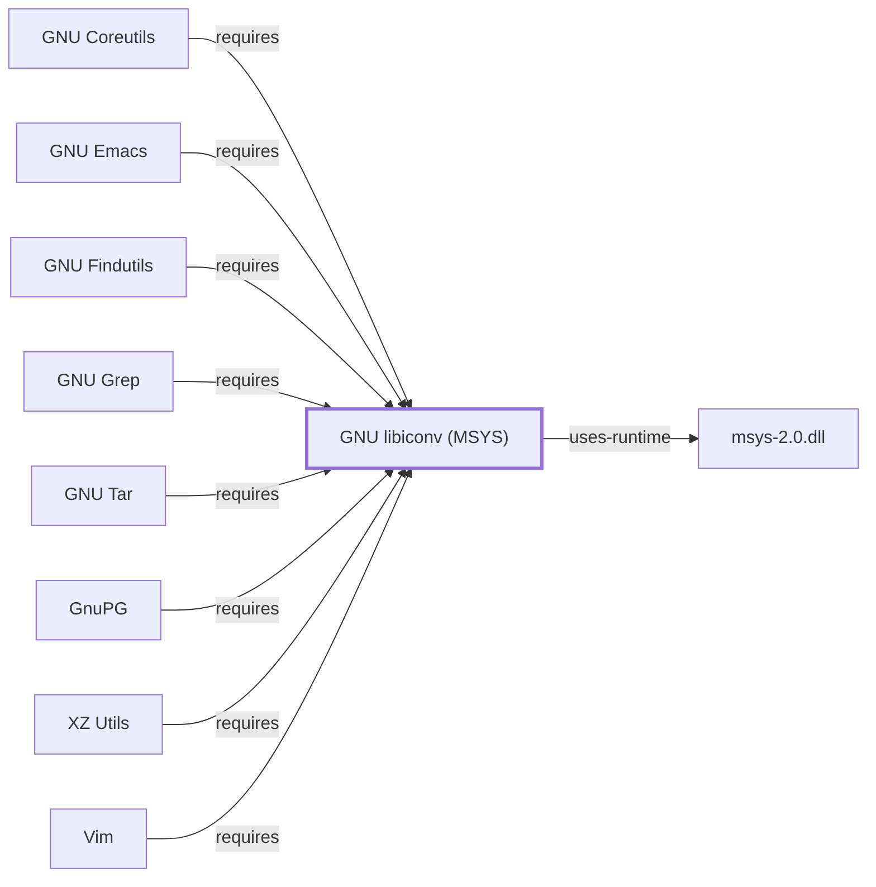

# GNU libiconv (MSYS)

## Purpose

This page documents the **MSYS-environment** GNU libiconv package
specifically — a character-set conversion library, needed because the
MSYS C library (Cygwin-derived) does not provide built-in `iconv`
conversion the way glibc does. It is depended on by six entities
already documented in this knowledge base — [GnuTLS](GNUTLS.md),
[GnuPG](GNUPG.md), [GNU Coreutils](GNU-COREUTILS.md),
[GNU libintl](GNU-LIBINTL.md), [GNU libunistring](GNU-LIBUNISTRING.md),
and [libgpg-error (MSYS)](LIBGPG-ERROR-MSYS.md) — the widest fan-in of
any single batch addition this session, each of which had already cited
this package by name (several explicitly flagging it as an unmodeled
dependency) before this page existed. See the
[official GNU libiconv project page](https://www.gnu.org/software/libiconv/)
for the full reference.

## Architectural Classification

`library:gnu:libiconv@msys` is packaged in the MSYS environment as
`package:msys2:libiconv` (version `1.19-1` in the current catalog
snapshot) — the same version number as the UCRT64 sibling documented on
[GNU libiconv (UCRT64)](GNU-LIBICONV.md), but a separately built,
separate catalog entity. This is the package
[GnuTLS](GNUTLS.md), [GnuPG](GNUPG.md), [GNU Coreutils](GNU-COREUTILS.md),
and the other MSYS-environment dependents listed above actually depend
on.

## Responsibilities

- Providing character-set conversion (`iconv`) functionality that the
  MSYS C library itself does not supply, consumed by any MSYS-packaged
  program or library needing portable multibyte/character-set handling.

## Boundaries

This page's package serves MSYS-environment consumers specifically;
[GNU Coreutils's own page](GNU-COREUTILS.md#dependencies) already
explained why coreutils needs this package rather than relying on the
platform C library. Native (UCRT64/CLANG64/i686) programs instead link
[GNU libiconv (UCRT64)](GNU-LIBICONV.md) — the two are not
interchangeable.

## Interfaces

- The POSIX `iconv`, `iconv_open`, `iconv_close` C API, the same
  interface [GNU libiconv (UCRT64)](GNU-LIBICONV.md#interfaces)
  documents, per the documentation.

## Dependencies

The catalog snapshot records no `runtime-depends-on` edges for
`package:msys2:libiconv` beyond standard MSYS runtime support.

## Reverse Dependencies

The catalog snapshot records 59 relationships targeting
`package:msys2:libiconv` — tied with [GNU libintl's](GNU-LIBINTL.md) own
count as the widest MSYS-only reverse-dependency footprint found this
session. Twelve are already modeled in this knowledge base:
`package:msys2:libgnutls`
(`relationship:foundation-libraries:gnutls-msys-requires-libiconv-msys`),
`package:msys2:gnupg`
(`relationship:ssh-curl-git:gnupg-requires-libiconv-msys`),
`package:msys2:coreutils`
(`relationship:gnu-userland:coreutils-requires-libiconv-msys`),
`package:msys2:libintl`
(`relationship:foundation-libraries:libintl-requires-libiconv-msys`),
`package:msys2:libunistring`
(`relationship:foundation-libraries:libunistring-requires-libiconv-msys`),
`package:msys2:libgpg-error`
(`relationship:foundation-libraries:libgpg-error-msys-requires-libiconv-msys`),
`package:msys2:xz`
(`relationship:archive-compression:xz-requires-libiconv-msys`,
documented fully in [XZ Utils](XZ-UTILS.md)),
`package:msys2:grep`
(`relationship:gnu-userland:grep-requires-libiconv-msys`, added
2026-07-30), `package:msys2:findutils`
(`relationship:gnu-userland:findutils-requires-libiconv-msys`, added
2026-07-30), `package:msys2:tar`
(`relationship:gnu-userland:tar-requires-libiconv-msys`, added
2026-07-30), `package:msys2:emacs`
(`relationship:gnu-userland:emacs-requires-libiconv-msys`, added
2026-07-30), and `package:msys2:vim`
(`relationship:editors-pagers-terminals:vim-requires-libiconv-msys`,
added 2026-07-30) — the last five closing gaps each citing page's own
dependency table had left standing without a corresponding graph edge.
The remaining ~47 recorded dependents (`binutils`, `bison`, `git`'s own
build tooling, and many others) are not individually modeled in this
knowledge base; see the
[reverse dependency impact analysis](REVERSE-DEPENDENCY-IMPACT-ANALYSIS.md)
for the current full list.

## Configuration

libiconv has no persistent configuration file; character-set/encoding
selection is made through its C API by the calling program at the point
of conversion.

## Initialization and Execution Flow

As a library, libiconv has no independent process lifecycle: it
initializes and executes within the process of whatever program links
against it, directly or (as with [libintl](GNU-LIBINTL.md) and
[libunistring](GNU-LIBUNISTRING.md)) transitively through another MSYS
library. As an MSYS-dependent library, this is adapted from POSIX
semantics onto Windows process primitives by `msys-2.0.dll` per
[MSYS Runtime Initialization](MSYS-RUNTIME-INITIALIZATION.md).

## Runtime Behavior

Identical functional behavior to
[GNU libiconv (UCRT64)](GNU-LIBICONV.md); see that page for detail not
specific to the MSYS/UCRT64 packaging distinction.

## Compatibility and Variants

The MSYS and native (UCRT64/CLANG64/i686) GNU libiconv packages are
separately versioned catalog entities (see Architectural Classification);
code built against one is not automatically compatible with the other
without matching the correct environment.

## Security Considerations

Character-set conversion of untrusted input is a documented general
source of encoding-confusion vulnerabilities in some historical
implementations; this page does not assert this specific package
version's mitigation status. See
[Threat Model and Supply Chain](THREAT-MODEL-AND-SUPPLY-CHAIN.md) for the
project's general supply-chain posture; no version-qualified CVE review
has been performed for the recorded `1.19-1` version.

## Failure Modes and Diagnostics

A character-set conversion failure (`EILSEQ`, invalid multibyte sequence)
should be checked against the actual encoding of the input data before
being treated as a defect in the calling program.

## Evidence, Assumptions, and Open Questions

Character-set conversion scope is backed by the official GNU libiconv
project page (`evidence:gnu:libiconv-manual-2026-07-30`), the same
evidence record [GNU libiconv (UCRT64)](GNU-LIBICONV.md) cites. Package
identity, version, and the six modeled dependent edges are backed by the
pacman catalog snapshot (`evidence:catalog:current`). Open, and
explicitly out of scope for this page: the ~53 remaining recorded
dependents not individually modeled, and header-level API surface / PE
import/export-level evidence, per the
[Library Family Classification](LIBRARY-FAMILY-CLASSIFICATION.md)
methodology.

<!-- BEGIN GENERATED dependency-subgraph -->

## Dependency Diagram

Dependencies and dependents of `library:gnu:libiconv@msys` in the composed graph: 14 dependents and 1 dependency, of which 6 are omitted here for legibility.

Generated from the composed model by `tools/build_object_diagrams.py`.
Edits between the surrounding markers are overwritten on the next build.

<!-- END GENERATED dependency-subgraph -->

## Related Objects

- [MSYS2 Library Architecture](LIBRARIES-ARCHITECTURE.md)
- [GNU libiconv (UCRT64)](GNU-LIBICONV.md)
- [GnuTLS](GNUTLS.md)
- [GnuPG](GNUPG.md)
- [GNU Coreutils](GNU-COREUTILS.md)
- [GNU libintl](GNU-LIBINTL.md)
- [GNU libunistring](GNU-LIBUNISTRING.md)
- [libgpg-error (MSYS)](LIBGPG-ERROR-MSYS.md)
- [XZ Utils](XZ-UTILS.md)
- [libarchive (MSYS)](LIBARCHIVE-MSYS.md)
- [GNU Grep](GNU-GREP.md)
- [GNU Findutils](GNU-FINDUTILS.md)
- [GNU Tar](GNU-TAR.md)
- [GNU Emacs](GNU-EMACS.md)
- [Vim](VIM.md)
- [popt (MSYS)](POPT-MSYS.md)
