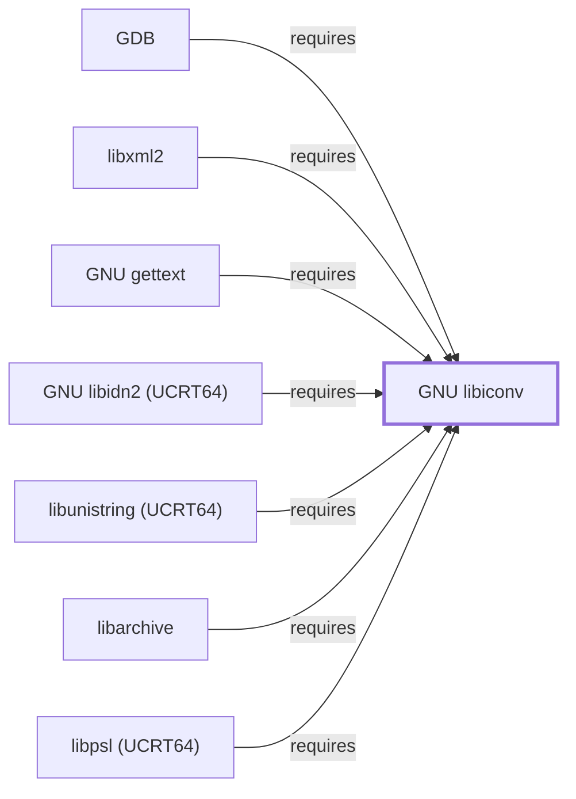

# GNU libiconv

## Purpose

Libiconv converts text between character encodings, and this page
documents why so many of this knowledge base's already-documented tools —
[GNU Coreutils](GNU-COREUTILS.md), [GNU Grep](GNU-GREP.md),
[GNU Tar](GNU-TAR.md), [Vim](VIM.md), and dozens more — depend on it: this
platform's C library does not provide the `iconv()` conversion function
the way glibc does. See the
[official GNU libiconv project page](https://www.gnu.org/software/libiconv/)
for the API reference.

## Architectural Classification

`library:gnu:libiconv` is a GNU-userland library, packaged per native
environment: this page cites the UCRT64 build,
`package:msys2:mingw-w64-ucrt-x86_64-libiconv` (version `1.19-1` in the
current catalog snapshot, license `LGPL-2.1-or-later` for the library
itself, with its documentation separately under `GPL-3.0-or-later`). This
page is scoped to Volume 6's package/dependency-level evidence; the fuller
[Library Family Classification](LIBRARY-FAMILY-CLASSIFICATION.md)
methodology has not been applied here and remains open.

## Responsibilities

- Providing the `iconv()` character-set conversion function and command-line
  conversion support that this environment's C runtime does not supply
  natively, standing in for the `iconv()` implementation glibc-based
  systems get for free from their C library.

## Boundaries

Libiconv performs character-set conversion only; it does not perform
locale-aware collation, formatting, or message translation — those are
[GNU gettext](GNU-GETTEXT.md)'s and the C runtime's separate
responsibilities, though gettext itself depends on libiconv (see
[GNU gettext's Dependencies](GNU-GETTEXT.md#dependencies)).

## Interfaces

- The `iconv()` C API (`iconv_open()`, `iconv()`, `iconv_close()`) for
  converting a byte sequence from one character encoding to another, per
  the manual. This page does not enumerate the header-level surface; that
  belongs to [Header and Development-Metadata Indexes](HEADER-AND-METADATA-INDEXES.md).

## Dependencies

The catalog snapshot records no `runtime-depends-on` edges for
`package:msys2:mingw-w64-ucrt-x86_64-libiconv` beyond its membership in
the UCRT64 repository and environment.

## Reverse Dependencies

The snapshot records **82** relationships targeting
`package:msys2:mingw-w64-ucrt-x86_64-libiconv` — a substantial dependent
count, though smaller than [zlib](ZLIB.md#reverse-dependencies)'s 299 and
[gcc-libs](LIBSTDCXX.md#reverse-dependencies)'s 167. Its MSYS-environment
counterpart (`package:msys2:libiconv`, cited throughout Volume 5's pages
for the same character-set-conversion rationale) is packaged and tracked
separately from this UCRT64 native build. See the
[reverse dependency impact analysis](REVERSE-DEPENDENCY-IMPACT-ANALYSIS.md)
for the current full list.

## Configuration

Libiconv has no persistent configuration file; the source and target
encodings are parameters a calling program passes to `iconv_open()`, or
flags a command-line tool passes through to its own `iconv()` usage.

## Initialization and Execution Flow

As a library, libiconv has no independent process lifecycle: it
initializes and executes within the process of whatever program links
against it, the same model documented for [zlib](ZLIB.md#initialization-and-execution-flow).

## Runtime Behavior

Conversion correctness and the specific set of supported encodings depend
on the installed libiconv build; a program silently mis-converting
non-ASCII text is a common symptom of a locale/encoding mismatch upstream
of libiconv itself rather than a libiconv defect.

## Compatibility and Variants

Libiconv's role — supplying `iconv()` where the platform C library doesn't
— is specific to non-glibc platforms; software written assuming glibc's
built-in `iconv()` and software written to link libiconv explicitly are
not always interchangeable without a compatibility shim, though this is
typically transparent in practice via header/library name conventions.

## Security Considerations

No libiconv-specific vulnerability review has been performed for this
volume; malformed-input handling in character-set conversion is a general
parser-robustness risk class, the same category already noted for
[pkgconf](PKGCONF.md#security-considerations)'s `.pc`-file parsing. See
[Threat Model and Supply Chain](THREAT-MODEL-AND-SUPPLY-CHAIN.md) for the
project's general supply-chain posture; no version-qualified CVE review has
been performed for the recorded `1.19-1` version.

## Failure Modes and Diagnostics

Unexpected mojibake (garbled text) in a dependent tool's output should
first be checked against the active locale/encoding settings before being
treated as a libiconv defect, the same diagnostic priority already
established for locale-sensitive tools throughout this knowledge base
(for example, [GNU Coreutils](GNU-COREUTILS.md#failure-modes-and-diagnostics)).

## Evidence, Assumptions, and Open Questions

The conversion model is backed by the official GNU libiconv project page
(`evidence:gnu:libiconv-manual-2026-07-30`), matching the `project_url`
already recorded for `package:msys2:mingw-w64-ucrt-x86_64-libiconv` in the
catalog. Package identity, version, license, and reverse-dependency count
are backed by the pacman catalog snapshot (`evidence:catalog:current`).
Open, and explicitly out of scope for this page: header-level API surface
and PE import/export-level evidence, per the
[Library Family Classification](LIBRARY-FAMILY-CLASSIFICATION.md)
methodology.

<!-- BEGIN GENERATED dependency-subgraph -->

## Dependency Diagram

Dependencies and dependents of `library:gnu:libiconv` in the composed graph: 7 dependents and 0 dependencies.

Generated from the composed model by `tools/build_object_diagrams.py`.
Edits between the surrounding markers are overwritten on the next build.

<!-- END GENERATED dependency-subgraph -->

## Related Objects

- [MSYS2 Library Architecture](LIBRARIES-ARCHITECTURE.md)
- [GNU gettext](GNU-GETTEXT.md)
- [GNU Coreutils](GNU-COREUTILS.md)
- [zlib](ZLIB.md)
- [libarchive](LIBARCHIVE.md)
- [GDB](GNU-GDB.md)
- [GNU libiconv (CLANG64)](GNU-LIBICONV-CLANG64.md)
