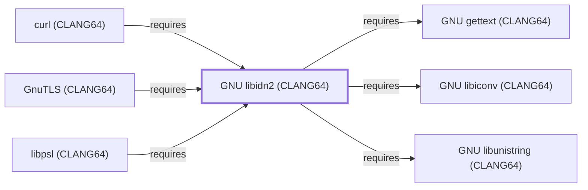

# GNU libidn2 (CLANG64)

<!-- BEGIN GENERATED object-facts -->

| Model fact | Value |
| --- | --- |
| Object | `library:gnu:libidn2@clang64` |
| Kind | `library` |
| Status | `partial` |
| Confidence | `high` |
| Authority | Free Software Foundation |
| Environments | `clang64` |
| Upstream | <https://www.gnu.org/software/libidn/#libidn2> |
| Packaged as | `package:msys2:mingw-w64-clang-x86_64-libidn2` |
| Version (observed) | 2.3.8-4 |
| License (observed) | spdx:GPL-2.0-or-later;spdx:LGPL-3.0-or-later |
| Architecture (observed) | any |
| Installed size (observed) | 734.06 KiB |

**Evidence on this object**

- `evidence:catalog:current` — MSYS2 pacman package catalog (`observed`, retrieved 2026-08-05)
- `evidence:gnu:libidn2-manual-2026-07-30` — GNU libidn2 (official project page) (`primary`, retrieved 2026-07-30)

Generated from the composed model by `tools/build_object_facts.py`. Observed values come from the catalog snapshot and change when it is refreshed.
Edits between the surrounding markers are overwritten on the next build.

<!-- END GENERATED object-facts -->

## Purpose

This page documents `package:msys2:mingw-w64-clang-x86_64-libidn2`,
the CLANG64-environment build of GNU libidn2 — an Internationalized
Domain Names (IDNA2008) encoding library, depended on by
[libpsl (CLANG64)](LIBPSL-CLANG64.md), the last page in this batch's
second CLANG64 chain. See the
[official GNU libidn project page](https://www.gnu.org/software/libidn/#libidn2)
for the full reference.

## Architectural Classification

`library:gnu:libidn2@clang64` is packaged as
`package:msys2:mingw-w64-clang-x86_64-libidn2` (version `2.3.8-4` in
the current catalog snapshot, license
`GPL-2.0-or-later;LGPL-3.0-or-later`) — a separately built, separate
catalog entity from [GNU libidn2 (UCRT64)](GNU-LIBIDN2-UCRT64.md). It
belongs to the CLANG64 environment. All three of its own recorded
runtime dependencies were already modeled entities in this knowledge
base before this page was written, letting this addition close its
full dependency footprint in a single pass.

## Responsibilities

- Providing internationalized domain name encoding (IDNA2008,
  converting Unicode domain labels to/from ASCII-compatible encoding)
  for CLANG64-native consumers, the same role
  [GNU libidn2 (UCRT64)](GNU-LIBIDN2-UCRT64.md#responsibilities)
  documents for its own environment.

## Boundaries

This page's package serves CLANG64-environment consumers specifically;
[curl (UCRT64)](CURL-UCRT64.md) instead depends on
[GNU libidn2 (UCRT64)](GNU-LIBIDN2-UCRT64.md#reverse-dependencies) —
the two are not interchangeable, matching the same distinction already
drawn throughout this volume for MSYS/UCRT64/CLANG64 sibling packages.
As with [GNU libidn2 (UCRT64)'s](GNU-LIBIDN2-UCRT64.md#boundaries) own
page, this dependency is not modeled as a direct edge from any CLANG64
curl entity, since no CLANG64 curl package is yet modeled in this
knowledge base.

## Interfaces

- The libidn2 C API (`idn2_lookup_u8`, `idn2_to_ascii_8z`, and related
  functions), the same interface
  [GNU libidn2 (UCRT64)](GNU-LIBIDN2-UCRT64.md#interfaces) documents,
  per the documentation.

## Dependencies

The catalog snapshot records three `runtime-depends-on` edges for
`package:msys2:mingw-w64-clang-x86_64-libidn2`, all now modeled in
this knowledge base:

| Dependency | Package | Architectural reason |
| --- | --- | --- |
| [GNU gettext (CLANG64)](GNU-GETTEXT-CLANG64.md) | `package:msys2:mingw-w64-clang-x86_64-gettext-runtime` | Backs gettext-based message translation (NLS) for libidn2's own diagnostic output. |
| [GNU libiconv (CLANG64)](GNU-LIBICONV-CLANG64.md) | `package:msys2:mingw-w64-clang-x86_64-libiconv` | Backs character-set conversion for libidn2's own domain-name encoding. |
| [GNU libunistring (CLANG64)](GNU-LIBUNISTRING-CLANG64.md) | `package:msys2:mingw-w64-clang-x86_64-libunistring` | Backs Unicode normalization for libidn2's IDNA2008 domain-name encoding. |

## Reverse Dependencies

The catalog snapshot records 11 relationships targeting
`package:msys2:mingw-w64-clang-x86_64-libidn2`. Three are now modeled
in this knowledge base: [libpsl (CLANG64)](LIBPSL-CLANG64.md)
(`relationship:foundation-libraries:libpsl-clang64-requires-libidn2-clang64`,
added 2026-08-02), [curl (CLANG64)](CURL-CLANG64.md)
(`relationship:foundation-libraries:curl-clang64-requires-libidn2-clang64`,
added 2026-08-02), and [GnuTLS (CLANG64)](GNUTLS-CLANG64.md)
(`relationship:foundation-libraries:gnutls-clang64-requires-libidn2-clang64`,
added 2026-08-02). The remaining recorded dependents (`curl-gnutls`,
`curl-winssl`, `gmime`, `msmtp`, `qemu`,
`qemu-image-util`, `wget`, `wget2`) are not individually modeled in
this knowledge base; see the
[reverse dependency impact analysis](REVERSE-DEPENDENCY-IMPACT-ANALYSIS.md)
for the current full list.

## Configuration

libidn2 has no persistent configuration file; behavior is controlled
entirely through its C API by the calling program.

## Initialization and Execution Flow

As a library, libidn2 has no independent process lifecycle: it
initializes and executes within the process of whatever program links
against it — [libpsl (CLANG64)](LIBPSL-CLANG64.md) in this dependency
chain. As a native MinGW-w64 library, this process model is
Windows-facing directly rather than mediated by `msys-2.0.dll`.

## Runtime Behavior

Identical functional behavior to
[GNU libidn2 (UCRT64)](GNU-LIBIDN2-UCRT64.md#runtime-behavior); see
that page for detail not specific to the CLANG64/UCRT64 packaging
distinction.

## Compatibility and Variants

The CLANG64 and UCRT64 libidn2 packages are separately versioned
catalog entities (see Architectural Classification); code built
against one is not automatically compatible with the other without
matching the correct environment.

## Security Considerations

Correct IDNA2008 encoding is security-relevant for domain-name-based
trust decisions (homograph-attack mitigation depends partly on correct
Unicode normalization); this page does not assert this specific
package version's mitigation status. See
[Threat Model and Supply Chain](THREAT-MODEL-AND-SUPPLY-CHAIN.md) for
the project's general supply-chain posture; no version-qualified CVE
review has been performed for the recorded `2.3.8-4` version.

## Failure Modes and Diagnostics

A dependent program's domain-name encoding failure should be checked
against the actual input domain's Unicode validity before being
treated as a libidn2 defect.

## Evidence, Assumptions, and Open Questions

IDNA2008 encoding scope is backed by the official GNU libidn project
page (`evidence:gnu:libidn2-manual-2026-07-30`), the same evidence
record [GNU libidn2 (UCRT64)](GNU-LIBIDN2-UCRT64.md) cites. Package
identity, version, license, and all three recorded dependency edges
are backed by the pacman catalog snapshot (`evidence:catalog:current`).
Open: the ten remaining recorded reverse dependents are not
individually modeled in this knowledge base.

<!-- BEGIN GENERATED dependency-subgraph -->

## Dependency Diagram

Dependencies and dependents of `library:gnu:libidn2@clang64` in the composed graph: 3 dependents and 3 dependencies.

Generated from the composed model by `tools/build_object_diagrams.py`.
Edits between the surrounding markers are overwritten on the next build.

<!-- END GENERATED dependency-subgraph -->

## Related Objects

- [MSYS2 Library Architecture](LIBRARIES-ARCHITECTURE.md)
- [GNU libidn2 (UCRT64)](GNU-LIBIDN2-UCRT64.md)
- [GNU gettext (CLANG64)](GNU-GETTEXT-CLANG64.md)
- [GNU libiconv (CLANG64)](GNU-LIBICONV-CLANG64.md)
- [GNU libunistring (CLANG64)](GNU-LIBUNISTRING-CLANG64.md)
- [curl (CLANG64)](CURL-CLANG64.md)
- [GnuTLS (CLANG64)](GNUTLS-CLANG64.md)
- [libpsl (CLANG64)](LIBPSL-CLANG64.md)
