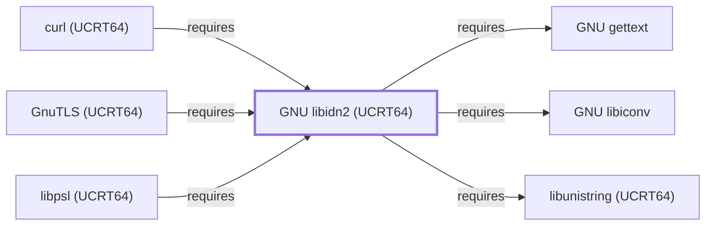

# GNU libidn2 (UCRT64)

<!-- BEGIN GENERATED object-facts -->

| Model fact | Value |
| --- | --- |
| Object | `library:gnu:libidn2@ucrt64` |
| Kind | `library` |
| Status | `partial` |
| Confidence | `high` |
| Authority | GNU Project |
| Environments | `ucrt64` |
| Upstream | <https://www.gnu.org/software/libidn/#libidn2> |
| Packaged as | `package:msys2:mingw-w64-ucrt-x86_64-libidn2` |
| Version (observed) | 2.3.8-4 |
| License (observed) | spdx:GPL-2.0-or-later;spdx:LGPL-3.0-or-later |
| Architecture (observed) | any |
| Installed size (observed) | 755.9 KB |

**Evidence on this object**

- `evidence:catalog:current` — MSYS2 pacman package catalog (`observed`, retrieved 2026-07-29)
- `evidence:gnu:libidn2-manual-2026-07-30` — GNU libidn2 (official project page) (`primary`, retrieved 2026-07-30)

Generated from the composed model by `tools/build_object_facts.py`. Observed values come from the catalog snapshot and change when it is refreshed.
Edits between the surrounding markers are overwritten on the next build.

<!-- END GENERATED object-facts -->

## Purpose

This page documents the **UCRT64-environment** libidn2 package
specifically — an implementation of the IDNA2008, Punycode, and TR46
internationalized domain name specifications — depended on by
[curl (UCRT64)](CURL-UCRT64.md) and [libpsl (UCRT64)](LIBPSL-UCRT64.md),
closing one of the sub-dependencies curl (UCRT64)'s own page had left
explicitly unmodeled. See the
[official GNU libidn2 project page](https://www.gnu.org/software/libidn/#libidn2)
for the full reference.

## Architectural Classification

`library:gnu:libidn2@ucrt64` is packaged in the UCRT64 environment as
`package:msys2:mingw-w64-ucrt-x86_64-libidn2` (version `2.3.8-4` in the
current catalog snapshot, license
`GPL-2.0-or-later;LGPL-3.0-or-later`) — a separately built, separate
catalog entity from [GNU libidn2 (MSYS)](GNU-LIBIDN2.md)'s `libidn2`
package. This is the package [curl (UCRT64)](CURL-UCRT64.md) — a
UCRT64-native component itself — actually depends on.

## Responsibilities

- Providing internationalized domain name (IDNA) processing, consumed
  by [curl (UCRT64)](CURL-UCRT64.md#dependencies) for non-ASCII
  hostname handling and by [libpsl (UCRT64)](LIBPSL-UCRT64.md#dependencies)
  for matching non-ASCII domain labels against the Public Suffix List.

## Boundaries

This page's package serves UCRT64-environment consumers specifically;
[GnuTLS (MSYS)](GNUTLS.md) and [libcurl (MSYS)](LIBCURL.md) instead
depend on [GNU libidn2 (MSYS)](GNU-LIBIDN2.md#reverse-dependencies) —
the two are not interchangeable, matching the same distinction already
made throughout this volume for MSYS/UCRT64 sibling pairs.

## Interfaces

- The libidn2 C API (`idn2_lookup_u8`, `idn2_to_ascii_8z`, and related
  functions), the same interface
  [GNU libidn2 (MSYS)](GNU-LIBIDN2.md#interfaces) documents, per the
  documentation.

## Dependencies

The UCRT64 `package:msys2:mingw-w64-ucrt-x86_64-libidn2` declares
dependencies on [GNU libiconv](GNU-LIBICONV.md) (character-set
conversion, `relationship:foundation-libraries:libidn2-ucrt64-requires-libiconv`),
[GNU gettext](GNU-GETTEXT.md) (gettext-based message translation,
`relationship:foundation-libraries:libidn2-ucrt64-requires-gettext`),
and [GNU libunistring (UCRT64)](GNU-LIBUNISTRING-UCRT64.md) (Unicode
string processing,
`relationship:foundation-libraries:libidn2-ucrt64-requires-libunistring-ucrt64`)
— all UCRT64-environment sibling libraries.

## Reverse Dependencies

The catalog snapshot records 11 relationships targeting
`package:msys2:mingw-w64-ucrt-x86_64-libidn2`. Three are now modeled in
this knowledge base: [curl (UCRT64)](CURL-UCRT64.md)
(`relationship:foundation-libraries:curl-ucrt64-requires-libidn2-ucrt64`),
[libpsl (UCRT64)](LIBPSL-UCRT64.md)
(`relationship:foundation-libraries:libpsl-ucrt64-requires-libidn2-ucrt64`),
and [GnuTLS (UCRT64)](GNUTLS-UCRT64.md)
(`relationship:foundation-libraries:gnutls-ucrt64-requires-libidn2-ucrt64`).
The remaining recorded dependents (`gmime`, `msmtp`, `qemu`,
`qemu-image-util`, `wget`, and `wget2`) are not
individually modeled in this knowledge base; see the
[reverse dependency impact analysis](REVERSE-DEPENDENCY-IMPACT-ANALYSIS.md)
for the current full list.

## Configuration

libidn2 has no persistent configuration file; behavior is controlled
entirely through its C API by the calling program.

## Initialization and Execution Flow

As a library, libidn2 has no independent process lifecycle: it
initializes and executes within the process of whatever program links
against it — [curl (UCRT64)](CURL-UCRT64.md) or
[libpsl (UCRT64)](LIBPSL-UCRT64.md) in this dependency chain. As a
native MinGW-w64 library, this process model is Windows-facing directly
rather than mediated by `msys-2.0.dll`.

## Runtime Behavior

Identical functional behavior to
[GNU libidn2 (MSYS)](GNU-LIBIDN2.md#runtime-behavior); see that page
for detail not specific to the UCRT64/MSYS packaging distinction.

## Compatibility and Variants

The UCRT64 and MSYS libidn2 packages are separately versioned catalog
entities (see Architectural Classification); code built against one is
not automatically compatible with the other without matching the
correct package/environment.

## Security Considerations

Domain-name-processing libraries are a documented general source of
homograph-attack and normalization-related risk; this page does not
assert this specific package version's mitigation status. See
[Threat Model and Supply Chain](THREAT-MODEL-AND-SUPPLY-CHAIN.md) for
the project's general supply-chain posture; no version-qualified CVE
review has been performed for the recorded `2.3.8-4` version.

## Failure Modes and Diagnostics

A curl or libpsl (UCRT64) failure resolving a non-ASCII hostname should
be checked against libidn2's own conversion diagnostics before being
treated as a defect in the calling program.

## Evidence, Assumptions, and Open Questions

Internationalized domain name processing scope is backed by the
official GNU libidn2 project page
(`evidence:gnu:libidn2-manual-2026-07-30`), the same evidence record
[GNU libidn2 (MSYS)](GNU-LIBIDN2.md) cites. Package identity, version,
license, and the recorded dependency/dependent edges are backed by the
pacman catalog snapshot (`evidence:catalog:current`). Open, and
explicitly out of scope for this page: the remaining recorded
dependents not individually modeled, and header-level API surface / PE
import/export-level evidence, per the
[Library Family Classification](LIBRARY-FAMILY-CLASSIFICATION.md)
methodology.

<!-- BEGIN GENERATED dependency-subgraph -->

## Dependency Diagram

Dependencies and dependents of `library:gnu:libidn2@ucrt64` in the composed graph: 3 dependents and 3 dependencies.

Generated from the composed model by `tools/build_object_diagrams.py`.
Edits between the surrounding markers are overwritten on the next build.

<!-- END GENERATED dependency-subgraph -->

## Related Objects

- [MSYS2 Library Architecture](LIBRARIES-ARCHITECTURE.md)
- [GNU libidn2 (MSYS)](GNU-LIBIDN2.md)
- [curl (UCRT64)](CURL-UCRT64.md)
- [libpsl (UCRT64)](LIBPSL-UCRT64.md)
- [GNU libunistring (UCRT64)](GNU-LIBUNISTRING-UCRT64.md)
- [GnuTLS (UCRT64)](GNUTLS-UCRT64.md)
- [GNU libidn2 (CLANG64)](GNU-LIBIDN2-CLANG64.md)
