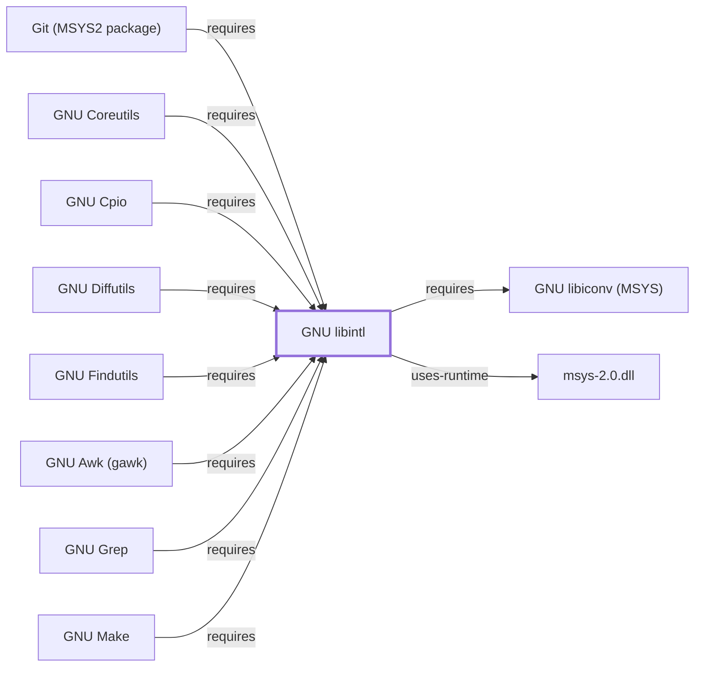

# GNU libintl

## Purpose

GNU libintl is the runtime half of GNU gettext — the internationalized
message translation (NLS, Native Language Support) library that lets a
program's user-facing strings be looked up in a translated message
catalog at runtime. This page documents its architectural role as the
single most widely depended-upon library discovered in this session's
sweep of Volume 5 and Volume 6 dependency tables: sixteen entities
already documented elsewhere in this knowledge base cite it by package
name (`libintl`) without a page of their own to point to, until now. See
the [official GNU gettext project page](https://www.gnu.org/software/gettext/)
for the full reference.

## Architectural Classification

`library:gnu:libintl` is packaged in the MSYS environment as
`package:msys2:libintl` (version `0.22.5-1` in the current catalog
snapshot). A separately packaged, native (UCRT64/CLANG64/i686) gettext
runtime also exists in the catalog as `gettext-runtime`
(`mingw-w64-ucrt-x86_64-gettext-runtime`), already documented in this
volume as `library:gnu:gettext` (see [GNU gettext](GNU-GETTEXT.md)) — a
separately versioned, separate catalog entity under a different package
name in this environment (`libintl` vs. `gettext-runtime`), the same
kind of MSYS-vs-native distinction this volume has applied consistently
throughout, and the same class of naming mismatch already flagged for
[libwinpthread](LIBWINPTHREAD.md#architectural-classification) and
[p11-kit](P11-KIT.md#architectural-classification). This page documents
the MSYS package specifically, since that is the one every MSYS
component and library cited below actually depends on.

## Responsibilities

- Providing runtime message-catalog lookup (`gettext()`, `dgettext()`,
  and related functions), consumed by MSYS-environment components to
  display translated diagnostic and interface strings when a translation
  is available for the active locale.

## Boundaries

libintl provides the runtime lookup half of gettext specifically; it
does not provide the build-time tooling (`.po`/`.mo` file compilation,
string extraction) that [GNU gettext](GNU-GETTEXT.md)'s fuller UCRT64
packaging documents — the two packages serve different roles even though
they share the same upstream project and this page's package is
sometimes loosely called "gettext" in casual references.

## Interfaces

- A C API (`gettext`, `dgettext`, `dcgettext`, `textdomain`,
  `bindtextdomain`) for runtime message translation lookup, per the
  documentation.

## Dependencies

The MSYS `package:msys2:libintl` declares dependencies on `gcc-libs` and
[GNU libiconv (MSYS)](GNU-LIBICONV-MSYS.md)
(`package:msys2:libiconv`,
`relationship:foundation-libraries:libintl-requires-libiconv-msys`), a
separate catalog entity from this knowledge base's existing
`library:gnu:libiconv`, which documents the UCRT64-packaged `libiconv`
instead, the same distinction already made for
[GNU libunistring](GNU-LIBUNISTRING.md#dependencies) elsewhere in this
volume.

## Reverse Dependencies

The catalog snapshot records 59 relationships targeting
`package:msys2:libintl` — the widest reverse-dependency footprint of any
library documented in this volume, well ahead of
[libxcrypt](LIBXCRYPT.md#reverse-dependencies)'s 19. Sixteen of those
dependents are already modeled elsewhere in this knowledge base, each now
with an explicit `requires` edge to `library:gnu:libintl`: the Volume 5
components [GNU Coreutils](GNU-COREUTILS.md), [GNU Findutils](GNU-FINDUTILS.md),
[GNU Awk](GNU-AWK.md), [GNU Grep](GNU-GREP.md), [GNU Sed](GNU-SED.md),
[GNU Nano](GNU-NANO.md), [Vim](VIM.md), [XZ Utils](XZ-UTILS.md),
[GNU Tar](GNU-TAR.md), [Git (MSYS2 package)](GIT-MSYS-PACKAGE.md), and
[GnuPG](GNUPG.md); the Volume 8 component [GNU Make](GNU-MAKE.md); and
the Volume 6 libraries [GnuTLS](GNUTLS.md),
[libgpg-error (MSYS)](LIBGPG-ERROR-MSYS.md), [GNU libidn2](GNU-LIBIDN2.md),
and [p11-kit](P11-KIT.md). The remaining ~43 recorded dependents (`bison`,
`git`'s own build tooling, `wget`, `subversion`, and many others) are not
individually modeled in this knowledge base; see the
[reverse dependency impact analysis](REVERSE-DEPENDENCY-IMPACT-ANALYSIS.md)
for the current full list.

## Configuration

libintl has no persistent configuration file of its own; which message
catalog it loads is determined by the active locale (`LANG`/`LC_MESSAGES`
environment variables) and the calling program's `textdomain`/
`bindtextdomain` calls, not external configuration.

## Initialization and Execution Flow

As a library, libintl has no independent process lifecycle: it
initializes and executes within the process of whatever program links
against it. As an MSYS-dependent library, this is adapted from POSIX
semantics onto Windows process primitives by `msys-2.0.dll` per
[MSYS Runtime Initialization](MSYS-RUNTIME-INITIALIZATION.md).

## Runtime Behavior

Whether a given string is actually translated at runtime depends on
whether a matching `.mo` message catalog exists for the active locale; in
its absence, `gettext()` falls back to returning the original (typically
English) string unchanged, a behavior consistent across every dependent
listed above.

## Compatibility and Variants

The MSYS `libintl` and UCRT64 `gettext-runtime` packages are separately
versioned catalog entities (see Architectural Classification); code
built against one is not automatically compatible with the other without
matching the correct environment.

## Security Considerations

libintl is not itself a security-sensitive component; message-catalog
lookup carries no elevated trust or network exposure. See
[Threat Model and Supply Chain](THREAT-MODEL-AND-SUPPLY-CHAIN.md) for the
project's general supply-chain posture; no version-qualified CVE review
has been performed for the recorded `0.22.5-1` version.

## Failure Modes and Diagnostics

Untranslated strings appearing despite an apparently correct locale
setting most commonly indicate a missing or mismatched `.mo` catalog for
that locale/domain combination, rather than a libintl defect.

## Evidence, Assumptions, and Open Questions

Message-translation runtime scope is backed by the official GNU gettext
project page (`evidence:gnu:libintl-manual-2026-07-30`), matching the
`project_url` already recorded for `package:msys2:libintl` in the
catalog. Package identity, version, and the sixteen modeled
dependency/dependent edges (now seventeen with
[GNU libiconv (MSYS)](GNU-LIBICONV-MSYS.md)) are backed by the pacman
catalog snapshot (`evidence:catalog:current`). Open, and explicitly out
of scope for this page: the ~43 remaining recorded dependents not
individually modeled in this knowledge base, and header-level API
surface / PE import/export-level evidence, per the
[Library Family Classification](LIBRARY-FAMILY-CLASSIFICATION.md)
methodology.

<!-- BEGIN GENERATED dependency-subgraph -->

## Dependency Diagram

Dependencies and dependents of `library:gnu:libintl` in the composed graph: 19 dependents and 2 dependencies, of which 11 are omitted here for legibility.

Generated from the composed model by `tools/build_object_diagrams.py`.
Edits between the surrounding markers are overwritten on the next build.

<!-- END GENERATED dependency-subgraph -->

## Related Objects

- [MSYS2 Library Architecture](LIBRARIES-ARCHITECTURE.md)
- [GNU gettext](GNU-GETTEXT.md)
- [GNU Coreutils](GNU-COREUTILS.md)
- [GNU libiconv (MSYS)](GNU-LIBICONV-MSYS.md)
- [GNU Findutils](GNU-FINDUTILS.md)
- [GNU Awk (gawk)](GNU-AWK.md)
- [GNU Grep](GNU-GREP.md)
- [GNU Sed](GNU-SED.md)
- [GNU Nano](GNU-NANO.md)
- [Vim](VIM.md)
- [XZ Utils](XZ-UTILS.md)
- [GNU Tar](GNU-TAR.md)
- [GNU Make](GNU-MAKE.md)
- [Git (MSYS2 package)](GIT-MSYS-PACKAGE.md)
- [GnuPG](GNUPG.md)
- [GnuTLS](GNUTLS.md)
- [libgpg-error (MSYS)](LIBGPG-ERROR-MSYS.md)
- [GNU libidn2](GNU-LIBIDN2.md)
- [p11-kit](P11-KIT.md)
- [popt (MSYS)](POPT-MSYS.md)
