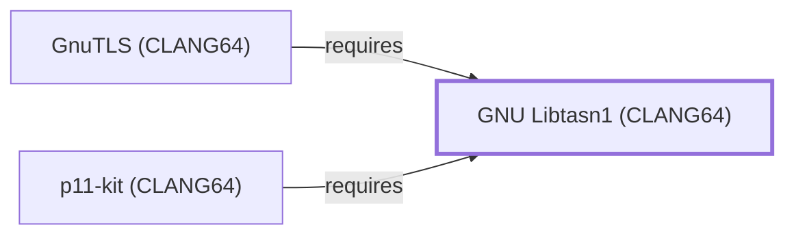

# GNU Libtasn1 (CLANG64)

<!-- BEGIN GENERATED object-facts -->

| Model fact | Value |
| --- | --- |
| Object | `library:gnu:libtasn1@clang64` |
| Kind | `library` |
| Status | `partial` |
| Confidence | `high` |
| Authority | Free Software Foundation |
| Environments | `clang64` |
| Upstream | <https://www.gnu.org/software/libtasn1/> |
| Packaged as | `package:msys2:mingw-w64-clang-x86_64-libtasn1` |
| Version (observed) | 4.21.0-1 |
| License (observed) | GPL3,;LGPL |
| Architecture (observed) | any |
| Installed size (observed) | 591.53 KiB |

**Evidence on this object**

- `evidence:catalog:current` — MSYS2 pacman package catalog (`observed`, retrieved 2026-08-05)
- `evidence:gnu:libtasn1-manual-2026-07-30` — GNU Libtasn1 (official project page) (`primary`, retrieved 2026-07-30)

Generated from the composed model by `tools/build_object_facts.py`. Observed values come from the catalog snapshot and change when it is refreshed.
Edits between the surrounding markers are overwritten on the next build.

<!-- END GENERATED object-facts -->

## Purpose

This page documents `package:msys2:mingw-w64-clang-x86_64-libtasn1`,
the CLANG64-environment build of libtasn1 — an ASN.1 structure parser
and DER encoder library, depended on by
[p11-kit (CLANG64)](P11-KIT-CLANG64.md), the third entity modeled in
this batch's ca-certificates (CLANG64) dependency chain. See the
[official GNU Libtasn1 project page](https://www.gnu.org/software/libtasn1/)
for the full reference.

## Architectural Classification

`library:gnu:libtasn1@clang64` is packaged as
`package:msys2:mingw-w64-clang-x86_64-libtasn1` (version `4.21.0-1` in
the current catalog snapshot, license `GPL3, LGPL`) — a separately
built, separate catalog entity from
[GNU Libtasn1 (UCRT64)](GNU-LIBTASN1-UCRT64.md) and
[GNU Libtasn1 (MSYS)](GNU-LIBTASN1.md). It belongs to the CLANG64
environment.

## Responsibilities

- Providing ASN.1 structure parsing and DER encoding, consumed by
  [p11-kit (CLANG64)](P11-KIT-CLANG64.md#dependencies) for PKCS#11
  module coordination.

## Boundaries

This page's package serves CLANG64-environment consumers specifically;
[GnuTLS (UCRT64)](GNUTLS-UCRT64.md) and
[p11-kit (UCRT64)](P11-KIT-UCRT64.md) instead depend on
[GNU Libtasn1 (UCRT64)](GNU-LIBTASN1-UCRT64.md#reverse-dependencies) —
the two are not interchangeable, matching the same distinction already
drawn throughout this volume for MSYS/UCRT64/CLANG64 sibling packages.

## Interfaces

- The libtasn1 C API (`asn1_parser2tree`, `asn1_der_decoding`, and
  related functions), the same interface
  [GNU Libtasn1 (UCRT64)](GNU-LIBTASN1-UCRT64.md#interfaces) documents,
  per the documentation.

## Dependencies

The catalog snapshot records no `runtime-depends-on` edges for
`package:msys2:mingw-w64-clang-x86_64-libtasn1` beyond standard
toolchain runtime support.

## Reverse Dependencies

The catalog snapshot records 7 relationships targeting
`package:msys2:mingw-w64-clang-x86_64-libtasn1`. One is now modeled in
this knowledge base: [p11-kit (CLANG64)](P11-KIT-CLANG64.md)
(`relationship:foundation-libraries:p11-kit-clang64-requires-libtasn1-clang64`,
added 2026-08-02). The remaining recorded dependents (`gnutls`,
`libdsm`, `libmicrodns`, `qemu`, `qemu-image-util`, and `shishi`) are
not individually modeled in this knowledge base; see the
[reverse dependency impact analysis](REVERSE-DEPENDENCY-IMPACT-ANALYSIS.md)
for the current full list.

## Configuration

libtasn1 has no persistent configuration file; behavior is controlled
entirely through its C API by the calling program.

## Initialization and Execution Flow

As a library, libtasn1 has no independent process lifecycle: it
initializes and executes within the process of whatever program links
against it — [p11-kit (CLANG64)](P11-KIT-CLANG64.md) in this dependency
chain. As a native MinGW-w64 library, this process model is
Windows-facing directly rather than mediated by `msys-2.0.dll`.

## Runtime Behavior

Identical functional behavior to
[GNU Libtasn1 (UCRT64)](GNU-LIBTASN1-UCRT64.md#runtime-behavior); see
that page for detail not specific to the CLANG64/UCRT64 packaging
distinction.

## Compatibility and Variants

The CLANG64, UCRT64, and MSYS libtasn1 packages are three separately
versioned catalog entities (see Architectural Classification); code
built against one is not automatically compatible with another without
matching the correct package/environment.

## Security Considerations

ASN.1/DER parsing against untrusted certificate data is a documented
general source of parser vulnerabilities; this page does not assert
this specific package version's mitigation status. See
[Threat Model and Supply Chain](THREAT-MODEL-AND-SUPPLY-CHAIN.md) for
the project's general supply-chain posture; no version-qualified CVE
review has been performed for the recorded `4.21.0-1` version.

## Failure Modes and Diagnostics

A p11-kit (CLANG64) certificate-parsing failure should be checked
against the certificate's actual ASN.1/DER encoding before being
treated as a libtasn1 defect.

## Evidence, Assumptions, and Open Questions

ASN.1/DER parsing scope is backed by the official GNU Libtasn1 project
page (`evidence:gnu:libtasn1-manual-2026-07-30`), the same evidence
record [GNU Libtasn1 (UCRT64)](GNU-LIBTASN1-UCRT64.md) cites. Package
identity, version, license, and the recorded dependent edge are backed
by the pacman catalog snapshot (`evidence:catalog:current`). Open: the
remaining recorded dependents are not individually modeled in this
knowledge base.

<!-- BEGIN GENERATED dependency-subgraph -->

## Dependency Diagram

Dependencies and dependents of `library:gnu:libtasn1@clang64` in the composed graph: 2 dependents and 0 dependencies.

Generated from the composed model by `tools/build_object_diagrams.py`.
Edits between the surrounding markers are overwritten on the next build.

<!-- END GENERATED dependency-subgraph -->

## Related Objects

- [MSYS2 Library Architecture](LIBRARIES-ARCHITECTURE.md)
- [GNU Libtasn1 (UCRT64)](GNU-LIBTASN1-UCRT64.md)
- [GNU Libtasn1 (MSYS)](GNU-LIBTASN1.md)
- [p11-kit (CLANG64)](P11-KIT-CLANG64.md)
- [GnuTLS (CLANG64)](GNUTLS-CLANG64.md)
