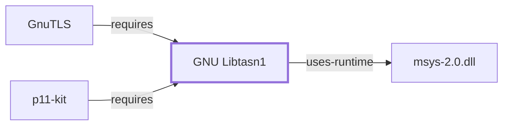

# GNU Libtasn1

<!-- BEGIN GENERATED object-facts -->

| Model fact | Value |
| --- | --- |
| Object | `library:gnu:libtasn1` |
| Kind | `library` |
| Status | `partial` |
| Confidence | `high` |
| Authority | GNU Project |
| Environments | `msys` |
| Upstream | <https://www.gnu.org/software/libtasn1/> |
| Packaged as | `package:msys2:libtasn1` |
| Version (observed) | 4.21.0-1 |
| License (observed) | GPL3;LGPL |
| Architecture (observed) | x86_64 |
| Installed size (observed) | 131.8 KB |

**Evidence on this object**

- `evidence:catalog:current` — MSYS2 pacman package catalog (`observed`, retrieved 2026-07-29)
- `evidence:gnu:libtasn1-manual-2026-07-30` — GNU Libtasn1 (official project page) (`primary`, retrieved 2026-07-30)

Generated from the composed model by `tools/build_object_facts.py`. Observed values come from the catalog snapshot and change when it is refreshed.
Edits between the surrounding markers are overwritten on the next build.

<!-- END GENERATED object-facts -->

## Purpose

GNU Libtasn1 implements Abstract Syntax Notation One (ASN.1) parsing and
Distinguished Encoding Rules (DER) manipulation — the structural encoding
that X.509 certificates and many other cryptographic data formats are
built on. This page documents its architectural role as a shared
dependency of both [GnuTLS](GNUTLS.md) and [p11-kit](P11-KIT.md); see the
[official GNU Libtasn1 project page](https://www.gnu.org/software/libtasn1/)
for the full API reference.

## Architectural Classification

`library:gnu:libtasn1` is packaged in the MSYS environment as
`package:msys2:libtasn1` (version `4.21.0-1` in the current catalog
snapshot). A separately packaged, native (UCRT64/CLANG64/i686) `libtasn1`
also exists in the catalog; this page documents the MSYS package
specifically, since that is the one both [GnuTLS](GNUTLS.md#dependencies)
and [p11-kit](P11-KIT.md#dependencies) actually depend on — the same
MSYS-vs-native distinction applied consistently to
[GnuTLS](GNUTLS.md#architectural-classification) and
[libidn2](GNU-LIBIDN2.md#architectural-classification) elsewhere in this
volume.

## Responsibilities

- Parsing and generating ASN.1-structured data encoded per the
  Distinguished Encoding Rules (DER), the structural format underlying
  X.509 certificates and other cryptographic objects.

## Boundaries

Libtasn1 handles the ASN.1/DER structural encoding layer specifically; it
does not itself implement TLS, X.509 certificate validation policy, or
PKCS#11 — those are the responsibilities of its dependents,
[GnuTLS](GNUTLS.md) and [p11-kit](P11-KIT.md) respectively.

## Interfaces

- A C API for defining ASN.1 structure trees and encoding/decoding DER
  data against them (`asn1_der_decoding`, `asn1_der_coding`, and related
  functions), per the documentation.

## Dependencies

The MSYS `package:msys2:libtasn1` declares a dependency on `info` (the GNU
Info documentation reader/format), reflecting only a documentation-format
dependency rather than a runtime code dependency.

## Reverse Dependencies

The catalog snapshot records 3 relationships targeting
`package:msys2:libtasn1`: `package:msys2:libgnutls`
(`relationship:foundation-libraries:gnutls-requires-libtasn1` in this
knowledge base's graph), `package:msys2:libp11-kit`
(`relationship:foundation-libraries:p11-kit-requires-libtasn1`), and its
own `-devel` subpackage. Both confirmed dependents use it for the same
underlying purpose: parsing DER-encoded X.509 certificate structures.

## Configuration

Libtasn1 has no persistent configuration file of its own; its behavior is
controlled entirely through its C API by the calling program, driven by
the ASN.1 structure definitions the caller supplies.

## Initialization and Execution Flow

As a library, Libtasn1 has no independent process lifecycle: it
initializes and executes within the process of whatever program links
against it. As an MSYS-dependent library, this is adapted from POSIX
semantics onto Windows process primitives by `msys-2.0.dll` per
[MSYS Runtime Initialization](MSYS-RUNTIME-INITIALIZATION.md).

## Runtime Behavior

Whether a given DER-encoded input decodes successfully depends on it
conforming to the ASN.1 structure definition the calling program supplied;
this page does not characterize specific decoding outcomes.

## Compatibility and Variants

The MSYS and native (UCRT64/CLANG64/i686) Libtasn1 packages are separately
versioned catalog entities (see Architectural Classification); code built
against one is not automatically compatible with the other without
matching the correct environment.

## Security Considerations

Malformed or maliciously crafted DER input is a documented class of
security concern for ASN.1 parsers generally (parser bugs have historically
been a source of certificate-parsing vulnerabilities across many
implementations); this page does not assert Libtasn1's specific
robustness against such input beyond citing its role. See
[Threat Model and Supply Chain](THREAT-MODEL-AND-SUPPLY-CHAIN.md) for the
project's general supply-chain posture; no version-qualified CVE review
has been performed for the recorded `4.21.0-1` version.

## Failure Modes and Diagnostics

A DER-decoding failure most commonly indicates malformed or unexpected
input relative to the ASN.1 structure definition in use, rather than a
defect in the calling program; the library's error codes distinguish
several such failure classes per the documentation.

## Evidence, Assumptions, and Open Questions

ASN.1/DER implementation scope is backed by the official GNU Libtasn1
project page (`evidence:gnu:libtasn1-manual-2026-07-30`), matching the
`project_url` already recorded for `package:msys2:libtasn1` in the
catalog. Package identity, version, and the recorded dependency/dependent
edges are backed by the pacman catalog snapshot
(`evidence:catalog:current`). Open, and explicitly out of scope for this
page: header-level API surface and PE import/export-level evidence, per
the [Library Family Classification](LIBRARY-FAMILY-CLASSIFICATION.md)
methodology, remain open.

<!-- BEGIN GENERATED dependency-subgraph -->

## Dependency Diagram

Dependencies and dependents of `library:gnu:libtasn1` in the composed graph: 2 dependents and 1 dependency.

Generated from the composed model by `tools/build_object_diagrams.py`.
Edits between the surrounding markers are overwritten on the next build.

<!-- END GENERATED dependency-subgraph -->

## Related Objects

- [MSYS2 Library Architecture](LIBRARIES-ARCHITECTURE.md)
- [GnuTLS](GNUTLS.md)
- [p11-kit](P11-KIT.md)
- [GNU Libtasn1 (UCRT64)](GNU-LIBTASN1-UCRT64.md)
