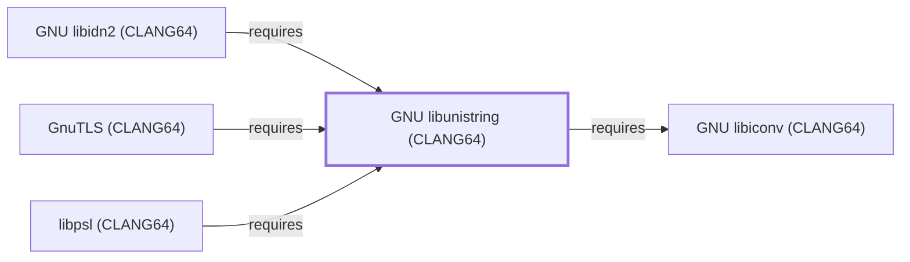

# GNU libunistring (CLANG64)

<!-- BEGIN GENERATED object-facts -->

| Model fact | Value |
| --- | --- |
| Object | `library:gnu:libunistring@clang64` |
| Kind | `library` |
| Status | `partial` |
| Confidence | `high` |
| Authority | Free Software Foundation |
| Environments | `clang64` |
| Upstream | <https://www.gnu.org/software/libunistring/> |
| Packaged as | `package:msys2:mingw-w64-clang-x86_64-libunistring` |
| Version (observed) | 1.4.2-1 |
| License (observed) | spdx:LGPL-3.0-or-later OR GPL-3.0-or-later |
| Architecture (observed) | any |
| Installed size (observed) | 6.3 MB |

**Evidence on this object**

- `evidence:catalog:current` — MSYS2 pacman package catalog (`observed`, retrieved 2026-07-29)
- `evidence:gnu:libunistring-manual-2026-07-30` — GNU libunistring (official project page) (`primary`, retrieved 2026-07-30)

Generated from the composed model by `tools/build_object_facts.py`. Observed values come from the catalog snapshot and change when it is refreshed.
Edits between the surrounding markers are overwritten on the next build.

<!-- END GENERATED object-facts -->

## Purpose

This page documents `package:msys2:mingw-w64-clang-x86_64-libunistring`,
the CLANG64-environment build of GNU libunistring — a Unicode string
library. It is the base of a second CLANG64 chain modeled in this
batch (this page → [GNU libidn2 (CLANG64)](GNU-LIBIDN2-CLANG64.md) →
[libpsl (CLANG64)](LIBPSL-CLANG64.md)), reusing
[GNU libiconv (CLANG64)](GNU-LIBICONV-CLANG64.md) modeled earlier this
session. See the
[official GNU libunistring project page](https://www.gnu.org/software/libunistring/)
for the full reference.

## Architectural Classification

`library:gnu:libunistring@clang64` is packaged as
`package:msys2:mingw-w64-clang-x86_64-libunistring` (version `1.4.2-1`
in the current catalog snapshot, license
`LGPL-3.0-or-later OR GPL-3.0-or-later`) — a separately built, separate
catalog entity from [GNU libunistring (UCRT64)](GNU-LIBUNISTRING-UCRT64.md).
It belongs to the CLANG64 environment. Its sole recorded runtime
dependency, [GNU libiconv (CLANG64)](GNU-LIBICONV-CLANG64.md), was
already a modeled entity in this knowledge base, letting this addition
close its full dependency footprint in a single pass.

## Responsibilities

- Providing Unicode string handling (normalization, encoding
  conversion, and Unicode-aware string operations) for CLANG64-native
  consumers, the same role
  [GNU libunistring (UCRT64)](GNU-LIBUNISTRING-UCRT64.md#responsibilities)
  documents for its own environment.

## Boundaries

This page's package serves CLANG64-environment consumers specifically;
[curl (UCRT64)](CURL-UCRT64.md) instead depends on
[GNU libunistring (UCRT64)](GNU-LIBUNISTRING-UCRT64.md#reverse-dependencies)
via [GNU libidn2 (UCRT64)](GNU-LIBIDN2-UCRT64.md) — the two are not
interchangeable, matching the same distinction already drawn throughout
this volume for MSYS/UCRT64/CLANG64 sibling packages.

## Interfaces

- The libunistring C API (`u8_normalize`, `u8_strconv_from_encoding`,
  and related functions), the same interface
  [GNU libunistring (UCRT64)](GNU-LIBUNISTRING-UCRT64.md#interfaces)
  documents, per the documentation.

## Dependencies

The catalog snapshot records one `runtime-depends-on` edge for
`package:msys2:mingw-w64-clang-x86_64-libunistring`, now modeled in
this knowledge base:

| Dependency | Package | Architectural reason |
| --- | --- | --- |
| [GNU libiconv (CLANG64)](GNU-LIBICONV-CLANG64.md) | `package:msys2:mingw-w64-clang-x86_64-libiconv` | Backs character-set conversion for libunistring's own Unicode string handling. |

## Reverse Dependencies

The catalog snapshot records 6 relationships targeting
`package:msys2:mingw-w64-clang-x86_64-libunistring`. Two are now
modeled in this knowledge base:
[GNU libidn2 (CLANG64)](GNU-LIBIDN2-CLANG64.md)
(`relationship:foundation-libraries:libidn2-clang64-requires-libunistring-clang64`,
added 2026-08-02) and [libpsl (CLANG64)](LIBPSL-CLANG64.md)
(`relationship:foundation-libraries:libpsl-clang64-requires-libunistring-clang64`,
added 2026-08-02). The remaining recorded dependents (`gnutls`,
`notcurses`, `qemu`, `qemu-image-util`) are not individually modeled in
this knowledge base; see the
[reverse dependency impact analysis](REVERSE-DEPENDENCY-IMPACT-ANALYSIS.md)
for the current full list.

## Configuration

libunistring has no persistent configuration file; behavior is
controlled entirely through its C API by the calling program.

## Initialization and Execution Flow

As a library, libunistring has no independent process lifecycle: it
initializes and executes within the process of whatever program links
against it — [GNU libidn2 (CLANG64)](GNU-LIBIDN2-CLANG64.md) and
[libpsl (CLANG64)](LIBPSL-CLANG64.md) in this dependency chain. As a
native MinGW-w64 library, this process model is Windows-facing
directly rather than mediated by `msys-2.0.dll`.

## Runtime Behavior

Identical functional behavior to
[GNU libunistring (UCRT64)](GNU-LIBUNISTRING-UCRT64.md#runtime-behavior);
see that page for detail not specific to the CLANG64/UCRT64 packaging
distinction.

## Compatibility and Variants

The CLANG64 and UCRT64 libunistring packages are separately versioned
catalog entities (see Architectural Classification); code built
against one is not automatically compatible with the other without
matching the correct environment.

## Security Considerations

No libunistring-specific vulnerability review has been performed for
this volume. See [Threat Model and Supply Chain](THREAT-MODEL-AND-SUPPLY-CHAIN.md)
for the project's general supply-chain posture; no version-qualified
CVE review has been performed for the recorded `1.4.2-1` version.

## Failure Modes and Diagnostics

A dependent program's Unicode-handling failure should be checked
against the actual input string encoding before being treated as a
libunistring defect.

## Evidence, Assumptions, and Open Questions

Unicode string-handling scope is backed by the official GNU
libunistring project page (`evidence:gnu:libunistring-manual-2026-07-30`),
the same evidence record
[GNU libunistring (UCRT64)](GNU-LIBUNISTRING-UCRT64.md) cites. Package
identity, version, license, and the recorded dependency edge are
backed by the pacman catalog snapshot (`evidence:catalog:current`).
Open: the four remaining recorded reverse dependents are not
individually modeled in this knowledge base.

<!-- BEGIN GENERATED dependency-subgraph -->

## Dependency Diagram

Dependencies and dependents of `library:gnu:libunistring@clang64` in the composed graph: 3 dependents and 1 dependency.

Generated from the composed model by `tools/build_object_diagrams.py`.
Edits between the surrounding markers are overwritten on the next build.

<!-- END GENERATED dependency-subgraph -->

## Related Objects

- [MSYS2 Library Architecture](LIBRARIES-ARCHITECTURE.md)
- [GNU libunistring (UCRT64)](GNU-LIBUNISTRING-UCRT64.md)
- [GNU libiconv (CLANG64)](GNU-LIBICONV-CLANG64.md)
- [GNU libidn2 (CLANG64)](GNU-LIBIDN2-CLANG64.md)
- [libpsl (CLANG64)](LIBPSL-CLANG64.md)
- [GnuTLS (CLANG64)](GNUTLS-CLANG64.md)
