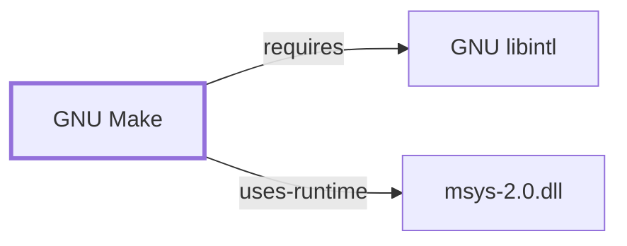

# GNU Make

## Purpose

Make executes declared dependency rules from a Makefile, rebuilding only
targets whose prerequisites are newer. This page documents its
architectural role and its notable dual-packaging in this snapshot; see the
[GNU Make manual](https://www.gnu.org/software/make/manual/make.html) for
the full rule-syntax and function reference.

## Architectural Classification

`component:gnu:make` is a GNU-userland component. Unlike every other tool
documented so far in this volume, it is packaged **twice** in this
snapshot: `package:msys2:make` (version `4.4.1-3`, MSYS environment, this
page's primary citation) and
`package:msys2:mingw-w64-ucrt-x86_64-make` (version `4.4.1-5`, UCRT64
environment) — the same duplication already flagged when documenting
[CMake](CMAKE.md)'s Ninja-generator alternative. Both are the same
upstream GNU Make project, packaged separately for MSYS-environment build
orchestration and for native UCRT64 toolchain use respectively.

## Responsibilities

- Executing dependency-ordered build rules from a `Makefile`, commonly the
  execution target for [Autoconf](GNU-AUTOCONF.md)/[Automake](GNU-AUTOMAKE.md)-generated
  build systems, the Autotools-family counterpart to
  [Ninja](NINJA.md)'s role for [CMake](CMAKE.md)/[Meson](MESON.md).

## Boundaries

Make executes rules; it does not generate them from a higher-level
description the way [Automake](GNU-AUTOMAKE.md) or [CMake](CMAKE.md) do —
Makefiles are commonly hand-written or generated by `configure` from a
`Makefile.in` template, a different relationship from the
generator/executor pairing documented for CMake/Meson and Ninja.

## Interfaces

- The `make` command reading a `Makefile`/`GNUmakefile` by default, with
  `-j` for parallel execution and `-C`/`-f` for directory/file selection,
  per the manual.

## Dependencies

The MSYS `package:msys2:make` records one `runtime-depends-on` edge:
[GNU libintl](GNU-LIBINTL.md) (`package:msys2:libintl`, gettext-based
message translation, the same NLS rationale documented for
[GNU Coreutils](GNU-COREUTILS.md)). Its declared
dependencies also list `sh`, a virtual capability provided by
`package:msys2:bash` rather than an actual package name; it is retained in
`generated/unresolved-dependencies.json` rather than asserted, per the same
explanation given for [GNU Grep](GNU-GREP.md#dependencies). The separate
UCRT64 package depends only on
`mingw-w64-ucrt-x86_64-gettext-runtime`, the native-environment equivalent.

## Reverse Dependencies

The MSYS package records 12 relationships targeting it, while the UCRT64
package records **0** in this snapshot — an honestly reported observation,
not an inference that the UCRT64 native make is unused in general; it
simply means no other package in this catalog snapshot declares a direct
dependency on it. See the
[reverse dependency impact analysis](REVERSE-DEPENDENCY-IMPACT-ANALYSIS.md)
for the current full list.

## Configuration

`Makefile`/`GNUmakefile` is the project's build description; `MAKEFLAGS`
and `MAKELEVEL` are environment variables Make itself sets and reads for
recursive-make invocations, per the manual.

## Initialization and Execution Flow

Make is an invoke-run-exit process that spawns each rule's recipe commands
as child processes; the MSYS package's process model is adapted from POSIX
semantics onto Windows process primitives by `msys-2.0.dll` per
[MSYS Runtime Initialization](MSYS-RUNTIME-INITIALIZATION.md), while the
UCRT64 package's process model is Windows-facing directly, the same
environment-dependent distinction already documented throughout this
volume and Volume 5.

## Runtime Behavior

Make's core behavior — comparing target and prerequisite file
modification times to decide whether a rule's recipe runs — is
timestamp-based; clock skew or a build system that doesn't update
timestamps as Make expects is a documented general source of stale- or
unnecessary-rebuild bugs.

## Compatibility and Variants

GNU Make includes extensions (pattern rules with `%`, functions like
`$(wildcard ...)`, `include`) beyond POSIX make; Makefiles relying on these
are not portable to a strictly POSIX make implementation without
adaptation, per the manual's own portability notes.

## Security Considerations

Make executes arbitrary recipe commands from the Makefile it is given; a
Makefile from an untrusted source can run arbitrary commands, the same
general risk class already noted for [Ninja](NINJA.md#security-considerations)'s
`build.ninja` files. See
[Threat Model and Supply Chain](THREAT-MODEL-AND-SUPPLY-CHAIN.md) for the
project's general supply-chain posture; no version-qualified CVE review has
been performed for the recorded `4.4.1-3`/`4.4.1-5` versions.

## Failure Modes and Diagnostics

"Nothing to be done" or unexpected no-op behavior should first be checked
against file timestamps and the dependency graph declared in the Makefile,
per Runtime Behavior above, before being treated as a Make defect.

## Evidence, Assumptions, and Open Questions

Rule-execution and Makefile-syntax behavior are backed by the official GNU
Make manual (`evidence:gnu:make-manual-2026-07-30`). Package identity,
version, and dependency edges for both packages are backed by the pacman
catalog snapshot (`evidence:catalog:current`). The unresolved `sh`
dependency on the MSYS package is explained by
`generated/unresolved-dependencies.json`, not merely asserted. No open
items beyond the general version-qualified security review noted above.

<!-- BEGIN GENERATED dependency-subgraph -->

## Dependency Diagram

Dependencies and dependents of `component:gnu:make` in the composed graph: 0 dependents and 2 dependencies.

Generated from the composed model by `tools/build_object_diagrams.py`.
Edits between the surrounding markers are overwritten on the next build.

<!-- END GENERATED dependency-subgraph -->

## Related Objects

- [MSYS2 Toolchain Role Model](TOOLCHAIN-ROLE-MODEL.md)
- [MSYS2 Build System Role Model](BUILD-SYSTEM-ROLE-MODEL.md)
- [GNU Autoconf](GNU-AUTOCONF.md)
- [GNU Automake](GNU-AUTOMAKE.md)
- [Ninja](NINJA.md)
- [GNU libintl](GNU-LIBINTL.md)
