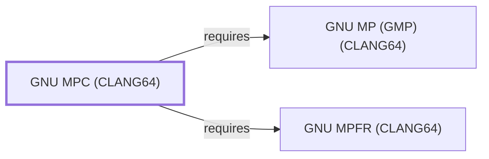

# GNU MPC (CLANG64)

## Purpose

This page documents `package:msys2:mingw-w64-clang-x86_64-mpc`, the
CLANG64-environment build of GNU MPC — multiple-precision complex-
number arithmetic built on both [GMP (CLANG64)](GNU-GMP-CLANG64.md)
and [GNU MPFR (CLANG64)](GNU-MPFR-CLANG64.md), both already documented
in this knowledge base. This page closes the last of the three
concrete future-batch candidates GMP (CLANG64)'s own page flagged. See
the [official MPC project site](https://www.multiprecision.org) for
the API reference.

## Architectural Classification

`library:multiprecision:mpc@clang64` is packaged as
`package:msys2:mingw-w64-clang-x86_64-mpc` (version `1.4.1-1` in the
current catalog snapshot, license `LGPL-3.0-or-later`), maintained by
the MPC team including Andreas Enge — the same version number as
[GNU MPC (UCRT64)](GNU-MPC.md)'s package, but a separately built,
separate catalog entity. It belongs to the CLANG64 environment. Both
of its own recorded runtime dependencies were already modeled entities
in this knowledge base before this page was written, letting this
addition close its full dependency footprint in a single pass — the
tenth full-coverage addition this session.

## Responsibilities

- Providing correctly-rounded complex-number arithmetic (real and
  imaginary parts each backed by
  [GNU MPFR (CLANG64)'s](GNU-MPFR-CLANG64.md) correct-rounding
  floating-point) for CLANG64-native consumers, the same role
  [GNU MPC (UCRT64)](GNU-MPC.md#responsibilities) documents for its
  own environment.

## Boundaries

MPC depends on both [GMP (CLANG64)](GNU-GMP-CLANG64.md) and
[GNU MPFR (CLANG64)](GNU-MPFR-CLANG64.md) rather than reimplementing
their functionality; it adds complex-number support specifically, the
same boundary already drawn on
[GNU MPC (UCRT64)'s](GNU-MPC.md#boundaries) own page.

## Interfaces

- The `mpc_*` C function family for complex-number arithmetic, the same
  interface [GNU MPC (UCRT64)](GNU-MPC.md#interfaces) documents, per
  the documentation.

## Dependencies

The catalog snapshot records two `runtime-depends-on` edges for
`package:msys2:mingw-w64-clang-x86_64-mpc`, both now modeled in this
knowledge base:

| Dependency | Package | Architectural reason |
| --- | --- | --- |
| [GMP (CLANG64)](GNU-GMP-CLANG64.md) | `package:msys2:mingw-w64-clang-x86_64-gmp` | MPC builds complex-number arithmetic directly on GMP's arbitrary-precision integer and rational primitives. |
| [GNU MPFR (CLANG64)](GNU-MPFR-CLANG64.md) | `package:msys2:mingw-w64-clang-x86_64-mpfr` | MPC's complex-number operations reuse MPFR's correctly-rounded real-arithmetic primitives for the real and imaginary components. |

## Reverse Dependencies

The catalog snapshot records 9 relationships targeting
`package:msys2:mingw-w64-clang-x86_64-mpc`:
`mingw-w64-clang-x86_64-arm-none-eabi-gcc`,
`mingw-w64-clang-x86_64-avr-gcc`,
`mingw-w64-clang-x86_64-gnome-calculator`,
`mingw-w64-clang-x86_64-openturns`,
`mingw-w64-clang-x86_64-python-gmpy2`,
`mingw-w64-clang-x86_64-python-passagemath-msolve`,
`mingw-w64-clang-x86_64-python-passagemath-plantri`,
`mingw-w64-clang-x86_64-riscv32-unknown-elf-gcc`, and
`mingw-w64-clang-x86_64-riscv64-unknown-elf-gcc` — the cross-
compilation embedded/alternate-architecture GCC toolchains among these
matching the same reverse-dependent pattern already documented on
[isl (CLANG64)'s](LIBISL-CLANG64.md#reverse-dependencies) own page.
None of these nine are currently modeled as entities in this knowledge
base; see the
[reverse dependency impact analysis](REVERSE-DEPENDENCY-IMPACT-ANALYSIS.md)
for the current full list.

## Configuration

MPC has no persistent configuration file; precision and rounding
parameters are set through its C API, mirroring MPFR's design, the
same model documented for [GNU MPC (UCRT64)](GNU-MPC.md#configuration).

## Initialization and Execution Flow

As a library, MPC has no independent process lifecycle: it initializes
and executes within the process of whatever program links against it.
As a native MinGW-w64 library, this process model is Windows-facing
directly rather than mediated by `msys-2.0.dll`.

## Runtime Behavior

Identical functional behavior to [GNU MPC (UCRT64)](GNU-MPC.md); see
that page for detail not specific to the CLANG64/UCRT64 packaging
distinction.

## Compatibility and Variants

The CLANG64 and UCRT64 MPC packages are separately versioned catalog
entities (see Architectural Classification); code built against one is
not automatically compatible with the other without matching the
correct environment.

## Security Considerations

No MPC-specific vulnerability review has been performed for this
volume; see [Threat Model and Supply Chain](THREAT-MODEL-AND-SUPPLY-CHAIN.md)
for the project's general supply-chain posture. No version-qualified
CVE review has been performed for the recorded `1.4.1-1` version.

## Failure Modes and Diagnostics

MPC itself has no user-facing CLI; complex-arithmetic-related failures
in a dependent tool should be checked against the requested precision
and rounding mode, the same diagnostic priority already established
for [GNU MPC (UCRT64)](GNU-MPC.md#failure-modes-and-diagnostics).

## Evidence, Assumptions, and Open Questions

The complex-arithmetic model is backed by the official MPC project site
(`evidence:multiprecision:mpc-manual-2026-07-30`), the same evidence
record [GNU MPC (UCRT64)](GNU-MPC.md) cites. Package identity, version,
license, and both recorded dependency edges are backed by the pacman
catalog snapshot (`evidence:catalog:current`). Open: the nine recorded
reverse dependents are not individually modeled in this knowledge
base.

<!-- BEGIN GENERATED dependency-subgraph -->

## Dependency Diagram

Dependencies and dependents of `library:multiprecision:mpc@clang64` in the composed graph: 0 dependents and 2 dependencies.

Generated from the composed model by `tools/build_object_diagrams.py`.
Edits between the surrounding markers are overwritten on the next build.

<!-- END GENERATED dependency-subgraph -->

## Related Objects

- [MSYS2 Library Architecture](LIBRARIES-ARCHITECTURE.md)
- [GNU MPC (UCRT64)](GNU-MPC.md)
- [GMP (CLANG64)](GNU-GMP-CLANG64.md)
- [GNU MPFR (CLANG64)](GNU-MPFR-CLANG64.md)
- [isl (CLANG64)](LIBISL-CLANG64.md)
