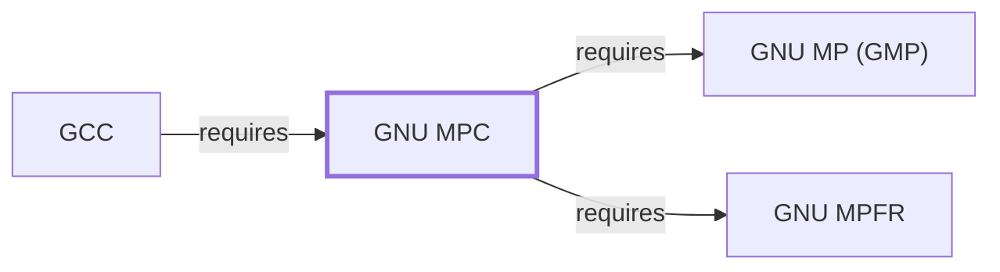

# GNU MPC

## Purpose

MPC provides multiple-precision complex-number arithmetic, built on both
[GMP](GNU-GMP.md) and [MPFR](GNU-MPFR.md), completing the arithmetic
library chain [GCC](GNU-GCC.md) depends on for its own internal
computation. This page documents its architectural role; see the
[official MPC project site](https://www.multiprecision.org) for the API
reference.

## Architectural Classification

`library:multiprecision:mpc` is packaged per native environment: this
page cites the UCRT64 build, `package:msys2:mingw-w64-ucrt-x86_64-mpc`
(version `1.4.1-1` in the current catalog snapshot, license
`LGPL-3.0-or-later`), maintained by the MPC team including Andreas Enge.

## Responsibilities

- Providing correctly-rounded complex-number arithmetic (real and
  imaginary parts each backed by [MPFR](GNU-MPFR.md)'s correct-rounding
  floating-point), completing the real/rational ([GMP](GNU-GMP.md)),
  correctly-rounded-real ([MPFR](GNU-MPFR.md)), and complex (MPC) tier of
  this dependency chain.

## Boundaries

MPC depends on both [GMP](GNU-GMP.md) and [MPFR](GNU-MPFR.md) rather than
reimplementing their functionality; it adds complex-number support
specifically, the one arithmetic domain neither of the other two covers.

## Interfaces

- The `mpc_*` C function family for complex-number arithmetic, mirroring
  MPFR's rounding-mode-explicit API design, per the documentation.

## Dependencies

The catalog snapshot records two `runtime-depends-on` edges for
`package:msys2:mingw-w64-ucrt-x86_64-mpc`: `mingw-w64-ucrt-x86_64-gmp`
and `mingw-w64-ucrt-x86_64-mpfr`, documented fully in
[GNU MP](GNU-GMP.md) and [GNU MPFR](GNU-MPFR.md) respectively — MPC is
the top tier of this three-library arithmetic chain.

## Reverse Dependencies

The snapshot records 15 relationships targeting
`package:msys2:mingw-w64-ucrt-x86_64-mpc`, including
[GCC](GNU-GCC.md#dependencies), which uses MPC for compile-time
complex-number constant evaluation. See the
[reverse dependency impact analysis](REVERSE-DEPENDENCY-IMPACT-ANALYSIS.md)
for the current full list.

## Configuration

MPC has no persistent configuration file; precision and rounding
parameters are set through its C API, mirroring MPFR's design.

## Initialization and Execution Flow

As a library, MPC has no independent process lifecycle: it initializes
and executes within the process of whatever program links against it, the
same model documented for [GNU MP](GNU-GMP.md#initialization-and-execution-flow)
and [GNU MPFR](GNU-MPFR.md#initialization-and-execution-flow).

## Runtime Behavior

MPC inherits MPFR's correct-rounding reproducibility guarantee, extended
to the complex domain — the same documented design goal already noted for
[MPFR](GNU-MPFR.md#runtime-behavior).

## Compatibility and Variants

MPC's API version compatibility tracks its own release notes; this page
does not enumerate them.

## Security Considerations

No MPC-specific vulnerability review has been performed for this volume;
see [Threat Model and Supply Chain](THREAT-MODEL-AND-SUPPLY-CHAIN.md) for
the project's general supply-chain posture. No version-qualified CVE
review has been performed for the recorded `1.4.1-1` version.

## Failure Modes and Diagnostics

MPC itself has no user-facing CLI; complex-arithmetic-related failures in
a dependent tool should be checked against the requested precision and
rounding mode, the same diagnostic priority already established for
[MPFR](GNU-MPFR.md#failure-modes-and-diagnostics).

## Evidence, Assumptions, and Open Questions

The complex-arithmetic model is backed by the official MPC project site
(`evidence:multiprecision:mpc-manual-2026-07-30`), matching the
`project_url` already recorded for
`package:msys2:mingw-w64-ucrt-x86_64-mpc` in the catalog. Package
identity, version, license, and both dependency edges are backed by the
pacman catalog snapshot (`evidence:catalog:current`). Open, and
explicitly out of scope for this page: header-level API surface and PE
import/export-level evidence, per the
[Library Family Classification](LIBRARY-FAMILY-CLASSIFICATION.md)
methodology.

<!-- BEGIN GENERATED dependency-subgraph -->

## Dependency Diagram

Dependencies and dependents of `library:multiprecision:mpc` in the composed graph: 1 dependent and 2 dependencies.

Generated from the composed model by `tools/build_object_diagrams.py`.
Edits between the surrounding markers are overwritten on the next build.

<!-- END GENERATED dependency-subgraph -->

## Related Objects

- [MSYS2 Library Architecture](LIBRARIES-ARCHITECTURE.md)
- [GNU MP (GMP)](GNU-GMP.md)
- [GNU MPFR](GNU-MPFR.md)
- [GCC](GNU-GCC.md)
- [GNU MPC (CLANG64)](GNU-MPC-CLANG64.md)
