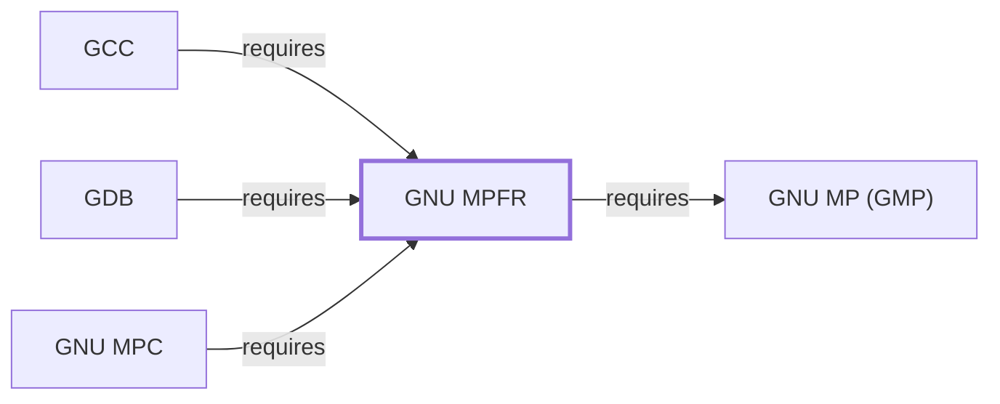

# GNU MPFR

## Purpose

MPFR provides multiple-precision, correctly-rounded binary floating-point
arithmetic built on [GMP](GNU-GMP.md), and it backs the same
arbitrary-precision needs of [GCC](GNU-GCC.md) and [GDB](GNU-GDB.md)
already documented on those pages. This page documents its architectural
role; see the [official MPFR project site](https://www.mpfr.org) for the
API reference.

## Architectural Classification

`library:gnu:mpfr` is a GNU-userland library, packaged per native
environment: this page cites the UCRT64 build,
`package:msys2:mingw-w64-ucrt-x86_64-mpfr` (version `4.2.2-3` in the
current catalog snapshot, license `LGPL-3.0-or-later`).

## Responsibilities

- Providing correctly-rounded floating-point arithmetic (each result
  guaranteed as if computed with infinite precision and rounded once) at
  arbitrary, user-selected precision — a stronger guarantee than GMP's own
  floating-point functions offer, per the manual.

## Boundaries

MPFR adds correct-rounding floating-point semantics on top of
[GMP](GNU-GMP.md)'s arithmetic primitives; it does not itself provide
complex-number support (that is [MPC](GNU-MPC.md)'s role, which depends
on both GMP and MPFR).

## Interfaces

- The `mpfr_*` C function family, mirroring GMP's naming convention but
  adding an explicit rounding-mode parameter to most operations, per the
  documentation.

## Dependencies

The catalog snapshot records two `runtime-depends-on` edges for
`package:msys2:mingw-w64-ucrt-x86_64-mpfr`: `mingw-w64-ucrt-x86_64-gmp`
(the arithmetic foundation MPFR builds on, documented fully in
[GNU MP](GNU-GMP.md)) and `mingw-w64-ucrt-x86_64-cc-libs` (the virtual
capability [gcc-libs provides](LIBSTDCXX.md#dependencies) in this
environment, for low-level compiler runtime support).

## Reverse Dependencies

The snapshot records 33 relationships targeting
`package:msys2:mingw-w64-ucrt-x86_64-mpfr`, including
[MPC](GNU-MPC.md#dependencies) and, through it and directly,
[GCC](GNU-GCC.md#dependencies) and [GDB](GNU-GDB.md#dependencies). See the
[reverse dependency impact analysis](REVERSE-DEPENDENCY-IMPACT-ANALYSIS.md)
for the current full list.

## Configuration

MPFR has no persistent configuration file; precision and rounding mode are
set per-operation or per-variable through its C API.

## Initialization and Execution Flow

As a library, MPFR has no independent process lifecycle: it initializes
and executes within the process of whatever program links against it, the
same model documented for [GNU MP](GNU-GMP.md#initialization-and-execution-flow).

## Runtime Behavior

MPFR's correct-rounding guarantee means identical results across
platforms and compilers for the same precision and rounding mode — a
reproducibility property the manual states explicitly as a design goal,
distinguishing it from ordinary hardware floating-point arithmetic.

## Compatibility and Variants

MPFR versions its correct-rounding guarantee against documented rounding
modes (`MPFR_RNDN`, `MPFR_RNDZ`, and others); this page does not enumerate
them, deferring to the manual.

## Security Considerations

No MPFR-specific vulnerability review has been performed for this volume;
see [Threat Model and Supply Chain](THREAT-MODEL-AND-SUPPLY-CHAIN.md) for
the project's general supply-chain posture. No version-qualified CVE
review has been performed for the recorded `4.2.2-3` version.

## Failure Modes and Diagnostics

MPFR itself has no user-facing CLI; precision-related failures in a
dependent tool should be checked against the requested precision and
rounding mode before being treated as an MPFR defect.

## Evidence, Assumptions, and Open Questions

The correct-rounding arithmetic model is backed by the official MPFR
project site (`evidence:gnu:mpfr-manual-2026-07-30`), matching the
`project_url` already recorded for
`package:msys2:mingw-w64-ucrt-x86_64-mpfr` in the catalog. Package
identity, version, license, and both dependency edges are backed by the
pacman catalog snapshot (`evidence:catalog:current`). Open, and
explicitly out of scope for this page: header-level API surface and PE
import/export-level evidence, per the
[Library Family Classification](LIBRARY-FAMILY-CLASSIFICATION.md)
methodology.

<!-- BEGIN GENERATED dependency-subgraph -->

## Dependency Diagram

Dependencies and dependents of `library:gnu:mpfr` in the composed graph: 3 dependents and 1 dependency.

Generated from the composed model by `tools/build_object_diagrams.py`.
Edits between the surrounding markers are overwritten on the next build.

<!-- END GENERATED dependency-subgraph -->

## Related Objects

- [MSYS2 Library Architecture](LIBRARIES-ARCHITECTURE.md)
- [GNU MP (GMP)](GNU-GMP.md)
- [GNU MPC](GNU-MPC.md)
- [GCC](GNU-GCC.md)
- [GDB](GNU-GDB.md)
- [GNU MPFR (MSYS)](GNU-MPFR-MSYS.md)
- [GNU MPFR (CLANG64)](GNU-MPFR-CLANG64.md)
