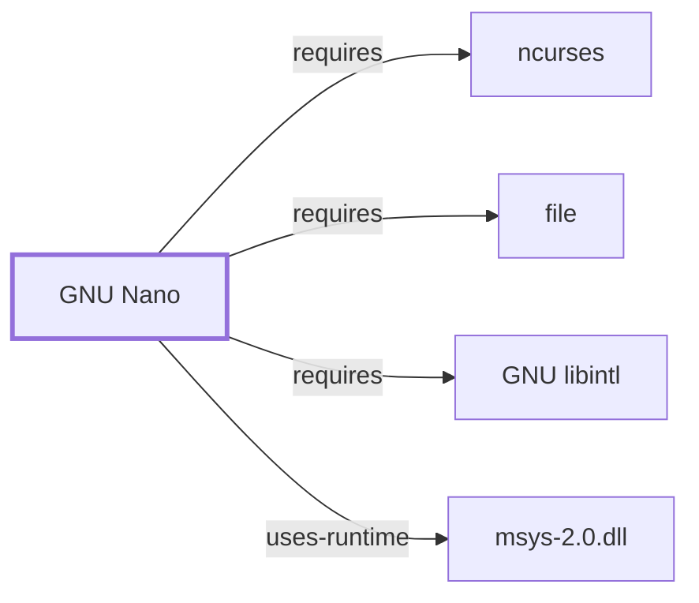

# GNU Nano

## Purpose

Nano is a small, easy-to-use full-screen text editor descended from Pico,
designed around always-visible on-screen keybinding hints rather than modal
editing. This page documents its architectural role and dependency
footprint; see the
[official GNU Nano project site](https://www.nano-editor.org) for the full
option and configuration reference.

## Architectural Classification

`component:gnu:nano` is a GNU-userland component packaged as
`package:msys2:nano` (version `9.1-1` in the current catalog snapshot,
license `GPL-3.0-or-later`), belonging to the MSYS environment. It occupies
a middle position in this volume's editor spectrum: full-screen like
[Vim](VIM.md) and [GNU Emacs](GNU-EMACS.md), but non-modal and designed for
immediate approachability rather than [Vim](VIM.md)'s modal efficiency or
[GNU Emacs](GNU-EMACS.md)'s extensibility.

## Responsibilities

- Full-screen text editing with always-visible keybinding hints (the
  bottom-of-screen command bar), syntax highlighting, and search/replace.

## Boundaries

Nano is not designed to be extensible or scriptable in the way
[GNU Emacs](GNU-EMACS.md) is (no embedded scripting language), and it is
not modal like [Vim](VIM.md) — its keybindings are Control/Meta-key
combinations active at all times, not mode-dependent.

## Interfaces

- Control-key command bindings (displayed on-screen by default), `-Y` for
  explicit syntax selection, and a `nanorc` syntax-highlighting rule format,
  per the manual.

## Dependencies

The catalog snapshot records three `runtime-depends-on` edges for
`package:msys2:nano`:

| Dependency | Package | Architectural reason |
| --- | --- | --- |
| File-type detection | `package:msys2:file` | Likely used to help select a syntax-highlighting rule set for files without a recognized extension; this specific mechanism is a plausible but not manual-confirmed explanation, recorded at medium confidence. Documented fully in [file](FILE.md). |
| Native-language messages | `package:msys2:libintl` | gettext-based message translation (NLS). Documented fully in [GNU libintl](GNU-LIBINTL.md). |
| Terminal capability library | `package:msys2:ncurses` | Screen drawing and cursor control, the same shared dependency documented as a hub in [ncurses](NCURSES.md#reverse-dependencies). |

Nano's declared dependencies also list `sh`, a virtual capability provided
by `package:msys2:bash` rather than an actual package name; it does not
resolve to a `runtime-depends-on` edge and is instead retained in
`generated/unresolved-dependencies.json`, per the same explanation given
for [GNU Grep](GNU-GREP.md#dependencies).

## Reverse Dependencies

The snapshot records 8 relationships targeting `package:msys2:nano`. See
the [reverse dependency impact analysis](REVERSE-DEPENDENCY-IMPACT-ANALYSIS.md)
for the current full list.

## Configuration

`~/.nanorc` (and system-wide `nanorc` files) set persistent options and
syntax-highlighting rules; this is a genuine standing configuration file,
similar to [mintty](MINTTY.md#configuration)'s `~/.minttyrc` and unlike the
purely per-invocation configuration of most tools documented earlier in
this volume.

## Initialization and Execution Flow

Nano is a longer-lived interactive process for a single editing session,
adapted from POSIX semantics onto Windows process primitives by
`msys-2.0.dll` per [MSYS Runtime Initialization](MSYS-RUNTIME-INITIALIZATION.md).
Its screen drawing depends on [ncurses](NCURSES.md).

## Runtime Behavior

Nano's on-screen keybinding hints are always visible regardless of editor
state, a deliberate design choice distinguishing it from
[Vim](VIM.md#compatibility-and-variants)'s modal, hint-free interface.

## Compatibility and Variants

Nano is not vi/ex-command compatible; users expecting [Vim](VIM.md)'s modal
commands will need nano's distinct Control/Meta-key bindings instead.

## Security Considerations

No nano-specific vulnerability review has been performed for this volume;
see [Threat Model and Supply Chain](THREAT-MODEL-AND-SUPPLY-CHAIN.md) for
the project's general supply-chain posture.

## Failure Modes and Diagnostics

Garbled screen drawing should first be checked against the same
terminfo/`TERM` question already flagged for
[ncurses](NCURSES.md#runtime-behavior) rather than treated as a defect in
nano itself.

## Evidence, Assumptions, and Open Questions

Interface and configuration behavior are backed by the official GNU Nano
project site (`evidence:gnu:nano-manual-2026-07-30`), matching the
`project_url` already recorded for `package:msys2:nano` in the catalog.
Package identity, version, license, and dependency edges are backed by the
pacman catalog snapshot (`evidence:catalog:current`). Open: the exact
purpose of the `file` dependency is a medium-confidence inference, not a
manual-confirmed fact; the unresolved `sh` dependency is explained by
`generated/unresolved-dependencies.json`, not merely asserted.

<!-- BEGIN GENERATED dependency-subgraph -->

## Dependency Diagram

Dependencies and dependents of `component:gnu:nano` in the composed graph: 0 dependents and 4 dependencies.

Generated from the composed model by `tools/build_object_diagrams.py`.
Edits between the surrounding markers are overwritten on the next build.

<!-- END GENERATED dependency-subgraph -->

## Related Objects

- [GNU Userland Role Model](GNU-USERLAND-ROLE-MODEL.md)
- [ncurses](NCURSES.md)
- [Vim](VIM.md)
- [GNU Emacs](GNU-EMACS.md)
- [GNU Ed](GNU-ED.md)
- [file](FILE.md)
- [GNU libintl](GNU-LIBINTL.md)
