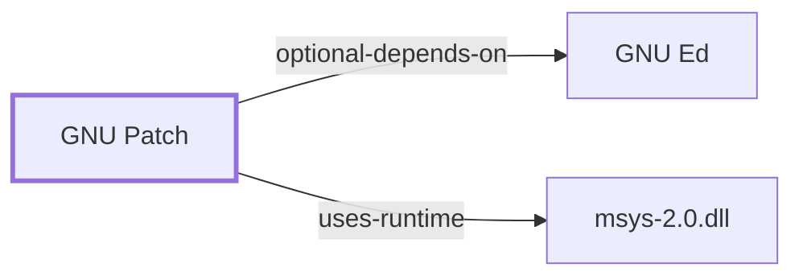

# GNU Patch

<!-- BEGIN GENERATED object-facts -->

| Model fact | Value |
| --- | --- |
| Object | `component:gnu:patch` |
| Kind | `component` |
| Status | `partial` |
| Confidence | `high` |
| Authority | Free Software Foundation |
| Environments | `msys` |
| Upstream | <https://www.gnu.org/software/patch/patch.html> |
| Packaged as | `package:msys2:patch` |
| Version (observed) | 2.7.6-3 |
| License (observed) | GPL |
| Architecture (observed) | x86_64 |
| Installed size (observed) | 186.38 KiB |

**Evidence on this object**

- `evidence:catalog:current` — MSYS2 pacman package catalog (`observed`, retrieved 2026-08-05)
- `evidence:gnu:patch-1-2026-08-02` — patch(1) manual page (`primary`, retrieved 2026-08-02)

Generated from the composed model by `tools/build_object_facts.py`. Observed values come from the catalog snapshot and change when it is refreshed.
Edits between the surrounding markers are overwritten on the next build.

<!-- END GENERATED object-facts -->

## Purpose

`patch` applies a difference listing to original files. It is the
consumer half of the format [GNU Diffutils](GNU-DIFFUTILS.md) produces,
and in this ecosystem it is the mechanism by which package recipes carry
source modifications: a `PKGBUILD`'s `prepare()` function applies the
`.patch` files sitting beside it.

Upstream states the job in one sentence:

> patch takes a patch file *patchfile* containing a difference listing
> produced by the diff program and applies those differences to one or
> more original files, producing patched versions.

## Architectural Classification

`component:gnu:patch` is a GNU-userland component packaged as
`package:msys2:patch` (version `2.7.6-3` in the current catalog snapshot,
license `GPL`, 190,858 bytes installed), belonging to the MSYS
environment. It declares one optional dependency, and its reason is
mechanical rather than cosmetic:

> `ed`: for `patch -e` functionality

That is because `patch` does not apply `ed`-format diffs itself:

> Context diffs (old-style, new-style, and unified) and normal diffs are
> applied by the patch program itself, while ed diffs are simply fed to
> the ed(1) editor via a pipe.

So the optional dependency on [GNU Ed](GNU-ED.md) is a real delegation.

## Responsibilities

- Detecting the diff format and applying it, or delegating to `ed`.
- Locating each hunk in a file that may have drifted from the one the
  patch was generated against.
- Producing reject files for hunks it cannot place.
- Making backups of the files it modifies.

## Format Detection and Garbage Tolerance

`patch` guesses:

> Upon startup, patch attempts to determine the type of the diff listing,
> unless overruled by a `-c` (`--context`), `-e` (`--ed`), `-n`
> (`--normal`), or `-u` (`--unified`) option.

and it is deliberately forgiving about what surrounds the diff:

> patch tries to skip any leading garbage, apply the diff, and then skip
> any trailing garbage. Thus you could feed an email message containing a
> diff listing to patch, and it should work.

It also unwraps consistent indentation, CRLF line endings, and RFC 934
`"- "` encapsulation. That tolerance is a feature for handling patches
that travelled through mail, and a hazard for automation: `patch` will
find *something* to do with a malformed input rather than refusing it.
In a `PKGBUILD`, state the format explicitly rather than relying on
detection.

## The Fuzz Algorithm

This is the part that decides whether a patch applies to a source tree
that has moved on, and its behavior is precisely documented:

- `patch` first tries to place the hunk exactly.
- If the maximum fuzz factor is 1 or more, it rescans **ignoring the first
  and last line of context**.
- If that fails and the factor is 2 or more, it ignores the first two and
  last two lines of context.
- **The default maximum fuzz factor is 2.**

Two placement rules follow:

> Hunks with less prefix context than suffix context (after applying fuzz)
> must apply at the start of the file if their first line number is 1.
> Hunks with more prefix context than suffix context (after applying fuzz)
> must apply at the end of the file.

The practical consequence: **a patch that "applies with fuzz" applied
somewhere `patch` guessed.** It reports the offset, and that report is
worth reading rather than discarding. Fuzz is why a recipe can keep
working across a minor upstream version bump, and also why it can silently
patch the wrong place.

## Reject Files

When a hunk cannot be placed:

> If patch cannot find a place to install that hunk of the patch, it puts
> the hunk out to a reject file, which normally is the name of the output
> file plus a `.rej` suffix, or `#` if `.rej` would generate a file name
> that is too long.

Two details worth knowing before reading a `.rej`:

- The rejected hunk comes out in unified or context format regardless of
  the input format. If the input was a normal diff, "many of the contexts
  are simply null".
- **The line numbers in a reject file are not the patch file's line
  numbers.** They "reflect the approximate location patch thinks the
  failed hunks belong in the new file rather than the old one."

The `.rej` filename fallback matters on Windows more than on Linux,
because Windows path length limits are stricter — see
[Windows Filesystem Boundary](WINDOWS-FILESYSTEM-BOUNDARY.md).

## Line Endings: the MSYS2-Relevant Behavior

`patch(1)` addresses Windows directly, and this is the most
ecosystem-relevant passage in either manual page:

> **`--binary`** — Write all files in binary mode, except for standard
> output and `/dev/tty`. When reading, disable the heuristic for
> transforming CRLF line endings into LF line endings. This option is
> needed on POSIX systems when applying patches generated on non-POSIX
> systems to non-POSIX files. (On POSIX systems, file reads and writes
> never transform line endings. On Windows, reads and writes do transform
> line endings by default, and patches should be generated by
> `diff --binary` when line endings are significant.)

Read carefully, that describes a **default transformation** on Windows,
and `patch` has a heuristic to compensate that `--binary` disables. So
three things can each independently mangle line endings: how the patch was
generated, how `patch` reads it, and how the underlying filesystem layer
presents the file.

The MSYS2 complication is the third one. MSYS-side text/binary treatment
is governed by mount options, and **this knowledge base has not captured
MSYS2's effective mount table** — see
[MSYS Mount Manager](MSYS-MOUNT-MANAGER.md). So this page states the
tool's documented behavior and stops short of stating what happens on a
real MSYS2 install, which is not established here.

## Options That Change the Outcome

| Option | Effect |
| --- | --- |
| `-p num` | strip `num` leading path components from filenames in the patch |
| `--dry-run` | print results without changing any files |
| `-R` | reverse the sense of the patch |
| `-f`, `--force` | ask no questions; skip patches with no filename header |
| `-b`, `--backup` | keep backups (`.orig` by default) |
| `-E`, `--remove-empty-files` | delete outputs that end up empty |
| `-d dir` | change directory before doing anything else |

`-p` is the one that varies between patch sources, because it depends on
how deep the paths in the patch file are. `--dry-run` is the right first
move against an unfamiliar patch.

`-E` has a documented side effect worth knowing: "When patch removes a
file, it also attempts to remove any empty ancestor directories."

## Environment Variables

| Variable | Effect |
| --- | --- |
| `POSIXLY_CORRECT` | conform more strictly to POSIX; see `--posix` |
| `SIMPLE_BACKUP_SUFFIX` | replace the `.orig` backup suffix |
| `TMPDIR`, `TMP`, `TEMP` | where temporary files go; first one set wins |
| `VERSION_CONTROL`, `PATCH_VERSION_CONTROL` | backup naming style |
| `QUOTING_STYLE` | default for `--quoting-style` |

The `TMPDIR`/`TMP`/`TEMP` precedence is worth flagging on this platform:
Windows sets `TMP` and `TEMP` and MSYS2 environments may set `TMPDIR`, so
which one wins is decided by that documented ordering rather than by the
host convention.

`patch` also uses `/dev/tty` to ask questions. In a build script that is
either unavailable or undesirable, which is what `-f`/`--force` and
`--batch`-style non-interaction exist for.

## Known Failure Modes

Upstream names three in its own BUGS section, and each is a real thing a
packager meets:

1. **Duplicated code defeats it.** "If code has been duplicated (for
   instance with `#ifdef OLDCODE ... #else ... #endif`), patch is
   incapable of patching both versions, and, if it works at all, will
   likely patch the wrong one, and tell you that it succeeded to boot."
2. **Re-applying looks like reversal.** "If you apply a patch you've
   already applied, patch thinks it is a reversed patch, and offers to
   un-apply the patch."
3. **Fuzzy matching is expensive.** "Bigger hunks, more context, a bigger
   offset from the original location, and a worse match all slow the
   algorithm down."

The first two are correctness hazards that report success. That is the
reason `--dry-run` and reading the offset reports are not optional
discipline.

## Evidence and Gaps

- Every quoted statement is from the upstream `patch(1)` manual page,
  retrieved 2026-08-02. **gnu.org returned 403 through this environment's
  proxy**, so the page was read from man7.org's mirror.
- **Nothing here was run against `package:msys2:patch`.** The MSYS2
  build's version is 2.7.6-3 per the catalog snapshot, which is older than
  current upstream; option availability on that build is not verified.
- The interaction between `patch`'s CRLF heuristic and MSYS2's mount
  options is the open question this page cannot close, because the mount
  table is uncaptured.

<!-- BEGIN GENERATED dependency-subgraph -->

## Dependency Diagram

Dependencies and dependents of `component:gnu:patch` in the composed graph: 0 dependents and 2 dependencies.

Generated from the composed model by `tools/build_object_diagrams.py`.
Edits between the surrounding markers are overwritten on the next build.

<!-- END GENERATED dependency-subgraph -->

## Related Objects

- [GNU Diffutils](GNU-DIFFUTILS.md)
- [GNU Ed](GNU-ED.md)
- [Packaging for MSYS2](DEVELOPER-PACKAGING.md)
- [MSYS Mount Manager](MSYS-MOUNT-MANAGER.md)
- [Windows Filesystem Boundary](WINDOWS-FILESYSTEM-BOUNDARY.md)
