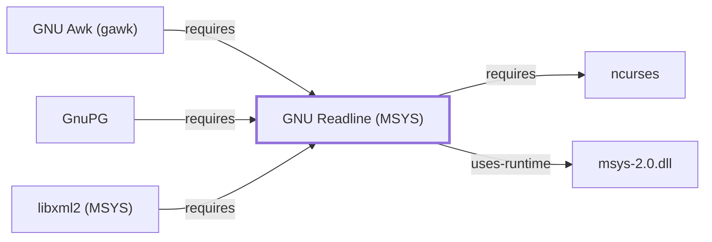

# GNU Readline (MSYS)

## Purpose

This page documents the **MSYS-environment** GNU Readline package
(`libreadline`) specifically — a library providing line editing, history,
and completion for interactive command-line programs — as a distinct
catalog entity from this knowledge base's existing
[GNU Readline (UCRT64)](GNU-READLINE.md) page: [GnuPG's](GNUPG.md)
interactive prompts and gawk's built-in interactive debugger
(`gawk --debug`) both link against this MSYS package, already cited by
package name on [GNUPG.md](GNUPG.md#dependencies) and
[GNU-AWK.md](GNU-AWK.md#dependencies) before this page existed. See the
[official GNU Readline project page](https://tiswww.case.edu/php/chet/readline/rltop.html)
for the full reference shared with the UCRT64 package.

## Architectural Classification

`library:gnu:readline@msys` is packaged in the MSYS environment as
`package:msys2:libreadline` (version `8.3.003-1` in the current catalog
snapshot) — a separately versioned catalog entity from
[GNU Readline (UCRT64)](GNU-READLINE.md)'s
`mingw-w64-ucrt-x86_64-readline` package. This is the package
[GnuPG](GNUPG.md) and [gawk](GNU-AWK.md) — both MSYS-environment
components themselves — actually depend on, the same MSYS-vs-native
distinction applied consistently throughout this volume, including for
[GNU Readline (UCRT64)](GNU-READLINE.md)'s own UCRT64-native dependent,
[GDB](GNU-GDB.md).

## Responsibilities

- Providing line editing, history navigation, and tab completion for
  interactive command-line prompts, consumed by
  [GnuPG's](GNUPG.md) interactive tools and gawk's `--debug` interactive
  debugger command prompt.

## Boundaries

This page's package serves MSYS-environment consumers specifically;
[GDB](GNU-GDB.md), documented as a UCRT64-native tool in Volume 8, links
against [GNU Readline (UCRT64)](GNU-READLINE.md) instead — the two
Readline packages are not interchangeable, matching the same
distinction already made for [GNU termcap](GNU-TERMCAP.md#architectural-classification)
in this volume.

## Interfaces

- The Readline C API (`readline()`, `add_history()`), the same interface
  [GNU Readline (UCRT64)](GNU-READLINE.md#interfaces) documents, per the
  documentation.

## Dependencies

The MSYS `package:msys2:libreadline` declares a dependency on
[ncurses](NCURSES.md) (`package:msys2:ncurses`, the same MSYS package
[ncurses'](NCURSES.md#architectural-classification) own page documents)
for terminal capability and cursor control — the same rationale already
documented for [GNU Readline (UCRT64)](GNU-READLINE.md#dependencies)'s
own `termcap` dependency, but a fuller terminal-handling library here
rather than the narrower termcap database.

## Reverse Dependencies

The catalog snapshot records 25 relationships targeting
`package:msys2:libreadline`, the widest reverse-dependency footprint of
any library added in this specific batch: `package:msys2:gnupg`
(`relationship:ssh-curl-git:gnupg-requires-libreadline` in this
knowledge base's graph), `package:msys2:gawk`
(`relationship:gnu-userland:gawk-requires-libreadline`),
`package:msys2:bc`, `package:msys2:cdecl`, `package:msys2:cgdb`,
`package:msys2:gdb` (the separate MSYS `gdb` package, distinct from the
UCRT64 `gdb` package [GNU GDB's own page](GNU-GDB.md) documents),
`package:msys2:inetutils`, `package:msys2:lftp`, `package:msys2:libgdbm`,
`package:msys2:libguile`, its own `-devel` subpackage,
`package:msys2:libxml2` (`relationship:foundation-libraries:libxml2-msys-requires-readline-msys`,
documented fully in [libxml2 (MSYS)](LIBXML2-MSYS.md)),
`package:msys2:nnn`, `package:msys2:pcre`, and
`package:msys2:pcre2`, among others not individually enumerated here.

## Configuration

`~/.inputrc` sets Readline key bindings and behavior — the same
configuration file [GNU Readline (UCRT64)](GNU-READLINE.md#configuration)
documents, since both packages honor the same file per the Readline
library's own convention.

## Initialization and Execution Flow

As a library, this package has no independent process lifecycle: it
initializes and executes within the process of whatever program links
against it — [GnuPG](GNUPG.md) or [gawk's](GNU-AWK.md) `--debug` mode in
this dependency chain. As an MSYS-dependent library, this is adapted
from POSIX semantics onto Windows process primitives by `msys-2.0.dll`
per [MSYS Runtime Initialization](MSYS-RUNTIME-INITIALIZATION.md).

## Runtime Behavior

Identical functional behavior to [GNU Readline (UCRT64)](GNU-READLINE.md);
see that page for detail not specific to the MSYS/UCRT64 packaging
distinction.

## Compatibility and Variants

The MSYS and native (UCRT64/CLANG64/i686) GNU Readline packages are
separately versioned catalog entities (see Architectural Classification);
code built against one is not automatically compatible with the other
without matching the correct environment.

## Security Considerations

GNU Readline is not itself a security-sensitive component in the usual
sense; its role in [GnuPG](GNUPG.md) is limited to interactive prompt
handling, distinct from GnuPG's actual cryptographic dependencies. See
[Threat Model and Supply Chain](THREAT-MODEL-AND-SUPPLY-CHAIN.md) for the
project's general supply-chain posture; no version-qualified CVE review
has been performed for the recorded `8.3.003-1` version.

## Failure Modes and Diagnostics

Unexpected interactive-prompt behavior (missing history, unresponsive key
bindings) in GnuPG or gawk's debugger should be checked against
`~/.inputrc` syntax before being treated as a defect in either calling
program.

## Evidence, Assumptions, and Open Questions

Line-editing library scope is backed by the official GNU Readline
project page (`evidence:gnu:readline-manual-2026-07-30`), the same
evidence record [GNU Readline (UCRT64)](GNU-READLINE.md) cites. Package
identity, version, and the recorded dependency/dependent edges are
backed by the pacman catalog snapshot (`evidence:catalog:current`).
Open, and explicitly out of scope for this page: header-level API
surface and PE import/export-level evidence, per the
[Library Family Classification](LIBRARY-FAMILY-CLASSIFICATION.md)
methodology.

<!-- BEGIN GENERATED dependency-subgraph -->

## Dependency Diagram

Dependencies and dependents of `library:gnu:readline@msys` in the composed graph: 3 dependents and 2 dependencies.

Generated from the composed model by `tools/build_object_diagrams.py`.
Edits between the surrounding markers are overwritten on the next build.

<!-- END GENERATED dependency-subgraph -->

## Related Objects

- [MSYS2 Library Architecture](LIBRARIES-ARCHITECTURE.md)
- [GnuPG](GNUPG.md)
- [GNU Awk (gawk)](GNU-AWK.md)
- [GNU Readline (UCRT64)](GNU-READLINE.md)
- [ncurses](NCURSES.md)
