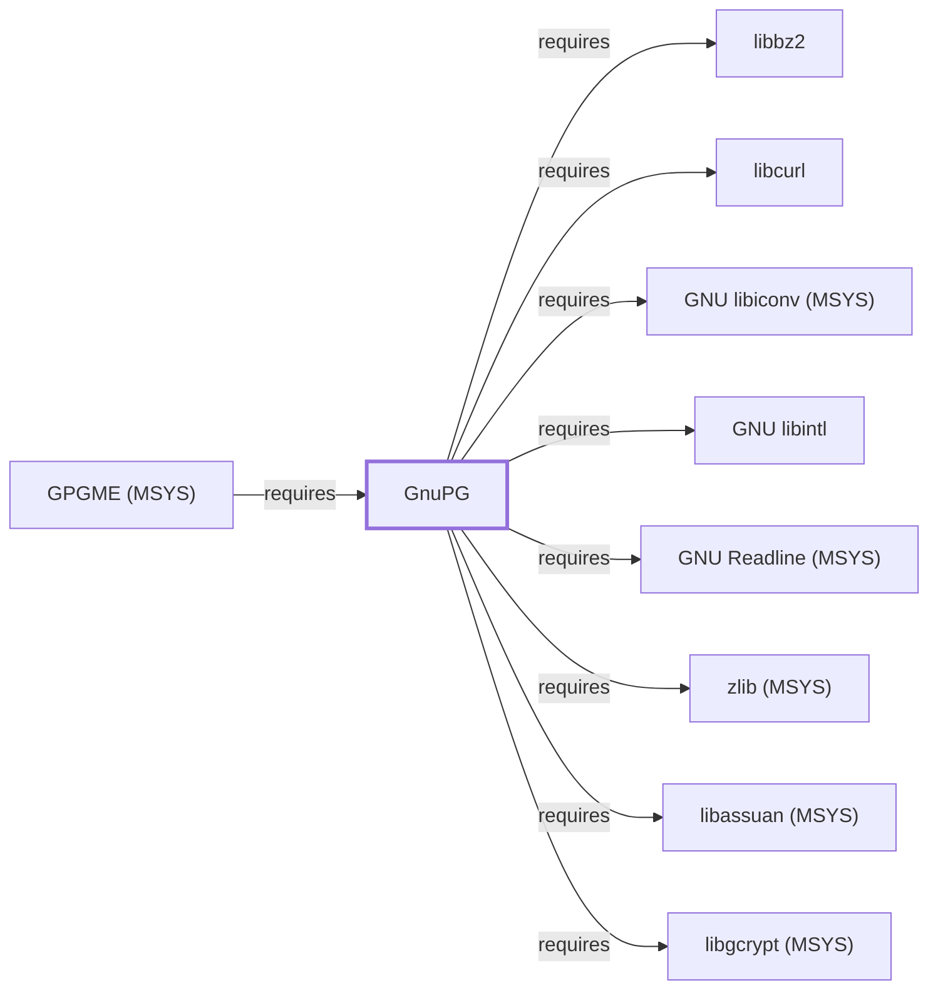

# GnuPG

<!-- BEGIN GENERATED object-facts -->

| Model fact | Value |
| --- | --- |
| Object | `component:gnupg:gnupg` |
| Kind | `component` |
| Status | `partial` |
| Confidence | `high` |
| Authority | Werner Koch / GnuPG project |
| Environments | `msys` |
| Upstream | <https://gnupg.org/> |
| Packaged as | `package:msys2:gnupg` |
| Version (observed) | 2.4.9-1 |
| License (observed) | GPL |
| Architecture (observed) | x86_64 |
| Installed size (observed) | 11.0 MB |

**Evidence on this object**

- `evidence:catalog:current` — MSYS2 pacman package catalog (`observed`, retrieved 2026-07-29)
- `evidence:gnupg:project-site-2026-07-30` — GnuPG (official project site) (`primary`, retrieved 2026-07-30)

Generated from the composed model by `tools/build_object_facts.py`. Observed values come from the catalog snapshot and change when it is refreshed.
Edits between the surrounding markers are overwritten on the next build.

<!-- END GENERATED object-facts -->

## Purpose

GnuPG implements the OpenPGP standard for encryption, decryption, and
digital signing. This page documents its architectural role and its
deliberately independent cryptographic dependency stack; see the
[official GnuPG project site](https://gnupg.org/) for the full command
reference.

## Architectural Classification

`component:gnupg:gnupg` is packaged as `package:msys2:gnupg` (version
`2.4.9-1` in the current catalog snapshot, license `GPL`), authored by
Werner Koch and the GnuPG project. It belongs to the MSYS environment.
Despite sitting in the same "SSH, curl, Git-adjacent tools" family as
[OpenSSL](OPENSSL.md), GnuPG notably does **not** depend on OpenSSL in this
snapshot (see Dependencies) — a deliberate architectural separation between
the OpenPGP and TLS/X.509 cryptographic ecosystems.

## Responsibilities

- OpenPGP encryption, decryption, digital signing, and signature
  verification, plus key management (generation, import/export, the
  `dirmngr` component it also provides for key-server/OCSP network
  lookups).

## Boundaries

GnuPG implements the OpenPGP standard specifically, distinct from the X.509
certificate model [OpenSSL](OPENSSL.md) and [curl](CURL.md#dependencies)
use for TLS; the two are not interchangeable trust models despite both
appearing in this "security tools" grouping.

## Interfaces

- `gpg`/`gpg2` (core operations: `--encrypt`, `--decrypt`, `--sign`,
  `--verify`, key management), `dirmngr` (network key/certificate lookups,
  provided by this same package), per the project documentation.

## Dependencies

The catalog snapshot records fourteen `runtime-depends-on` edges for
`package:msys2:gnupg` — the widest dependency footprint of any component
documented in this volume, spanning its own independent cryptographic
stack plus archive, terminal, and database libraries:

| Dependency | Package | Architectural reason |
| --- | --- | --- |
| Symmetric/public-key cryptography | `package:msys2:libgcrypt` | GnuPG's primary low-level cryptographic library, independent of OpenSSL's. Documented fully in [libgcrypt (MSYS)](LIBGCRYPT-MSYS.md) — corrected 2026-07-30 from an earlier link to the separately versioned UCRT64 [libgcrypt](LIBGCRYPT.md) package, which GnuPG does not actually depend on. |
| Low-level crypto primitives | `package:msys2:nettle` | Backs additional cryptographic primitives; a different MSYS-packaged catalog entity from the UCRT64 Nettle library documented as a GnuTLS dependency for [GNU Emacs](GNU-EMACS.md#dependencies). Documented fully in [Nettle (MSYS)](NETTLE-MSYS.md) — corrected 2026-07-30 from an earlier link to the UCRT64 [Nettle](NETTLE.md) package. |
| GnuPG error codes | `package:msys2:libgpg-error` | Shared error-code definitions used across the GnuPG project's own library stack (`relationship:ssh-curl-git:gnupg-requires-libgpg-error-msys`, added 2026-07-30). Documented fully in [libgpg-error (MSYS)](LIBGPG-ERROR-MSYS.md). |
| IPC between GnuPG components | `package:msys2:libassuan` | Backs the Assuan IPC protocol GnuPG uses for communication between `gpg`, `dirmngr`, and other GnuPG-family helper processes. Documented fully in [libassuan (MSYS)](LIBASSUAN-MSYS.md) — corrected 2026-07-30 from an earlier link to the separately versioned UCRT64 [libassuan](LIBASSUAN.md) package. |
| Certificate/CMS handling | `package:msys2:libksba` | Backs X.509/CMS certificate parsing, used specifically by GnuPG's S/MIME support (`gpgsm`) despite GnuPG's primary focus being OpenPGP rather than X.509. Documented fully in [libksba (MSYS)](LIBKSBA-MSYS.md) — corrected 2026-07-30 from an earlier link to the separately versioned UCRT64 [libksba](LIBKSBA.md) package. |
| Threading | `package:msys2:libnpth` | GnuPG's own portable threading library (New/Nth Pth), used internally for concurrent operations. Documented fully in [nPth (MSYS)](NPTH-MSYS.md) — corrected 2026-07-30 from an earlier link to the UCRT64 [nPth](NPTH.md) package. |
| TLS for network lookups | `package:msys2:libgnutls` | Backs `dirmngr`'s TLS-secured connections to key servers and OCSP responders — the network-facing exception to GnuPG's OpenSSL independence. Documented fully in [GnuTLS](GNUTLS.md). |
| HTTP transfer library | `package:msys2:libcurl` | Backs `dirmngr`'s HTTP-based key-server and certificate-revocation lookups. Documented fully in [libcurl](LIBCURL.md). |
| Compression | `package:msys2:bzip2`, `package:msys2:libbz2`, `package:msys2:zlib` | Back compressed OpenPGP packet handling, per the OpenPGP standard's built-in compression support. Documented fully in [zlib (MSYS)](ZLIB-MSYS.md) and [libbz2](LIBBZ2.md). |
| Character-set conversion | `package:msys2:libiconv` | Portable multibyte/character-set handling, matching the same rationale documented for [GNU Coreutils](GNU-COREUTILS.md). Documented fully in [GNU libiconv (MSYS)](GNU-LIBICONV-MSYS.md). |
| Native-language messages | `package:msys2:libintl` | gettext-based message translation (NLS). Documented fully in [GNU libintl](GNU-LIBINTL.md). |
| Interactive line editing | `package:msys2:libreadline` | Backs interactive prompts in GnuPG's command-line tools. Documented fully in [GNU Readline (MSYS)](GNU-READLINE-MSYS.md). |
| Key/passphrase database | `package:msys2:libsqlite` | Backs GnuPG's key- and trust-database storage (`relationship:ssh-curl-git:gnupg-requires-libsqlite`, added 2026-08-02). Documented fully in [libsqlite (MSYS)](LIBSQLITE-MSYS.md). |
| Passphrase entry | `package:msys2:pinentry` | A separate, dedicated program GnuPG launches to securely prompt for passphrases, keeping passphrase entry isolated from the calling terminal/application. |

An optional dependency on `curl` (distinct from the `libcurl` runtime
dependency above) backs the `gpg2keys_curl` key-fetching helper.

## Reverse Dependencies

The snapshot records 4 relationships targeting `package:msys2:gnupg`.
One is now modeled in this knowledge base:
[GPGME (MSYS)](LIBGPGME-MSYS.md)
(`relationship:foundation-libraries:libgpgme-requires-gnupg`, added
2026-08-02 — GPGME wraps and delegates to GnuPG's own OpenPGP/CMS
engines). See
the [reverse dependency impact analysis](REVERSE-DEPENDENCY-IMPACT-ANALYSIS.md)
for the current full list.

## Configuration

`~/.gnupg/gpg.conf` and the GnuPG home directory (keyrings, trust database)
are a genuine, security-sensitive standing configuration and data store,
similar in sensitivity to [OpenSSH](OPENSSH.md#configuration)'s `~/.ssh`
directory.

## Initialization and Execution Flow

`gpg` is typically an invoke-run-exit process per operation, but may launch
`dirmngr` (for network lookups) and `pinentry` (for passphrase entry) as
separate child processes communicating over the Assuan IPC protocol
(backed by `libassuan`) — a materially more multi-process architecture than
most other tools documented in this volume. All are adapted from POSIX
semantics onto Windows process primitives by `msys-2.0.dll` per
[MSYS Runtime Initialization](MSYS-RUNTIME-INITIALIZATION.md).

## Runtime Behavior

Passphrase entry is deliberately routed through the separate `pinentry`
process rather than read directly by `gpg`, a documented design choice
isolating secret entry from the calling context.

## Compatibility and Variants

GnuPG 2.x's split-process architecture (`gpg`, `gpg-agent`, `dirmngr`,
`pinentry` as cooperating processes) is a significant architectural
departure from the older GnuPG 1.x single-process model; scripts or
integrations written against 1.x assumptions may not map directly onto this
recorded `2.4.9-1` version's behavior.

## Security Considerations

GnuPG is itself security-critical infrastructure for encryption, signing,
and trust decisions; its explicit architectural separation of passphrase
entry (`pinentry`) from the main `gpg` process is a deliberate security
boundary. See [Threat Model and Supply Chain](THREAT-MODEL-AND-SUPPLY-CHAIN.md)
for the project's general supply-chain posture; no version-qualified CVE
review has been performed for the recorded `2.4.9-1` version.

## Failure Modes and Diagnostics

A passphrase prompt failing to appear (rather than a passphrase being
rejected) is commonly a `pinentry` configuration or terminal-integration
issue rather than a `gpg` defect, given the split-process architecture
described above.

## Evidence, Assumptions, and Open Questions

Command semantics and the split-process architecture are backed by the
official GnuPG project site (`evidence:gnupg:project-site-2026-07-30`),
matching the `project_url` already recorded for `package:msys2:gnupg` in
the catalog. Package identity, version, license, and all recorded
dependency edges are backed by the pacman catalog snapshot
(`evidence:catalog:current`). Correction (2026-07-30): five `requires`
edges (`libgcrypt`, `libassuan`, `libksba`, `nPth`, `Nettle`) originally
pointed to this knowledge base's UCRT64-packaged library entities for
those names; since `package:msys2:gnupg` is itself an MSYS-environment
package, its actual catalog-recorded dependencies are the separately
versioned MSYS siblings, now corrected and documented on the `(MSYS)`
pages linked in Dependencies above. No open items beyond the general
version-qualified security review noted above.

<!-- BEGIN GENERATED dependency-subgraph -->

## Dependency Diagram

Dependencies and dependents of `component:gnupg:gnupg` in the composed graph: 1 dependent and 15 dependencies, of which 7 are omitted here for legibility.

Generated from the composed model by `tools/build_object_diagrams.py`.
Edits between the surrounding markers are overwritten on the next build.

<!-- END GENERATED dependency-subgraph -->

## Related Objects

- [GNU Userland Role Model](GNU-USERLAND-ROLE-MODEL.md)
- [OpenSSL](OPENSSL.md)
- [curl](CURL.md)
- [GNU Emacs](GNU-EMACS.md)
- [GnuTLS](GNUTLS.md)
- [libgcrypt (MSYS)](LIBGCRYPT-MSYS.md)
- [libassuan (MSYS)](LIBASSUAN-MSYS.md)
- [libksba (MSYS)](LIBKSBA-MSYS.md)
- [nPth (MSYS)](NPTH-MSYS.md)
- [Nettle (MSYS)](NETTLE-MSYS.md)
- [libgpg-error (MSYS)](LIBGPG-ERROR-MSYS.md)
- [GNU libintl](GNU-LIBINTL.md)
- [libcurl](LIBCURL.md)
- [GNU Readline (MSYS)](GNU-READLINE-MSYS.md)
- [libsqlite (MSYS)](LIBSQLITE-MSYS.md)
- [GPGME (MSYS)](LIBGPGME-MSYS.md)
- [GNU libiconv (MSYS)](GNU-LIBICONV-MSYS.md)
- [zlib (MSYS)](ZLIB-MSYS.md)
- [libbz2](LIBBZ2.md)
