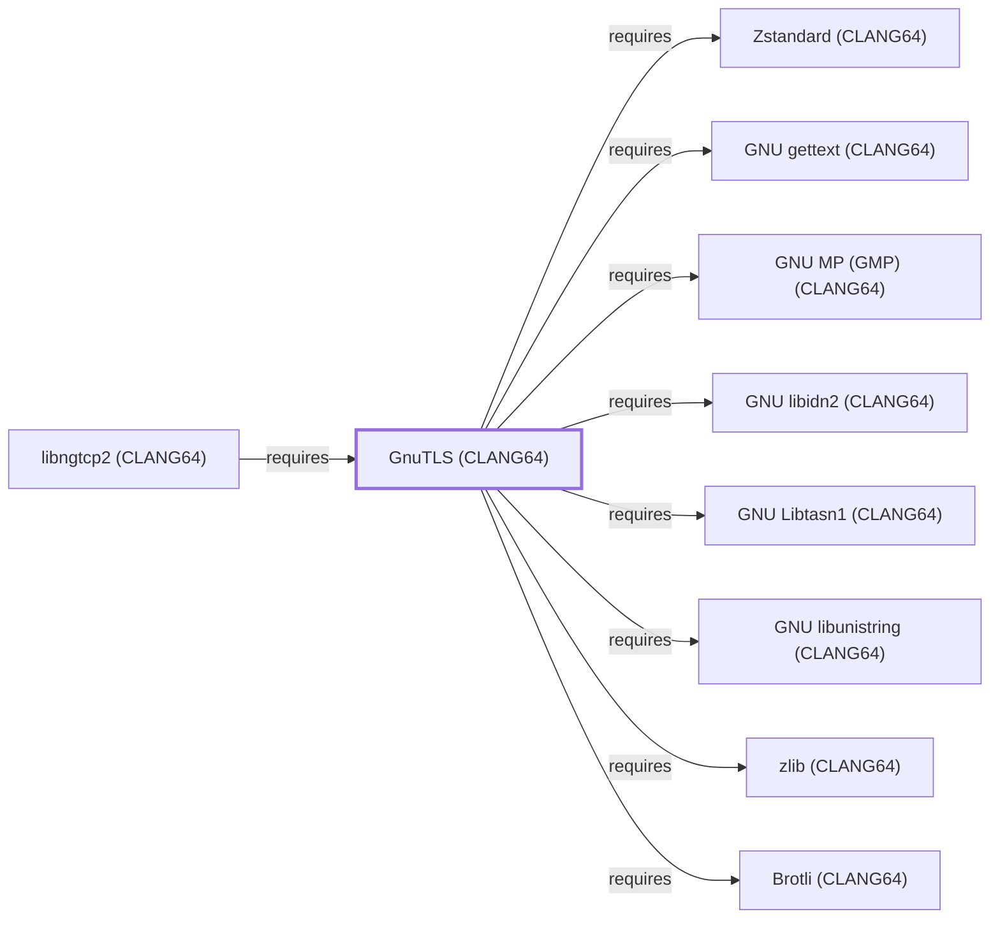

# GnuTLS (CLANG64)

## Purpose

This page documents `package:msys2:mingw-w64-clang-x86_64-gnutls`, the
CLANG64-environment build of GnuTLS — a library implementing TLS/SSL
and related cryptographic protocols. It is depended on by
[libngtcp2 (CLANG64)](LIBNGTCP2-CLANG64.md) as its second declared TLS
backend alongside [OpenSSL (CLANG64)](OPENSSL-CLANG64.md). With 31
recorded catalog dependents and all eleven of its own declared
dependencies already modeled elsewhere in this volume — reused
directly from this session's GMP-chain, ca-certificates-chain, and
GnuPG-crypto-stack CLANG64 batches — it is one of the most densely
connected entities added this session. See the
[official GnuTLS project site](https://www.gnutls.org/) for the API
reference.

## Architectural Classification

`library:gnutls:gnutls@clang64` is packaged as
`package:msys2:mingw-w64-clang-x86_64-gnutls` (version `3.8.13-3` in
the current catalog snapshot, license
`GPL-3.0-or-later;LGPL-2.1-or-later`) — a separately built, separate
catalog entity from [GnuTLS (UCRT64)](GNUTLS-UCRT64.md) and
[GnuTLS (MSYS)](GNUTLS.md). It belongs to the CLANG64 environment.

## Responsibilities

- Providing TLS/SSL protocol implementation and general cryptographic
  services, consumed by
  [libngtcp2 (CLANG64)](LIBNGTCP2-CLANG64.md#dependencies) for QUIC's
  TLS 1.3 handshake, as an alternative to
  [OpenSSL (CLANG64)](OPENSSL-CLANG64.md).

## Boundaries

This page's package serves CLANG64-environment consumers specifically;
[GnuPG (MSYS)](GNUPG.md) and [GNU Emacs (MSYS)](GNU-EMACS.md) instead
depend on [GnuTLS (MSYS)](GNUTLS.md#reverse-dependencies) — the two
are not interchangeable, matching the same distinction already made
throughout this volume for MSYS/UCRT64/CLANG64 sibling groups.

## Interfaces

- The GnuTLS C API (`gnutls_init`, `gnutls_handshake`, and related
  functions), the same interface
  [GnuTLS (UCRT64)](GNUTLS-UCRT64.md#interfaces) documents, per the
  documentation.

## Dependencies

The catalog snapshot records eleven `runtime-depends-on` edges for
`package:msys2:mingw-w64-clang-x86_64-gnutls`, all now modeled in this
knowledge base:

| Dependency | Package | Architectural reason |
| --- | --- | --- |
| [Brotli (CLANG64)](BROTLI-CLANG64.md) | `mingw-w64-clang-x86_64-brotli` | Backs Brotli-compressed certificate support per RFC 8879. |
| [GNU gettext (CLANG64)](GNU-GETTEXT-CLANG64.md) | `mingw-w64-clang-x86_64-gettext-runtime` | Backs gettext-based message translation (NLS). |
| [GMP (CLANG64)](GNU-GMP-CLANG64.md) | `mingw-w64-clang-x86_64-gmp` | Backs arbitrary-precision arithmetic used by GnuTLS's own public-key cryptography. |
| [GNU libidn2 (CLANG64)](GNU-LIBIDN2-CLANG64.md) | `mingw-w64-clang-x86_64-libidn2` | Backs internationalized domain name (IDNA2008) handling in certificate validation. |
| [GNU Libtasn1 (CLANG64)](GNU-LIBTASN1-CLANG64.md) | `mingw-w64-clang-x86_64-libtasn1` | Backs ASN.1/DER structure parsing for certificate handling. |
| [GNU libunistring (CLANG64)](GNU-LIBUNISTRING-CLANG64.md) | `mingw-w64-clang-x86_64-libunistring` | Backs Unicode string handling for certificate and hostname processing. |
| [libwinpthread (CLANG64)](LIBWINPTHREAD-CLANG64.md) | `mingw-w64-clang-x86_64-libwinpthread` | Backs POSIX threading primitives GnuTLS uses internally. |
| [Nettle (CLANG64)](NETTLE-CLANG64.md) | `mingw-w64-clang-x86_64-nettle` | Backs GnuTLS's own low-level cryptographic primitives. |
| [p11-kit (CLANG64)](P11-KIT-CLANG64.md) | `mingw-w64-clang-x86_64-p11-kit` | Backs PKCS#11 module coordination for trust-anchor and smart-card support. |
| [zlib (CLANG64)](ZLIB-CLANG64.md) | `mingw-w64-clang-x86_64-zlib` | Backs compressed-certificate and compressed-record extensions. |
| [Zstandard (CLANG64)](LIBZSTD-CLANG64.md) | `mingw-w64-clang-x86_64-zstd` | Backs Zstandard-compressed certificate handling. |

## Reverse Dependencies

The catalog snapshot records 31 relationships targeting
`package:msys2:mingw-w64-clang-x86_64-gnutls`. One is now modeled in
this knowledge base: [libngtcp2 (CLANG64)](LIBNGTCP2-CLANG64.md)
(`relationship:foundation-libraries:libngtcp2-clang64-requires-gnutls-clang64`,
added 2026-08-02). The remaining ~30 recorded dependents (a broad mix
of CLANG64 packages including separate CLANG64-native `gnupg` and
`emacs` packages, `ffmpeg`, `filezilla`, `qemu`, `vlc`, `wget`, and
`wireshark`) are not individually modeled in this knowledge base; see
the [reverse dependency impact analysis](REVERSE-DEPENDENCY-IMPACT-ANALYSIS.md)
for the current full list.

## Configuration

GnuTLS has no persistent configuration file as a library; TLS
parameters and priority strings are set entirely through its C API by
the calling program, the same convention documented for
[GnuTLS (UCRT64)](GNUTLS-UCRT64.md#configuration).

## Initialization and Execution Flow

As a library, GnuTLS has no independent process lifecycle: it
initializes and executes within the process of whatever program links
against it — [libngtcp2 (CLANG64)](LIBNGTCP2-CLANG64.md) in this
dependency chain. As a native MinGW-w64 library, this process model is
Windows-facing directly rather than mediated by `msys-2.0.dll`.

## Runtime Behavior

Identical functional behavior to
[GnuTLS (UCRT64)](GNUTLS-UCRT64.md#runtime-behavior); see that page for
detail not specific to the CLANG64/UCRT64 packaging distinction. In
curl (CLANG64)'s dependency chain specifically, GnuTLS (CLANG64) is
exercised only via the separate `curl-gnutls` package variant, not the
primary `curl` package this knowledge base's
[curl (CLANG64)](CURL-CLANG64.md) page documents (which links
[OpenSSL (CLANG64)](OPENSSL-CLANG64.md) instead).

## Compatibility and Variants

The CLANG64, UCRT64, and MSYS GnuTLS packages are three separately
versioned catalog entities (see Architectural Classification); code
built against one is not automatically compatible with another without
matching the correct package/environment.

## Security Considerations

GnuTLS implements TLS/SSL protocol handling and certificate
verification, a security-critical role by nature; this page does not
assert this specific package version's patch status. See
[Threat Model and Supply Chain](THREAT-MODEL-AND-SUPPLY-CHAIN.md) for
the project's general supply-chain posture; no version-qualified CVE
review has been performed for the recorded `3.8.13-3` version.

## Failure Modes and Diagnostics

A libngtcp2 (CLANG64) TLS handshake failure when built against the
GnuTLS backend should be checked against GnuTLS's own error-code
diagnostics (`gnutls_strerror` and related functions) before being
treated as a defect in the calling program.

## Evidence, Assumptions, and Open Questions

TLS/SSL protocol implementation scope is backed by the official
GnuTLS project site (`evidence:gnutls:manual-2026-07-30`), the same
evidence record [GnuTLS (UCRT64)](GNUTLS-UCRT64.md) cites. Package
identity, version, license, and all recorded dependency/dependent
edges are backed by the pacman catalog snapshot
(`evidence:catalog:current`). Open: the ~30 remaining recorded
dependents (including the separate CLANG64-native `gnupg` and `emacs`
packages) are not individually modeled in this knowledge base.

<!-- BEGIN GENERATED dependency-subgraph -->

## Dependency Diagram

Dependencies and dependents of `library:gnutls:gnutls@clang64` in the composed graph: 1 dependent and 11 dependencies, of which 3 are omitted here for legibility.

Generated from the composed model by `tools/build_object_diagrams.py`.
Edits between the surrounding markers are overwritten on the next build.

<!-- END GENERATED dependency-subgraph -->

## Related Objects

- [MSYS2 Library Architecture](LIBRARIES-ARCHITECTURE.md)
- [GnuTLS (UCRT64)](GNUTLS-UCRT64.md)
- [GnuTLS (MSYS)](GNUTLS.md)
- [libngtcp2 (CLANG64)](LIBNGTCP2-CLANG64.md)
- [OpenSSL (CLANG64)](OPENSSL-CLANG64.md)
- [Brotli (CLANG64)](BROTLI-CLANG64.md)
- [GNU libidn2 (CLANG64)](GNU-LIBIDN2-CLANG64.md)
- [GNU Libtasn1 (CLANG64)](GNU-LIBTASN1-CLANG64.md)
- [GNU libunistring (CLANG64)](GNU-LIBUNISTRING-CLANG64.md)
- [p11-kit (CLANG64)](P11-KIT-CLANG64.md)
- [Nettle (CLANG64)](NETTLE-CLANG64.md)
- [GMP (CLANG64)](GNU-GMP-CLANG64.md)
