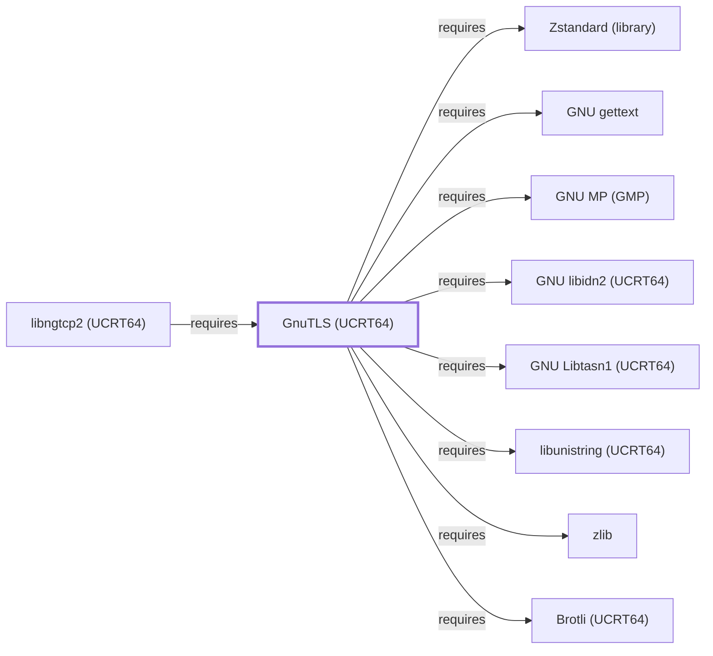

# GnuTLS (UCRT64)

<!-- BEGIN GENERATED object-facts -->

| Model fact | Value |
| --- | --- |
| Object | `library:gnutls:gnutls@ucrt64` |
| Kind | `library` |
| Status | `partial` |
| Confidence | `high` |
| Authority | GnuTLS project |
| Environments | `ucrt64` |
| Upstream | <https://www.gnutls.org/> |
| Packaged as | `package:msys2:mingw-w64-ucrt-x86_64-gnutls` |
| Version (observed) | 3.8.13-3 |
| License (observed) | spdx:GPL-3.0-or-later;spdx:LGPL-2.1-or-later |
| Architecture (observed) | any |
| Installed size (observed) | 14.26 MiB |

**Evidence on this object**

- `evidence:catalog:current` — MSYS2 pacman package catalog (`observed`, retrieved 2026-08-05)
- `evidence:gnutls:manual-2026-07-30` — GnuTLS (official project site) (`primary`, retrieved 2026-07-30)

Generated from the composed model by `tools/build_object_facts.py`. Observed values come from the catalog snapshot and change when it is refreshed.
Edits between the surrounding markers are overwritten on the next build.

<!-- END GENERATED object-facts -->

## Purpose

This page documents the **UCRT64-environment** GnuTLS package
specifically — a library implementing TLS/SSL and related
cryptographic protocols — depended on by
[libngtcp2 (UCRT64)](LIBNGTCP2-UCRT64.md) as its second declared TLS
backend alongside [OpenSSL (UCRT64)](OPENSSL-UCRT64.md), closing an
item that page had explicitly left unmodeled. With 31 recorded catalog
dependents and eleven of its own twelve declared dependencies already
modeled elsewhere in this volume, it is one of the most densely
connected entities added this session. See the
[official GnuTLS project site](https://www.gnutls.org/) for the API
reference.

## Architectural Classification

`library:gnutls:gnutls@ucrt64` is packaged in the UCRT64 environment as
`package:msys2:mingw-w64-ucrt-x86_64-gnutls` (version `3.8.13-3` in
the current catalog snapshot, license
`GPL-3.0-or-later;LGPL-2.1-or-later`) — a separately built, separate
catalog entity from [GnuTLS (MSYS)](GNUTLS.md)'s `libgnutls` package.
This is the package [libngtcp2 (UCRT64)](LIBNGTCP2-UCRT64.md) — a
UCRT64-native library entity itself — actually depends on for its
alternative TLS 1.3 backend.

## Responsibilities

- Providing TLS/SSL protocol implementation and general cryptographic
  services, consumed by [libngtcp2 (UCRT64)](LIBNGTCP2-UCRT64.md#dependencies)
  for QUIC's TLS 1.3 handshake, as an alternative to
  [OpenSSL (UCRT64)](OPENSSL-UCRT64.md). The remaining 30 recorded
  reverse dependents include separate UCRT64-native `gnupg` and
  `emacs` packages — distinct catalog entities from this knowledge
  base's MSYS [GnuPG](GNUPG.md) and [GNU Emacs](GNU-EMACS.md) entities
  — not individually modeled here.

## Boundaries

This page's package serves UCRT64-environment consumers specifically;
[GnuPG (MSYS)](GNUPG.md) and [GNU Emacs (MSYS)](GNU-EMACS.md) instead
depend on [GnuTLS (MSYS)](GNUTLS.md#reverse-dependencies) — the two are
not interchangeable, matching the same distinction already made
throughout this volume for MSYS/UCRT64 sibling pairs.

## Interfaces

- The GnuTLS C API (`gnutls_init`, `gnutls_handshake`, and related
  functions), the same interface [GnuTLS (MSYS)](GNUTLS.md#interfaces)
  documents, per the documentation.

## Dependencies

The UCRT64 `package:msys2:mingw-w64-ucrt-x86_64-gnutls` declares
eleven `runtime-depends-on` edges, all now backed by `requires` edges
to already-modeled UCRT64-environment sibling libraries:
[Brotli (UCRT64)](BROTLI-UCRT64.md) (Brotli-compressed certificate
support per RFC 8879,
`relationship:foundation-libraries:gnutls-ucrt64-requires-brotli-ucrt64`),
[GNU gettext](GNU-GETTEXT.md) (NLS,
`relationship:foundation-libraries:gnutls-ucrt64-requires-gettext`),
[GNU MP](GNU-GMP.md) (arbitrary-precision arithmetic,
`relationship:foundation-libraries:gnutls-ucrt64-requires-gmp`),
[GNU libidn2 (UCRT64)](GNU-LIBIDN2-UCRT64.md) (internationalized
domain name processing,
`relationship:foundation-libraries:gnutls-ucrt64-requires-libidn2-ucrt64`),
[GNU Libtasn1 (UCRT64)](GNU-LIBTASN1-UCRT64.md) (ASN.1/DER parsing,
`relationship:foundation-libraries:gnutls-ucrt64-requires-libtasn1-ucrt64`),
[GNU libunistring (UCRT64)](GNU-LIBUNISTRING-UCRT64.md) (Unicode
string processing,
`relationship:foundation-libraries:gnutls-ucrt64-requires-libunistring-ucrt64`),
[libwinpthread](LIBWINPTHREAD.md) (POSIX threading,
`relationship:foundation-libraries:gnutls-ucrt64-requires-libwinpthread`),
[Nettle](NETTLE.md) (cryptographic primitives,
`relationship:foundation-libraries:gnutls-ucrt64-requires-nettle`),
[p11-kit (UCRT64)](P11-KIT-UCRT64.md) (PKCS#11 module support,
`relationship:foundation-libraries:gnutls-ucrt64-requires-p11-kit-ucrt64`),
[zlib](ZLIB.md) (compressed-certificate support,
`relationship:foundation-libraries:gnutls-ucrt64-requires-zlib`), and
[Zstandard (library)](LIBZSTD.md) (Zstandard-compressed-certificate
support,
`relationship:foundation-libraries:gnutls-ucrt64-requires-zstd`).

## Reverse Dependencies

The catalog snapshot records 31 relationships targeting
`package:msys2:mingw-w64-ucrt-x86_64-gnutls`. One is now modeled in
this knowledge base: [libngtcp2 (UCRT64)](LIBNGTCP2-UCRT64.md)
(`relationship:foundation-libraries:libngtcp2-ucrt64-requires-gnutls-ucrt64`).
The remaining ~30 recorded dependents (a broad mix of UCRT64 packages
including separate UCRT64-native `gnupg` and `emacs` packages, `ffmpeg`,
`filezilla`, `qemu`, `vlc`, `wget`, and `wireshark`) are not
individually modeled in this knowledge base; see the
[reverse dependency impact analysis](REVERSE-DEPENDENCY-IMPACT-ANALYSIS.md)
for the current full list.

## Configuration

GnuTLS has no persistent configuration file as a library; TLS
parameters and priority strings are set entirely through its C API by
the calling program, the same convention documented for
[GnuTLS (MSYS)](GNUTLS.md#configuration).

## Initialization and Execution Flow

As a library, GnuTLS has no independent process lifecycle: it
initializes and executes within the process of whatever program links
against it — [libngtcp2 (UCRT64)](LIBNGTCP2-UCRT64.md) in this
dependency chain. As a native MinGW-w64 library, this process model is
Windows-facing directly rather than mediated by `msys-2.0.dll`.

## Runtime Behavior

Identical functional behavior to [GnuTLS (MSYS)](GNUTLS.md#runtime-behavior);
see that page for detail not specific to the UCRT64/MSYS packaging
distinction. In curl (UCRT64)'s dependency chain specifically, GnuTLS
(UCRT64) is exercised only via the separate `curl-gnutls` package
variant, not the primary `curl` package this knowledge base's
[curl (UCRT64)](CURL-UCRT64.md) page documents (which links
[OpenSSL (UCRT64)](OPENSSL-UCRT64.md) instead).

## Compatibility and Variants

The UCRT64 and MSYS GnuTLS packages are separately versioned catalog
entities (see Architectural Classification); code built against one is
not automatically compatible with the other without matching the
correct package/environment.

## Security Considerations

GnuTLS implements TLS/SSL protocol handling and certificate
verification, a security-critical role by nature; this page does not
assert this specific package version's patch status. See
[Threat Model and Supply Chain](THREAT-MODEL-AND-SUPPLY-CHAIN.md) for
the project's general supply-chain posture; no version-qualified CVE
review has been performed for the recorded `3.8.13-3` version.

## Failure Modes and Diagnostics

A libngtcp2 (UCRT64) TLS handshake failure when built against the
GnuTLS backend should be checked against GnuTLS's own error-code
diagnostics (`gnutls_strerror` and related functions) before being
treated as a defect in the calling program.

## Evidence, Assumptions, and Open Questions

TLS/SSL protocol implementation scope is backed by the official
GnuTLS project site (`evidence:gnutls:manual-2026-07-30`), the same
evidence record [GnuTLS (MSYS)](GNUTLS.md) cites. Package identity,
version, license, and the recorded dependency/dependent edges are
backed by the pacman catalog snapshot (`evidence:catalog:current`).
Open, and explicitly out of scope for this page: the ~30 remaining
recorded dependents not individually modeled (including the separate
UCRT64-native `gnupg` and `emacs` packages), and header-level API
surface / PE import/export-level evidence, per the
[Library Family Classification](LIBRARY-FAMILY-CLASSIFICATION.md)
methodology.

<!-- BEGIN GENERATED dependency-subgraph -->

## Dependency Diagram

Dependencies and dependents of `library:gnutls:gnutls@ucrt64` in the composed graph: 1 dependent and 11 dependencies, of which 3 are omitted here for legibility.

Generated from the composed model by `tools/build_object_diagrams.py`.
Edits between the surrounding markers are overwritten on the next build.

<!-- END GENERATED dependency-subgraph -->

## Related Objects

- [MSYS2 Library Architecture](LIBRARIES-ARCHITECTURE.md)
- [GnuTLS (MSYS)](GNUTLS.md)
- [libngtcp2 (UCRT64)](LIBNGTCP2-UCRT64.md)
- [OpenSSL (UCRT64)](OPENSSL-UCRT64.md)
- [Brotli (UCRT64)](BROTLI-UCRT64.md)
- [GNU libidn2 (UCRT64)](GNU-LIBIDN2-UCRT64.md)
- [GNU Libtasn1 (UCRT64)](GNU-LIBTASN1-UCRT64.md)
- [GNU libunistring (UCRT64)](GNU-LIBUNISTRING-UCRT64.md)
- [p11-kit (UCRT64)](P11-KIT-UCRT64.md)
- [Nettle](NETTLE.md)
- [GNU MP](GNU-GMP.md)
- [libwinpthread](LIBWINPTHREAD.md)
- [GnuTLS (CLANG64)](GNUTLS-CLANG64.md)
