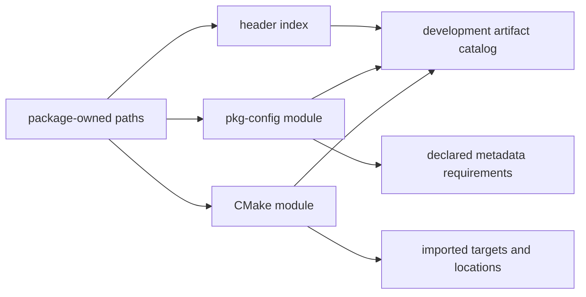

# Header and Development-Metadata Indexes

Development-facing inventory consists of package-owned headers and typed
package-consumption metadata. Header paths, `pkg-config` modules, and CMake
modules are related discovery surfaces—not interchangeable claims of API,
ABI, or link compatibility.

| Index surface | Collected identity | Parsed fields | Excluded conclusion |
| --- | --- | --- | --- |
| Header | Package, normalized include path, snapshot, presence | Path and available-byte hash where present | Public API stability or language-level compatibility |
| `pkg-config` module | Owning package and `.pc` path | Name, version, variables, flags, requirements | Complete transitive ABI or runtime dependency closure |
| CMake module | Owning package and CMake file path | Imported targets, locations, and declared dependencies | Generator-specific build success |
| Metadata requirement | Source metadata entity plus declared expression | Requirement class and version constraint | A unique resolved package without snapshot evidence |

## Indexing Rules

1. Index headers by normalized package path, not basename, because duplicate
   names across include roots are expected.
2. Preserve package ownership and snapshot evidence for each header or module.
   Development files may be present in repository manifests without locally
   available bytes.
3. Expand `pkg-config` variables only as recorded parser output and retain
   unresolved/dynamic constructs rather than executing package scripts.
4. Treat CMake imported locations and targets as configuration metadata. Their
   validity depends on prefix, generator, toolchain, and selected environment.
5. Generate requirement edges only when a target is unambiguous in the same
   projection; otherwise keep a structured unresolved record.

## Query Sequence

1. Choose a repository/inventory snapshot and package scope.
2. Find package-owned headers, `.pc`, or CMake artifacts by normalized path.
3. Inspect parsed metadata and its evidence before following requirements.
4. Combine metadata with the selected environment/toolchain only for a
   qualified build analysis.

## Related Views

- [Package-to-file inventory](PACKAGE-FILE-INVENTORY.md)
- [Build system role model](BUILD-SYSTEM-ROLE-MODEL.md)
- [Deep inventory evidence contract](DEEP-INVENTORY-CONTRACT.md)
