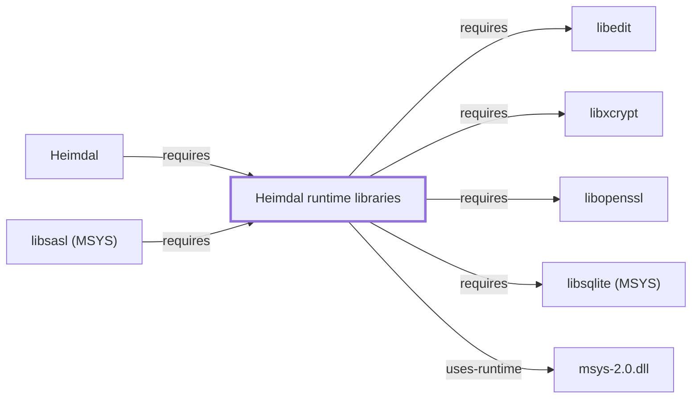

# Heimdal runtime libraries

<!-- BEGIN GENERATED object-facts -->

| Model fact | Value |
| --- | --- |
| Object | `library:h5l:heimdal-libs` |
| Kind | `library` |
| Status | `partial` |
| Confidence | `high` |
| Authority | Heimdal Project |
| Environments | `msys` |
| Upstream | <https://www.h5l.org/> |
| Packaged as | `package:msys2:heimdal-libs` |
| Version (observed) | 7.8.0-5 |
| License (observed) | custom |
| Architecture (observed) | x86_64 |
| Installed size (observed) | 2.5 MB |

**Evidence on this object**

- `evidence:catalog:current` — MSYS2 pacman package catalog (`observed`, retrieved 2026-07-29)
- `evidence:h5l:heimdal-manual-2026-07-30` — Heimdal Kerberos 5 (official project page) (`primary`, retrieved 2026-07-30)

Generated from the composed model by `tools/build_object_facts.py`. Observed values come from the catalog snapshot and change when it is refreshed.
Edits between the surrounding markers are overwritten on the next build.

<!-- END GENERATED object-facts -->

## Purpose

This page documents `heimdal-libs`, the runtime shared-library half of
the Heimdal Kerberos V5 package, closing an item
[Heimdal's own page](HEIMDAL.md#dependencies) explicitly noted it was
declining to model separately: "This page does not add a formal
`requires` edge to a separate `heimdal-libs` entity in this knowledge
base, since OpenSSH's own catalog-recorded dependency targets
`package:msys2:heimdal` directly." This page closes that gap by
modeling the library `heimdal` itself depends on. See the
[official Heimdal project page](https://www.h5l.org/) for the full
reference.

## Architectural Classification

`library:h5l:heimdal-libs` is packaged in the MSYS environment as
`package:msys2:heimdal-libs` (version `7.8.0-5` in the current catalog
snapshot, the same version as [Heimdal](HEIMDAL.md)'s own
`package:msys2:heimdal` package). This follows the same CLI/library-package
split pattern already documented for
[curl/libcurl](LIBCURL.md#architectural-classification) and
[OpenSSL/libopenssl](OPENSSL.md#architectural-classification) elsewhere
in this knowledge base — `heimdal` is the CLI/tools package
[HEIMDAL.md](HEIMDAL.md) documents, while `heimdal-libs` is its
companion runtime library.

## Responsibilities

- Providing the Kerberos V5 protocol implementation as a runtime shared
  library, consumed by [Heimdal's](HEIMDAL.md) own CLI tools (`kinit`,
  `klist`) and by other GSSAPI-aware programs.

## Boundaries

heimdal-libs provides the Kerberos V5 runtime implementation
specifically; the `heimdal` package [HEIMDAL.md](HEIMDAL.md) documents
provides the command-line tools built on top of it — the same
CLI/library split pattern, not a duplicate of the same functionality.

## Interfaces

- The Kerberos V5 / GSSAPI C API, consumed by [Heimdal's](HEIMDAL.md)
  own tools and by other GSSAPI-aware programs such as
  [OpenSSH](OPENSSH.md#dependencies), per the documentation.

## Dependencies

The catalog snapshot records `runtime-depends-on` edges from
`package:msys2:heimdal-libs` to `package:msys2:libopenssl` — OpenSSL's
own runtime library, backing Heimdal's use of OpenSSL cryptographic
primitives alongside its Kerberos implementation, documented fully in
[libopenssl](LIBOPENSSL.md)
(`relationship:foundation-libraries:heimdal-libs-requires-libopenssl`)
— [libedit](LIBEDIT.md) (interactive line editing in Heimdal's own
tools,
`relationship:foundation-libraries:heimdal-libs-requires-libedit`,
added 2026-07-30), and [libxcrypt](LIBXCRYPT.md) (`crypt()`-family
password hashing,
`relationship:foundation-libraries:heimdal-libs-requires-libxcrypt`,
added 2026-07-30 — correcting a prior version of this paragraph that
only noted libxcrypt among heimdal-libs' *reverse* dependents' own
dependency set rather than as heimdal-libs' own direct forward
dependency) — and [libsqlite (MSYS)](LIBSQLITE-MSYS.md) (Kerberos
credential-cache and database backend support,
`relationship:foundation-libraries:heimdal-libs-requires-libsqlite`,
added 2026-08-02, closing this section's own prior "not individually
modeled" note). Beyond these four edges, the remainder of this
package's own dependencies (`libdb`) is not individually modeled in
this knowledge base; this page's scope is otherwise limited to
confirming and documenting the [Heimdal](HEIMDAL.md) dependency
relationship.

## Reverse Dependencies

The catalog snapshot records 4 relationships targeting
`package:msys2:heimdal-libs`: `package:msys2:heimdal`
(`relationship:foundation-libraries:heimdal-requires-heimdal-libs` in
this knowledge base's graph), its own `-devel` subpackage,
[libsasl (MSYS)](LIBSASL-MSYS.md)
(`relationship:foundation-libraries:libsasl-requires-heimdal-libs`,
added 2026-08-02, backing libsasl's GSSAPI mechanism), and
`package:msys2:neomutt`.

## Configuration

Kerberos deployments conventionally use `/etc/krb5.conf` for realm and
key-distribution-center configuration, the same configuration file
already noted on [Heimdal's own page](HEIMDAL.md#configuration); its
presence and content in this environment was not directly confirmed.

## Initialization and Execution Flow

As a library, heimdal-libs has no independent process lifecycle: it
initializes and executes within the process of whatever program links
against it — [Heimdal's](HEIMDAL.md) own `kinit`/`klist` tools, or
[OpenSSH](OPENSSH.md) during GSSAPI authentication negotiation. As an
MSYS-dependent library, this is adapted from POSIX semantics onto
Windows process primitives by `msys-2.0.dll` per
[MSYS Runtime Initialization](MSYS-RUNTIME-INITIALIZATION.md).

## Runtime Behavior

heimdal-libs' Kerberos protocol implementation is exercised whenever a
GSSAPI/Kerberos authentication attempt occurs, already noted as a
general point on [Heimdal's own page](HEIMDAL.md#runtime-behavior).

## Compatibility and Variants

Whether other native environments (UCRT64, CLANG64, i686) in this
catalog package heimdal-libs separately was not confirmed while writing
this page; this is recorded as an open item rather than assumed either
way.

## Security Considerations

As the actual Kerberos V5 protocol implementation, heimdal-libs sits in
a security-critical position for GSSAPI/Kerberos authentication,
already noted at the package level on
[Heimdal's own page](HEIMDAL.md#security-considerations). See
[Threat Model and Supply Chain](THREAT-MODEL-AND-SUPPLY-CHAIN.md) for the
project's general supply-chain posture; no version-qualified CVE review
has been performed for the recorded `7.8.0-5` version.

## Failure Modes and Diagnostics

A GSSAPI/Kerberos authentication failure traceable to the protocol
implementation itself (rather than a missing ticket, already noted on
[Heimdal's own page](HEIMDAL.md#failure-modes-and-diagnostics)) should
be checked against heimdal-libs' own error reporting.

## Evidence, Assumptions, and Open Questions

Kerberos V5 runtime implementation scope is backed by the official
Heimdal project page (`evidence:h5l:heimdal-manual-2026-07-30`), the
same evidence record [Heimdal's own page](HEIMDAL.md) cites. Package
identity, version, and the modeled dependency edges are backed by the
pacman catalog snapshot (`evidence:catalog:current`). Open: whether
other native environments package heimdal-libs separately was not
confirmed. Also explicitly out of scope for this page: this package's
remaining `libdb` sub-dependency, and header-level API
surface / PE import/export-level evidence, per the
[Library Family Classification](LIBRARY-FAMILY-CLASSIFICATION.md)
methodology.

<!-- BEGIN GENERATED dependency-subgraph -->

## Dependency Diagram

Dependencies and dependents of `library:h5l:heimdal-libs` in the composed graph: 2 dependents and 5 dependencies.

Generated from the composed model by `tools/build_object_diagrams.py`.
Edits between the surrounding markers are overwritten on the next build.

<!-- END GENERATED dependency-subgraph -->

## Related Objects

- [MSYS2 Library Architecture](LIBRARIES-ARCHITECTURE.md)
- [Heimdal](HEIMDAL.md)
- [OpenSSH](OPENSSH.md)
- [libsqlite (MSYS)](LIBSQLITE-MSYS.md)
- [libopenssl](LIBOPENSSL.md)
- [libedit](LIBEDIT.md)
- [libxcrypt](LIBXCRYPT.md)
- [libsasl (MSYS)](LIBSASL-MSYS.md)
