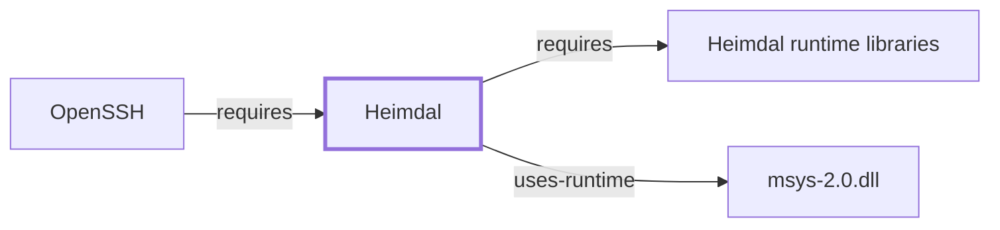

# Heimdal

<!-- BEGIN GENERATED object-facts -->

| Model fact | Value |
| --- | --- |
| Object | `library:h5l:heimdal` |
| Kind | `library` |
| Status | `partial` |
| Confidence | `high` |
| Authority | Heimdal Project |
| Environments | `msys` |
| Upstream | <https://www.h5l.org/> |
| Packaged as | `package:msys2:heimdal` |
| Version (observed) | 7.8.0-5 |
| License (observed) | custom |
| Architecture (observed) | x86_64 |
| Installed size (observed) | 3.0 MB |

**Evidence on this object**

- `evidence:catalog:current` — MSYS2 pacman package catalog (`observed`, retrieved 2026-07-29)
- `evidence:h5l:heimdal-manual-2026-07-30` — Heimdal Kerberos 5 (official project page) (`primary`, retrieved 2026-07-30)

Generated from the composed model by `tools/build_object_facts.py`. Observed values come from the catalog snapshot and change when it is refreshed.
Edits between the surrounding markers are overwritten on the next build.

<!-- END GENERATED object-facts -->

## Purpose

Heimdal implements the Kerberos V5 network authentication protocol,
enabling single-sign-on authentication for programs that support it. This
page documents its architectural role as a directly-declared dependency
of [OpenSSH](OPENSSH.md), which uses it to back optional GSSAPI-based
authentication; see the
[official Heimdal project page](https://www.h5l.org/) for the full
reference.

## Architectural Classification

`library:h5l:heimdal` is packaged in the MSYS environment as
`package:msys2:heimdal` (version `7.8.0-5` in the current catalog
snapshot). The package itself declares a dependency on a separate
`package:msys2:heimdal-libs` package (see Dependencies) — the actual
runtime shared libraries — following the same CLI/library-package split
pattern already documented for [curl](CURL.md#architectural-classification)/`libcurl`
and [OpenSSL](OPENSSL.md#architectural-classification)/`libopenssl`
elsewhere in this knowledge base. This page documents
`package:msys2:heimdal` specifically, since that is the package
[OpenSSH](OPENSSH.md#dependencies) itself directly declares as a
dependency, per the catalog.

## Responsibilities

- Implementing the Kerberos V5 protocol and its associated tools (key
  distribution, ticket management), consumed by [OpenSSH](OPENSSH.md) to
  back GSSAPI-based authentication — Kerberos single sign-on, as an
  alternative to password or public-key authentication.

## Boundaries

Heimdal implements Kerberos V5 specifically, a network authentication
protocol distinct from the public-key and password-based authentication
methods [OpenSSH](OPENSSH.md) also supports via its other dependencies
([libfido2](LIBFIDO2.md), [libxcrypt](LIBXCRYPT.md)); GSSAPI is the
interface layer OpenSSH uses to invoke Kerberos authentication without
depending on Kerberos-specific APIs directly.

## Interfaces

- Kerberos V5 command-line tools (`kinit`, `klist`, and others) plus a
  GSSAPI-compatible library interface consumed by OpenSSH and other
  GSSAPI-aware programs, per the documentation.

## Dependencies

The catalog snapshot records one `runtime-depends-on` edge for
`package:msys2:heimdal`: [Heimdal runtime libraries](HEIMDAL-LIBS.md)
(`package:msys2:heimdal-libs`,
`relationship:foundation-libraries:heimdal-requires-heimdal-libs`), the
package's own runtime shared-library half, now given its own page,
closing an item this page previously declined to model. This is
separate from [OpenSSH's](OPENSSH.md) own catalog-recorded dependency,
which targets `package:msys2:heimdal` directly rather than
`heimdal-libs`.

## Reverse Dependencies

The catalog snapshot records 2 relationships targeting
`package:msys2:heimdal`: `package:msys2:cvs` and `package:msys2:openssh`
(`relationship:ssh-curl-git:openssh-requires-heimdal` in this knowledge
base's graph).

## Configuration

Kerberos deployments conventionally use `/etc/krb5.conf` for realm and
key-distribution-center configuration — a genuine, deployment-specific
standing configuration file, though its presence and content in this
environment was not directly confirmed while writing this page.

## Initialization and Execution Flow

As a library dependency, Heimdal's GSSAPI code initializes and executes
within the process of whatever program links against it —
[OpenSSH's](OPENSSH.md) `ssh`/`sshd` in this dependency chain, at
GSSAPI-authentication negotiation time. Heimdal's own command-line tools
(`kinit`, `klist`) are separate, independently invoked processes. As
MSYS-dependent components, both are adapted from POSIX semantics onto
Windows process primitives by `msys-2.0.dll` per
[MSYS Runtime Initialization](MSYS-RUNTIME-INITIALIZATION.md).

## Runtime Behavior

GSSAPI/Kerberos authentication is only exercised when both the OpenSSH
client and server negotiate it during connection setup, already noted as
a general point on [OpenSSH's own page](OPENSSH.md#runtime-behavior); a
Kerberos ticket must also already be present (typically via `kinit`) for
the negotiation to succeed.

## Compatibility and Variants

Heimdal is one of two commonly deployed independent Kerberos V5
implementations (the other being MIT Kerberos); interoperability between
them is a protocol-level compatibility question, not a drop-in library
compatibility one — this page does not assert cross-implementation
compatibility specifics.

## Security Considerations

Kerberos single sign-on shifts trust onto the key distribution center and
the security of cached tickets; this is a materially different security
model from password or public-key authentication, worth noting alongside
[OpenSSH's own security discussion](OPENSSH.md#security-considerations).
See [Threat Model and Supply Chain](THREAT-MODEL-AND-SUPPLY-CHAIN.md) for
the project's general supply-chain posture; no version-qualified CVE
review has been performed for the recorded `7.8.0-5` version.

## Failure Modes and Diagnostics

A GSSAPI authentication failure in OpenSSH most commonly traces back to a
missing or expired Kerberos ticket (checkable with `klist`) rather than an
OpenSSH-specific defect; OpenSSH's own verbose flags
(`-v`/`-vv`/`-vvv`) surface GSSAPI negotiation detail.

## Evidence, Assumptions, and Open Questions

Kerberos V5/GSSAPI implementation scope is backed by the official Heimdal
project page (`evidence:h5l:heimdal-manual-2026-07-30`), matching the
`project_url` already recorded for `package:msys2:heimdal` in the
catalog. Package identity, version, and the recorded dependency/dependent
edges are backed by the pacman catalog snapshot
(`evidence:catalog:current`). Open: `/etc/krb5.conf`'s presence and
content in this environment were not directly confirmed. Also explicitly
out of scope for this page: header-level API surface and PE
import/export-level evidence, per the
[Library Family Classification](LIBRARY-FAMILY-CLASSIFICATION.md)
methodology.

<!-- BEGIN GENERATED dependency-subgraph -->

## Dependency Diagram

Dependencies and dependents of `library:h5l:heimdal` in the composed graph: 1 dependent and 2 dependencies.

Generated from the composed model by `tools/build_object_diagrams.py`.
Edits between the surrounding markers are overwritten on the next build.

<!-- END GENERATED dependency-subgraph -->

## Related Objects

- [MSYS2 Library Architecture](LIBRARIES-ARCHITECTURE.md)
- [OpenSSH](OPENSSH.md)
- [libfido2](LIBFIDO2.md)
- [libxcrypt](LIBXCRYPT.md)
- [Heimdal runtime libraries](HEIMDAL-LIBS.md)
