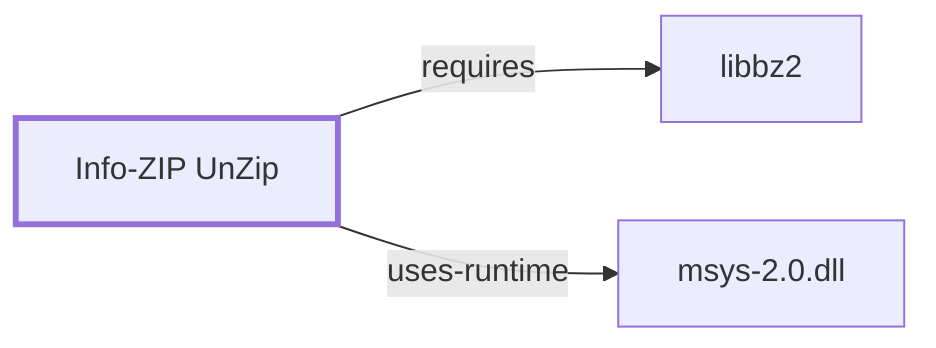

# Info-ZIP UnZip

<!-- BEGIN GENERATED object-facts -->

| Model fact | Value |
| --- | --- |
| Object | `component:info-zip:unzip` |
| Kind | `component` |
| Status | `partial` |
| Confidence | `high` |
| Authority | Info-ZIP |
| Environments | `msys` |
| Upstream | <http://www.info-zip.org/> |
| Packaged as | `package:msys2:unzip` |
| Version (observed) | 6.0-3 |
| License (observed) | custom |
| Architecture (observed) | x86_64 |
| Installed size (observed) | 430.4 KB |

**Evidence on this object**

- `evidence:catalog:current` — MSYS2 pacman package catalog (`observed`, retrieved 2026-07-29)
- `evidence:info-zip:unzip-manual-2026-07-30` — Info-ZIP (official project site) (`primary`, retrieved 2026-07-30)

Generated from the composed model by `tools/build_object_facts.py`. Observed values come from the catalog snapshot and change when it is refreshed.
Edits between the surrounding markers are overwritten on the next build.

<!-- END GENERATED object-facts -->

## Purpose

UnZip extracts and inspects PKZIP-compatible `.zip` archives, the
counterpart to [Zip](INFO-ZIP-ZIP.md)'s archive creation. This page
documents its architectural role, its bundled wrapper script, and its
dependency footprint; see the
[official Info-ZIP project site](http://www.info-zip.org/) for the full
option reference.

## Architectural Classification

`component:info-zip:unzip` is packaged as `package:msys2:unzip` (version
`6.0-3` in the current catalog snapshot, license `custom`), authored by the
Info-ZIP project. It belongs to the MSYS environment.

## Responsibilities

- Extracting, listing, and testing `.zip` archives, including bzip2-method
  entries created by [Zip](INFO-ZIP-ZIP.md).
- Providing `zipgrep`, a bundled shell-script wrapper that searches file
  contents inside a `.zip` archive without requiring the caller to extract
  it first — the same convenience pattern documented for
  [GNU Gzip](GNU-GZIP.md#dependencies)'s `zgrep`.

## Boundaries

Like [Zip](INFO-ZIP-ZIP.md), unzip combines archive and compression
handling in one tool and does not need pairing with a separate compressor.

## Interfaces

- `-l` (list contents), `-t` (test archive integrity), `-x` (exclude
  entries), `-o` (overwrite without prompting), per the manual.

## Dependencies

The catalog snapshot records two `runtime-depends-on` edges for
`package:msys2:unzip`:

| Dependency | Package | Architectural reason |
| --- | --- | --- |
| Interactive shell | `package:msys2:bash` | Backs the bundled `zipgrep` shell-script wrapper, the same wrapper-script pattern documented for [GNU Gzip](GNU-GZIP.md#dependencies). |
| bzip2 compression method | `package:msys2:libbz2` | Needed to extract entries compressed with the bzip2 method, the counterpart to the dependency documented for [Zip](INFO-ZIP-ZIP.md#dependencies) (`claim:component:zip-family:bzip2-method`). Documented fully in [libbz2](LIBBZ2.md). |

## Reverse Dependencies

The snapshot records 15 relationships targeting `package:msys2:unzip` — the
highest reverse-dependency count of any tool covered across this and the
prior archive/compression batch. See the
[reverse dependency impact analysis](REVERSE-DEPENDENCY-IMPACT-ANALYSIS.md)
for the current full list.

## Configuration

Unzip has no persistent configuration file; `UNZIP` and `UNZIPOPT`
environment variables set default options, per the manual.

## Initialization and Execution Flow

The core `unzip` binary is an invoke-run-exit process. `zipgrep` follows the
same layered execution model documented for gzip's wrapper scripts: a
`bash` process interprets the wrapper, which in turn launches `unzip` as a
child process — each an MSYS-runtime process-creation event adapted by
`msys-2.0.dll`, per [MSYS Runtime Initialization](MSYS-RUNTIME-INITIALIZATION.md).

## Runtime Behavior

Extraction correctness depends on the archive's per-entry compression
method (store, deflate, or bzip2) matching a method this build supports;
the `libbz2` dependency confirms bzip2-method support in this package.

## Compatibility and Variants

Some `.zip`-family files use non-standard or proprietary extensions
(certain self-extracting archives, ZIP64 for large archives); the manual
documents unzip's support boundaries for these variants rather than
claiming universal `.zip` compatibility.

## Security Considerations

Extracting an untrusted `.zip` archive carries path-traversal risk from
maliciously crafted entry names (a `../`-style entry attempting to write
outside the target directory); the manual documents unzip's default
protections against this. See
[Threat Model and Supply Chain](THREAT-MODEL-AND-SUPPLY-CHAIN.md) for the
project's general supply-chain posture.

## Failure Modes and Diagnostics

`-t` (test mode) is the documented way to verify an archive's integrity
before extracting; an extraction failure on a specific entry should first
be checked against that entry's declared compression method.

## Evidence, Assumptions, and Open Questions

Archive format and option semantics are backed by the official Info-ZIP
project site (`evidence:info-zip:unzip-manual-2026-07-30`), matching the
`project_url` already recorded for `package:msys2:unzip` in the catalog.
Package identity, version, license, and both dependency edges are backed by
the pacman catalog snapshot (`evidence:catalog:current`). No open items
beyond the general version-qualified security review implied above.

<!-- BEGIN GENERATED dependency-subgraph -->

## Dependency Diagram

Dependencies and dependents of `component:info-zip:unzip` in the composed graph: 0 dependents and 2 dependencies.

Generated from the composed model by `tools/build_object_diagrams.py`.
Edits between the surrounding markers are overwritten on the next build.

<!-- END GENERATED dependency-subgraph -->

## Related Objects

- [GNU Userland Role Model](GNU-USERLAND-ROLE-MODEL.md)
- [Info-ZIP Zip](INFO-ZIP-ZIP.md)
- [GNU Gzip](GNU-GZIP.md)
- [bzip2](BZIP2.md)
- [libbz2](LIBBZ2.md)
