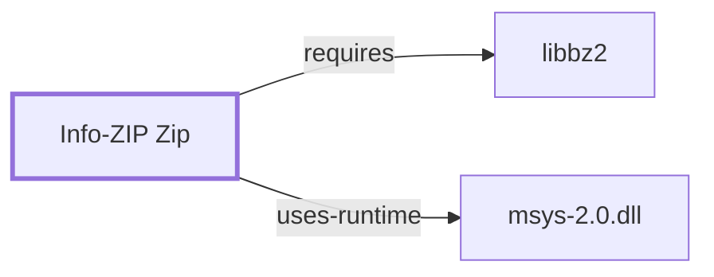

# Info-ZIP Zip

<!-- BEGIN GENERATED object-facts -->

| Model fact | Value |
| --- | --- |
| Object | `component:info-zip:zip` |
| Kind | `component` |
| Status | `partial` |
| Confidence | `high` |
| Authority | Info-ZIP |
| Environments | `msys` |
| Upstream | <http://www.info-zip.org/Zip.html> |
| Packaged as | `package:msys2:zip` |
| Version (observed) | 3.0-5 |
| License (observed) | BSD |
| Architecture (observed) | x86_64 |
| Installed size (observed) | 473.0 KB |

**Evidence on this object**

- `evidence:catalog:current` — MSYS2 pacman package catalog (`observed`, retrieved 2026-07-29)
- `evidence:info-zip:zip-manual-2026-07-30` — Info-ZIP Zip (official project page) (`primary`, retrieved 2026-07-30)

**Claims about this object**

- `claim:component:zip-family:bzip2-method` (`inference`, `high`) — Zip and UnZip support the bzip2 compression method within .zip archives, explaining their libbz2 dependency.

Generated from the composed model by `tools/build_object_facts.py`. Observed values come from the catalog snapshot and change when it is refreshed.
Edits between the surrounding markers are overwritten on the next build.

<!-- END GENERATED object-facts -->

## Purpose

Zip creates PKZIP-compatible `.zip` archives, combining archiving and
compression in a single format — unlike the tar-plus-compressor composition
documented for [GNU Tar](GNU-TAR.md) and its paired compressors. This page
documents its architectural role and dependency footprint; see the
[official Info-ZIP Zip project page](http://www.info-zip.org/Zip.html) for
the full option reference.

## Architectural Classification

`component:info-zip:zip` is packaged as `package:msys2:zip` (version
`3.0-5` in the current catalog snapshot, license `BSD`), authored by the
Info-ZIP project (not GNU, not the same project as
[UnZip](INFO-ZIP-UNZIP.md), though the two are commonly paired and share an
upstream project). It belongs to the MSYS environment.

## Responsibilities

- Creating `.zip` archives that combine multiple files, their metadata, and
  per-entry compression into a single container format.

## Boundaries

Unlike the single-stream compressors elsewhere in this batch, zip is both
archiver and compressor at once; it does not need to be paired with a
separate compression tool the way tar does.

## Interfaces

- `-r` (recurse into directories), `-9` (maximum compression), `-e`
  (encrypt, using zip's traditional, cryptographically weak scheme per the
  manual's own caveats), `-d` (delete entries from an existing archive).

## Dependencies

The catalog snapshot records one `runtime-depends-on` edge for
`package:msys2:zip`: `package:msys2:libbz2`. Modern Info-ZIP zip supports
bzip2 as an alternate per-entry compression method within `.zip` archives,
which explains this dependency
(`claim:component:zip-family:bzip2-method`) — the same underlying method
[UnZip](INFO-ZIP-UNZIP.md) must also support to extract such entries.
Documented fully in [libbz2](LIBBZ2.md).

## Reverse Dependencies

The snapshot records 13 relationships targeting `package:msys2:zip`. See
the [reverse dependency impact analysis](REVERSE-DEPENDENCY-IMPACT-ANALYSIS.md)
for the current full list.

## Configuration

Zip has no persistent configuration file; a `ZIPOPT` environment variable
sets default options, per the manual.

## Initialization and Execution Flow

Zip is an invoke-run-exit process, adapted from POSIX semantics onto
Windows process primitives by `msys-2.0.dll` per
[MSYS Runtime Initialization](MSYS-RUNTIME-INITIALIZATION.md).

## Runtime Behavior

Each archive entry can use a different compression method (store, deflate,
or bzip2), recorded per-entry in the archive's central directory — a
materially different structure from the single-stream formats elsewhere in
this batch, where the entire file is one compressed unit.

## Compatibility and Variants

Zip's traditional encryption (`-e`) is documented as cryptographically weak
and should not be relied on for confidentiality against a motivated
attacker; the manual itself flags this rather than presenting it as a
secure option.

## Security Considerations

Zip's own weak traditional encryption is a documented, known-weak scheme
(see Compatibility and Variants); archives requiring real confidentiality
should be encrypted with a separate, modern tool instead. See
[Threat Model and Supply Chain](THREAT-MODEL-AND-SUPPLY-CHAIN.md) for the
project's general supply-chain posture.

## Failure Modes and Diagnostics

Silently relying on `-e` encryption for sensitive data is the most notable
correctness/security gotcha for this tool specifically, per the manual's
own documented caveats.

## Evidence, Assumptions, and Open Questions

Archive format and option semantics are backed by the official Info-ZIP
Zip project page (`evidence:info-zip:zip-manual-2026-07-30`), matching the
`project_url` already recorded for `package:msys2:zip` in the catalog.
Package identity, version, license, and the libbz2 dependency are backed by
the pacman catalog snapshot (`evidence:catalog:current`) via
`claim:component:zip-family:bzip2-method`. No open items beyond the general
version-qualified security review implied above.

<!-- BEGIN GENERATED dependency-subgraph -->

## Dependency Diagram

Dependencies and dependents of `component:info-zip:zip` in the composed graph: 0 dependents and 2 dependencies.

Generated from the composed model by `tools/build_object_diagrams.py`.
Edits between the surrounding markers are overwritten on the next build.

<!-- END GENERATED dependency-subgraph -->

## Related Objects

- [GNU Userland Role Model](GNU-USERLAND-ROLE-MODEL.md)
- [Info-ZIP UnZip](INFO-ZIP-UNZIP.md)
- [bzip2](BZIP2.md)
- [libbz2](LIBBZ2.md)
- [p7zip](P7ZIP.md)
