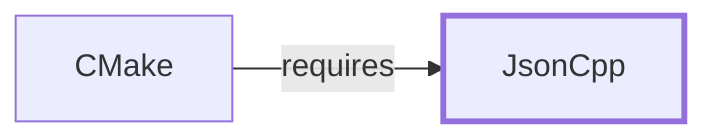

# JsonCpp

## Purpose

JsonCpp is a C++ library for reading and writing JSON. This page
documents its architectural role as a directly-declared dependency of
[CMake](CMAKE.md), which uses it to implement its JSON-based file-api and
`CMakePresets.json`/`CMakeUserPresets.json` support; see the
[official JsonCpp project page](https://github.com/open-source-parsers/jsoncpp)
for the full API reference.

## Architectural Classification

`library:jsoncpp:jsoncpp` is packaged per native environment: this page
cites the UCRT64 build,
`package:msys2:mingw-w64-ucrt-x86_64-jsoncpp` (version `1.9.6-3` in the
current catalog snapshot). It belongs to the UCRT64 environment and, like
[CMake](CMAKE.md#architectural-classification) itself and the rest of
Volume 8's toolchain components, does not depend on `msys-2.0.dll`, per
the [MSYS2 and MinGW-w64 role model](MSYS2-AND-MINGW-W64-ROLE-MODEL.md).

## Responsibilities

- Parsing and serializing JSON, consumed by [CMake](CMAKE.md) for its
  JSON-based file-api (used by IDEs and other tooling to query CMake
  project information) and for reading/writing
  `CMakePresets.json`/`CMakeUserPresets.json` configuration files.

## Boundaries

JsonCpp provides general-purpose JSON parsing and serialization
specifically; it defines no CMake-specific schema itself — the structure
of CMake's file-api responses and `CMakePresets.json` format are CMake's
own design, merely encoded and decoded through JsonCpp. JsonCpp already
appeared by package name in
[CMake's dependency table](CMAKE.md#dependencies) before this page
existed.

## Interfaces

- A C++ API (`Json::Value`, `Json::Reader`/`Json::CharReader`,
  `Json::Writer`/`Json::StreamWriter`) for representing, parsing, and
  serializing JSON data, per the documentation.

## Dependencies

The UCRT64 `package:msys2:mingw-w64-ucrt-x86_64-jsoncpp` declares a
dependency on `mingw-w64-ucrt-x86_64-gcc-libs` only — the GCC runtime
support libraries, not a library-family dependency distinct enough to
warrant its own page in this volume.

## Reverse Dependencies

The catalog snapshot records 6 relationships targeting
`package:msys2:mingw-w64-ucrt-x86_64-jsoncpp`: `package:msys2:mingw-w64-ucrt-x86_64-cmake`
(`relationship:toolchain:cmake-requires-jsoncpp` in this knowledge base's
graph), plus five other unrelated UCRT64 packages
(`angleproject`, `openxr-sdk`, `paraview`, `vrpn`, `vtk`) not covered
elsewhere in this knowledge base, reflecting JsonCpp's role as a
general-purpose utility library used well beyond the build-tooling
context this page focuses on.

## Configuration

JsonCpp has no persistent configuration file of its own; its behavior
(strict vs. permissive JSON parsing, output formatting) is controlled
entirely through its C++ API by the calling program.

## Initialization and Execution Flow

As a library, JsonCpp has no independent process lifecycle: it
initializes and executes within the process of whatever program links
against it — [CMake](CMAKE.md) in this dependency chain. As a native
MinGW-w64 library, this process model is Windows-facing directly rather
than mediated by `msys-2.0.dll`.

## Runtime Behavior

JsonCpp's file-api role is exercised whenever an IDE or other tool
queries CMake's file-api during or after configuration; its
`CMakePresets.json` role is exercised at the start of nearly every CMake
invocation that uses presets, a materially more routine usage pattern
than [cppdap's](CPPDAP.md) debugger-only role.

## Compatibility and Variants

Whether other native environments (CLANG64, i686) in this catalog package
JsonCpp separately was not confirmed while writing this page; this is
recorded as an open item rather than assumed either way.

## Security Considerations

JSON parsing of untrusted input is a documented general source of parser
vulnerabilities across libraries broadly; this page does not assert
JsonCpp's specific robustness beyond citing its role as CMake's chosen
JSON implementation. See
[Threat Model and Supply Chain](THREAT-MODEL-AND-SUPPLY-CHAIN.md) for the
project's general supply-chain posture; no version-qualified CVE review
has been performed for the recorded `1.9.6-3` version.

## Failure Modes and Diagnostics

A malformed `CMakePresets.json`/`CMakeUserPresets.json` file most commonly
surfaces as a JSON-syntax error reported by CMake at configure time,
traceable to JsonCpp's own parser error reporting rather than a defect in
CMake's logic.

## Evidence, Assumptions, and Open Questions

JSON parsing/serialization scope is backed by the official JsonCpp
project page (`evidence:jsoncpp:manual-2026-07-30`), matching the
`project_url` already recorded for
`package:msys2:mingw-w64-ucrt-x86_64-jsoncpp` in the catalog. Package
identity, version, and the recorded dependency/dependent edges are backed
by the pacman catalog snapshot (`evidence:catalog:current`). Open:
whether other native environments package JsonCpp separately was not
confirmed. Also explicitly out of scope for this page: header-level API
surface and PE import/export-level evidence, per the
[Library Family Classification](LIBRARY-FAMILY-CLASSIFICATION.md)
methodology.

<!-- BEGIN GENERATED dependency-subgraph -->

## Dependency Diagram

Dependencies and dependents of `library:jsoncpp:jsoncpp` in the composed graph: 1 dependent and 0 dependencies.

Generated from the composed model by `tools/build_object_diagrams.py`.
Edits between the surrounding markers are overwritten on the next build.

<!-- END GENERATED dependency-subgraph -->

## Related Objects

- [MSYS2 Library Architecture](LIBRARIES-ARCHITECTURE.md)
- [CMake](CMAKE.md)
- [cppdap](CPPDAP.md)
