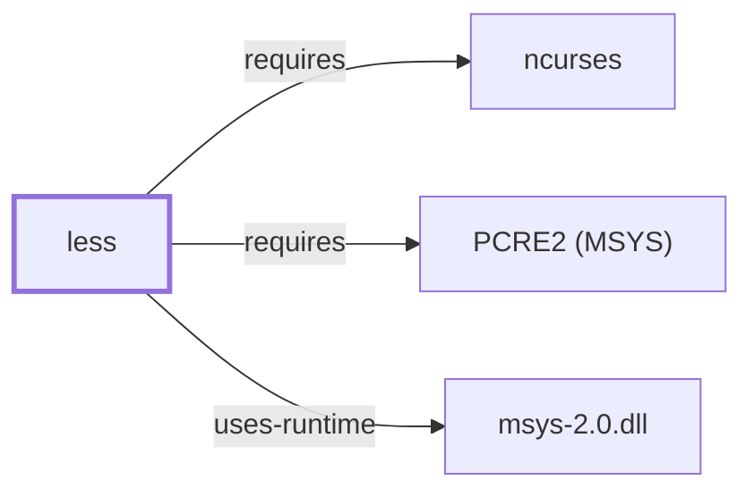

# less

## Purpose

Less is a pager: it displays text a screen at a time with backward and
forward navigation, without reading the entire input into memory first
(unlike `more`). This page documents its architectural role and its
regex-engine dependency; see the
[official less project site](http://www.greenwoodsoftware.com/less) for the
full command reference.

## Architectural Classification

`component:greenwood:less` is packaged as `package:msys2:less` (version
`704-1` in the current catalog snapshot, license `GPL3`), authored by Mark
Nudelman. It is not a GNU project despite the GPL license and its frequent
bundling on GNU/Linux systems. It belongs to the MSYS environment and is
the tool underlying the `zless`/`zipgrep`-style wrapper scripts documented
for [GNU Gzip](GNU-GZIP.md#dependencies) and
[Info-ZIP UnZip](INFO-ZIP-UNZIP.md#responsibilities).

## Responsibilities

- Displaying text a screen at a time with forward/backward navigation and
  incremental search, without requiring the whole input up front.

## Boundaries

Less only displays text; it does not edit files (that is
[Vim](VIM.md)'s, [GNU Nano](GNU-NANO.md)'s, [GNU Emacs](GNU-EMACS.md)'s, or
[GNU Ed](GNU-ED.md)'s role) and does not itself decompress files (the
`zless`/`zipgrep`-style wrappers documented elsewhere in this volume handle
that composition).

## Interfaces

- Forward/backward paging (space, `b`), regex search (`/`, `?`), and a
  `-N` line-number and `-S` chop-long-lines option family, per the project
  documentation.

## Dependencies

The catalog snapshot records two `runtime-depends-on` edges for
`package:msys2:less`:

| Dependency | Package | Architectural reason |
| --- | --- | --- |
| Perl-compatible regex | `package:msys2:libpcre2_8` | Backs Perl-compatible regular-expression support in less's search functionality (`claim:component:less:pcre-search`). Documented fully in [PCRE2 (MSYS)](PCRE2-MSYS.md). |
| Terminal capability library | `package:msys2:ncurses` | Screen drawing and cursor control, the same shared dependency documented as a hub in [ncurses](NCURSES.md#reverse-dependencies). |

## Reverse Dependencies

The snapshot records 3 relationships targeting `package:msys2:less`. See
the [reverse dependency impact analysis](REVERSE-DEPENDENCY-IMPACT-ANALYSIS.md)
for the current full list.

## Configuration

The `LESS` environment variable sets default options; `LESSOPEN`/`LESSCLOSE`
configure input preprocessors (for example, to transparently page compressed
or binary files), per the project documentation.

## Initialization and Execution Flow

Less is an invoke-run-exit process for a single paging session, adapted
from POSIX semantics onto Windows process primitives by `msys-2.0.dll` per
[MSYS Runtime Initialization](MSYS-RUNTIME-INITIALIZATION.md). Its screen
drawing depends on [ncurses](NCURSES.md), which in turn depends on the
active terminal's terminfo entry (ordinarily [mintty](MINTTY.md) in this
environment).

## Runtime Behavior

Less can begin displaying output before reading the entire input, which is
its key distinguishing behavior versus `more`; this is a documented design
goal rather than an incidental optimization.

## Compatibility and Variants

Less supports both its own extended command set and a POSIX/`more`-compatible
mode; scripts or muscle-memory built around strict `more` behavior may not
map onto every less feature by default.

## Security Considerations

`LESSOPEN`/`LESSCLOSE` invoking an external preprocessor on untrusted input
files is a documented feature with a corresponding trust boundary: the
preprocessor command runs with the invoking user's privileges. See
[Threat Model and Supply Chain](THREAT-MODEL-AND-SUPPLY-CHAIN.md) for the
project's general supply-chain posture; no less-specific CVE review has
been performed for the recorded `704-1` version.

## Failure Modes and Diagnostics

Garbled or incorrectly redrawn screens should first be checked against the
same terminfo/`TERM` question already flagged for
[ncurses](NCURSES.md#runtime-behavior) and [mintty](MINTTY.md#runtime-behavior)
rather than treated as a defect in less itself.

## Evidence, Assumptions, and Open Questions

Command behavior and design goals are backed by the official less project
site (`evidence:less:project-site-2026-07-30`), matching the `project_url`
already recorded for `package:msys2:less` in the catalog. Package identity,
version, license, and both dependency edges are backed by the pacman
catalog snapshot (`evidence:catalog:current`) via
`claim:component:less:pcre-search`. No open items beyond the general
version-qualified security review implied above.

<!-- BEGIN GENERATED dependency-subgraph -->

## Dependency Diagram

Dependencies and dependents of `component:greenwood:less` in the composed graph: 0 dependents and 3 dependencies.

Generated from the composed model by `tools/build_object_diagrams.py`.
Edits between the surrounding markers are overwritten on the next build.

<!-- END GENERATED dependency-subgraph -->

## Related Objects

- [GNU Userland Role Model](GNU-USERLAND-ROLE-MODEL.md)
- [ncurses](NCURSES.md)
- [GNU Gzip](GNU-GZIP.md)
- [Info-ZIP UnZip](INFO-ZIP-UNZIP.md)
- [mintty](MINTTY.md)
- [PCRE2 (MSYS)](PCRE2-MSYS.md)
