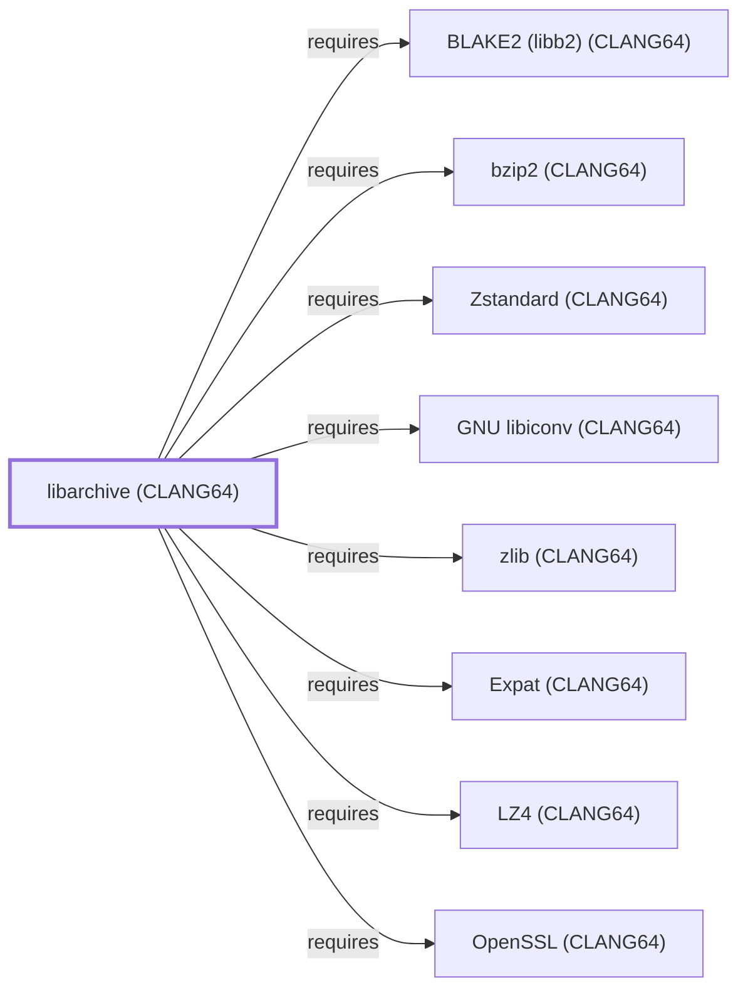

# libarchive (CLANG64)

## Purpose

This page documents `package:msys2:mingw-w64-clang-x86_64-libarchive`,
the CLANG64-environment build of libarchive — a multi-format archive
and compression library. All ten of its own recorded runtime
dependencies were modeled in this same batch, letting this addition
close its full dependency footprint in a single pass — the widest
single-pass dependency closure of any library added this session,
completing the chain begun with
[bzip2 (CLANG64)](BZIP2-CLANG64.md). See the
[official libarchive project site](https://www.libarchive.org/) for
the full format and API reference.

## Architectural Classification

`library:libarchive:libarchive@clang64` is packaged as
`package:msys2:mingw-w64-clang-x86_64-libarchive` (version `3.8.8-2`
in the current catalog snapshot, license `BSD-2-Clause`) — a
separately built, separate catalog entity from
[libarchive (UCRT64)](LIBARCHIVE.md) and
[libarchive (MSYS)](LIBARCHIVE-MSYS.md). It belongs to the CLANG64
environment.

## Responsibilities

- Reading and writing tar, cpio, ISO9660, ZIP, and other archive
  formats, and their common compression filters (gzip, bzip2, XZ/LZMA,
  LZ4, Zstandard), through a single unified streaming API, the same
  role documented for [libarchive (UCRT64)](LIBARCHIVE.md#responsibilities)
  and [libarchive (MSYS)](LIBARCHIVE-MSYS.md#responsibilities).

## Boundaries

This page's package serves CLANG64-environment consumers specifically;
[CMake (UCRT64)](CMAKE.md) instead depends on
[libarchive (UCRT64)](LIBARCHIVE.md#reverse-dependencies) — the two are
not interchangeable, matching the same distinction already drawn
throughout this volume for MSYS/UCRT64/CLANG64 sibling packages.

## Interfaces

- The libarchive C API (`archive_read_*`, `archive_write_*`, and
  related functions), the same interface family
  [libarchive (UCRT64)](LIBARCHIVE.md#interfaces) documents, per the
  documentation.

## Dependencies

The catalog snapshot records ten `runtime-depends-on` edges for
`package:msys2:mingw-w64-clang-x86_64-libarchive`, all now modeled in
this knowledge base:

| Dependency | Package | Architectural reason |
| --- | --- | --- |
| [bzip2 (CLANG64)](BZIP2-CLANG64.md) | `package:msys2:mingw-w64-clang-x86_64-bzip2` | Backs reading and writing the bzip2 compression filter. |
| [Expat (CLANG64)](EXPAT-CLANG64.md) | `package:msys2:mingw-w64-clang-x86_64-expat` | Backs XML parsing for xar and other XML-based formats. |
| [BLAKE2 (CLANG64)](LIBB2-CLANG64.md) | `package:msys2:mingw-w64-clang-x86_64-libb2` | Backs BLAKE2-based checksum support. |
| [GNU libiconv (CLANG64)](GNU-LIBICONV-CLANG64.md) | `package:msys2:mingw-w64-clang-x86_64-libiconv` | Backs character-set conversion for archive entry filenames/metadata. |
| [LZ4 (CLANG64)](LZ4-CLANG64.md) | `package:msys2:mingw-w64-clang-x86_64-lz4` | Backs reading and writing the LZ4 compression filter. |
| [OpenSSL (CLANG64)](OPENSSL-CLANG64.md) | `package:msys2:mingw-w64-clang-x86_64-openssl` | Backs cryptographic hashing and encrypted-archive support. |
| [PCRE2 (CLANG64)](PCRE2-CLANG64.md) | `package:msys2:mingw-w64-clang-x86_64-pcre2` | Backs regular-expression matching used in libarchive's own filename-pattern matching logic. |
| [liblzma (CLANG64)](LIBLZMA-CLANG64.md) | `package:msys2:mingw-w64-clang-x86_64-xz` | Backs reading and writing the XZ/LZMA compression filter. |
| [zlib (CLANG64)](ZLIB-CLANG64.md) | `package:msys2:mingw-w64-clang-x86_64-zlib` | Backs reading and writing the gzip/DEFLATE compression filter. |
| [Zstandard (CLANG64)](LIBZSTD-CLANG64.md) | `package:msys2:mingw-w64-clang-x86_64-zstd` | Backs reading and writing the Zstandard compression filter. |

## Reverse Dependencies

The catalog snapshot records 21 relationships targeting
`package:msys2:mingw-w64-clang-x86_64-libarchive`: `akira`,
`appstream-glib`, `ark`, `avogadrolibs-qt`, `cmake` (a separate
CLANG64-native `cmake` package, distinct from the UCRT64 `cmake`
package [CMake's own page](CMAKE.md) documents), `evince`, `gdal`,
`gimp`, `libgxps`, `libresprite`, `libvips`, `mpv`, `muon`,
`qt-creator`, `rpi-imager`, `swi-prolog-archive`, `tesseract-ocr`,
`totem-pl-parser`, `vlc`, `vtk`, and `zeal`. None of these
twenty-one are currently modeled as entities in this knowledge base;
see the [reverse dependency impact analysis](REVERSE-DEPENDENCY-IMPACT-ANALYSIS.md)
for the current full list.

## Configuration

libarchive has no persistent configuration file; format and filter
selection are set entirely through its C API by the calling program.

## Initialization and Execution Flow

As a library, libarchive has no independent process lifecycle: it
initializes and executes within the process of whatever program links
against it, the same model documented for
[libarchive (UCRT64)](LIBARCHIVE.md#initialization-and-execution-flow).
As a native MinGW-w64 library, this process model is Windows-facing
directly rather than mediated by `msys-2.0.dll`.

## Runtime Behavior

Identical functional behavior to
[libarchive (UCRT64)](LIBARCHIVE.md#runtime-behavior); see that page
for detail not specific to the CLANG64/UCRT64 packaging distinction.
This CLANG64 build's own dependency set additionally includes
[BLAKE2 (CLANG64)](LIBB2-CLANG64.md) for checksum support, not
recorded as a dependency of either the UCRT64 or MSYS siblings in this
catalog snapshot.

## Compatibility and Variants

The CLANG64, UCRT64, and MSYS libarchive packages are three separately
versioned catalog entities (see Architectural Classification); archives
produced or read by one are format-compatible with the others (the
archive formats themselves are portable), but the packages themselves
are not interchangeable at the linking level.

## Security Considerations

Parsing untrusted archive input is a documented general source of
archive-library vulnerabilities (path traversal, decompression bombs,
integer overflows in format parsers); this page does not assert this
specific package version's mitigation status. See
[Threat Model and Supply Chain](THREAT-MODEL-AND-SUPPLY-CHAIN.md) for
the project's general supply-chain posture; no version-qualified CVE
review has been performed for the recorded `3.8.8-2` version.

## Failure Modes and Diagnostics

A dependent program's archive read/write failure should be checked
against the specific format/filter combination in use and the
corresponding codec library (see Dependencies table above) before
being treated as a libarchive defect.

## Evidence, Assumptions, and Open Questions

Format and API scope is backed by the official libarchive project site
(`evidence:libarchive:manual-2026-07-30`), the same evidence record
[libarchive (UCRT64)](LIBARCHIVE.md) cites. Package identity, version,
license, and all ten recorded dependency edges are backed by the
pacman catalog snapshot (`evidence:catalog:current`). Open: the
twenty-one recorded reverse dependents are not individually modeled in
this knowledge base.

<!-- BEGIN GENERATED dependency-subgraph -->

## Dependency Diagram

Dependencies and dependents of `library:libarchive:libarchive@clang64` in the composed graph: 0 dependents and 10 dependencies, of which 2 are omitted here for legibility.

Generated from the composed model by `tools/build_object_diagrams.py`.
Edits between the surrounding markers are overwritten on the next build.

<!-- END GENERATED dependency-subgraph -->

## Related Objects

- [MSYS2 Library Architecture](LIBRARIES-ARCHITECTURE.md)
- [libarchive (UCRT64)](LIBARCHIVE.md)
- [libarchive (MSYS)](LIBARCHIVE-MSYS.md)
- [bzip2 (CLANG64)](BZIP2-CLANG64.md)
- [Expat (CLANG64)](EXPAT-CLANG64.md)
- [BLAKE2 (CLANG64)](LIBB2-CLANG64.md)
- [GNU libiconv (CLANG64)](GNU-LIBICONV-CLANG64.md)
- [LZ4 (CLANG64)](LZ4-CLANG64.md)
- [OpenSSL (CLANG64)](OPENSSL-CLANG64.md)
- [PCRE2 (CLANG64)](PCRE2-CLANG64.md)
- [liblzma (CLANG64)](LIBLZMA-CLANG64.md)
- [zlib (CLANG64)](ZLIB-CLANG64.md)
- [Zstandard (CLANG64)](LIBZSTD-CLANG64.md)
