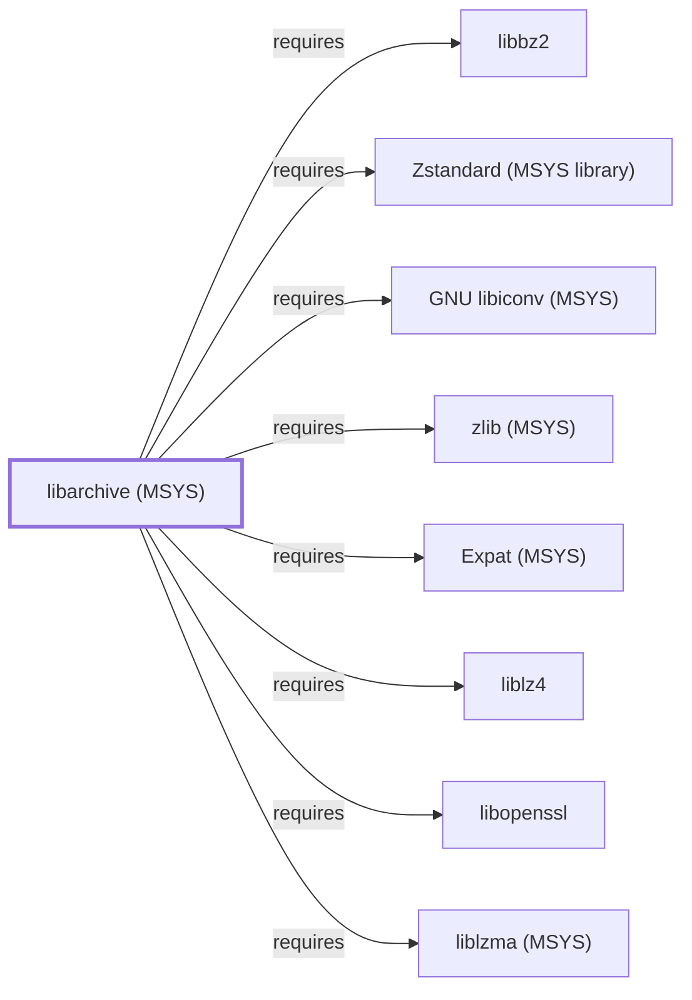

# libarchive (MSYS)

<!-- BEGIN GENERATED object-facts -->

| Model fact | Value |
| --- | --- |
| Object | `library:libarchive:libarchive@msys` |
| Kind | `library` |
| Status | `partial` |
| Confidence | `high` |
| Authority | libarchive project |
| Environments | `msys` |
| Upstream | <https://www.libarchive.org/> |
| Packaged as | `package:msys2:libarchive` |
| Version (observed) | 3.8.9-1 |
| License (observed) | spdx:BSD-2-Clause |
| Architecture (observed) | x86_64 |
| Installed size (observed) | 748.05 KiB |

**Evidence on this object**

- `evidence:catalog:current` — MSYS2 pacman package catalog (`observed`, retrieved 2026-08-05)
- `evidence:libarchive:manual-2026-07-30` — libarchive (official project site) (`primary`, retrieved 2026-07-30)

Generated from the composed model by `tools/build_object_facts.py`. Observed values come from the catalog snapshot and change when it is refreshed.
Edits between the surrounding markers are overwritten on the next build.

<!-- END GENERATED object-facts -->

## Purpose

This page documents `package:msys2:libarchive`, the MSYS-environment
build of the multi-format archive and compression library — a
genuinely distinct catalog package from
[libarchive (UCRT64)](LIBARCHIVE.md), and the widest real (non-
boilerplate) dependency footprint of any single MSYS library modeled to
date in this volume: eight forward edges across four codec libraries
already added over prior batches, including
[liblz4 (MSYS)](LIBLZ4-MSYS.md), one of this MSYS package's own reverse
dependents. See the
[official libarchive project site](https://www.libarchive.org/) for the
full format and API reference.

## Architectural Classification

`library:libarchive:libarchive@msys` is packaged as
`package:msys2:libarchive` (version `3.8.8-1` in the current catalog
snapshot, license `BSD-2-Clause`) — a separately built, separate catalog
entity from [libarchive (UCRT64)](LIBARCHIVE.md)'s
`mingw-w64-ucrt-x86_64-libarchive` package, matching the same
MSYS/UCRT64 sibling-package distinction already drawn throughout this
volume (e.g. [zlib (MSYS)](ZLIB-MSYS.md) vs.
[zlib (UCRT64)](ZLIB.md)).

## Responsibilities

- Reading and writing tar, cpio, ISO9660, ZIP, and other archive
  formats, and their common compression filters (gzip, bzip2, XZ/LZMA,
  LZ4, Zstandard), through a single unified streaming API.

## Boundaries

This page's package serves MSYS-environment consumers specifically;
[libarchive (UCRT64)](LIBARCHIVE.md#boundaries) is the separate package
[CMake](CMAKE.md) depends on for its native `ARCHIVE_CREATE`/
`ARCHIVE_EXTRACT` support — the two are not interchangeable.

## Interfaces

- The libarchive C API (`archive_read_*`, `archive_write_*`, and
  related functions), the same interface family
  [libarchive (UCRT64)](LIBARCHIVE.md#interfaces) documents, per the
  documentation.

## Dependencies

The catalog snapshot records 9 `runtime-depends-on` edges for
`package:msys2:libarchive`; the `gcc-libs` C/C++ runtime row is excluded
per this volume's boilerplate-dependency policy, and the remaining 8 are
all modeled in this knowledge base:

| Dependency | Package | Architectural reason |
| --- | --- | --- |
| [libbz2](LIBBZ2.md) | `package:msys2:libbz2` | Backs the bzip2 compression filter. |
| [Expat (MSYS)](EXPAT-MSYS.md) | `package:msys2:libexpat` | Backs XML parsing for xar and other XML-based formats. |
| [GNU libiconv (MSYS)](GNU-LIBICONV-MSYS.md) | `package:msys2:libiconv` | Backs character-set conversion for archive entry filenames/metadata. |
| [liblz4 (MSYS)](LIBLZ4-MSYS.md) | `package:msys2:liblz4` | Backs the LZ4 compression filter. |
| [liblzma (MSYS)](LIBLZMA-MSYS.md) | `package:msys2:liblzma` | Backs the XZ/LZMA compression filter. |
| [libopenssl](LIBOPENSSL.md) | `package:msys2:libopenssl` | Backs cryptographic hashing and encrypted-archive support. |
| [libzstd (MSYS)](LIBZSTD-MSYS.md) | `package:msys2:libzstd` | Backs the Zstandard compression filter. |
| [zlib (MSYS)](ZLIB-MSYS.md) | `package:msys2:zlib` | Backs the gzip/DEFLATE compression filter, the same role zlib plays for [libcurl](LIBCURL.md) and [GnuPG](GNUPG.md). |

## Reverse Dependencies

The catalog snapshot records 7 relationships targeting
`package:msys2:libarchive`: `cmake` (the MSYS `cmake` package, distinct
from [CMake](CMAKE.md)'s already-modeled UCRT64 dependency on the
separate [libarchive (UCRT64)](LIBARCHIVE.md) entity), `libarchive-devel`,
`nnn`, `pacutils`, `pacutils-devel`, `pkgfile`, and `python-pyalpm`. None
of these seven are currently modeled as entities in this knowledge base;
see the
[reverse dependency impact analysis](REVERSE-DEPENDENCY-IMPACT-ANALYSIS.md)
for the current full list.

## Configuration

libarchive has no persistent configuration file; format and filter
selection are set entirely through its C API by the calling program.

## Initialization and Execution Flow

As a library, libarchive has no independent process lifecycle: it
initializes and executes within the process of whatever program links
against it, the same model documented for
[libarchive (UCRT64)](LIBARCHIVE.md#initialization-and-execution-flow).

## Runtime Behavior

Identical functional behavior to [libarchive (UCRT64)](LIBARCHIVE.md);
see that page for detail not specific to the MSYS/UCRT64 packaging
distinction. This MSYS build's own dependency graph is notably wider
than the UCRT64 sibling's modeled dependency set, reflecting that this
page closes all of its non-boilerplate catalog dependencies in a single
batch.

## Compatibility and Variants

The MSYS and UCRT64 libarchive packages are separately versioned
catalog entities (see Architectural Classification); archives produced
or read by one are format-compatible with the other (the archive
formats themselves are portable), but the packages themselves are not
interchangeable at the linking level.

## Security Considerations

Parsing untrusted archive input is a documented general source of
archive-library vulnerabilities (path traversal, decompression bombs,
integer overflows in format parsers); this page does not assert this
specific package version's mitigation status. See
[Threat Model and Supply Chain](THREAT-MODEL-AND-SUPPLY-CHAIN.md) for
the project's general supply-chain posture; no version-qualified CVE
review has been performed for the recorded `3.8.8-1` version.

## Failure Modes and Diagnostics

A dependent program's archive read/write failure should be checked
against the specific format/filter combination in use and the
corresponding codec library (see Dependencies table above) before being
treated as a libarchive defect.

## Evidence, Assumptions, and Open Questions

Format and API scope is backed by the official libarchive project site
(`evidence:libarchive:manual-2026-07-30`), the same evidence record
[libarchive (UCRT64)](LIBARCHIVE.md) cites. Package identity, version,
license, and all 8 recorded non-boilerplate dependency edges are backed
by the pacman catalog snapshot (`evidence:catalog:current`). Open: the
seven recorded reverse dependents (`cmake`, `libarchive-devel`, `nnn`,
`pacutils`, `pacutils-devel`, `pkgfile`, `python-pyalpm`) are not
individually modeled in this knowledge base.

<!-- BEGIN GENERATED dependency-subgraph -->

## Dependency Diagram

Dependencies and dependents of `library:libarchive:libarchive@msys` in the composed graph: 0 dependents and 8 dependencies.

Generated from the composed model by `tools/build_object_diagrams.py`.
Edits between the surrounding markers are overwritten on the next build.

<!-- END GENERATED dependency-subgraph -->

## Related Objects

- [MSYS2 Library Architecture](LIBRARIES-ARCHITECTURE.md)
- [libarchive (UCRT64)](LIBARCHIVE.md)
- [libbz2](LIBBZ2.md)
- [Expat (MSYS)](EXPAT-MSYS.md)
- [GNU libiconv (MSYS)](GNU-LIBICONV-MSYS.md)
- [liblz4 (MSYS)](LIBLZ4-MSYS.md)
- [liblzma (MSYS)](LIBLZMA-MSYS.md)
- [libopenssl](LIBOPENSSL.md)
- [libzstd (MSYS)](LIBZSTD-MSYS.md)
- [zlib (MSYS)](ZLIB-MSYS.md)
- [libarchive (CLANG64)](LIBARCHIVE-CLANG64.md)
