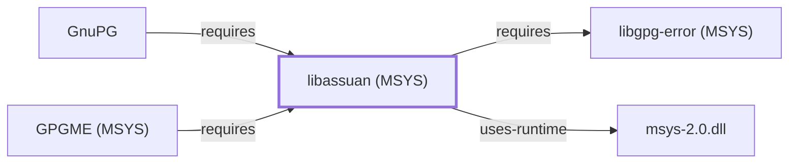

# libassuan (MSYS)

<!-- BEGIN GENERATED object-facts -->

| Model fact | Value |
| --- | --- |
| Object | `library:gnupg:libassuan@msys` |
| Kind | `library` |
| Status | `partial` |
| Confidence | `high` |
| Authority | GnuPG project |
| Environments | `msys` |
| Upstream | <https://gnupg.org/related_software/libassuan> |
| Packaged as | `package:msys2:libassuan` |
| Version (observed) | 3.0.2-1 |
| License (observed) | GPL |
| Architecture (observed) | x86_64 |
| Installed size (observed) | 213.7 KB |

**Evidence on this object**

- `evidence:catalog:current` — MSYS2 pacman package catalog (`observed`, retrieved 2026-07-29)
- `evidence:gnupg:libassuan-manual-2026-07-30` — libassuan (official project page) (`primary`, retrieved 2026-07-30)

Generated from the composed model by `tools/build_object_facts.py`. Observed values come from the catalog snapshot and change when it is refreshed.
Edits between the surrounding markers are overwritten on the next build.

<!-- END GENERATED object-facts -->

## Purpose

This page documents the **MSYS-environment** `libassuan` package
specifically — the Assuan IPC protocol library GnuPG uses for
communication between `gpg`, `dirmngr`, and other GnuPG-family helper
processes — as a correction: [GNUPG.md](GNUPG.md) and
[libassuan (UCRT64)](LIBASSUAN.md) originally recorded
`component:gnupg:gnupg`'s `requires` edge as pointing to the
UCRT64-packaged `libassuan`
(`package:msys2:mingw-w64-ucrt-x86_64-libassuan`), but
`package:msys2:gnupg` is itself an MSYS-environment package whose actual
catalog-recorded dependency is `package:msys2:libassuan` — a separately
versioned, separate catalog entity. This page documents that correct
target; see the
[official libassuan project page](https://gnupg.org/related_software/libassuan)
for the API reference shared with the UCRT64 package.

## Architectural Classification

`library:gnupg:libassuan@msys` is packaged in the MSYS environment as
`package:msys2:libassuan` (version `3.0.2-1` in the current catalog
snapshot) — a materially different version from the UCRT64 sibling's
`2.5.7-1` documented on [libassuan (UCRT64)](LIBASSUAN.md), the largest
version gap of any MSYS/UCRT64 pair corrected in this batch. This is the
package [GnuPG](GNUPG.md#architectural-classification) actually depends
on.

## Responsibilities

- Backing the Assuan IPC protocol for [GnuPG's](GNUPG.md) MSYS-packaged
  build, the same functional role
  [libassuan (UCRT64)](LIBASSUAN.md) documents for the UCRT64 packaging
  context.

## Boundaries

Functionally identical in scope to [libassuan (UCRT64)](LIBASSUAN.md) —
this page exists specifically to document the correct MSYS-packaged
catalog entity that GnuPG's own MSYS build depends on.

## Interfaces

Identical API surface to [libassuan (UCRT64)](LIBASSUAN.md); see that
page for interface details, since both packages share the same upstream
project.

## Dependencies

The catalog snapshot records two `runtime-depends-on` edges for
`package:msys2:libassuan`: `gcc-libs` and `package:msys2:libgpg-error`,
documented on [libgpg-error (MSYS)](LIBGPG-ERROR-MSYS.md)
(`relationship:foundation-libraries:libassuan-msys-requires-libgpg-error-msys`).

## Reverse Dependencies

The catalog snapshot records 4 relationships targeting
`package:msys2:libassuan`: `package:msys2:gnupg`
(`relationship:ssh-curl-git:gnupg-requires-libassuan` in this knowledge
base's graph, corrected 2026-07-30 to point here instead of the UCRT64
package), its own `-devel` subpackage,
[GPGME (MSYS)](LIBGPGME-MSYS.md)
(`relationship:foundation-libraries:libgpgme-requires-libassuan`, added
2026-08-02), and `package:msys2:pinentry`.

## Configuration

No persistent configuration file; identical to
[libassuan (UCRT64)](LIBASSUAN.md) in this respect.

## Initialization and Execution Flow

As a library, this package has no independent process lifecycle: it
initializes and executes within the process of whatever program links
against it — [GnuPG](GNUPG.md) in this dependency chain. As an
MSYS-dependent library, this is adapted from POSIX semantics onto Windows
process primitives by `msys-2.0.dll` per
[MSYS Runtime Initialization](MSYS-RUNTIME-INITIALIZATION.md), unlike the
UCRT64 sibling, which does not depend on `msys-2.0.dll`.

## Runtime Behavior

Identical functional behavior to [libassuan (UCRT64)](LIBASSUAN.md); see
that page for detail not specific to the MSYS/UCRT64 packaging
distinction.

## Compatibility and Variants

This is the correction record for the MSYS/UCRT64 packaging distinction
itself: the two `libassuan` packages are separately versioned catalog
entities (`3.0.2-1` MSYS vs. `2.5.7-1` UCRT64 — a full major version
apart) and not interchangeable at the binary level.

## Security Considerations

Identical security posture to [libassuan (UCRT64)](LIBASSUAN.md); see
that page. No version-qualified CVE review has been performed for the
recorded `3.0.2-1` version specifically.

## Failure Modes and Diagnostics

Identical to [libassuan (UCRT64)](LIBASSUAN.md); GnuPG's IPC-related
failures should be checked against this MSYS package's behavior
specifically, not the UCRT64 sibling's, since GnuPG links against this
one.

## Evidence, Assumptions, and Open Questions

The Assuan IPC protocol role is backed by the official libassuan project
page (`evidence:gnupg:libassuan-manual-2026-07-30`), the same evidence
record [libassuan (UCRT64)](LIBASSUAN.md) cites. Package identity,
version, and the recorded dependency/dependent edges (including the
2026-07-30 correction to `relationship:ssh-curl-git:gnupg-requires-libassuan`)
are backed by the pacman catalog snapshot (`evidence:catalog:current`).

<!-- BEGIN GENERATED dependency-subgraph -->

## Dependency Diagram

Dependencies and dependents of `library:gnupg:libassuan@msys` in the composed graph: 2 dependents and 2 dependencies.

Generated from the composed model by `tools/build_object_diagrams.py`.
Edits between the surrounding markers are overwritten on the next build.

<!-- END GENERATED dependency-subgraph -->

## Related Objects

- [MSYS2 Library Architecture](LIBRARIES-ARCHITECTURE.md)
- [GnuPG](GNUPG.md)
- [libassuan (UCRT64)](LIBASSUAN.md)
- [libgpg-error (MSYS)](LIBGPG-ERROR-MSYS.md)
- [GPGME (MSYS)](LIBGPGME-MSYS.md)
