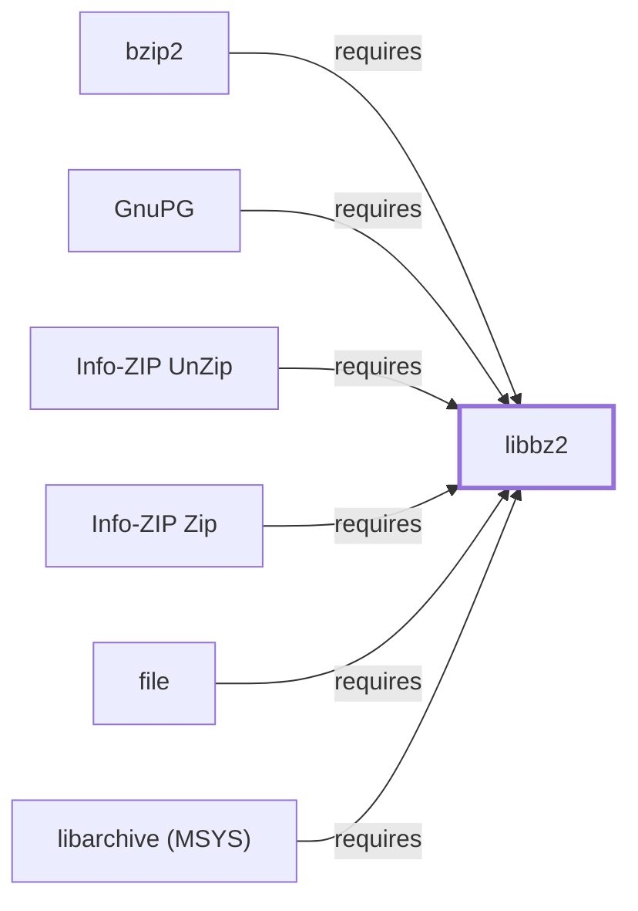

# libbz2

<!-- BEGIN GENERATED object-facts -->

| Model fact | Value |
| --- | --- |
| Object | `library:bzip2:libbz2` |
| Kind | `library` |
| Status | `partial` |
| Confidence | `high` |
| Authority | Julian Seward |
| Environments | `msys` |
| Upstream | <http://www.bzip.org> |
| Packaged as | `package:msys2:libbz2` |
| Version (observed) | 1.0.8-4 |
| License (observed) | custom |
| Architecture (observed) | x86_64 |
| Installed size (observed) | 65.70 KiB |

**Evidence on this object**

- `evidence:bzip2:project-site-2026-07-30` — bzip2 and libbzip2 (official project site) (`primary`, retrieved 2026-07-30)
- `evidence:catalog:current` — MSYS2 pacman package catalog (`observed`, retrieved 2026-08-05)

Generated from the composed model by `tools/build_object_facts.py`. Observed values come from the catalog snapshot and change when it is refreshed.
Edits between the surrounding markers are overwritten on the next build.

<!-- END GENERATED object-facts -->

## Purpose

libbz2 is the Burrows-Wheeler-transform compression codec library split
out from the [bzip2](BZIP2.md) command-line package; this page documents
that shared library specifically, distinct from the CLI tool. It is one
of the more widely linked codec libraries found in this sweep of Volume 6,
with five recorded catalog dependents already modeled in this knowledge
base. See the [official bzip2 project site](http://www.bzip.org) for the
format and algorithm reference.

## Architectural Classification

`library:bzip2:libbz2` is packaged in the MSYS environment as
`package:msys2:libbz2` (version `1.0.8-4` in the current catalog
snapshot, license `custom`, matching [bzip2's own recorded
license](BZIP2.md#architectural-classification)), authored by Julian
Seward — the same author as [the bzip2 CLI](BZIP2.md) itself. No separate
native (UCRT64/CLANG64/i686) `libbz2` package was found in this catalog
snapshot, so unlike several other codec libraries documented in this
volume (zlib, zstd), no `@msys`-qualified sibling disambiguation is
needed for this entity's ID.

## Responsibilities

- Providing Burrows-Wheeler-transform compression and decompression as a
  linked library, consumed by [the bzip2 CLI](BZIP2.md#dependencies)
  itself (split library/CLI pattern), [file](FILE.md#dependencies) (to
  identify files inside bzip2-compressed containers),
  [GnuPG](GNUPG.md#dependencies) (compressed OpenPGP packet handling,
  alongside [zlib](ZLIB-MSYS.md)), and [Zip](INFO-ZIP-ZIP.md#dependencies)
  and [UnZip](INFO-ZIP-UNZIP.md#dependencies) (the bzip2 compression
  method within `.zip` archives).

## Boundaries

libbz2 implements the Burrows-Wheeler compression codec specifically; it
does not implement archive-container formats (`.zip`, `.tar`) itself —
those remain the responsibility of the tools that link against it, which
use libbz2 only for the compression/decompression step within their own
container formats.

## Interfaces

- A C API (`BZ2_bzCompress`, `BZ2_bzDecompress`, and the simpler
  `BZ2_bzBuffToBuffCompress`/`BZ2_bzBuffToBuffDecompress` one-shot
  variants) for Burrows-Wheeler compression and decompression, per the
  documentation.

## Dependencies

The MSYS `package:msys2:libbz2` declares no `runtime-depends-on` edges
beyond standard toolchain runtime support (`gcc-libs`).

## Reverse Dependencies

The catalog snapshot records 16 relationships targeting
`package:msys2:libbz2`. Five are now modeled in this knowledge base:
[bzip2](BZIP2.md) (`relationship:foundation-libraries:bzip2-requires-libbz2`),
[file](FILE.md) (`relationship:foundation-libraries:file-requires-libbz2`),
[GnuPG](GNUPG.md) (`relationship:ssh-curl-git:gnupg-requires-libbz2`),
[Zip](INFO-ZIP-ZIP.md) (`relationship:zip-family:zip-requires-libbz2`),
and [UnZip](INFO-ZIP-UNZIP.md) (`relationship:zip-family:unzip-requires-libbz2`).
The remaining recorded dependents include `package:msys2:pcre` and
`package:msys2:pcre2` — the `pcregrep`/`pcre2grep` CLI meta-packages,
which are **distinct catalog packages** from the `libpcre`/`libpcre2_8`
library packages already documented on [PCRE (MSYS)](PCRE-MSYS.md) and
[PCRE2 (MSYS)](PCRE2-MSYS.md); this page does not attribute the
`libbz2` dependency to those library entities, since it belongs to the
separate, not-yet-modeled meta-package instead. Also not individually
modeled: `bsdcpio`, `bsdtar`, `elinks`, `libarchive` (MSYS package —
distinct from
[this knowledge base's UCRT64 LibArchive entity](LIBARCHIVE.md)),
`libbz2-devel`, `perl-compress-bzip2`, `python`, and `subversion`. See
the [reverse dependency impact analysis](REVERSE-DEPENDENCY-IMPACT-ANALYSIS.md)
for the current full list.

## Configuration

libbz2 has no persistent configuration file as a library; block size and
compression parameters are set entirely through its C API by the calling
program.

## Initialization and Execution Flow

As a library, libbz2 has no independent process lifecycle: it initializes
and executes within the process of whatever program links against it. As
an MSYS-dependent component, this is adapted from POSIX semantics onto
Windows process primitives by `msys-2.0.dll` per
[MSYS Runtime Initialization](MSYS-RUNTIME-INITIALIZATION.md).

## Runtime Behavior

libbz2 compresses input in independent, fixed-size blocks, the same
block-structured design documented for [the bzip2 CLI](BZIP2.md#runtime-behavior);
this partial-recovery-friendly property is a codec-level characteristic
shared by every program linking against this library, not a CLI-specific
behavior.

## Compatibility and Variants

No separate native (UCRT64/CLANG64/i686) `libbz2` package was found in
this catalog snapshot; whether one exists in a different snapshot or
repository is recorded as an open item rather than assumed either way.

## Security Considerations

Decompressing untrusted bzip2-compressed data carries the general
decompression-bomb and parser-robustness considerations of any
compression library; this page does not assert this specific package
version's robustness against crafted input. See
[Threat Model and Supply Chain](THREAT-MODEL-AND-SUPPLY-CHAIN.md) for the
project's general supply-chain posture; no version-qualified CVE review
has been performed for the recorded `1.0.8-4` version.

## Failure Modes and Diagnostics

A decompression failure most commonly indicates either a corrupted `.bz2`
stream or a block-size mismatch between what the compressing and
decompressing calls expect; libbz2's block-structured design allows a
calling program to attempt partial recovery of still-intact blocks, the
same property [bzip2recover](BZIP2.md#failure-modes-and-diagnostics)
exposes at the CLI level.

## Evidence, Assumptions, and Open Questions

Burrows-Wheeler compression library scope is backed by the official
bzip2 project site (`evidence:bzip2:project-site-2026-07-30`), matching
the `project_url` already recorded for `package:msys2:libbz2` in the
catalog. Package identity, version, and the five modeled dependent edges
are backed by the pacman catalog snapshot (`evidence:catalog:current`).
Open, and explicitly out of scope for this page: the remaining recorded
dependents not individually modeled (including the not-yet-modeled
`pcregrep`/`pcre2grep` meta-packages), whether a native
(UCRT64/CLANG64/i686) `libbz2` package exists in this snapshot, and
header-level API surface / PE import/export-level evidence, per the
[Library Family Classification](LIBRARY-FAMILY-CLASSIFICATION.md)
methodology.

<!-- BEGIN GENERATED dependency-subgraph -->

## Dependency Diagram

Dependencies and dependents of `library:bzip2:libbz2` in the composed graph: 6 dependents and 0 dependencies.

Generated from the composed model by `tools/build_object_diagrams.py`.
Edits between the surrounding markers are overwritten on the next build.

<!-- END GENERATED dependency-subgraph -->

## Related Objects

- [MSYS2 Library Architecture](LIBRARIES-ARCHITECTURE.md)
- [bzip2](BZIP2.md)
- [file](FILE.md)
- [GnuPG](GNUPG.md)
- [Info-ZIP Zip](INFO-ZIP-ZIP.md)
- [Info-ZIP UnZip](INFO-ZIP-UNZIP.md)
- [PCRE (MSYS)](PCRE-MSYS.md)
- [PCRE2 (MSYS)](PCRE2-MSYS.md)
- [zlib (MSYS)](ZLIB-MSYS.md)
- [libarchive (MSYS)](LIBARCHIVE-MSYS.md)
- [bzip2 (CLANG64)](BZIP2-CLANG64.md)
