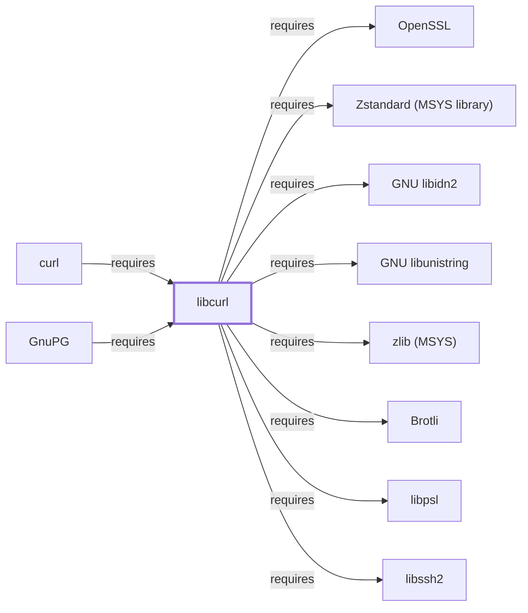

# libcurl

<!-- BEGIN GENERATED object-facts -->

| Model fact | Value |
| --- | --- |
| Object | `library:curl:libcurl` |
| Kind | `library` |
| Status | `partial` |
| Confidence | `high` |
| Authority | curl project |
| Environments | `msys` |
| Upstream | <https://curl.se/> |
| Packaged as | `package:msys2:libcurl` |
| Version (observed) | 8.21.0-1 |
| License (observed) | spdx:MIT |
| Architecture (observed) | x86_64 |
| Installed size (observed) | 896.9 KB |

**Evidence on this object**

- `evidence:catalog:current` — MSYS2 pacman package catalog (`observed`, retrieved 2026-07-29)
- `evidence:curl:project-site-2026-07-30` — curl (official project site) (`primary`, retrieved 2026-07-30)

Generated from the composed model by `tools/build_object_facts.py`. Observed values come from the catalog snapshot and change when it is refreshed.
Edits between the surrounding markers are overwritten on the next build.

<!-- END GENERATED object-facts -->

## Purpose

libcurl is the multi-protocol file-transfer library underlying the
[curl](CURL.md) CLI, and it is also depended on directly by
[GnuPG](GNUPG.md)'s `dirmngr` for HTTP-based key-server and
certificate-revocation lookups — a second, independent consumer already
cited by package name on both [CURL.md](CURL.md#dependencies) and
[GNUPG.md](GNUPG.md#dependencies) before this page existed. This page
documents its architectural role; see the
[official curl project site](https://curl.se/) for the full API
reference.

## Architectural Classification

`library:curl:libcurl` is packaged in the MSYS environment as
`package:msys2:libcurl` (version `8.21.0-1` in the current catalog
snapshot, the same version as the `curl` CLI package it ships alongside).
A separately packaged, native `curl` (bundling both CLI and library, per
[curl (UCRT64)](CURL-UCRT64.md)) also exists in the catalog; this page
documents the MSYS package specifically, since that is the one both
[curl](CURL.md#architectural-classification) (itself MSYS-packaged) and
[GnuPG](GNUPG.md#architectural-classification) actually depend on.

## Responsibilities

- Implementing multi-protocol file transfer (HTTP(S), FTP, and others
  depending on build configuration) as a reusable library, consumed by
  the [curl](CURL.md) CLI and, independently, by
  [GnuPG](GNUPG.md)'s `dirmngr` component.

## Boundaries

libcurl is the shared transfer-library half of the CLI/library split
already noted on [curl's own page](CURL.md#architectural-classification);
[curl](CURL.md) itself is a thin command-line frontend over this
library's functionality, while [GnuPG's](GNUPG.md) `dirmngr` links
against libcurl directly without going through the `curl` CLI at all.

## Interfaces

- The `curl_easy_*` and `curl_multi_*` C API families for performing and
  managing transfers programmatically, per the documentation.

## Dependencies

The MSYS `package:msys2:libcurl` declares twelve dependencies. Six are
the same MSYS-packaged sibling libraries this knowledge base already
documents, so this page adds explicit `requires` edges for them:
[GNU libidn2](GNU-LIBIDN2.md) (internationalized domain names),
[libnghttp2](LIBNGHTTP2.md) (HTTP/2), [libnghttp3](LIBNGHTTP3.md)
(HTTP/3), [libngtcp2](LIBNGTCP2.md) (QUIC transport),
[libpsl](LIBPSL.md) (Public Suffix List cookie-domain scoping), and
[GNU libunistring](GNU-LIBUNISTRING.md) (Unicode string handling) — the
same six dependencies [curl's own CLI page](CURL.md#dependencies)
already lists directly, since the CLI's own dependency table happens to
match libcurl's here. A seventh, [OpenSSL](OPENSSL.md)
(`package:msys2:openssl`, TLS/HTTPS support), also matches this
knowledge base's existing `component:openssl:openssl` entity exactly and
gets a `requires` edge as well. An eighth, [zlib (MSYS)](ZLIB-MSYS.md)
(`package:msys2:zlib`, transparent decompression support,
`relationship:foundation-libraries:libcurl-requires-zlib-msys`), closes
an item this page previously declined to model — distinct from this
knowledge base's UCRT64 and CLANG64 zlib entities, now given its own
page. The remaining four now also have pages and `requires` edges of
their own: [Brotli](BROTLI.md) (`package:msys2:brotli`,
`Content-Encoding: br` support), [ca-certificates](CA-CERTIFICATES.md)
(`package:msys2:ca-certificates`, TLS trust-store data, also a direct
dependency of the `curl` CLI package itself), [libssh2](LIBSSH2.md)
(`package:msys2:libssh2`, `sftp://`/`scp://` support), and
[Zstandard (MSYS library)](LIBZSTD-MSYS.md) (`package:msys2:libzstd`,
`Content-Encoding: zstd` support) — closing every one of libcurl's
twelve declared dependencies to a page of its own.

## Reverse Dependencies

The catalog snapshot records 8 relationships targeting
`package:msys2:libcurl`: `package:msys2:curl`
(`relationship:ssh-curl-git:curl-requires-libcurl` in this knowledge
base's graph), `package:msys2:gnupg`
(`relationship:ssh-curl-git:gnupg-requires-libcurl`), `package:msys2:cargo-c`,
`package:msys2:cmake` (the MSYS `cmake` package, a different catalog
entity from the UCRT64 `cmake` package [CMake's own page](CMAKE.md)
documents, whose own `curl` dependency is the separate
[curl (UCRT64)](CURL-UCRT64.md) package),
its own `-devel` subpackage, `package:msys2:pacutils` and its `-devel`
subpackage, and `package:msys2:rust`.

## Configuration

libcurl has no persistent configuration file of its own; `~/.curlrc`
(already documented on [curl's own page](CURL.md#configuration)) is
specific to the `curl` CLI frontend, not to libcurl itself, which is
controlled entirely through its C API by the calling program — including
[GnuPG's](GNUPG.md) `dirmngr`, which has no equivalent of `curlrc`.

## Initialization and Execution Flow

As a library, libcurl has no independent process lifecycle: it
initializes and executes within the process of whatever program links
against it — [curl](CURL.md) or [GnuPG's](GNUPG.md) `dirmngr` in this
dependency chain. As an MSYS-dependent library, this is adapted from
POSIX semantics onto Windows process primitives by `msys-2.0.dll` per
[MSYS Runtime Initialization](MSYS-RUNTIME-INITIALIZATION.md).

## Runtime Behavior

Which protocol stack a given libcurl-backed transfer actually exercises
depends on server negotiation and the request target, the same general
point already made on [curl's own page](CURL.md#runtime-behavior); this
applies equally to `dirmngr`'s libcurl-backed lookups.

## Compatibility and Variants

The MSYS and native (UCRT64/CLANG64/i686) libcurl packages are separately
versioned catalog entities (see Architectural Classification); code
built against one is not automatically compatible with the other without
matching the correct environment.

## Security Considerations

libcurl handles untrusted network content and TLS trust decisions
directly for both of its consumers; the same Public Suffix List
(`libpsl`) defense against cookie-scoping vulnerabilities already noted
on [curl's own page](CURL.md#security-considerations) applies here too,
since both consumers share this one library. See
[Threat Model and Supply Chain](THREAT-MODEL-AND-SUPPLY-CHAIN.md) for the
project's general supply-chain posture; no version-qualified CVE review
has been performed for the recorded `8.21.0-1` version.

## Failure Modes and Diagnostics

Transfer failures in [GnuPG's](GNUPG.md) `dirmngr` (key-server or
certificate-revocation lookups) should be triaged against the same
protocol-negotiation and TLS-handshake considerations
[curl's own page](CURL.md#failure-modes-and-diagnostics) documents for
the CLI, since both link against this same library.

## Evidence, Assumptions, and Open Questions

Protocol and API semantics are backed by the official curl project site
(`evidence:curl:project-site-2026-07-30`), the same evidence record
[curl's own page](CURL.md) cites, since both packages share the same
upstream project. Package identity, version, and the recorded
dependency/dependent edges are backed by the pacman catalog snapshot
(`evidence:catalog:current`). Open, and explicitly out of scope for this
page: header-level API surface and PE import/export-level evidence, per
the [Library Family Classification](LIBRARY-FAMILY-CLASSIFICATION.md)
methodology.

<!-- BEGIN GENERATED dependency-subgraph -->

## Dependency Diagram

Dependencies and dependents of `library:curl:libcurl` in the composed graph: 2 dependents and 13 dependencies, of which 5 are omitted here for legibility.

Generated from the composed model by `tools/build_object_diagrams.py`.
Edits between the surrounding markers are overwritten on the next build.

<!-- END GENERATED dependency-subgraph -->

## Related Objects

- [MSYS2 Library Architecture](LIBRARIES-ARCHITECTURE.md)
- [curl](CURL.md)
- [GnuPG](GNUPG.md)
- [OpenSSL](OPENSSL.md)
- [GNU libidn2](GNU-LIBIDN2.md)
- [libnghttp2](LIBNGHTTP2.md)
- [libnghttp3](LIBNGHTTP3.md)
- [libngtcp2](LIBNGTCP2.md)
- [libpsl](LIBPSL.md)
- [GNU libunistring](GNU-LIBUNISTRING.md)
- [zlib (MSYS)](ZLIB-MSYS.md)
- [Brotli](BROTLI.md)
- [ca-certificates](CA-CERTIFICATES.md)
- [libssh2](LIBSSH2.md)
- [curl (UCRT64)](CURL-UCRT64.md)
- [Zstandard (MSYS library)](LIBZSTD-MSYS.md)
- [curl (CLANG64)](CURL-CLANG64.md)
