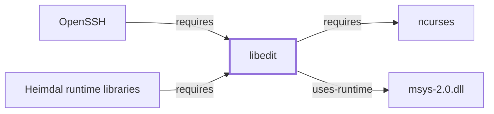

# libedit

<!-- BEGIN GENERATED object-facts -->

| Model fact | Value |
| --- | --- |
| Object | `library:libedit:libedit` |
| Kind | `library` |
| Status | `partial` |
| Confidence | `high` |
| Authority | libedit project (NetBSD Editline port) |
| Environments | `msys` |
| Upstream | <https://www.thrysoee.dk/editline/> |
| Packaged as | `package:msys2:libedit` |
| Version (observed) | 20240808_3.1-1 |
| License (observed) | BSD |
| Architecture (observed) | x86_64 |
| Installed size (observed) | 459.24 KiB |

**Evidence on this object**

- `evidence:catalog:current` — MSYS2 pacman package catalog (`observed`, retrieved 2026-08-05)
- `evidence:libedit:manual-2026-07-30` — libedit / NetBSD Editline (official project page) (`primary`, retrieved 2026-07-30)

Generated from the composed model by `tools/build_object_facts.py`. Observed values come from the catalog snapshot and change when it is refreshed.
Edits between the surrounding markers are overwritten on the next build.

<!-- END GENERATED object-facts -->

## Purpose

libedit is an autotool- and libtoolized port of the NetBSD Editline
library, providing readline-style interactive line editing (history,
cursor movement, tab completion hooks) for programs that link against it.
This page documents its architectural role as a directly-declared
dependency of [OpenSSH](OPENSSH.md); see the
[official libedit project page](https://www.thrysoee.dk/editline/) for the
full API reference.

## Architectural Classification

`library:libedit:libedit` is packaged in the MSYS environment as
`package:msys2:libedit` (version `20240808_3.1-1` in the current catalog
snapshot). A separately packaged, native (UCRT64/CLANG64/i686) `libedit`
was not confirmed to exist in this snapshot; this page documents the MSYS
package specifically, since that is the one
[OpenSSH](OPENSSH.md#dependencies) actually depends on.

## Responsibilities

- Interactive command-line editing (history navigation, cursor movement,
  key bindings), consumed by [OpenSSH](OPENSSH.md) specifically for
  `sftp`'s interactive command prompt.

## Boundaries

libedit provides a readline-style line-editing API distinct from
[GNU Readline](GNU-READLINE.md) itself — the two are separate,
independently maintained implementations of a similar editing-library
role, not the same library under two names; [GnuPG's](GNUPG.md#dependencies)
interactive prompts depend on GNU Readline specifically, while
[OpenSSH's](OPENSSH.md#dependencies) `sftp` prompt depends on libedit.

## Interfaces

- A C API (`el_init`, `el_gets`, `el_set`, and related functions) for
  embedding line editing into an interactive program, per the
  documentation.

## Dependencies

The MSYS `package:msys2:libedit` declares a dependency on
[ncurses](NCURSES.md) (`package:msys2:ncurses`, the same MSYS package
[ncurses'](NCURSES.md#architectural-classification) own page documents),
for terminal capability and cursor control
(`relationship:foundation-libraries:libedit-requires-ncurses`, formalized
as a graph edge 2026-08-02 — this dependency was previously cited here
by package name only).

## Reverse Dependencies

The catalog snapshot records 4 relationships targeting
`package:msys2:libedit`: `package:msys2:openssh`
(`relationship:ssh-curl-git:openssh-requires-libedit` in this knowledge
base's graph), `package:msys2:heimdal-libs`
(`relationship:foundation-libraries:heimdal-libs-requires-libedit`,
added 2026-07-30, documented fully in
[Heimdal runtime libraries](HEIMDAL-LIBS.md)), `package:msys2:llvm-libs`,
and its own `-devel` subpackage.

## Configuration

libedit reads a per-application initialization file (conventionally
`~/.editrc`) for key-binding customization, similar in role to
[GNU Readline's](GNU-READLINE.md#configuration) `~/.inputrc`, though the
two files use different, incompatible syntaxes.

## Initialization and Execution Flow

As a library, libedit has no independent process lifecycle: it
initializes and executes within the process of whatever program links
against it — [OpenSSH's](OPENSSH.md) `sftp` in this dependency chain. As
an MSYS-dependent library, this is adapted from POSIX semantics onto
Windows process primitives by `msys-2.0.dll` per
[MSYS Runtime Initialization](MSYS-RUNTIME-INITIALIZATION.md).

## Runtime Behavior

Line-editing behavior (history size, key bindings) is configured per
invoking program and per user `~/.editrc`, not a single fixed behavior
across every libedit-linked program.

## Compatibility and Variants

Whether a native (UCRT64/CLANG64/i686) libedit package exists in this
catalog snapshot was not confirmed while writing this page; this is
recorded as an open item rather than assumed either way.

## Security Considerations

libedit is not itself a cryptographic or authentication component; its
role in [OpenSSH](OPENSSH.md) is limited to `sftp`'s interactive prompt,
distinct from OpenSSH's actual authentication-relevant dependencies
([libfido2](LIBFIDO2.md), [Heimdal](HEIMDAL.md), [libxcrypt](LIBXCRYPT.md)).
See [Threat Model and Supply Chain](THREAT-MODEL-AND-SUPPLY-CHAIN.md) for
the project's general supply-chain posture; no version-qualified CVE
review has been performed for the recorded `20240808_3.1-1` version.

## Failure Modes and Diagnostics

Unexpected `sftp` prompt behavior (missing history, unresponsive key
bindings) should be checked against `~/.editrc` syntax before being
treated as an OpenSSH defect.

## Evidence, Assumptions, and Open Questions

Line-editing API scope is backed by the official libedit project page
(`evidence:libedit:manual-2026-07-30`), matching the `project_url` already
recorded for `package:msys2:libedit` in the catalog. Package identity,
version, and the recorded dependency/dependent edges are backed by the
pacman catalog snapshot (`evidence:catalog:current`). Open: whether a
native (UCRT64/CLANG64/i686) libedit package exists in this snapshot was
not confirmed. Also explicitly out of scope for this page: header-level
API surface and PE import/export-level evidence, per the
[Library Family Classification](LIBRARY-FAMILY-CLASSIFICATION.md)
methodology.

<!-- BEGIN GENERATED dependency-subgraph -->

## Dependency Diagram

Dependencies and dependents of `library:libedit:libedit` in the composed graph: 2 dependents and 2 dependencies.

Generated from the composed model by `tools/build_object_diagrams.py`.
Edits between the surrounding markers are overwritten on the next build.

<!-- END GENERATED dependency-subgraph -->

## Related Objects

- [MSYS2 Library Architecture](LIBRARIES-ARCHITECTURE.md)
- [OpenSSH](OPENSSH.md)
- [GNU Readline](GNU-READLINE.md)
- [ncurses](NCURSES.md)
- [WinEditLine](WINEDITLINE.md)
