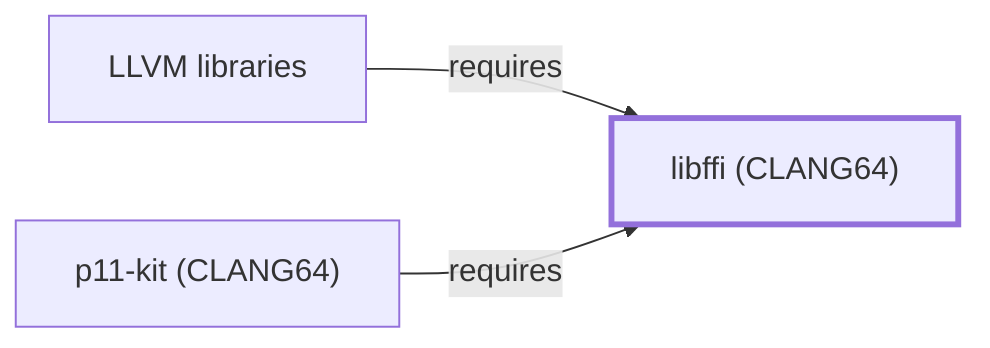

# libffi (CLANG64)

<!-- BEGIN GENERATED object-facts -->

| Model fact | Value |
| --- | --- |
| Object | `library:libffi:libffi@clang64` |
| Kind | `library` |
| Status | `partial` |
| Confidence | `high` |
| Authority | libffi project |
| Environments | `clang64` |
| Upstream | <https://sourceware.org/libffi> |
| Packaged as | `package:msys2:mingw-w64-clang-x86_64-libffi` |
| Version (observed) | 3.7.1-1 |
| License (observed) | spdx:MIT |
| Architecture (observed) | any |
| Installed size (observed) | 133.54 KiB |

**Evidence on this object**

- `evidence:catalog:current` — MSYS2 pacman package catalog (`observed`, retrieved 2026-08-05)
- `evidence:libffi:project-site-2026-07-30` — libffi (official project site) (`primary`, retrieved 2026-07-30)

Generated from the composed model by `tools/build_object_facts.py`. Observed values come from the catalog snapshot and change when it is refreshed.
Edits between the surrounding markers are overwritten on the next build.

<!-- END GENERATED object-facts -->

## Purpose

This page documents the **CLANG64-environment** libffi package
specifically — a portable, high-level foreign function interface (FFI)
library — depended on by [LLVM libraries](LLVM-LIBS.md), closing a
correction to that page's own Dependencies section, which had
incorrectly stated no `runtime-depends-on` edges existed for the
package. See the
[official libffi project site](https://sourceware.org/libffi) for the
full reference.

## Architectural Classification

`library:libffi:libffi@clang64` is packaged in the CLANG64 environment
as `package:msys2:mingw-w64-clang-x86_64-libffi` (version `3.7.1-1` in
the current catalog snapshot, license `MIT`, matching
[libffi (MSYS)'s](LIBFFI-MSYS.md#architectural-classification) own
recorded version) — a separately built, separate catalog entity from
[libffi (MSYS)](LIBFFI-MSYS.md)'s `libffi` package. This is the package
[LLVM libraries](LLVM-LIBS.md) — a CLANG64-native component itself —
actually depends on.

## Responsibilities

- Providing a foreign function interface (calling functions whose
  signature is determined at runtime rather than compile time),
  consumed by [LLVM libraries](LLVM-LIBS.md#dependencies) — most likely
  backing LLVM's own dynamic-symbol-resolution or JIT-adjacent
  infrastructure, though the exact internal LLVM subsystem consuming it
  was not directly confirmed while writing this page.

## Boundaries

libffi provides call-signature dispatch specifically; it does not
itself implement any LLVM-specific compilation or analysis logic — that
remains [LLVM libraries'](LLVM-LIBS.md) own responsibility, with libffi
serving only as a lower-level building block.

## Interfaces

- The libffi C API (`ffi_prep_cif`, `ffi_call`, and related functions),
  the same interface [libffi (MSYS)](LIBFFI-MSYS.md#interfaces)
  documents, per the documentation.

## Dependencies

The CLANG64 `package:msys2:mingw-w64-clang-x86_64-libffi` declares no
`runtime-depends-on` edges beyond standard toolchain runtime support.

## Reverse Dependencies

The catalog snapshot records 19 relationships targeting
`package:msys2:mingw-w64-clang-x86_64-libffi`. Two are now modeled in
this knowledge base: [LLVM libraries](LLVM-LIBS.md)
(`relationship:foundation-libraries:llvm-libs-requires-libffi-clang64`)
and [p11-kit (CLANG64)](P11-KIT-CLANG64.md)
(`relationship:foundation-libraries:p11-kit-clang64-requires-libffi-clang64`,
added 2026-08-02). The remaining ~17 recorded dependents (a broad mix
of CLANG64 packages including `glib2`, `gobject-introspection`,
`python`, `python-cffi`, `qemu`, and `ruby`) are not individually
modeled in this knowledge
base; see the
[reverse dependency impact analysis](REVERSE-DEPENDENCY-IMPACT-ANALYSIS.md)
for the current full list.

## Configuration

libffi has no persistent configuration file; call-interface descriptions
are constructed entirely through its C API by the calling program.

## Initialization and Execution Flow

As a library, libffi has no independent process lifecycle: it
initializes and executes within the process of whatever program links
against it — [LLVM libraries](LLVM-LIBS.md) in this dependency chain.
As a native MinGW-w64 library, this process model is Windows-facing
directly rather than mediated by `msys-2.0.dll`.

## Runtime Behavior

Identical functional behavior to [libffi (MSYS)](LIBFFI-MSYS.md); see
that page for detail not specific to the CLANG64/MSYS packaging
distinction.

## Compatibility and Variants

The CLANG64 and MSYS libffi packages are separately versioned catalog
entities (see Architectural Classification); code built against one is
not automatically compatible with the other without matching the
correct package/environment.

## Security Considerations

A foreign-function-interface library sits in a security-sensitive
position by nature, since it mediates calls into dynamically resolved
code; this page does not assert this specific package version's
robustness. See
[Threat Model and Supply Chain](THREAT-MODEL-AND-SUPPLY-CHAIN.md) for
the project's general supply-chain posture; no version-qualified CVE
review has been performed for the recorded `3.7.1-1` version.

## Failure Modes and Diagnostics

An LLVM-libraries failure traceable to a call-signature mismatch should
be checked against libffi's own diagnostics before being treated as an
LLVM defect; this page does not attempt a general diagnostic guide
given the unconfirmed exact internal consumer noted above.

## Evidence, Assumptions, and Open Questions

Foreign-function-interface scope is backed by the official libffi
project site (`evidence:libffi:project-site-2026-07-30`), the same
evidence record [libffi (MSYS)](LIBFFI-MSYS.md) cites. Package
identity, version, license, and the one modeled dependent edge are
backed by the pacman catalog snapshot (`evidence:catalog:current`).
Open: the exact internal LLVM subsystem consuming libffi was not
directly confirmed. Also explicitly out of scope for this page: the
~17 remaining recorded dependents not individually modeled, and
header-level API surface / PE import/export-level evidence, per the
[Library Family Classification](LIBRARY-FAMILY-CLASSIFICATION.md)
methodology.

<!-- BEGIN GENERATED dependency-subgraph -->

## Dependency Diagram

Dependencies and dependents of `library:libffi:libffi@clang64` in the composed graph: 2 dependents and 0 dependencies.

Generated from the composed model by `tools/build_object_diagrams.py`.
Edits between the surrounding markers are overwritten on the next build.

<!-- END GENERATED dependency-subgraph -->

## Related Objects

- [MSYS2 Library Architecture](LIBRARIES-ARCHITECTURE.md)
- [LLVM libraries](LLVM-LIBS.md)
- [libffi (MSYS)](LIBFFI-MSYS.md)
- [libffi (UCRT64)](LIBFFI-UCRT64.md)
- [p11-kit (CLANG64)](P11-KIT-CLANG64.md)
