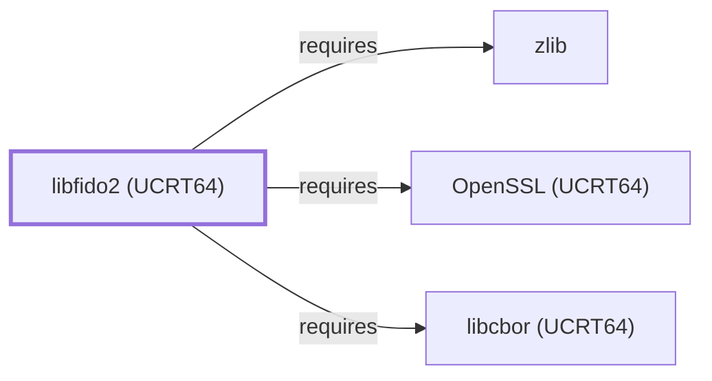

# libfido2 (UCRT64)

<!-- BEGIN GENERATED object-facts -->

| Model fact | Value |
| --- | --- |
| Object | `library:yubico:libfido2@ucrt64` |
| Kind | `library` |
| Status | `partial` |
| Confidence | `high` |
| Authority | Yubico |
| Environments | `ucrt64` |
| Upstream | <https://developers.yubico.com/libfido2/> |
| Packaged as | `package:msys2:mingw-w64-ucrt-x86_64-libfido2` |
| Version (observed) | 1.17.0-3 |
| License (observed) | BSD-2-Clause |
| Architecture (observed) | any |
| Installed size (observed) | 1.7 MB |

**Evidence on this object**

- `evidence:catalog:current` — MSYS2 pacman package catalog (`observed`, retrieved 2026-07-29)
- `evidence:yubico:libfido2-manual-2026-07-30` — libfido2 (official Yubico developer page) (`primary`, retrieved 2026-07-30)

Generated from the composed model by `tools/build_object_facts.py`. Observed values come from the catalog snapshot and change when it is refreshed.
Edits between the surrounding markers are overwritten on the next build.

<!-- END GENERATED object-facts -->

## Purpose

This page documents `package:msys2:mingw-w64-ucrt-x86_64-libfido2`,
the UCRT64-environment build of libfido2 — a library implementing the
FIDO2 and U2F protocols. This page closes a gap
[libfido2 (MSYS)](LIBFIDO2.md#architectural-classification) had
already flagged ("a separately packaged, native (UCRT64/CLANG64)
`libfido2` also exists in the catalog") but left unmodeled. See the
[official libfido2 developer page](https://developers.yubico.com/libfido2/)
for the full API reference.

## Architectural Classification

`library:yubico:libfido2@ucrt64` is packaged as
`package:msys2:mingw-w64-ucrt-x86_64-libfido2` (version `1.17.0-3` in
the current catalog snapshot, license `BSD-2-Clause`), authored by
Yubico — a separately built, separate catalog entity from
[libfido2 (MSYS)](LIBFIDO2.md)'s `libfido2` package. It belongs to the
UCRT64 environment.

## Responsibilities

- Communicating with FIDO2/U2F hardware security keys over USB and
  implementing the FIDO2/U2F protocols, the same functional role
  [libfido2 (MSYS)](LIBFIDO2.md#responsibilities) documents for its
  own environment's consumers, most notably OpenSSH's
  hardware-security-key-backed public-key authentication.

## Boundaries

This page's package serves UCRT64-environment consumers specifically;
[libfido2 (MSYS)](LIBFIDO2.md#reverse-dependencies) instead serves
MSYS-environment consumers — including [OpenSSH](OPENSSH.md), whose
own dependency is on the MSYS package — as a separate,
non-interchangeable catalog entity, the same distinction already drawn
throughout this volume for MSYS/UCRT64/CLANG64 sibling packages.

## Interfaces

- A C API for FIDO2/U2F device discovery, credential creation, and
  assertion (`fido_dev_open`, `fido_cred_*`, `fido_assert_*`, and
  related functions), the same interface
  [libfido2 (MSYS)](LIBFIDO2.md#interfaces) documents, per the
  documentation.

## Dependencies

The UCRT64 `package:msys2:mingw-w64-ucrt-x86_64-libfido2` declares
dependencies on [libcbor (UCRT64)](LIBCBOR-UCRT64.md) (a CBOR
binary-format parsing library used by the FIDO2 protocol's own data
encoding,
`relationship:foundation-libraries:libfido2-ucrt64-requires-libcbor-ucrt64`),
[OpenSSL (UCRT64)](OPENSSL-UCRT64.md) (backs FIDO2/U2F cryptographic
operations such as ECDSA/EdDSA signature verification and hashing,
`relationship:foundation-libraries:libfido2-ucrt64-requires-openssl-ucrt64`),
and [zlib](ZLIB.md) (`relationship:foundation-libraries:libfido2-ucrt64-requires-zlib-ucrt64`)
— the same three-library dependency set
[libfido2 (MSYS)](LIBFIDO2.md#dependencies) documents for its own
environment.

## Reverse Dependencies

The catalog snapshot records 1 relationship targeting
`package:msys2:mingw-w64-ucrt-x86_64-libfido2`: the separate
`package:msys2:mingw-w64-ucrt-x86_64-python-fido2` package, not
individually modeled in this knowledge base — unlike
[libfido2 (MSYS)](LIBFIDO2.md#reverse-dependencies), whose sole
functional dependent is [OpenSSH](OPENSSH.md).

## Configuration

libfido2 has no persistent configuration file of its own; hardware-key
interaction is driven entirely through its C API by the calling
program, the same model [libfido2 (MSYS)](LIBFIDO2.md#configuration)
documents.

## Initialization and Execution Flow

As a library, libfido2 has no independent process lifecycle: it
initializes and executes within the process of whatever program links
against it, communicating with a physical USB device at the time of a
FIDO2/U2F operation. As a native MinGW-w64 library, this process model
is Windows-facing directly rather than mediated by `msys-2.0.dll`.

## Runtime Behavior

Identical functional behavior to [libfido2 (MSYS)](LIBFIDO2.md#runtime-behavior);
see that page for detail not specific to the UCRT64 packaging
distinction.

## Compatibility and Variants

The UCRT64 and MSYS libfido2 packages are separately versioned catalog
entities (see Architectural Classification); code built against one is
not automatically compatible with the other without matching the
correct package/environment. Device support also varies by FIDO2/U2F
firmware version across different hardware keys, per the upstream
documentation.

## Security Considerations

FIDO2 hardware-key authentication is a documented strong-authentication
method, the same security property [libfido2 (MSYS)](LIBFIDO2.md#security-considerations)
documents. See [Threat Model and Supply Chain](THREAT-MODEL-AND-SUPPLY-CHAIN.md)
for the project's general supply-chain posture; no version-qualified
CVE review has been performed for the recorded `1.17.0-3` version.

## Failure Modes and Diagnostics

A FIDO2 operation failing to detect a device most commonly indicates a
USB connection, driver, or device-firmware compatibility issue rather
than a libfido2 defect, the same triage order
[libfido2 (MSYS)](LIBFIDO2.md#failure-modes-and-diagnostics) documents.

## Evidence, Assumptions, and Open Questions

FIDO2/U2F protocol implementation scope is backed by the official
libfido2 developer page (`evidence:yubico:libfido2-manual-2026-07-30`),
the same evidence record [libfido2 (MSYS)](LIBFIDO2.md) cites. Package
identity, version, license, and the recorded dependency/dependent
edges are backed by the pacman catalog snapshot
(`evidence:catalog:current`). Open, and explicitly out of scope for
this page: the `python-fido2` reverse dependent is not individually
modeled, and header-level API surface / PE import/export-level
evidence, per the
[Library Family Classification](LIBRARY-FAMILY-CLASSIFICATION.md)
methodology, also remain open.

<!-- BEGIN GENERATED dependency-subgraph -->

## Dependency Diagram

Dependencies and dependents of `library:yubico:libfido2@ucrt64` in the composed graph: 0 dependents and 3 dependencies.

Generated from the composed model by `tools/build_object_diagrams.py`.
Edits between the surrounding markers are overwritten on the next build.

<!-- END GENERATED dependency-subgraph -->

## Related Objects

- [MSYS2 Library Architecture](LIBRARIES-ARCHITECTURE.md)
- [libfido2 (MSYS)](LIBFIDO2.md)
- [libfido2 (CLANG64)](LIBFIDO2-CLANG64.md)
- [libcbor (UCRT64)](LIBCBOR-UCRT64.md)
- [OpenSSL (UCRT64)](OPENSSL-UCRT64.md)
- [zlib](ZLIB.md)
