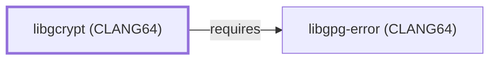

# libgcrypt (CLANG64)

<!-- BEGIN GENERATED object-facts -->

| Model fact | Value |
| --- | --- |
| Object | `library:gnupg:libgcrypt@clang64` |
| Kind | `library` |
| Status | `partial` |
| Confidence | `high` |
| Authority | GnuPG project |
| Environments | `clang64` |
| Upstream | <https://gnupg.org/software/libgcrypt/> |
| Packaged as | `package:msys2:mingw-w64-clang-x86_64-libgcrypt` |
| Version (observed) | 1.12.2-2 |
| License (observed) | LGPL |
| Architecture (observed) | any |
| Installed size (observed) | 4.7 MB |

**Evidence on this object**

- `evidence:catalog:current` — MSYS2 pacman package catalog (`observed`, retrieved 2026-07-29)
- `evidence:gnupg:libgcrypt-manual-2026-07-30` — libgcrypt (official project page) (`primary`, retrieved 2026-07-30)

Generated from the composed model by `tools/build_object_facts.py`. Observed values come from the catalog snapshot and change when it is refreshed.
Edits between the surrounding markers are overwritten on the next build.

<!-- END GENERATED object-facts -->

## Purpose

This page documents `package:msys2:mingw-w64-clang-x86_64-libgcrypt`,
the CLANG64-environment build of libgcrypt — GnuPG's own
general-purpose cryptographic library. Its sole non-boilerplate
dependency, [libgpg-error (CLANG64)](LIBGPG-ERROR-CLANG64.md), was
modeled earlier in this same batch. See the
[official libgcrypt project page](https://gnupg.org/software/libgcrypt/index.html)
for the API reference.

## Architectural Classification

`library:gnupg:libgcrypt@clang64` is packaged as
`package:msys2:mingw-w64-clang-x86_64-libgcrypt` (version `1.12.2-2`
in the current catalog snapshot, license `LGPL`) — a separately built,
separate catalog entity from [libgcrypt (UCRT64)](LIBGCRYPT.md) and
[libgcrypt (MSYS)](LIBGCRYPT-MSYS.md). It belongs to the CLANG64
environment. `package:msys2:mingw-w64-clang-x86_64-gnupg` is among
this package's own reverse dependents (see Reverse Dependencies) — a
distinct CLANG64-native GnuPG package from `component:gnupg:gnupg`,
this knowledge base's MSYS-packaged GnuPG entity, matching the same
package-identity distinction already drawn on
[libgcrypt (UCRT64)'s](LIBGCRYPT.md#purpose) own page.

## Responsibilities

- Providing symmetric and public-key cryptographic primitives (cipher
  algorithms, hash functions, random-number generation) for CLANG64-
  native GnuPG-family software, deliberately independent of
  [OpenSSL](OPENSSL.md), the same role
  [libgcrypt (UCRT64)](LIBGCRYPT.md#responsibilities) documents for its
  own environment.

## Boundaries

Libgcrypt implements OpenPGP-relevant cryptographic primitives; it is
not a TLS/X.509 library, the same boundary already drawn on
[libgcrypt (UCRT64)'s](LIBGCRYPT.md#boundaries) own page.

## Interfaces

- A C API for symmetric ciphers, hash functions, MACs, public-key
  operations, and cryptographically secure random-number generation,
  the same interface [libgcrypt (UCRT64)](LIBGCRYPT.md#interfaces)
  documents, per the documentation.

## Dependencies

The catalog snapshot records two `runtime-depends-on` edges for
`package:msys2:mingw-w64-clang-x86_64-libgcrypt`; the `cc-libs` C/C++
runtime row is excluded per this volume's boilerplate-dependency
policy, and the remaining one is modeled in this knowledge base:

| Dependency | Package | Architectural reason |
| --- | --- | --- |
| [libgpg-error (CLANG64)](LIBGPG-ERROR-CLANG64.md) | `package:msys2:mingw-w64-clang-x86_64-libgpg-error` | Backs shared error-code definitions used across the GnuPG project's own library stack. |

## Reverse Dependencies

The catalog snapshot records 19 relationships targeting
`package:msys2:mingw-w64-clang-x86_64-libgcrypt`: `abiword`,
`mingw-w64-clang-x86_64-gnupg` (a distinct CLANG64-native GnuPG
package, not this knowledge base's MSYS
`component:gnupg:gnupg` entity — see Architectural Classification),
`gtk-vnc`, `kwallet`, `libaacs`, `libotr`, `libsecret`, `libsidplayfp`,
`libvirt`, `libvncserver`, `qca-qt5`, `qca-qt6`, `rasqal`, `shishi`,
`srecord`, `totem-pl-parser`, `vlc`, `wireshark`, and `xmlsec`. None of
these nineteen are currently modeled as entities in this knowledge
base; see the
[reverse dependency impact analysis](REVERSE-DEPENDENCY-IMPACT-ANALYSIS.md)
for the current full list.

## Configuration

Libgcrypt has no persistent configuration file; algorithm and key-size
selection are made through its C API at the point of use by the
calling program.

## Initialization and Execution Flow

As a library, libgcrypt has no independent process lifecycle: it
initializes and executes within the process of whatever program links
against it. As a native MinGW-w64 library, this process model is
Windows-facing directly rather than mediated by `msys-2.0.dll`.

## Runtime Behavior

Identical functional behavior to
[libgcrypt (UCRT64)](LIBGCRYPT.md#runtime-behavior); see that page for
detail not specific to the CLANG64/UCRT64 packaging distinction.

## Compatibility and Variants

The CLANG64, UCRT64, and MSYS libgcrypt packages are three separately
versioned catalog entities (see Architectural Classification); code
built against one is not automatically compatible with another without
matching the correct package/environment.

## Security Considerations

As a cryptographic library in the GnuPG family, libgcrypt is itself
security-critical infrastructure for whatever program links against
this CLANG64 build. See
[Threat Model and Supply Chain](THREAT-MODEL-AND-SUPPLY-CHAIN.md) for
the project's general supply-chain posture; no version-qualified CVE
review has been performed for the recorded `1.12.2-2` version.

## Failure Modes and Diagnostics

Libgcrypt itself has no user-facing CLI; cryptographic operation
failures in a program linking against this CLANG64 build should be
checked against libgcrypt's own documented algorithm and key-size
support before being treated as a caller-specific defect.

## Evidence, Assumptions, and Open Questions

The cryptographic-primitives role is backed by the official libgcrypt
project page (`evidence:gnupg:libgcrypt-manual-2026-07-30`), the same
evidence record [libgcrypt (UCRT64)](LIBGCRYPT.md) cites. Package
identity, version, license, and the recorded dependency edge are
backed by the pacman catalog snapshot (`evidence:catalog:current`).
Open: the nineteen recorded reverse dependents are not individually
modeled in this knowledge base.

<!-- BEGIN GENERATED dependency-subgraph -->

## Dependency Diagram

Dependencies and dependents of `library:gnupg:libgcrypt@clang64` in the composed graph: 0 dependents and 1 dependency.

Generated from the composed model by `tools/build_object_diagrams.py`.
Edits between the surrounding markers are overwritten on the next build.

<!-- END GENERATED dependency-subgraph -->

## Related Objects

- [MSYS2 Library Architecture](LIBRARIES-ARCHITECTURE.md)
- [libgcrypt (UCRT64)](LIBGCRYPT.md)
- [libgcrypt (MSYS)](LIBGCRYPT-MSYS.md)
- [libgpg-error (CLANG64)](LIBGPG-ERROR-CLANG64.md)
