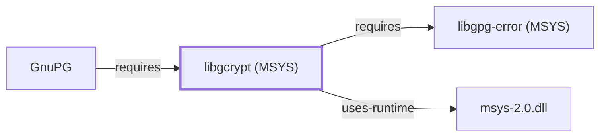

# libgcrypt (MSYS)

<!-- BEGIN GENERATED object-facts -->

| Model fact | Value |
| --- | --- |
| Object | `library:gnupg:libgcrypt@msys` |
| Kind | `library` |
| Status | `partial` |
| Confidence | `high` |
| Authority | GnuPG project |
| Environments | `msys` |
| Upstream | <https://gnupg.org> |
| Packaged as | `package:msys2:libgcrypt` |
| Version (observed) | 1.12.2-1 |
| License (observed) | LGPL |
| Architecture (observed) | x86_64 |
| Installed size (observed) | 1172.52 KiB |

**Evidence on this object**

- `evidence:catalog:current` — MSYS2 pacman package catalog (`observed`, retrieved 2026-08-05)
- `evidence:gnupg:libgcrypt-manual-2026-07-30` — libgcrypt (official project page) (`primary`, retrieved 2026-07-30)

Generated from the composed model by `tools/build_object_facts.py`. Observed values come from the catalog snapshot and change when it is refreshed.
Edits between the surrounding markers are overwritten on the next build.

<!-- END GENERATED object-facts -->

## Purpose

This page documents the **MSYS-environment** `libgcrypt` package
specifically — GnuPG's own general-purpose cryptographic library — as a
correction: [GNUPG.md](GNUPG.md) and [libgcrypt (UCRT64)](LIBGCRYPT.md)
originally recorded `component:gnupg:gnupg`'s `requires` edge as pointing
to the UCRT64-packaged `libgcrypt`
(`package:msys2:mingw-w64-ucrt-x86_64-libgcrypt`), but
`package:msys2:gnupg` is itself an MSYS-environment package whose actual
catalog-recorded dependency is `package:msys2:libgcrypt` — a separately
versioned, separate catalog entity. This page documents that correct
target; see the
[official libgcrypt project page](https://gnupg.org/software/libgcrypt/index.html)
for the API reference shared with the UCRT64 package.

## Architectural Classification

`library:gnupg:libgcrypt@msys` is packaged in the MSYS environment as
`package:msys2:libgcrypt` (version `1.12.2-1` in the current catalog
snapshot) — a different version from the UCRT64 sibling's `1.12.2-2`
documented on [libgcrypt (UCRT64)](LIBGCRYPT.md). This is the package
[GnuPG](GNUPG.md#architectural-classification), an MSYS-environment
component itself, actually depends on.

## Responsibilities

- Providing symmetric and public-key cryptographic primitives for
  [GnuPG's](GNUPG.md) MSYS-packaged build, the same functional role
  [libgcrypt (UCRT64)](LIBGCRYPT.md) documents for the UCRT64 packaging
  context, deliberately independent of [OpenSSL](OPENSSL.md).

## Boundaries

Functionally identical in scope to [libgcrypt (UCRT64)](LIBGCRYPT.md) —
this page exists specifically to document the correct MSYS-packaged
catalog entity that GnuPG's own MSYS build depends on, not a different
library role.

## Interfaces

Identical API surface to [libgcrypt (UCRT64)](LIBGCRYPT.md); see that
page for interface details, since both packages share the same upstream
project and API.

## Dependencies

The catalog snapshot records one `runtime-depends-on` edge for
`package:msys2:libgcrypt`: `package:msys2:libgpg-error`, documented on
[libgpg-error (MSYS)](LIBGPG-ERROR-MSYS.md)
(`relationship:foundation-libraries:libgcrypt-msys-requires-libgpg-error-msys`)
— the same dependency structure [libgcrypt (UCRT64)](LIBGCRYPT.md)'s own
package has onto its UCRT64 `libgpg-error` sibling, but staying within
the MSYS environment throughout rather than crossing into UCRT64.

## Reverse Dependencies

The catalog snapshot records 4 relationships targeting
`package:msys2:libgcrypt`: `package:msys2:gnupg`
(`relationship:ssh-curl-git:gnupg-requires-libgcrypt` in this knowledge
base's graph, corrected 2026-07-30 to point here instead of the UCRT64
package), `package:msys2:elinks`, its own `-devel` subpackage, and
`package:msys2:libxslt`.

## Configuration

No persistent configuration file; identical to
[libgcrypt (UCRT64)](LIBGCRYPT.md) in this respect.

## Initialization and Execution Flow

As a library, this package has no independent process lifecycle: it
initializes and executes within the process of whatever program links
against it — [GnuPG](GNUPG.md) in this dependency chain. As an
MSYS-dependent library, this is adapted from POSIX semantics onto Windows
process primitives by `msys-2.0.dll` per
[MSYS Runtime Initialization](MSYS-RUNTIME-INITIALIZATION.md), unlike the
UCRT64 sibling, which does not depend on `msys-2.0.dll`.

## Runtime Behavior

Identical functional behavior to [libgcrypt (UCRT64)](LIBGCRYPT.md);
see that page for detail not specific to the MSYS/UCRT64 packaging
distinction.

## Compatibility and Variants

This is the correction record for the MSYS/UCRT64 packaging distinction
itself: the two `libgcrypt` packages are separately versioned catalog
entities (`1.12.2-1` MSYS vs. `1.12.2-2` UCRT64) and not interchangeable
at the binary level, even though both trace to the same upstream project
and version line.

## Security Considerations

Identical security posture to [libgcrypt (UCRT64)](LIBGCRYPT.md); see
that page. No version-qualified CVE review has been performed for the
recorded `1.12.2-1` version specifically.

## Failure Modes and Diagnostics

Identical to [libgcrypt (UCRT64)](LIBGCRYPT.md); GnuPG's cryptographic
operation failures should be checked against this MSYS package's
behavior specifically, not the UCRT64 sibling's, since GnuPG links
against this one.

## Evidence, Assumptions, and Open Questions

The cryptographic-primitives role is backed by the official libgcrypt
project page (`evidence:gnupg:libgcrypt-manual-2026-07-30`), the same
evidence record [libgcrypt (UCRT64)](LIBGCRYPT.md) cites, since both
packages share the same upstream documentation. Package identity,
version, and the recorded dependency/dependent edges (including the
2026-07-30 correction to `relationship:ssh-curl-git:gnupg-requires-libgcrypt`)
are backed by the pacman catalog snapshot (`evidence:catalog:current`).

<!-- BEGIN GENERATED dependency-subgraph -->

## Dependency Diagram

Dependencies and dependents of `library:gnupg:libgcrypt@msys` in the composed graph: 1 dependent and 2 dependencies.

Generated from the composed model by `tools/build_object_diagrams.py`.
Edits between the surrounding markers are overwritten on the next build.

<!-- END GENERATED dependency-subgraph -->

## Related Objects

- [MSYS2 Library Architecture](LIBRARIES-ARCHITECTURE.md)
- [GnuPG](GNUPG.md)
- [libgcrypt (UCRT64)](LIBGCRYPT.md)
- [libgpg-error (MSYS)](LIBGPG-ERROR-MSYS.md)
