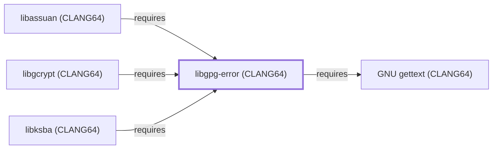

# libgpg-error (CLANG64)

<!-- BEGIN GENERATED object-facts -->

| Model fact | Value |
| --- | --- |
| Object | `library:gnupg:libgpg-error@clang64` |
| Kind | `library` |
| Status | `partial` |
| Confidence | `high` |
| Authority | GnuPG project |
| Environments | `clang64` |
| Upstream | <https://gnupg.org/software/libgpg-error/> |
| Packaged as | `package:msys2:mingw-w64-clang-x86_64-libgpg-error` |
| Version (observed) | 1.61-1 |
| License (observed) | spdx:LGPL-2.1-or-later |
| Architecture (observed) | any |
| Installed size (observed) | 1640.40 KiB |

**Evidence on this object**

- `evidence:catalog:current` — MSYS2 pacman package catalog (`observed`, retrieved 2026-08-05)
- `evidence:gnupg:libgpg-error-manual-2026-07-30` — GnuPG project site (libgpg-error) (`primary`, retrieved 2026-07-30)

Generated from the composed model by `tools/build_object_facts.py`. Observed values come from the catalog snapshot and change when it is refreshed.
Edits between the surrounding markers are overwritten on the next build.

<!-- END GENERATED object-facts -->

## Purpose

This page documents `package:msys2:mingw-w64-clang-x86_64-libgpg-error`,
the CLANG64-environment build of libgpg-error — a shared set of
error-code definitions used across the GnuPG project's library stack.
It is the base of a four-entity GnuPG crypto-stack chain modeled in
this batch (this page →
{[libgcrypt (CLANG64)](LIBGCRYPT-CLANG64.md),
[libassuan (CLANG64)](LIBASSUAN-CLANG64.md),
[libksba (CLANG64)](LIBKSBA-CLANG64.md)}), reusing
[GNU gettext (CLANG64)](GNU-GETTEXT-CLANG64.md) modeled earlier this
session. See the [GnuPG project site](https://gnupg.org) for
background.

## Architectural Classification

`library:gnupg:libgpg-error@clang64` is packaged as
`package:msys2:mingw-w64-clang-x86_64-libgpg-error` (version `1.61-1`
in the current catalog snapshot, license `LGPL-2.1-or-later`) — a
separately built, separate catalog entity from
[libgpg-error (UCRT64)](LIBGPG-ERROR.md) and
[libgpg-error (MSYS)](LIBGPG-ERROR-MSYS.md). It belongs to the CLANG64
environment. Its sole non-boilerplate runtime dependency,
[GNU gettext (CLANG64)](GNU-GETTEXT-CLANG64.md), was already a modeled
entity in this knowledge base, letting this addition close its full
dependency footprint in a single pass.

## Responsibilities

- Defining a shared error-code enumeration and basic string/locale
  utilities consumed by [libgcrypt (CLANG64)](LIBGCRYPT-CLANG64.md),
  [libassuan (CLANG64)](LIBASSUAN-CLANG64.md), and
  [libksba (CLANG64)](LIBKSBA-CLANG64.md), the same foundational role
  [libgpg-error (UCRT64)](LIBGPG-ERROR.md#responsibilities) documents
  for its own environment.

## Boundaries

Libgpg-error provides error-code plumbing only; it implements no
cryptography, IPC, or certificate parsing itself — those are
[libgcrypt (CLANG64)](LIBGCRYPT-CLANG64.md)'s,
[libassuan (CLANG64)](LIBASSUAN-CLANG64.md)'s, and
[libksba (CLANG64)](LIBKSBA-CLANG64.md)'s respective responsibilities,
all three of which depend on this library.

## Interfaces

- A C API for error-code creation, inspection, and human-readable
  string conversion (`gpg_strerror`), the same interface
  [libgpg-error (UCRT64)](LIBGPG-ERROR.md#interfaces) documents, per
  the documentation.

## Dependencies

The catalog snapshot records two `runtime-depends-on` edges for
`package:msys2:mingw-w64-clang-x86_64-libgpg-error`; the `cc-libs`
C/C++ runtime row is excluded per this volume's boilerplate-dependency
policy, and the remaining one is modeled in this knowledge base:

| Dependency | Package | Architectural reason |
| --- | --- | --- |
| [GNU gettext (CLANG64)](GNU-GETTEXT-CLANG64.md) | `package:msys2:mingw-w64-clang-x86_64-gettext-runtime` | Backs gettext-based message translation (NLS) for libgpg-error's own diagnostic output. |

## Reverse Dependencies

The catalog snapshot records 8 relationships targeting
`package:msys2:mingw-w64-clang-x86_64-libgpg-error`. Three are now
modeled in this knowledge base:
[libgcrypt (CLANG64)](LIBGCRYPT-CLANG64.md)
(`relationship:foundation-libraries:libgcrypt-clang64-requires-libgpg-error-clang64`,
added 2026-08-02), [libassuan (CLANG64)](LIBASSUAN-CLANG64.md)
(`relationship:foundation-libraries:libassuan-clang64-requires-libgpg-error-clang64`,
added 2026-08-02), and [libksba (CLANG64)](LIBKSBA-CLANG64.md)
(`relationship:foundation-libraries:libksba-clang64-requires-libgpg-error-clang64`,
added 2026-08-02). The remaining recorded dependents (`gpgme`,
`gtk-vnc`, `libbdplus`, `libvirt`, `shishi`) are not individually
modeled in this knowledge base; see the
[reverse dependency impact analysis](REVERSE-DEPENDENCY-IMPACT-ANALYSIS.md)
for the current full list.

## Configuration

Libgpg-error has no persistent configuration file; its behavior is
determined entirely by the error codes its dependents pass through its
API.

## Initialization and Execution Flow

As a library, libgpg-error has no independent process lifecycle: it
initializes and executes within the process of whatever program links
against it (directly or, more commonly, transitively through
[libgcrypt (CLANG64)](LIBGCRYPT-CLANG64.md),
[libassuan (CLANG64)](LIBASSUAN-CLANG64.md), or
[libksba (CLANG64)](LIBKSBA-CLANG64.md)). As a native MinGW-w64
library, this process model is Windows-facing directly rather than
mediated by `msys-2.0.dll`.

## Runtime Behavior

Identical functional behavior to
[libgpg-error (UCRT64)](LIBGPG-ERROR.md#runtime-behavior); see that
page for detail not specific to the CLANG64/UCRT64 packaging
distinction.

## Compatibility and Variants

The CLANG64, UCRT64, and MSYS libgpg-error packages are three
separately versioned catalog entities (see Architectural
Classification); code built against one is not automatically
compatible with another without matching the correct
package/environment.

## Security Considerations

No libgpg-error-specific vulnerability review has been performed for
this volume; see [Threat Model and Supply Chain](THREAT-MODEL-AND-SUPPLY-CHAIN.md)
for the project's general supply-chain posture. No version-qualified
CVE review has been performed for the recorded `1.61-1` version.

## Failure Modes and Diagnostics

Libgpg-error itself has no user-facing CLI; error codes surfaced by a
dependent library can be looked up against this library's error-code
enumeration when diagnosing an unfamiliar error message.

## Evidence, Assumptions, and Open Questions

The shared error-code role is backed by the official GnuPG project
site (`evidence:gnupg:libgpg-error-manual-2026-07-30`), the same
evidence record [libgpg-error (UCRT64)](LIBGPG-ERROR.md) cites.
Package identity, version, license, and the recorded dependency edge
are backed by the pacman catalog snapshot (`evidence:catalog:current`).
Open: the five remaining recorded reverse dependents are not
individually modeled in this knowledge base.

<!-- BEGIN GENERATED dependency-subgraph -->

## Dependency Diagram

Dependencies and dependents of `library:gnupg:libgpg-error@clang64` in the composed graph: 3 dependents and 1 dependency.

Generated from the composed model by `tools/build_object_diagrams.py`.
Edits between the surrounding markers are overwritten on the next build.

<!-- END GENERATED dependency-subgraph -->

## Related Objects

- [MSYS2 Library Architecture](LIBRARIES-ARCHITECTURE.md)
- [libgpg-error (UCRT64)](LIBGPG-ERROR.md)
- [libgpg-error (MSYS)](LIBGPG-ERROR-MSYS.md)
- [libgcrypt (CLANG64)](LIBGCRYPT-CLANG64.md)
- [libassuan (CLANG64)](LIBASSUAN-CLANG64.md)
- [libksba (CLANG64)](LIBKSBA-CLANG64.md)
- [GNU gettext (CLANG64)](GNU-GETTEXT-CLANG64.md)
