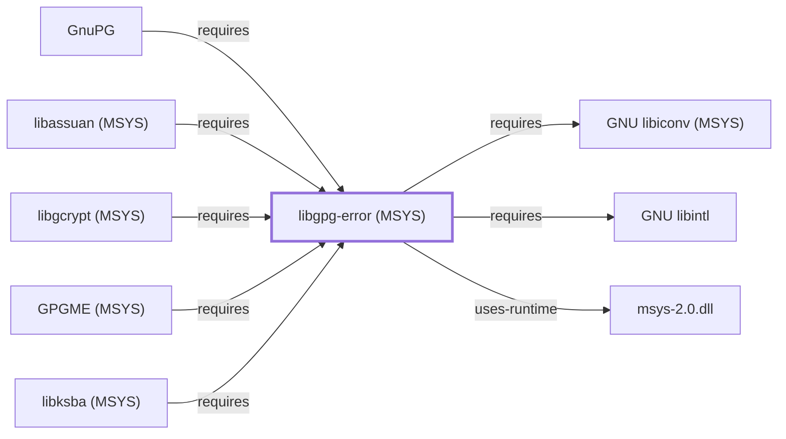

# libgpg-error (MSYS)

## Purpose

This page documents the **MSYS-environment** `libgpg-error` package
specifically — the shared error-code vocabulary used across the GnuPG
project's own library stack — discovered while correcting
[GnuPG's](GNUPG.md) other MSYS crypto-stack dependencies
([libgcrypt (MSYS)](LIBGCRYPT-MSYS.md),
[libassuan (MSYS)](LIBASSUAN-MSYS.md),
[libksba (MSYS)](LIBKSBA-MSYS.md)), each of which depends on this MSYS
package rather than the UCRT64 sibling
[libgpg-error (UCRT64)](LIBGPG-ERROR.md) documents. Unlike its three
dependents, no direct `component:gnupg:gnupg` requires edge needed
correcting here — the catalog does not record `package:msys2:gnupg`
depending on `libgpg-error` directly, only transitively through
libgcrypt/libassuan/libksba. See the
[official GnuPG project site](https://gnupg.org) for background shared
with the UCRT64 package.

## Architectural Classification

`library:gnupg:libgpg-error@msys` is packaged in the MSYS environment as
`package:msys2:libgpg-error` (version `1.61-1` in the current catalog
snapshot) — the same version number as the UCRT64 sibling documented on
[libgpg-error (UCRT64)](LIBGPG-ERROR.md), but a separately built,
separate catalog entity.

## Responsibilities

- Defining a shared error-code enumeration consumed by
  [libgcrypt (MSYS)](LIBGCRYPT-MSYS.md),
  [libassuan (MSYS)](LIBASSUAN-MSYS.md), and
  [libksba (MSYS)](LIBKSBA-MSYS.md) — the same functional role
  [libgpg-error (UCRT64)](LIBGPG-ERROR.md) documents for the UCRT64
  packaging context.

## Boundaries

Functionally identical in scope to [libgpg-error (UCRT64)](LIBGPG-ERROR.md)
— this page exists specifically to document the correct MSYS-packaged
catalog entity that GnuPG's other MSYS crypto-stack libraries actually
depend on.

## Interfaces

Identical API surface to [libgpg-error (UCRT64)](LIBGPG-ERROR.md); see
that page for interface details, since both packages share the same
upstream project.

## Dependencies

The catalog snapshot records two `runtime-depends-on` edges for
`package:msys2:libgpg-error`:
[GNU libiconv (MSYS)](GNU-LIBICONV-MSYS.md) (`package:msys2:libiconv`,
`relationship:foundation-libraries:libgpg-error-msys-requires-libiconv-msys`)
and [GNU libintl](GNU-LIBINTL.md) (`package:msys2:libintl`) — both
MSYS-environment sibling packages backing character-set conversion and
localized error-string output respectively
(`relationship:foundation-libraries:libgpg-error-msys-requires-libintl`),
a different sub-dependency pair from
[libgpg-error (UCRT64)](LIBGPG-ERROR.md)'s own `gettext-runtime`
dependency.

## Reverse Dependencies

The catalog snapshot records 6 relationships targeting
`package:msys2:libgpg-error`: `package:msys2:gnupg`
(`relationship:ssh-curl-git:gnupg-requires-libgpg-error-msys`, added
2026-07-30 — a direct catalog dependency, alongside GnuPG's own
transitive requirement flowing through the three libraries above),
`package:msys2:libassuan`
(`relationship:foundation-libraries:libassuan-msys-requires-libgpg-error-msys`),
`package:msys2:libgcrypt`
(`relationship:foundation-libraries:libgcrypt-msys-requires-libgpg-error-msys`),
[GPGME (MSYS)](LIBGPGME-MSYS.md)
(`relationship:foundation-libraries:libgpgme-requires-libgpg-error`,
added 2026-08-02), `package:msys2:libksba`
(`relationship:foundation-libraries:libksba-msys-requires-libgpg-error-msys`),
and `package:msys2:pinentry`.

## Configuration

No persistent configuration file; identical to
[libgpg-error (UCRT64)](LIBGPG-ERROR.md) in this respect.

## Initialization and Execution Flow

As a library, this package has no independent process lifecycle: it
initializes and executes within the process of whatever program links
against it, directly or (more commonly) transitively through
[libgcrypt (MSYS)](LIBGCRYPT-MSYS.md),
[libassuan (MSYS)](LIBASSUAN-MSYS.md), or
[libksba (MSYS)](LIBKSBA-MSYS.md). As an MSYS-dependent library, this is
adapted from POSIX semantics onto Windows process primitives by
`msys-2.0.dll` per
[MSYS Runtime Initialization](MSYS-RUNTIME-INITIALIZATION.md), unlike the
UCRT64 sibling, which does not depend on `msys-2.0.dll`.

## Runtime Behavior

Identical functional behavior to [libgpg-error (UCRT64)](LIBGPG-ERROR.md);
see that page for detail not specific to the MSYS/UCRT64 packaging
distinction.

## Compatibility and Variants

This is the correction record for the MSYS/UCRT64 packaging distinction
itself: the two `libgpg-error` packages share the same version (`1.61-1`)
but are separately built, separate catalog entities with different
sub-dependency structures and are not interchangeable at the binary
level.

## Security Considerations

No libgpg-error-specific vulnerability review has been performed for
this package; see
[Threat Model and Supply Chain](THREAT-MODEL-AND-SUPPLY-CHAIN.md) for the
project's general supply-chain posture.

## Failure Modes and Diagnostics

Identical to [libgpg-error (UCRT64)](LIBGPG-ERROR.md); error codes
surfaced by [GnuPG](GNUPG.md) or its MSYS-packaged dependent libraries
trace back to this package specifically, not the UCRT64 sibling.

## Evidence, Assumptions, and Open Questions

The shared error-code role is backed by the official GnuPG project site
(`evidence:gnupg:libgpg-error-manual-2026-07-30`), the same evidence
record [libgpg-error (UCRT64)](LIBGPG-ERROR.md) cites. Package identity,
version, and the recorded dependency/dependent edges are backed by the
pacman catalog snapshot (`evidence:catalog:current`).

<!-- BEGIN GENERATED dependency-subgraph -->

## Dependency Diagram

Dependencies and dependents of `library:gnupg:libgpg-error@msys` in the composed graph: 5 dependents and 3 dependencies.

Generated from the composed model by `tools/build_object_diagrams.py`.
Edits between the surrounding markers are overwritten on the next build.

<!-- END GENERATED dependency-subgraph -->

## Related Objects

- [MSYS2 Library Architecture](LIBRARIES-ARCHITECTURE.md)
- [GnuPG](GNUPG.md)
- [libgpg-error (UCRT64)](LIBGPG-ERROR.md)
- [libgcrypt (MSYS)](LIBGCRYPT-MSYS.md)
- [libassuan (MSYS)](LIBASSUAN-MSYS.md)
- [libksba (MSYS)](LIBKSBA-MSYS.md)
- [GNU libintl](GNU-LIBINTL.md)
- [GPGME (MSYS)](LIBGPGME-MSYS.md)
- [GNU libiconv (MSYS)](GNU-LIBICONV-MSYS.md)
