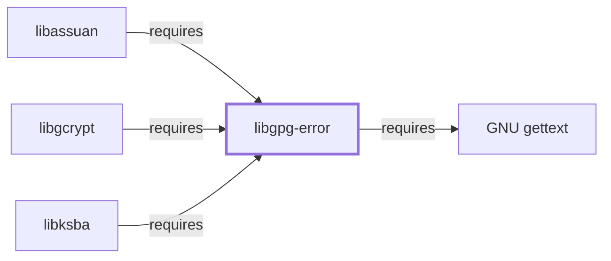

# libgpg-error

<!-- BEGIN GENERATED object-facts -->

| Model fact | Value |
| --- | --- |
| Object | `library:gnupg:libgpg-error` |
| Kind | `library` |
| Status | `partial` |
| Confidence | `high` |
| Authority | GnuPG project |
| Environments | `ucrt64` |
| Upstream | <https://gnupg.org> |
| Packaged as | `package:msys2:mingw-w64-ucrt-x86_64-libgpg-error` |
| Version (observed) | 1.61-1 |
| License (observed) | spdx:LGPL-2.1-or-later |
| Architecture (observed) | any |
| Installed size (observed) | 1.7 MB |

**Evidence on this object**

- `evidence:catalog:current` — MSYS2 pacman package catalog (`observed`, retrieved 2026-07-29)
- `evidence:gnupg:libgpg-error-manual-2026-07-30` — GnuPG project site (libgpg-error) (`primary`, retrieved 2026-07-30)

Generated from the composed model by `tools/build_object_facts.py`. Observed values come from the catalog snapshot and change when it is refreshed.
Edits between the surrounding markers are overwritten on the next build.

<!-- END GENERATED object-facts -->

## Purpose

Libgpg-error provides a shared set of error-code definitions used across
the entire GnuPG project's library stack, so [libgcrypt](LIBGCRYPT.md),
[libassuan](LIBASSUAN.md), and [libksba](LIBKSBA.md) all report failures
through one consistent error-code vocabulary rather than each defining
their own. This page documents its foundational role; see the
[GnuPG project site](https://gnupg.org) for background.

## Architectural Classification

`library:gnupg:libgpg-error` is packaged per native environment: this
page cites the UCRT64 build,
`package:msys2:mingw-w64-ucrt-x86_64-libgpg-error` (version `1.61-1` in
the current catalog snapshot, license `LGPL-2.1-or-later`).

## Responsibilities

- Defining a shared error-code enumeration and basic string/locale
  utilities consumed by the rest of the GnuPG library ecosystem, avoiding
  each library inventing its own incompatible error representation.

## Boundaries

Libgpg-error provides error-code plumbing only; it implements no
cryptography, IPC, or certificate parsing itself — those are
[libgcrypt](LIBGCRYPT.md)'s, [libassuan](LIBASSUAN.md)'s, and
[libksba](LIBKSBA.md)'s respective responsibilities, all three of which
depend on this library.

## Interfaces

- A C API for error-code creation, inspection, and human-readable string
  conversion (`gpg_strerror`), consumed internally by its dependents
  rather than typically used directly by application code.

## Dependencies

The catalog snapshot records two `runtime-depends-on` edges for
`package:msys2:mingw-w64-ucrt-x86_64-libgpg-error`:
`mingw-w64-ucrt-x86_64-cc-libs` (low-level compiler runtime support) and
`mingw-w64-ucrt-x86_64-gettext-runtime` (backing localized error-string
output, documented fully in [GNU gettext](GNU-GETTEXT.md)). The gettext
edge is now modeled in this knowledge base
(`relationship:foundation-libraries:libgpg-error-requires-gettext`,
added 2026-07-30 — this page's own prose had named it without a
corresponding graph edge).

## Reverse Dependencies

The snapshot records 8 relationships targeting
`package:msys2:mingw-w64-ucrt-x86_64-libgpg-error`, including
[libgcrypt](LIBGCRYPT.md#dependencies), [libassuan](LIBASSUAN.md#dependencies),
and [libksba](LIBKSBA.md#dependencies). See the
[reverse dependency impact analysis](REVERSE-DEPENDENCY-IMPACT-ANALYSIS.md)
for the current full list.

## Configuration

Libgpg-error has no persistent configuration file; its behavior is
determined entirely by the error codes its dependents pass through its
API.

## Initialization and Execution Flow

As a library, libgpg-error has no independent process lifecycle: it
initializes and executes within the process of whatever program links
against it (directly or, more commonly, transitively through
[libgcrypt](LIBGCRYPT.md), [libassuan](LIBASSUAN.md), or
[libksba](LIBKSBA.md)).

## Runtime Behavior

Because this library is a shared dependency across the GnuPG stack, its
error-code vocabulary is what [GnuPG](GNUPG.md)'s own error reporting
ultimately traces back to, even when a user-facing GnuPG error message
originates in one of the higher-level libraries.

## Compatibility and Variants

Error-code stability across libgpg-error versions is a documented design
goal (existing codes are not renumbered), since so many other libraries
depend on a consistent numbering; this page does not restate the
project's own versioning policy in detail.

## Security Considerations

No libgpg-error-specific vulnerability review has been performed for this
volume; see [Threat Model and Supply Chain](THREAT-MODEL-AND-SUPPLY-CHAIN.md)
for the project's general supply-chain posture. No version-qualified CVE
review has been performed for the recorded `1.61-1` version.

## Failure Modes and Diagnostics

Libgpg-error itself has no user-facing CLI; error codes surfaced by
[GnuPG](GNUPG.md) or its dependent libraries can be looked up against this
library's error-code enumeration when diagnosing an unfamiliar error
message.

## Evidence, Assumptions, and Open Questions

The shared error-code role is backed by the official GnuPG project site
(`evidence:gnupg:libgpg-error-manual-2026-07-30`), matching the
`project_url` already recorded for
`package:msys2:mingw-w64-ucrt-x86_64-libgpg-error` in the catalog.
Package identity, version, license, and both dependency edges are backed
by the pacman catalog snapshot (`evidence:catalog:current`). Open, and
explicitly out of scope for this page: header-level API surface and PE
import/export-level evidence, per the
[Library Family Classification](LIBRARY-FAMILY-CLASSIFICATION.md)
methodology.

<!-- BEGIN GENERATED dependency-subgraph -->

## Dependency Diagram

Dependencies and dependents of `library:gnupg:libgpg-error` in the composed graph: 3 dependents and 1 dependency.

Generated from the composed model by `tools/build_object_diagrams.py`.
Edits between the surrounding markers are overwritten on the next build.

<!-- END GENERATED dependency-subgraph -->

## Related Objects

- [MSYS2 Library Architecture](LIBRARIES-ARCHITECTURE.md)
- [libgcrypt](LIBGCRYPT.md)
- [libassuan](LIBASSUAN.md)
- [libksba](LIBKSBA.md)
- [GnuPG](GNUPG.md)
