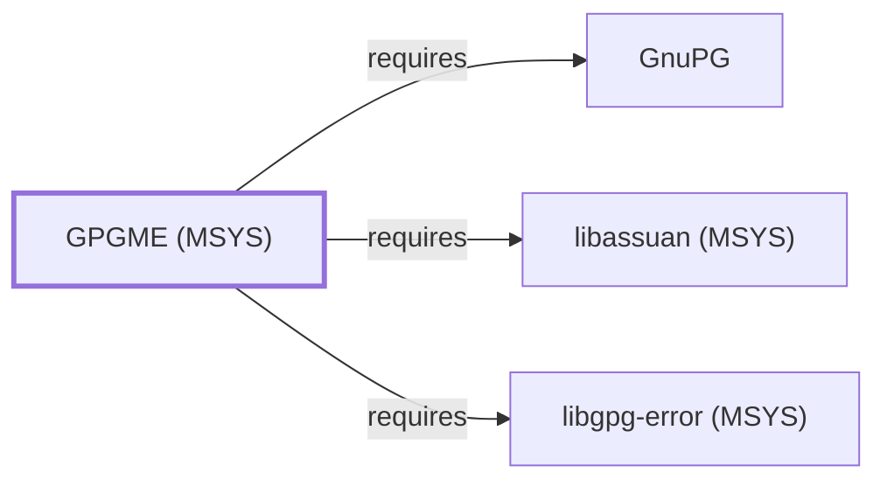

# GPGME (MSYS)

<!-- BEGIN GENERATED object-facts -->

| Model fact | Value |
| --- | --- |
| Object | `library:gnupg:libgpgme@msys` |
| Kind | `library` |
| Status | `partial` |
| Confidence | `high` |
| Authority | GnuPG project |
| Environments | `msys` |
| Upstream | <https://gnupg.org/related_software/gpgme/> |
| Packaged as | `package:msys2:libgpgme` |
| Version (observed) | 2.0.1-1 |
| License (observed) | LGPL |
| Architecture (observed) | x86_64 |
| Installed size (observed) | 586.15 KiB |

**Evidence on this object**

- `evidence:catalog:current` — MSYS2 pacman package catalog (`observed`, retrieved 2026-08-05)
- `evidence:gnupg:gpgme-manual-2026-08-02` — GPGME (official project page) (`primary`, retrieved 2026-08-02)

Generated from the composed model by `tools/build_object_facts.py`. Observed values come from the catalog snapshot and change when it is refreshed.
Edits between the surrounding markers are overwritten on the next build.

<!-- END GENERATED object-facts -->

## Purpose

This page documents `package:msys2:libgpgme`, GnuPG Made Easy (GPGME) —
a high-level library wrapping GnuPG's own OpenPGP/CMS engines behind a
simpler, protocol-agnostic API. GPGME was already cited as an unmodeled
reverse dependent on both
[libassuan (MSYS)'s](LIBASSUAN-MSYS.md#reverse-dependencies) and
[libgpg-error (MSYS)'s](LIBGPG-ERROR-MSYS.md#reverse-dependencies) own
pages before this page or a corresponding entity existed. See the
[official GPGME project page](https://gnupg.org/related_software/gpgme/)
for the full reference.

## Architectural Classification

`library:gnupg:libgpgme@msys` is packaged as `package:msys2:libgpgme`
(version `2.0.1-1` in the current catalog snapshot, license `LGPL`),
part of the GnuPG project. It belongs to the MSYS environment. All
three of its own recorded runtime dependencies were already modeled
entities in this knowledge base before this page was written, letting
this addition close its full dependency footprint in a single pass —
the same full-coverage pattern documented for
[libsasl (MSYS)](LIBSASL-MSYS.md) and [Serf](LIBSERF-MSYS.md).

## Responsibilities

- Providing a high-level, protocol-agnostic C API over GnuPG's own
  OpenPGP and CMS/S-MIME engines, letting consuming programs perform
  encryption, signing, and verification without directly managing
  GnuPG's process-spawning and Assuan-protocol details themselves.

## Boundaries

GPGME is a wrapper library specifically; it does not itself implement
cryptographic protocol logic — that responsibility belongs entirely to
the [GnuPG](GNUPG.md) engine processes it launches and communicates
with, matching the layered-wrapper pattern already documented for
other GnuPG-family dependents in this volume.

## Interfaces

- The GPGME C API (`gpgme_op_encrypt`, `gpgme_op_verify`,
  `gpgme_op_sign`, and related functions), per the project
  documentation.

## Dependencies

The catalog snapshot records three `runtime-depends-on` edges for
`package:msys2:libgpgme`, all now modeled in this knowledge base:

| Dependency | Package | Architectural reason |
| --- | --- | --- |
| [GnuPG](GNUPG.md) | `package:msys2:gnupg` | GPGME wraps and delegates to GnuPG's own OpenPGP/CMS engines rather than reimplementing cryptographic protocol logic itself. |
| [libassuan (MSYS)](LIBASSUAN-MSYS.md) | `package:msys2:libassuan` | Backs the Assuan IPC protocol GPGME uses to communicate with the GnuPG engine processes it wraps. |
| [libgpg-error (MSYS)](LIBGPG-ERROR-MSYS.md) | `package:msys2:libgpg-error` | Backs shared error-code definitions used across the GnuPG project's own library stack, the same rationale documented for GnuPG's own dependency on this package. |

## Reverse Dependencies

The catalog snapshot records 6 relationships targeting
`package:msys2:libgpgme`: `libgpgme-devel`, `mutt`, `neomutt`,
`pacutils`, `pacutils-devel`, and `python-pyalpm`. None of these six
are currently modeled as entities in this knowledge base; see the
[reverse dependency impact analysis](REVERSE-DEPENDENCY-IMPACT-ANALYSIS.md)
for the current full list.

## Configuration

GPGME has no persistent configuration file of its own; it inherits
GnuPG's own configuration (`gpg.conf` and related files) since it
launches and drives the actual GnuPG engine processes.

## Initialization and Execution Flow

As a library, GPGME has no independent process lifecycle: it
initializes within the process of whatever program links against it,
then spawns and communicates with separate [GnuPG](GNUPG.md) engine
processes via the Assuan protocol to perform actual cryptographic
operations.

## Runtime Behavior

GPGME's wrapper role is exercised whenever a consuming program invokes
a `gpgme_op_*` function; the actual cryptographic work happens in the
spawned GnuPG engine process, not within GPGME's own process space.

## Compatibility and Variants

Whether other native environments (UCRT64, CLANG64, i686) in this
catalog package GPGME separately was not confirmed while writing this
page; this is recorded as an open item rather than assumed either way.

## Security Considerations

As a wrapper around GnuPG's own cryptographic engine, GPGME inherits
GnuPG's security posture rather than introducing independent
cryptographic risk, though the IPC boundary itself (Assuan, via
libassuan) is a security-relevant interface. See
[Threat Model and Supply Chain](THREAT-MODEL-AND-SUPPLY-CHAIN.md) for
the project's general supply-chain posture; no version-qualified CVE
review has been performed for the recorded `2.0.1-1` version.

## Failure Modes and Diagnostics

A cryptographic-operation failure in a consuming program should first
be checked against the underlying [GnuPG](GNUPG.md) engine's own error
reporting (surfaced through GPGME's API) before being treated as a
GPGME-specific defect.

## Evidence, Assumptions, and Open Questions

GPGME's wrapper role is backed by the official GPGME project page
(`evidence:gnupg:gpgme-manual-2026-08-02`), matching the `project_url`
recorded for `package:msys2:libgpgme` in the catalog. Package identity,
version, license, and all three recorded dependency edges are backed
by the pacman catalog snapshot (`evidence:catalog:current`). Open:
whether other native environments package GPGME separately was not
confirmed, and the six recorded reverse dependents (`libgpgme-devel`,
`mutt`, `neomutt`, `pacutils`, `pacutils-devel`, `python-pyalpm`) are
not individually modeled in this knowledge base.

<!-- BEGIN GENERATED dependency-subgraph -->

## Dependency Diagram

Dependencies and dependents of `library:gnupg:libgpgme@msys` in the composed graph: 0 dependents and 3 dependencies.

Generated from the composed model by `tools/build_object_diagrams.py`.
Edits between the surrounding markers are overwritten on the next build.

<!-- END GENERATED dependency-subgraph -->

## Related Objects

- [MSYS2 Library Architecture](LIBRARIES-ARCHITECTURE.md)
- [GnuPG](GNUPG.md)
- [libassuan (MSYS)](LIBASSUAN-MSYS.md)
- [libgpg-error (MSYS)](LIBGPG-ERROR-MSYS.md)
