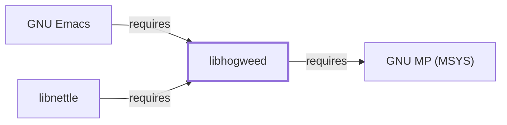

# Hogweed (MSYS)

<!-- BEGIN GENERATED object-facts -->

| Model fact | Value |
| --- | --- |
| Object | `library:nettle:libhogweed@msys` |
| Kind | `library` |
| Status | `partial` |
| Confidence | `high` |
| Authority | Niels Möller |
| Environments | `msys` |
| Upstream | <https://www.lysator.liu.se/~nisse/nettle/> |
| Packaged as | `package:msys2:libhogweed` |
| Version (observed) | 4.0-1 |
| License (observed) | spdx:GPL-2.0-or-later OR LGPL-3.0-or-later |
| Architecture (observed) | x86_64 |
| Installed size (observed) | 259.3 KB |

**Evidence on this object**

- `evidence:catalog:current` — MSYS2 pacman package catalog (`observed`, retrieved 2026-07-29)
- `evidence:nettle:manual-2026-07-30` — Nettle (official project site) (`primary`, retrieved 2026-07-30)

Generated from the composed model by `tools/build_object_facts.py`. Observed values come from the catalog snapshot and change when it is refreshed.
Edits between the surrounding markers are overwritten on the next build.

<!-- END GENERATED object-facts -->

## Purpose

This page documents `libhogweed`, Nettle's public-key cryptography
sublibrary in the MSYS environment — already cited by package name on
[GNU Emacs's own dependency table](GNU-EMACS.md#dependencies) as "a
dependency of GnuTLS above rather than a separate Emacs feature in its
own right," and on [Nettle (MSYS)'s](NETTLE-MSYS.md) page (albeit with
an incorrect direct-dependency claim this page's sibling,
[libnettle (MSYS)](LIBNETTLE-MSYS.md), corrects). See the
[official Nettle project page](https://www.lysator.liu.se/~nisse/nettle/)
for the API reference shared with the other Nettle-family packages in
this knowledge base.

## Architectural Classification

`library:nettle:libhogweed@msys` is packaged in the MSYS environment as
`package:msys2:libhogweed` (version `4.0-1` in the current catalog
snapshot, license `GPL-2.0-or-later OR LGPL-3.0-or-later`) — the same
version as its sibling [libnettle (MSYS)](LIBNETTLE-MSYS.md), reflecting
a shared release cadence rather than a coincidence.

## Responsibilities

- Providing public-key cryptography primitives (RSA, DSA, ECDSA, and
  related algorithms) as a linked library, consumed by
  [libnettle (MSYS)](LIBNETTLE-MSYS.md#dependencies) and directly by
  [GNU Emacs](GNU-EMACS.md#dependencies) itself, per the catalog
  snapshot.

## Boundaries

Hogweed implements Nettle's public-key cryptography specifically;
symmetric-cryptography and hashing primitives remain
[libnettle (MSYS)'s](LIBNETTLE-MSYS.md) own responsibility — the split
Hogweed's own upstream documentation describes.

## Interfaces

- The Hogweed C API (RSA, DSA, ECDSA, and related public-key
  primitives), distinct from
  [libnettle's](LIBNETTLE-MSYS.md#interfaces) symmetric-cryptography
  API, per the documentation.

## Dependencies

The MSYS `package:msys2:libhogweed` declares one `runtime-depends-on`
edge: `package:msys2:gmp` (the arbitrary-precision integer arithmetic
Hogweed's public-key algorithms build on, documented fully in
[GNU MP (MSYS)](GNU-GMP-MSYS.md),
`relationship:foundation-libraries:libhogweed-msys-requires-gmp-msys`).

## Reverse Dependencies

The catalog snapshot records 4 relationships targeting
`package:msys2:libhogweed`. Two are now modeled in this knowledge base:
`package:msys2:libnettle`
(`relationship:foundation-libraries:libnettle-msys-requires-libhogweed-msys`,
documented fully in [libnettle (MSYS)](LIBNETTLE-MSYS.md)) and
`package:msys2:emacs`
(`relationship:gnu-userland:emacs-requires-libhogweed-msys`, already
noted in [GNU Emacs's own dependency table](GNU-EMACS.md#dependencies)
before this page existed). The remaining two (`package:msys2:libnettle-devel`
and `package:msys2:task`) are not individually modeled in this knowledge
base; see the
[reverse dependency impact analysis](REVERSE-DEPENDENCY-IMPACT-ANALYSIS.md)
for the current full list.

## Configuration

Hogweed has no persistent configuration file; identical to
[libnettle (MSYS)](LIBNETTLE-MSYS.md#configuration) in this respect.

## Initialization and Execution Flow

As a library, Hogweed has no independent process lifecycle: it
initializes and executes within the process of whatever program links
against it — [libnettle (MSYS)](LIBNETTLE-MSYS.md) or
[GNU Emacs](GNU-EMACS.md) directly in this dependency chain. As an
MSYS-dependent library, this is adapted from POSIX semantics onto
Windows process primitives by `msys-2.0.dll` per
[MSYS Runtime Initialization](MSYS-RUNTIME-INITIALIZATION.md).

## Runtime Behavior

Public-key operations (certificate verification, key exchange) are
exercised whenever [GNU Emacs's](GNU-EMACS.md) Network Security Manager
or [GnuTLS](GNUTLS.md) itself perform a TLS handshake; Hogweed plays no
role in Nettle's symmetric-cipher or hashing code paths, which remain
[libnettle's](LIBNETTLE-MSYS.md) own responsibility.

## Compatibility and Variants

No separate native (UCRT64/CLANG64/i686) `libhogweed` package was found
in this catalog snapshot; whether one exists in a different snapshot or
repository is recorded as an open item rather than assumed either way.

## Security Considerations

Public-key cryptographic correctness is security-critical by definition;
this page does not assert this specific package version's
implementation robustness. See
[Threat Model and Supply Chain](THREAT-MODEL-AND-SUPPLY-CHAIN.md) for
the project's general supply-chain posture; no version-qualified CVE
review has been performed for the recorded `4.0-1` version.

## Failure Modes and Diagnostics

A TLS handshake or certificate-verification failure involving GnuTLS or
GNU Emacs's Network Security Manager should be checked against
[GnuTLS's](GNUTLS.md#failure-modes-and-diagnostics) own diagnostics
first, since Hogweed itself has no independent user-facing surface.

## Evidence, Assumptions, and Open Questions

The public-key cryptography scope is backed by the official Nettle
project page (`evidence:nettle:manual-2026-07-30`), the same evidence
record [libnettle (MSYS)](LIBNETTLE-MSYS.md) cites. Package identity,
version, license, and the two modeled dependent edges are backed by the
pacman catalog snapshot (`evidence:catalog:current`). Open, and
explicitly out of scope for this page: the two remaining recorded
dependents not individually modeled, whether a native
(UCRT64/CLANG64/i686) `libhogweed` package exists in this snapshot, and
header-level API surface / PE import/export-level evidence, per the
[Library Family Classification](LIBRARY-FAMILY-CLASSIFICATION.md)
methodology.

<!-- BEGIN GENERATED dependency-subgraph -->

## Dependency Diagram

Dependencies and dependents of `library:nettle:libhogweed@msys` in the composed graph: 2 dependents and 1 dependency.

Generated from the composed model by `tools/build_object_diagrams.py`.
Edits between the surrounding markers are overwritten on the next build.

<!-- END GENERATED dependency-subgraph -->

## Related Objects

- [MSYS2 Library Architecture](LIBRARIES-ARCHITECTURE.md)
- [libnettle (MSYS)](LIBNETTLE-MSYS.md)
- [Nettle (MSYS)](NETTLE-MSYS.md)
- [GNU Emacs](GNU-EMACS.md)
- [GNU MP (MSYS)](GNU-GMP-MSYS.md)
- [GnuTLS](GNUTLS.md)
