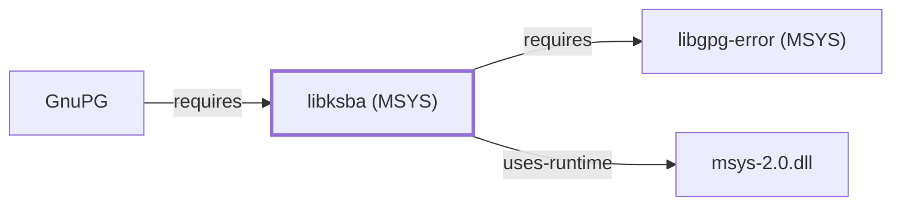

# libksba (MSYS)

<!-- BEGIN GENERATED object-facts -->

| Model fact | Value |
| --- | --- |
| Object | `library:gnupg:libksba@msys` |
| Kind | `library` |
| Status | `partial` |
| Confidence | `high` |
| Authority | GnuPG project |
| Environments | `msys` |
| Upstream | <https://www.gnupg.org/related_software/libksba/> |
| Packaged as | `package:msys2:libksba` |
| Version (observed) | 1.8.0-1 |
| License (observed) | spdx:LGPL-3.0-or-later OR GPL-2.0-or-later |
| Architecture (observed) | x86_64 |
| Installed size (observed) | 291.3 KB |

**Evidence on this object**

- `evidence:catalog:current` — MSYS2 pacman package catalog (`observed`, retrieved 2026-07-29)
- `evidence:gnupg:libksba-manual-2026-07-30` — libksba (official project page) (`primary`, retrieved 2026-07-30)

Generated from the composed model by `tools/build_object_facts.py`. Observed values come from the catalog snapshot and change when it is refreshed.
Edits between the surrounding markers are overwritten on the next build.

<!-- END GENERATED object-facts -->

## Purpose

This page documents the **MSYS-environment** `libksba` package
specifically — GnuPG's X.509/CMS certificate-parsing library, used by
GnuPG's S/MIME support (`gpgsm`) — as a correction: [GNUPG.md](GNUPG.md)
and [libksba (UCRT64)](LIBKSBA.md) originally recorded
`component:gnupg:gnupg`'s `requires` edge as pointing to the
UCRT64-packaged `libksba`
(`package:msys2:mingw-w64-ucrt-x86_64-libksba`), but
`package:msys2:gnupg` is itself an MSYS-environment package whose actual
catalog-recorded dependency is `package:msys2:libksba` — a separately
versioned, separate catalog entity. This page documents that correct
target; see the
[official libksba project page](https://www.gnupg.org/related_software/libksba/)
for the API reference shared with the UCRT64 package.

## Architectural Classification

`library:gnupg:libksba@msys` is packaged in the MSYS environment as
`package:msys2:libksba` (version `1.8.0-1` in the current catalog
snapshot) — a different, newer version from the UCRT64 sibling's
`1.6.8-1` documented on [libksba (UCRT64)](LIBKSBA.md). This is the
package [GnuPG](GNUPG.md#architectural-classification) actually depends
on.

## Responsibilities

- Backing X.509/CMS certificate parsing for [GnuPG's](GNUPG.md)
  MSYS-packaged build's S/MIME support (`gpgsm`), the same functional
  role [libksba (UCRT64)](LIBKSBA.md) documents for the UCRT64 packaging
  context.

## Boundaries

Functionally identical in scope to [libksba (UCRT64)](LIBKSBA.md) — this
page exists specifically to document the correct MSYS-packaged catalog
entity that GnuPG's own MSYS build depends on.

## Interfaces

Identical API surface to [libksba (UCRT64)](LIBKSBA.md); see that page
for interface details, since both packages share the same upstream
project.

## Dependencies

The catalog snapshot records two `runtime-depends-on` edges for
`package:msys2:libksba`: `gcc-libs` and `package:msys2:libgpg-error`,
documented on [libgpg-error (MSYS)](LIBGPG-ERROR-MSYS.md)
(`relationship:foundation-libraries:libksba-msys-requires-libgpg-error-msys`).

## Reverse Dependencies

The catalog snapshot records 2 relationships targeting
`package:msys2:libksba`: `package:msys2:gnupg`
(`relationship:ssh-curl-git:gnupg-requires-libksba` in this knowledge
base's graph, corrected 2026-07-30 to point here instead of the UCRT64
package) and its own `-devel` subpackage.

## Configuration

No persistent configuration file; identical to
[libksba (UCRT64)](LIBKSBA.md) in this respect.

## Initialization and Execution Flow

As a library, this package has no independent process lifecycle: it
initializes and executes within the process of whatever program links
against it — [GnuPG's](GNUPG.md) `gpgsm` in this dependency chain. As an
MSYS-dependent library, this is adapted from POSIX semantics onto Windows
process primitives by `msys-2.0.dll` per
[MSYS Runtime Initialization](MSYS-RUNTIME-INITIALIZATION.md), unlike the
UCRT64 sibling, which does not depend on `msys-2.0.dll`.

## Runtime Behavior

Identical functional behavior to [libksba (UCRT64)](LIBKSBA.md); see
that page for detail not specific to the MSYS/UCRT64 packaging
distinction.

## Compatibility and Variants

This is the correction record for the MSYS/UCRT64 packaging distinction
itself: the two `libksba` packages are separately versioned catalog
entities (`1.8.0-1` MSYS vs. `1.6.8-1` UCRT64) and not interchangeable at
the binary level.

## Security Considerations

X.509/CMS certificate parsing is a security-sensitive operation; identical
posture to [libksba (UCRT64)](LIBKSBA.md). No version-qualified CVE
review has been performed for the recorded `1.8.0-1` version specifically.

## Failure Modes and Diagnostics

Identical to [libksba (UCRT64)](LIBKSBA.md); GnuPG's `gpgsm`
certificate-parsing failures should be checked against this MSYS
package's behavior specifically, not the UCRT64 sibling's, since GnuPG
links against this one.

## Evidence, Assumptions, and Open Questions

The X.509/CMS parsing role is backed by the official libksba project page
(`evidence:gnupg:libksba-manual-2026-07-30`), the same evidence record
[libksba (UCRT64)](LIBKSBA.md) cites. Package identity, version, and the
recorded dependency/dependent edges (including the 2026-07-30 correction
to `relationship:ssh-curl-git:gnupg-requires-libksba`) are backed by the
pacman catalog snapshot (`evidence:catalog:current`).

<!-- BEGIN GENERATED dependency-subgraph -->

## Dependency Diagram

Dependencies and dependents of `library:gnupg:libksba@msys` in the composed graph: 1 dependent and 2 dependencies.

Generated from the composed model by `tools/build_object_diagrams.py`.
Edits between the surrounding markers are overwritten on the next build.

<!-- END GENERATED dependency-subgraph -->

## Related Objects

- [MSYS2 Library Architecture](LIBRARIES-ARCHITECTURE.md)
- [GnuPG](GNUPG.md)
- [libksba (UCRT64)](LIBKSBA.md)
- [libgpg-error (MSYS)](LIBGPG-ERROR-MSYS.md)
