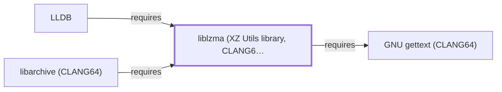

# liblzma (XZ Utils library, CLANG64)

<!-- BEGIN GENERATED object-facts -->

| Model fact | Value |
| --- | --- |
| Object | `library:tukaani:liblzma@clang64` |
| Kind | `library` |
| Status | `partial` |
| Confidence | `high` |
| Authority | Tukaani project |
| Environments | `clang64` |
| Upstream | <https://tukaani.org/xz> |
| Packaged as | `package:msys2:mingw-w64-clang-x86_64-xz` |
| Version (observed) | 5.8.3-1 |
| License (observed) | spdx:0BSD;AND;LGPL-2.1-or-later;AND;GPL-2.0-or-later |
| Architecture (observed) | any |
| Installed size (observed) | 4536.46 KiB |

**Evidence on this object**

- `evidence:catalog:current` — MSYS2 pacman package catalog (`observed`, retrieved 2026-08-05)
- `evidence:tukaani:xz-library-manual-2026-07-30` — XZ Utils / liblzma (official project site) (`primary`, retrieved 2026-07-30)

Generated from the composed model by `tools/build_object_facts.py`. Observed values come from the catalog snapshot and change when it is refreshed.
Edits between the surrounding markers are overwritten on the next build.

<!-- END GENERATED object-facts -->

## Purpose

This page documents the **CLANG64-environment** xz package specifically
— the compression library underlying XZ Utils — depended on by
[LLDB](LLDB.md) to back reading debug information compressed with the
xz/LZMA algorithm, already cited by package name on
[LLDB.md's dependency table](LLDB.md#dependencies) (which explicitly
noted it was "not individually modeled") before this page existed. See
the [official XZ Utils project page](https://tukaani.org/xz) for the
full reference.

## Architectural Classification

`library:tukaani:liblzma@clang64` is packaged in the CLANG64
environment as `package:msys2:mingw-w64-clang-x86_64-xz` (version
`5.8.3-1` in the current catalog snapshot) — a separately built,
separate catalog entity from [liblzma (UCRT64)](LIBLZMA.md)'s
`mingw-w64-ucrt-x86_64-xz` package (GDB's own dependency) and from
[XZ Utils (MSYS)](XZ-UTILS.md)'s `xz` CLI package. This is the package
[LLDB](LLDB.md) — a CLANG64-native component itself — actually depends
on, the third distinct xz/liblzma-named catalog entity in this
knowledge base.

## Responsibilities

- Providing LZMA/xz compression and decompression, consumed by
  [LLDB](LLDB.md#dependencies) to back reading debug information
  compressed with the xz/LZMA algorithm, the same functional role
  [liblzma (UCRT64)](LIBLZMA.md#responsibilities) documents for GDB.

## Boundaries

This page's package serves CLANG64-environment consumers specifically;
[GDB](GNU-GDB.md) instead links [liblzma (UCRT64)](LIBLZMA.md) — the
two are not interchangeable, matching the same distinction already made
throughout this volume for MSYS/UCRT64/CLANG64 sibling triples.

## Interfaces

- The liblzma C API (`lzma_easy_buffer_encode`, `lzma_stream_decoder`,
  and related functions), the same interface
  [liblzma (UCRT64)](LIBLZMA.md#interfaces) documents, per the
  documentation.

## Dependencies

The CLANG64 `package:msys2:mingw-w64-clang-x86_64-xz` declares a
dependency on `mingw-w64-clang-x86_64-gettext-runtime` — a CLANG64
sibling package, not individually modeled as a separate dependency edge
from this entity in this knowledge base.

## Reverse Dependencies

**Correction, 2026-07-30**: this page previously stated 41 relationships;
the catalog snapshot actually records **42** targeting
`package:msys2:mingw-w64-clang-x86_64-xz`. One is now modeled in this
knowledge base: [LLDB](LLDB.md)
(`relationship:foundation-libraries:lldb-requires-liblzma-clang64`).
The remaining ~41 recorded dependents (a broad mix of CLANG64 packages
including `boost-libs`, `imagemagick`, `libarchive`, `qemu`, and
`rustup`) are not individually modeled in this knowledge base; see the
[reverse dependency impact analysis](REVERSE-DEPENDENCY-IMPACT-ANALYSIS.md)
for the current full list.

## Configuration

liblzma has no persistent configuration file; compression level and
parameters are set entirely through its C API by the calling program.

## Initialization and Execution Flow

As a library, liblzma has no independent process lifecycle: it
initializes and executes within the process of whatever program links
against it — [LLDB](LLDB.md) in this dependency chain. As a native
MinGW-w64 library, this process model is Windows-facing directly rather
than mediated by `msys-2.0.dll`.

## Runtime Behavior

Identical functional behavior to [liblzma (UCRT64)](LIBLZMA.md); see
that page for detail not specific to the CLANG64/UCRT64 packaging
distinction.

## Compatibility and Variants

The CLANG64, UCRT64, and MSYS xz/liblzma packages are three separately
versioned catalog entities (see Architectural Classification); code
built against one is not automatically compatible with another without
matching the correct package/environment.

## Security Considerations

Decompressing untrusted xz-compressed debug data carries the general
decompression-bomb and parser-robustness considerations of any
compression library; this page does not assert this specific package
version's robustness against crafted input. See
[Threat Model and Supply Chain](THREAT-MODEL-AND-SUPPLY-CHAIN.md) for
the project's general supply-chain posture; no version-qualified CVE
review has been performed for the recorded `5.8.3-1` version.

## Failure Modes and Diagnostics

An LLDB failure reading xz-compressed debug information most commonly
indicates a version mismatch or corrupted stream rather than a defect
in LLDB itself, the same triage order documented for
[liblzma (UCRT64)](LIBLZMA.md#failure-modes-and-diagnostics).

## Evidence, Assumptions, and Open Questions

LZMA/xz compression library scope is backed by the official XZ Utils
project page (`evidence:tukaani:xz-library-manual-2026-07-30`), the
same evidence record [liblzma (UCRT64)](LIBLZMA.md) cites. Package
identity, version, and the one modeled dependent edge are backed by the
pacman catalog snapshot (`evidence:catalog:current`). Open, and
explicitly out of scope for this page: the ~41 remaining recorded
dependents not individually modeled, this package's own
gettext-runtime sub-dependency, and header-level API surface / PE
import/export-level evidence, per the
[Library Family Classification](LIBRARY-FAMILY-CLASSIFICATION.md)
methodology.

<!-- BEGIN GENERATED dependency-subgraph -->

## Dependency Diagram

Dependencies and dependents of `library:tukaani:liblzma@clang64` in the composed graph: 2 dependents and 1 dependency.

Generated from the composed model by `tools/build_object_diagrams.py`.
Edits between the surrounding markers are overwritten on the next build.

<!-- END GENERATED dependency-subgraph -->

## Related Objects

- [MSYS2 Library Architecture](LIBRARIES-ARCHITECTURE.md)
- [liblzma (UCRT64)](LIBLZMA.md)
- [XZ Utils](XZ-UTILS.md)
- [LLDB](LLDB.md)
