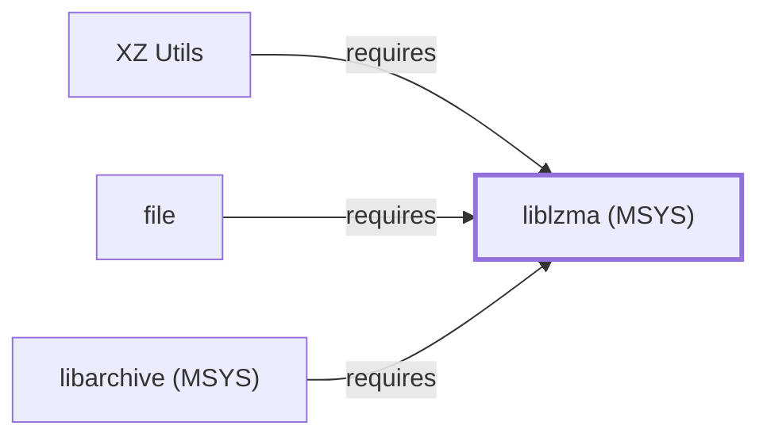

# liblzma (MSYS)

<!-- BEGIN GENERATED object-facts -->

| Model fact | Value |
| --- | --- |
| Object | `library:tukaani:liblzma@msys` |
| Kind | `library` |
| Status | `partial` |
| Confidence | `high` |
| Authority | Tukaani project |
| Environments | `msys` |
| Upstream | <https://tukaani.org/xz/> |
| Packaged as | `package:msys2:liblzma` |
| Version (observed) | 5.8.3-1 |
| License (observed) | GPL;LGPL;custom |
| Architecture (observed) | x86_64 |
| Installed size (observed) | 177.1 KB |

**Evidence on this object**

- `evidence:catalog:current` — MSYS2 pacman package catalog (`observed`, retrieved 2026-07-29)
- `evidence:tukaani:xz-library-manual-2026-07-30` — XZ Utils / liblzma (official project site) (`primary`, retrieved 2026-07-30)

Generated from the composed model by `tools/build_object_facts.py`. Observed values come from the catalog snapshot and change when it is refreshed.
Edits between the surrounding markers are overwritten on the next build.

<!-- END GENERATED object-facts -->

## Purpose

liblzma is the compression library underlying XZ Utils, split from
[the xz CLI package](XZ-UTILS.md); this page documents that shared
library specifically, distinct from the CLI tool — closing an item
[file's own page](FILE.md#dependencies) had explicitly flagged as not
individually modeled, and the third distinct liblzma-named catalog
entity in this knowledge base alongside
[liblzma (UCRT64)](LIBLZMA.md) and
[liblzma (CLANG64)](LIBLZMA-CLANG64.md). See the
[official XZ Utils project page](https://tukaani.org/xz/) for the full
reference.

## Architectural Classification

`library:tukaani:liblzma@msys` is packaged in the MSYS environment as
`package:msys2:liblzma` (version `5.8.3-1` in the current catalog
snapshot, license `GPL;LGPL;custom`, matching
[XZ Utils' own recorded license family](XZ-UTILS.md#architectural-classification)),
authored by the Tukaani project — the same project as
[the xz CLI](XZ-UTILS.md) itself.

## Responsibilities

- Providing LZMA/xz compression and decompression as a linked library,
  consumed by [the xz CLI](XZ-UTILS.md#dependencies) itself (split
  library/CLI pattern) and by [file](FILE.md#dependencies) to identify
  files inside xz/LZMA-compressed containers.

## Boundaries

liblzma implements the LZMA2 codec specifically; it does not itself
provide any archive-container format or command-line interface — those
remain the responsibility of the programs that link against it.

## Interfaces

- A C API (`lzma_easy_encoder`, `lzma_stream_decoder`, and related
  functions) for LZMA/xz compression and decompression, the same
  interface [liblzma (UCRT64)](LIBLZMA.md#interfaces) documents, per
  the documentation.

## Dependencies

The MSYS `package:msys2:liblzma` declares no `runtime-depends-on`
edges beyond standard toolchain runtime support.

## Reverse Dependencies

The catalog snapshot records 12 relationships targeting
`package:msys2:liblzma`. Two are now modeled in this knowledge base:
[XZ Utils](XZ-UTILS.md)
(`relationship:archive-compression:xz-requires-liblzma-msys`) and
[file](FILE.md)
(`relationship:foundation-libraries:file-requires-liblzma-msys`). The
remaining recorded dependents (`bsdcpio`, `bsdtar`, `elinks`,
`libarchive` (MSYS package — distinct from
[this knowledge base's UCRT64 LibArchive entity](LIBARCHIVE.md)),
`python`, `squashfs-tools`, `subversion`, `xdelta3`, and its own
`-devel` subpackage) are not individually modeled in this knowledge
base; see the
[reverse dependency impact analysis](REVERSE-DEPENDENCY-IMPACT-ANALYSIS.md)
for the current full list.

## Configuration

liblzma has no persistent configuration file; compression level and
parameters are set entirely through its C API by the calling program.

## Initialization and Execution Flow

As a library, liblzma has no independent process lifecycle: it
initializes and executes within the process of whatever program links
against it. As an MSYS-dependent component, this is adapted from POSIX
semantics onto Windows process primitives by `msys-2.0.dll` per
[MSYS Runtime Initialization](MSYS-RUNTIME-INITIALIZATION.md).

## Runtime Behavior

liblzma's LZMA2 codec is exercised whenever a consuming program reads
or writes xz/LZMA-compressed data; [the xz CLI](XZ-UTILS.md) exercises
it on every invocation, while [file's](FILE.md) use is conditional on
encountering an xz-compressed file during type identification.

## Compatibility and Variants

The MSYS, UCRT64, and CLANG64 liblzma packages are three separately
versioned catalog entities (see Architectural Classification); code
built against one is not automatically compatible with another without
matching the correct package/environment.

## Security Considerations

Decompressing untrusted xz-compressed data carries the general
decompression-bomb and parser-robustness considerations of any
compression library; this page does not assert this specific package
version's robustness against crafted input. See
[Threat Model and Supply Chain](THREAT-MODEL-AND-SUPPLY-CHAIN.md) for
the project's general supply-chain posture; no version-qualified CVE
review has been performed for the recorded `5.8.3-1` version.

## Failure Modes and Diagnostics

An xz or file decompression failure most commonly indicates a
corrupted or truncated xz stream rather than a defect in liblzma
itself.

## Evidence, Assumptions, and Open Questions

LZMA/xz compression library scope is backed by the official XZ Utils
project page (`evidence:tukaani:xz-library-manual-2026-07-30`), the
same evidence record [liblzma (UCRT64)](LIBLZMA.md) cites, matching
the `project_url` already recorded for `package:msys2:liblzma` in the
catalog. Package identity, version, and the two modeled dependent
edges are backed by the pacman catalog snapshot
(`evidence:catalog:current`). Open, and explicitly out of scope for
this page: the remaining recorded dependents not individually
modeled, and header-level API surface / PE import/export-level
evidence, per the
[Library Family Classification](LIBRARY-FAMILY-CLASSIFICATION.md)
methodology.

<!-- BEGIN GENERATED dependency-subgraph -->

## Dependency Diagram

Dependencies and dependents of `library:tukaani:liblzma@msys` in the composed graph: 3 dependents and 0 dependencies.

Generated from the composed model by `tools/build_object_diagrams.py`.
Edits between the surrounding markers are overwritten on the next build.

<!-- END GENERATED dependency-subgraph -->

## Related Objects

- [MSYS2 Library Architecture](LIBRARIES-ARCHITECTURE.md)
- [XZ Utils](XZ-UTILS.md)
- [file](FILE.md)
- [liblzma (UCRT64)](LIBLZMA.md)
- [liblzma (CLANG64)](LIBLZMA-CLANG64.md)
- [libarchive (MSYS)](LIBARCHIVE-MSYS.md)
