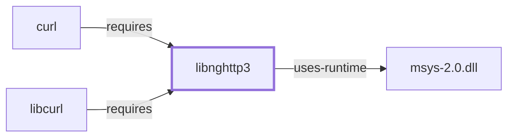

# libnghttp3

## Purpose

libnghttp3 implements the HTTP/3 protocol as a C library, providing the
application-layer protocol machinery that runs over QUIC (implemented
separately by [libngtcp2](LIBNGTCP2.md)) rather than over TCP. This page
documents its architectural role as a directly-declared dependency of
[curl](CURL.md); see the
[official nghttp3 project page](https://nghttp2.org/nghttp3) for the full
API reference.

## Architectural Classification

`library:nghttp2:libnghttp3` is packaged in the MSYS environment as
`package:msys2:libnghttp3` (version `1.18.0-1` in the current catalog
snapshot). A separately packaged, native (UCRT64/CLANG64/i686)
`libnghttp3` also exists in the catalog; this page documents the MSYS
package specifically, since that is the one
[curl](CURL.md#dependencies) actually depends on — the same
MSYS-vs-native distinction applied consistently across this batch's
sibling pages, [libnghttp2](LIBNGHTTP2.md) and [libngtcp2](LIBNGTCP2.md).
Despite the similar name and shared upstream project (nghttp2), this is a
separate library and a separate catalog package from
[libnghttp2](LIBNGHTTP2.md), implementing a different protocol version.

## Responsibilities

- Implementing the HTTP/3 application-layer protocol as a reusable
  library, consumed by [curl](CURL.md) to negotiate and speak HTTP/3 when
  a server offers it, running over the QUIC transport that
  [libngtcp2](LIBNGTCP2.md) implements.

## Boundaries

libnghttp3 provides the HTTP/3 application-layer protocol specifically;
it does not implement the underlying QUIC transport itself — that is
[libngtcp2](LIBNGTCP2.md)'s responsibility, a separate library this page's
dependent, curl, also depends on directly. libnghttp3 already appeared by
package name in [curl's dependency table](CURL.md#dependencies) before
this page existed.

## Interfaces

- A C API for HTTP/3 connection, stream, and frame handling designed to be
  driven by a QUIC transport implementation such as libngtcp2, per the
  documentation.

## Dependencies

The MSYS `package:msys2:libnghttp3` declares a dependency on `gcc-libs`
only — the GCC runtime support libraries, not a library-family dependency
distinct enough to warrant its own page in this volume.

## Reverse Dependencies

The catalog snapshot records 3 relationships targeting
`package:msys2:libnghttp3`: `package:msys2:curl`
(`relationship:ssh-curl-git:curl-requires-libnghttp3` in this knowledge
base's graph, a direct dependency of the CLI package itself, not merely of
`libcurl`), `package:msys2:libcurl`, and its own `-devel` subpackage.

## Configuration

libnghttp3 has no persistent configuration file of its own; HTTP/3
session parameters are controlled entirely through its C API by the
calling program, which must also supply a QUIC transport implementation
to drive it.

## Initialization and Execution Flow

As a library, libnghttp3 has no independent process lifecycle: it
initializes and executes within the process of whatever program links
against it — [curl](CURL.md) in this dependency chain. As an
MSYS-dependent library, this is adapted from POSIX semantics onto Windows
process primitives by `msys-2.0.dll` per
[MSYS Runtime Initialization](MSYS-RUNTIME-INITIALIZATION.md).

## Runtime Behavior

Whether a given curl invocation actually negotiates HTTP/3 depends on
server-side support and protocol negotiation, not solely on this
library's presence, already noted as a general point on
[curl's own page](CURL.md#runtime-behavior), which specifically calls out
the HTTP/3/QUIC dependency set this library is part of.

## Compatibility and Variants

The MSYS and native (UCRT64/CLANG64/i686) libnghttp3 packages are
separately versioned catalog entities (see Architectural Classification);
code built against one is not automatically compatible with the other
without matching the correct environment.

## Security Considerations

HTTP/3 and QUIC are comparatively newer protocol implementations than
HTTP/2, with an evolving security-review history across implementations
generally; this page does not assert this specific package version's
exposure or mitigation status. See
[Threat Model and Supply Chain](THREAT-MODEL-AND-SUPPLY-CHAIN.md) for the
project's general supply-chain posture; no version-qualified CVE review
has been performed for the recorded `1.18.0-1` version.

## Failure Modes and Diagnostics

An HTTP/3-specific connection failure (as opposed to a general network
failure) should be checked with curl's `-v`/`--trace` diagnostic flags,
already documented on [curl's own page](CURL.md#failure-modes-and-diagnostics),
before being treated as a libnghttp3 or libngtcp2 defect.

## Evidence, Assumptions, and Open Questions

HTTP/3 protocol implementation scope is backed by the official nghttp3
project page (`evidence:nghttp2:libnghttp3-manual-2026-07-30`), matching
the `project_url` already recorded for `package:msys2:libnghttp3` in the
catalog. Package identity, version, and the recorded dependency/dependent
edges are backed by the pacman catalog snapshot
(`evidence:catalog:current`). Open, and explicitly out of scope for this
page: header-level API surface and PE import/export-level evidence, per
the [Library Family Classification](LIBRARY-FAMILY-CLASSIFICATION.md)
methodology, remain open.

<!-- BEGIN GENERATED dependency-subgraph -->

## Dependency Diagram

Dependencies and dependents of `library:nghttp2:libnghttp3` in the composed graph: 2 dependents and 1 dependency.

Generated from the composed model by `tools/build_object_diagrams.py`.
Edits between the surrounding markers are overwritten on the next build.

<!-- END GENERATED dependency-subgraph -->

## Related Objects

- [MSYS2 Library Architecture](LIBRARIES-ARCHITECTURE.md)
- [curl](CURL.md)
- [libnghttp2](LIBNGHTTP2.md)
- [libngtcp2](LIBNGTCP2.md)
- [libnghttp3 (UCRT64)](LIBNGHTTP3-UCRT64.md)
- [libnghttp3 (CLANG64)](LIBNGHTTP3-CLANG64.md)
