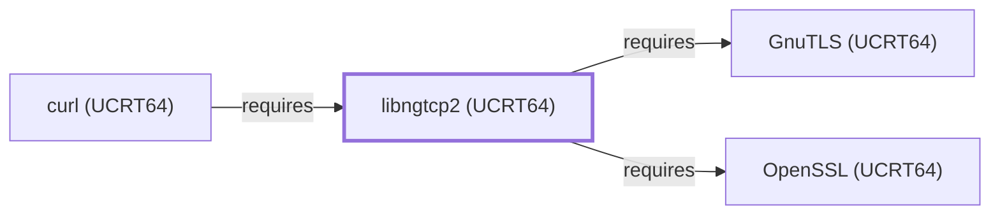

# libngtcp2 (UCRT64)

<!-- BEGIN GENERATED object-facts -->

| Model fact | Value |
| --- | --- |
| Object | `library:nghttp2:libngtcp2@ucrt64` |
| Kind | `library` |
| Status | `partial` |
| Confidence | `high` |
| Authority | nghttp2 project |
| Environments | `ucrt64` |
| Upstream | <https://nghttp2.org/ngtcp2> |
| Packaged as | `package:msys2:mingw-w64-ucrt-x86_64-ngtcp2` |
| Version (observed) | 1.25.0-1 |
| License (observed) | spdx:MIT |
| Architecture (observed) | any |
| Installed size (observed) | 1674.86 KiB |

**Evidence on this object**

- `evidence:catalog:current` — MSYS2 pacman package catalog (`observed`, retrieved 2026-08-05)
- `evidence:nghttp2:libngtcp2-manual-2026-07-30` — ngtcp2 project page (`primary`, retrieved 2026-07-30)

Generated from the composed model by `tools/build_object_facts.py`. Observed values come from the catalog snapshot and change when it is refreshed.
Edits between the surrounding markers are overwritten on the next build.

<!-- END GENERATED object-facts -->

## Purpose

This page documents the **UCRT64-environment** libngtcp2 package
specifically — an implementation of the IETF QUIC transport protocol —
depended on by [curl (UCRT64)](CURL-UCRT64.md) to carry HTTP/3 traffic
over QUIC, closing one of the sub-dependencies that page's own
Dependencies section had left explicitly unmodeled. See the
[official ngtcp2 project page](https://nghttp2.org/ngtcp2) for the full
reference.

## Architectural Classification

`library:nghttp2:libngtcp2@ucrt64` is packaged in the UCRT64
environment as `package:msys2:mingw-w64-ucrt-x86_64-ngtcp2` (version
`1.24.0-1` in the current catalog snapshot, license `MIT`) — a
separately built, separate catalog entity from
[libngtcp2 (MSYS)](LIBNGTCP2.md)'s `libngtcp2` package. This is the
package [curl (UCRT64)](CURL-UCRT64.md) — a UCRT64-native component
itself — actually depends on.

## Responsibilities

- Providing the QUIC transport protocol implementation, consumed by
  [curl (UCRT64)](CURL-UCRT64.md#dependencies) to carry HTTP/3 traffic
  over QUIC, paired with an HTTP/3 implementation
  ([libnghttp3 (UCRT64)](LIBNGHTTP3-UCRT64.md)).

## Boundaries

This page's package serves UCRT64-environment consumers specifically;
[curl (MSYS)](CURL.md) and [libcurl (MSYS)](LIBCURL.md) instead depend
on [libngtcp2 (MSYS)](LIBNGTCP2.md#reverse-dependencies) — the two are
not interchangeable, matching the same distinction already made
throughout this volume for MSYS/UCRT64 sibling pairs.

## Interfaces

- A C API for QUIC connection and stream handling, designed to be
  paired with a TLS backend (this package's own dependency, see
  Dependencies) and an HTTP/3 implementation, the same interface
  [libngtcp2 (MSYS)](LIBNGTCP2.md#interfaces) documents, per the
  documentation.

## Dependencies

The UCRT64 `package:msys2:mingw-w64-ucrt-x86_64-ngtcp2` declares
dependencies on [OpenSSL (UCRT64)](OPENSSL-UCRT64.md) (QUIC's own TLS
1.3 handshake,
`relationship:foundation-libraries:libngtcp2-ucrt64-requires-openssl-ucrt64`)
and [GnuTLS (UCRT64)](GNUTLS-UCRT64.md) (the second of two declared
TLS backends,
`relationship:foundation-libraries:libngtcp2-ucrt64-requires-gnutls-ucrt64`,
added 2026-07-30 — closing an item this page had previously left
explicitly unmodeled).

## Reverse Dependencies

The catalog snapshot records 2 relationships targeting
`package:msys2:mingw-w64-ucrt-x86_64-ngtcp2`. One is now modeled in
this knowledge base: [curl (UCRT64)](CURL-UCRT64.md)
(`relationship:foundation-libraries:curl-ucrt64-requires-libngtcp2-ucrt64`)
— its sole functional recorded dependent, alongside its `curl-gnutls`
variant package.

## Configuration

libngtcp2 has no persistent configuration file; behavior is controlled
entirely through its C API by the calling program.

## Initialization and Execution Flow

As a library, libngtcp2 has no independent process lifecycle: it
initializes and executes within the process of whatever program links
against it — [curl (UCRT64)](CURL-UCRT64.md) in this dependency chain.
As a native MinGW-w64 library, this process model is Windows-facing
directly rather than mediated by `msys-2.0.dll`.

## Runtime Behavior

Identical functional behavior to
[libngtcp2 (MSYS)](LIBNGTCP2.md#runtime-behavior); see that page for
detail not specific to the UCRT64/MSYS packaging distinction.

## Compatibility and Variants

The UCRT64 and MSYS libngtcp2 packages are separately versioned
catalog entities (see Architectural Classification); code built
against one is not automatically compatible with the other without
matching the correct package/environment.

## Security Considerations

QUIC transport implementations sit in a security-sensitive position by
nature, mediating both transport framing and TLS 1.3 handshake state;
this page does not assert this specific package version's robustness.
See [Threat Model and Supply Chain](THREAT-MODEL-AND-SUPPLY-CHAIN.md)
for the project's general supply-chain posture; no version-qualified
CVE review has been performed for the recorded `1.24.0-1` version.

## Failure Modes and Diagnostics

An HTTP/3-specific curl connection failure should be checked with
curl's own verbose/trace diagnostics before being treated as a
libngtcp2 or libnghttp3 (UCRT64) defect, the same triage order
documented for [libngtcp2 (MSYS)](LIBNGTCP2.md#failure-modes-and-diagnostics).

## Evidence, Assumptions, and Open Questions

QUIC transport implementation scope is backed by the official ngtcp2
project page (`evidence:nghttp2:libngtcp2-manual-2026-07-30`), the same
evidence record [libngtcp2 (MSYS)](LIBNGTCP2.md) cites. Package
identity, version, license, and the recorded dependency/dependent edges
are backed by the pacman catalog snapshot (`evidence:catalog:current`).
Open, and explicitly out of scope for this page: header-level API
surface / PE import/export-level evidence, per the
[Library Family Classification](LIBRARY-FAMILY-CLASSIFICATION.md)
methodology.

<!-- BEGIN GENERATED dependency-subgraph -->

## Dependency Diagram

Dependencies and dependents of `library:nghttp2:libngtcp2@ucrt64` in the composed graph: 1 dependent and 2 dependencies.

Generated from the composed model by `tools/build_object_diagrams.py`.
Edits between the surrounding markers are overwritten on the next build.

<!-- END GENERATED dependency-subgraph -->

## Related Objects

- [MSYS2 Library Architecture](LIBRARIES-ARCHITECTURE.md)
- [libngtcp2 (MSYS)](LIBNGTCP2.md)
- [curl (UCRT64)](CURL-UCRT64.md)
- [OpenSSL (UCRT64)](OPENSSL-UCRT64.md)
- [libnghttp3 (UCRT64)](LIBNGHTTP3-UCRT64.md)
- [GnuTLS (UCRT64)](GNUTLS-UCRT64.md)
- [libngtcp2 (CLANG64)](LIBNGTCP2-CLANG64.md)
