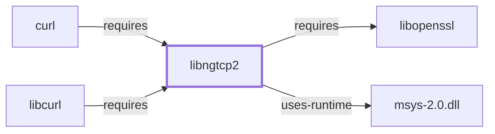

# libngtcp2

## Purpose

libngtcp2 implements the IETF QUIC transport protocol as a C library —
the encrypted, multiplexed transport that HTTP/3 (implemented separately
by [libnghttp3](LIBNGHTTP3.md)) runs over instead of TCP. This page
documents its architectural role as a directly-declared dependency of
[curl](CURL.md); see the
[official ngtcp2 project page](https://nghttp2.org/ngtcp2) for the full
API reference.

## Architectural Classification

`library:nghttp2:libngtcp2` is packaged in the MSYS environment as
`package:msys2:libngtcp2` (version `1.25.0-1` in the current catalog
snapshot). A separately packaged, native (UCRT64/CLANG64/i686)
`libngtcp2` also exists in the catalog; this page documents the MSYS
package specifically, since that is the one
[curl](CURL.md#dependencies) actually depends on — the same
MSYS-vs-native distinction applied consistently across this batch's
sibling pages, [libnghttp2](LIBNGHTTP2.md) and [libnghttp3](LIBNGHTTP3.md).

## Responsibilities

- Implementing the IETF QUIC transport protocol (connection
  establishment, encryption, stream multiplexing, loss recovery) as a
  reusable library, consumed by [curl](CURL.md) to carry HTTP/3 traffic
  (via [libnghttp3](LIBNGHTTP3.md)) when a server offers it.

## Boundaries

libngtcp2 provides the QUIC transport layer specifically; it does not
implement the HTTP/3 application-layer protocol itself — that is
[libnghttp3](LIBNGHTTP3.md)'s responsibility, a separate library this
page's dependent, curl, also depends on directly. libngtcp2 already
appeared by package name in
[curl's dependency table](CURL.md#dependencies) before this page existed.

## Interfaces

- A C API for QUIC connection and stream handling, designed to be paired
  with a TLS backend (this package's own dependency, see Dependencies) and
  an HTTP/3 implementation such as libnghttp3, per the documentation.

## Dependencies

The MSYS `package:msys2:libngtcp2` declares dependencies on `gcc-libs` and
[libopenssl](LIBOPENSSL.md) — the OpenSSL **runtime library** package
(`package:msys2:libopenssl`,
`relationship:foundation-libraries:libngtcp2-requires-libopenssl`), used
here for QUIC's own TLS 1.3 handshake. **Correction, 2026-07-30**: this
page originally left libopenssl unmodeled and declined to add a formal
dependency edge to it; [libopenssl](LIBOPENSSL.md) now has its own page,
and the edge is added here. This is a distinct catalog entity from
`package:msys2:openssl`, the CLI package [OpenSSL's own page](OPENSSL.md)
documents (`component:openssl:openssl`); no formal dependency edge to
`component:openssl:openssl` is added for that reason, the same
package/environment-style distinction already applied throughout this
volume, here between a CLI package and its own separately packaged
runtime library rather than between MSYS and native environments.

## Reverse Dependencies

The catalog snapshot records 3 relationships targeting
`package:msys2:libngtcp2`: `package:msys2:curl`
(`relationship:ssh-curl-git:curl-requires-libngtcp2` in this knowledge
base's graph, a direct dependency of the CLI package itself, not merely of
`libcurl`), `package:msys2:libcurl`, and its own `-devel` subpackage.

## Configuration

libngtcp2 has no persistent configuration file of its own; QUIC connection
parameters are controlled entirely through its C API by the calling
program.

## Initialization and Execution Flow

As a library, libngtcp2 has no independent process lifecycle: it
initializes and executes within the process of whatever program links
against it — [curl](CURL.md) in this dependency chain. As an
MSYS-dependent library, this is adapted from POSIX semantics onto Windows
process primitives by `msys-2.0.dll` per
[MSYS Runtime Initialization](MSYS-RUNTIME-INITIALIZATION.md).

## Runtime Behavior

Whether a given curl invocation actually negotiates QUIC/HTTP-3 depends on
server-side support and protocol negotiation, not solely on this
library's presence, already noted as a general point on
[curl's own page](CURL.md#runtime-behavior), which specifically calls out
the HTTP/3/QUIC dependency set this library is part of.

## Compatibility and Variants

The MSYS and native (UCRT64/CLANG64/i686) libngtcp2 packages are
separately versioned catalog entities (see Architectural Classification);
code built against one is not automatically compatible with the other
without matching the correct environment.

## Security Considerations

QUIC is a comparatively newer transport protocol with an evolving
security-review history across implementations generally, and this
library's own TLS 1.3 handshake depends directly on the OpenSSL runtime
library's security posture; this page does not assert this specific
package version's exposure or mitigation status. See
[Threat Model and Supply Chain](THREAT-MODEL-AND-SUPPLY-CHAIN.md) for the
project's general supply-chain posture; no version-qualified CVE review
has been performed for the recorded `1.25.0-1` version.

## Failure Modes and Diagnostics

A QUIC/HTTP-3-specific connection failure (as opposed to a general network
failure) should be checked with curl's `-v`/`--trace` diagnostic flags,
already documented on [curl's own page](CURL.md#failure-modes-and-diagnostics),
before being treated as a libngtcp2 or libnghttp3 defect.

## Evidence, Assumptions, and Open Questions

QUIC transport implementation scope is backed by the official ngtcp2
project page (`evidence:nghttp2:libngtcp2-manual-2026-07-30`), matching
the `project_url` already recorded for `package:msys2:libngtcp2` in the
catalog. Package identity, version, and the recorded dependency/dependent
edges are backed by the pacman catalog snapshot
(`evidence:catalog:current`). Open, and explicitly out of scope for this
page: header-level API surface and PE import/export-level evidence, per
the [Library Family Classification](LIBRARY-FAMILY-CLASSIFICATION.md)
methodology.

<!-- BEGIN GENERATED dependency-subgraph -->

## Dependency Diagram

Dependencies and dependents of `library:nghttp2:libngtcp2` in the composed graph: 2 dependents and 2 dependencies.

Generated from the composed model by `tools/build_object_diagrams.py`.
Edits between the surrounding markers are overwritten on the next build.

<!-- END GENERATED dependency-subgraph -->

## Related Objects

- [MSYS2 Library Architecture](LIBRARIES-ARCHITECTURE.md)
- [curl](CURL.md)
- [libnghttp2](LIBNGHTTP2.md)
- [libnghttp3](LIBNGHTTP3.md)
- [OpenSSL](OPENSSL.md)
- [libopenssl](LIBOPENSSL.md)
- [libngtcp2 (UCRT64)](LIBNGTCP2-UCRT64.md)
- [libngtcp2 (CLANG64)](LIBNGTCP2-CLANG64.md)
