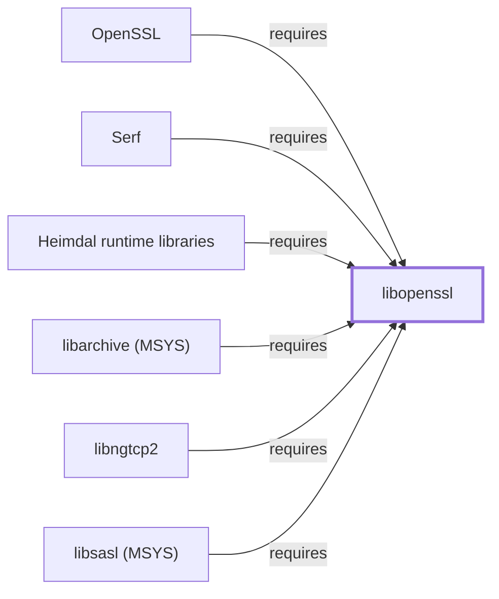

# libopenssl

## Purpose

libopenssl is the OpenSSL runtime library package split from
[the openssl CLI package](OPENSSL.md); this page documents that shared
library specifically, distinct from the CLI tool — closing an item
explicitly flagged as not-yet-modeled on both
[Heimdal runtime libraries'](HEIMDAL-LIBS.md) and
[libngtcp2's](LIBNGTCP2.md) own pages before this page existed. With 27
recorded catalog dependents, it has the widest reverse-dependency
footprint of any library added in this batch. See the
[official OpenSSL project site](https://openssl-library.org) for the API
and command-line reference.

## Architectural Classification

`library:openssl:libopenssl` is packaged in the MSYS environment as
`package:msys2:libopenssl` (version `3.6.3-1` in the current catalog
snapshot, license `Apache-2.0`, matching [openssl's own recorded
license](OPENSSL.md#architectural-classification)), authored by the
OpenSSL Project — the same project as
[the openssl CLI package](OPENSSL.md) itself. No separate native
(UCRT64/CLANG64/i686) *split* `libopenssl`-named package was found in
this catalog snapshot; a UCRT64-native OpenSSL build does exist, but as
a single bundled CLI+library package rather than a split pair — see
[OpenSSL (UCRT64)](OPENSSL-UCRT64.md).

## Responsibilities

- Providing TLS/SSL protocol implementations and general-purpose
  cryptographic primitives as a linked library, consumed by
  [the openssl CLI](OPENSSL.md#dependencies) itself (split library/CLI
  pattern), [Heimdal runtime libraries](HEIMDAL-LIBS.md#dependencies)
  (backing Heimdal's own use of OpenSSL primitives alongside its
  Kerberos implementation), and [libngtcp2](LIBNGTCP2.md#dependencies)
  (QUIC's TLS 1.3 handshake).

## Boundaries

libopenssl implements TLS/SSL protocol handling and general-purpose
cryptographic primitives specifically; it does not itself implement any
consuming protocol (Kerberos, QUIC, or otherwise) — those remain the
responsibility of the programs that link against it.

## Interfaces

- The OpenSSL `libssl`/`libcrypto` C API (TLS/SSL protocol functions
  plus general-purpose hashing, symmetric, and asymmetric cryptography
  primitives), identical to the API surface documented on
  [the openssl CLI page](OPENSSL.md#interfaces), per the documentation.

## Dependencies

The MSYS `package:msys2:libopenssl` declares no `runtime-depends-on`
edges beyond standard toolchain runtime support.

## Reverse Dependencies

The catalog snapshot records 27 relationships targeting
`package:msys2:libopenssl` — the widest reverse-dependency footprint of
any library added in this batch. Three are now modeled in this
knowledge base: [openssl](OPENSSL.md)
(`relationship:ssh-curl-git:openssl-requires-libopenssl`),
[Heimdal runtime libraries](HEIMDAL-LIBS.md)
(`relationship:foundation-libraries:heimdal-libs-requires-libopenssl`),
and [libngtcp2](LIBNGTCP2.md)
(`relationship:foundation-libraries:libngtcp2-requires-libopenssl`,
correcting that page's own prior explicitly-unmodeled note). The
remaining ~24 recorded dependents (a broad mix of MSYS packages
including `libarchive` (MSYS package — distinct from
[this knowledge base's UCRT64 LibArchive entity](LIBARCHIVE.md)),
`libsasl`, `libssh`, `neomutt`, `python`, `rsync`, `rust`, and `subversion`)
are not individually modeled in this knowledge base; see the
[reverse dependency impact analysis](REVERSE-DEPENDENCY-IMPACT-ANALYSIS.md)
for the current full list.

## Configuration

libopenssl has no persistent configuration file as a library beyond the
system-wide `openssl.cnf` convention its consuming programs may read;
protocol and cryptographic parameters are otherwise set entirely through
its C API by the calling program.

## Initialization and Execution Flow

As a library, libopenssl has no independent process lifecycle: it
initializes and executes within the process of whatever program links
against it. As an MSYS-dependent component, this is adapted from POSIX
semantics onto Windows process primitives by `msys-2.0.dll` per
[MSYS Runtime Initialization](MSYS-RUNTIME-INITIALIZATION.md).

## Runtime Behavior

TLS/SSL handshake and cryptographic-primitive behavior is identical to
that documented for [the openssl CLI package](OPENSSL.md#runtime-behavior);
this page does not restate protocol-level detail not specific to the
library/CLI packaging distinction.

## Compatibility and Variants

No separate native (UCRT64/CLANG64/i686) *split* `libopenssl`-named
package was found in this catalog snapshot. **Correction, 2026-07-30**:
a UCRT64-native OpenSSL package does exist —
[OpenSSL (UCRT64)](OPENSSL-UCRT64.md) — but unlike this MSYS
package's CLI/library split, it bundles both CLI and library together
in one package, the same non-split pattern documented for
[curl (UCRT64)](CURL-UCRT64.md). Whether a CLANG64/i686 build exists
remains an open item.

## Security Considerations

OpenSSL is a security-critical library by definition, with an extensive
public CVE history; this page does not assert this specific package
version's patch status. See
[Threat Model and Supply Chain](THREAT-MODEL-AND-SUPPLY-CHAIN.md) for
the project's general supply-chain posture; no version-qualified CVE
review has been performed for the recorded `3.6.3-1` version.

## Failure Modes and Diagnostics

A TLS handshake failure in any consuming program should be checked
against OpenSSL's own error-queue diagnostics (`ERR_get_error` and
related functions) before being treated as a defect in the calling
program.

## Evidence, Assumptions, and Open Questions

TLS/SSL protocol and cryptographic-primitives scope is backed by the
official OpenSSL project site (`evidence:openssl:project-site-2026-07-30`),
the same evidence record [openssl](OPENSSL.md) cites, matching the
`project_url` already recorded for `package:msys2:libopenssl` in the
catalog. Package identity, version, and the three modeled dependent
edges are backed by the pacman catalog snapshot
(`evidence:catalog:current`). Open, and explicitly out of scope for this
page: the ~24 remaining recorded dependents not individually modeled,
whether a CLANG64/i686 build exists, and header-level API surface / PE
import/export-level evidence, per the
[Library Family Classification](LIBRARY-FAMILY-CLASSIFICATION.md)
methodology.

<!-- BEGIN GENERATED dependency-subgraph -->

## Dependency Diagram

Dependencies and dependents of `library:openssl:libopenssl` in the composed graph: 6 dependents and 0 dependencies.

Generated from the composed model by `tools/build_object_diagrams.py`.
Edits between the surrounding markers are overwritten on the next build.

<!-- END GENERATED dependency-subgraph -->

## Related Objects

- [MSYS2 Library Architecture](LIBRARIES-ARCHITECTURE.md)
- [OpenSSL](OPENSSL.md)
- [Heimdal runtime libraries](HEIMDAL-LIBS.md)
- [libngtcp2](LIBNGTCP2.md)
- [OpenSSL (UCRT64)](OPENSSL-UCRT64.md)
- [libarchive (MSYS)](LIBARCHIVE-MSYS.md)
- [libsasl (MSYS)](LIBSASL-MSYS.md)
- [Serf](LIBSERF-MSYS.md)
