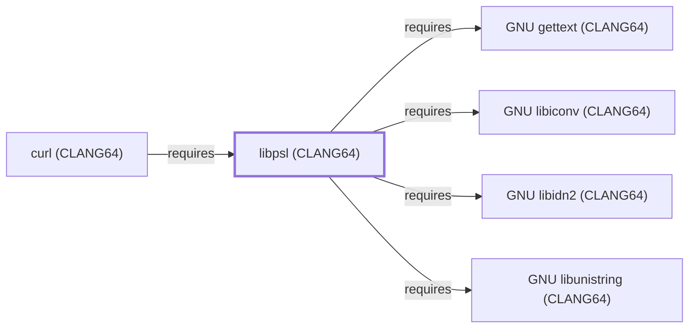

# libpsl (CLANG64)

<!-- BEGIN GENERATED object-facts -->

| Model fact | Value |
| --- | --- |
| Object | `library:libpsl:libpsl@clang64` |
| Kind | `library` |
| Status | `partial` |
| Confidence | `high` |
| Authority | libpsl project |
| Environments | `clang64` |
| Upstream | <https://github.com/rockdaboot/libpsl> |
| Packaged as | `package:msys2:mingw-w64-clang-x86_64-libpsl` |
| Version (observed) | 0.21.5-3 |
| License (observed) | spdx:MIT |
| Architecture (observed) | any |
| Installed size (observed) | 254.9 KB |

**Evidence on this object**

- `evidence:catalog:current` — MSYS2 pacman package catalog (`observed`, retrieved 2026-07-29)
- `evidence:libpsl:manual-2026-07-30` — libpsl (GitHub project page) (`primary`, retrieved 2026-07-30)

Generated from the composed model by `tools/build_object_facts.py`. Observed values come from the catalog snapshot and change when it is refreshed.
Edits between the surrounding markers are overwritten on the next build.

<!-- END GENERATED object-facts -->

## Purpose

This page documents `package:msys2:mingw-w64-clang-x86_64-libpsl`, the
CLANG64-environment build of libpsl — a Public Suffix List library
used to correctly determine registrable domain boundaries (e.g.
distinguishing `example.co.uk` from a subdomain of `.co.uk`). It is
the top of this batch's second CLANG64 chain (libunistring → libidn2 →
this page). See the
[official libpsl project page](https://github.com/rockdaboot/libpsl)
for the full reference.

## Architectural Classification

`library:libpsl:libpsl@clang64` is packaged as
`package:msys2:mingw-w64-clang-x86_64-libpsl` (version `0.21.5-3` in
the current catalog snapshot, license `MIT`) — a separately built,
separate catalog entity from [libpsl (UCRT64)](LIBPSL-UCRT64.md). It
belongs to the CLANG64 environment. All four of its own recorded
runtime dependencies were already modeled entities in this knowledge
base before this page was written, letting this addition close its
full dependency footprint in a single pass.

## Responsibilities

- Providing Public Suffix List lookups for CLANG64-native consumers to
  correctly determine cookie-domain and TLS-certificate-scope
  boundaries, the same role
  [libpsl (UCRT64)](LIBPSL-UCRT64.md#responsibilities) documents for
  its own environment.

## Boundaries

This page's package serves CLANG64-environment consumers specifically;
[curl (UCRT64)](CURL-UCRT64.md) instead depends on
[libpsl (UCRT64)](LIBPSL-UCRT64.md#reverse-dependencies) — the two are
not interchangeable, matching the same distinction already drawn
throughout this volume for MSYS/UCRT64/CLANG64 sibling packages.

## Interfaces

- The libpsl C API (`psl_is_public_suffix`, `psl_registrable_domain`,
  and related functions), the same interface
  [libpsl (UCRT64)](LIBPSL-UCRT64.md#interfaces) documents, per the
  documentation.

## Dependencies

The catalog snapshot records four `runtime-depends-on` edges for
`package:msys2:mingw-w64-clang-x86_64-libpsl`, all now modeled in this
knowledge base:

| Dependency | Package | Architectural reason |
| --- | --- | --- |
| [GNU gettext (CLANG64)](GNU-GETTEXT-CLANG64.md) | `package:msys2:mingw-w64-clang-x86_64-gettext-runtime` | Backs gettext-based message translation (NLS) for libpsl's own diagnostic output. |
| [GNU libiconv (CLANG64)](GNU-LIBICONV-CLANG64.md) | `package:msys2:mingw-w64-clang-x86_64-libiconv` | Backs character-set conversion for libpsl's own domain-name handling. |
| [GNU libidn2 (CLANG64)](GNU-LIBIDN2-CLANG64.md) | `package:msys2:mingw-w64-clang-x86_64-libidn2` | Backs internationalized domain name (IDNA2008) matching against the Public Suffix List. |
| [GNU libunistring (CLANG64)](GNU-LIBUNISTRING-CLANG64.md) | `package:msys2:mingw-w64-clang-x86_64-libunistring` | Backs Unicode string handling for libpsl's own domain matching. |

## Reverse Dependencies

The catalog snapshot records 10 relationships targeting
`package:msys2:mingw-w64-clang-x86_64-libpsl`. One is now modeled in
this knowledge base: [curl (CLANG64)](CURL-CLANG64.md)
(`relationship:foundation-libraries:curl-clang64-requires-libpsl-clang64`,
added 2026-08-02). The remaining recorded dependents (`curl-gnutls`,
`curl-winssl`, `libsoup3`, `qemu`, `qemu-image-util`,
`transmission-cli`, `transmission-gtk`, `transmission-qt`, `wget2`) are
not individually modeled as entities in this knowledge base; see the
[reverse dependency impact analysis](REVERSE-DEPENDENCY-IMPACT-ANALYSIS.md)
for the current full list.

## Configuration

libpsl has no persistent configuration file; the suffix list is
compiled into the library or loaded from a bundled data file at
build time.

## Initialization and Execution Flow

As a library, libpsl has no independent process lifecycle: it
initializes and executes within the process of whatever program links
against it. As a native MinGW-w64 library, this process model is
Windows-facing directly rather than mediated by `msys-2.0.dll`.

## Runtime Behavior

Identical functional behavior to
[libpsl (UCRT64)](LIBPSL-UCRT64.md#runtime-behavior); see that page
for detail not specific to the CLANG64/UCRT64 packaging distinction.

## Compatibility and Variants

The CLANG64 and UCRT64 libpsl packages are separately versioned
catalog entities (see Architectural Classification); code built
against one is not automatically compatible with the other without
matching the correct environment.

## Security Considerations

Incorrect Public Suffix List determination is a documented general
source of cookie-scoping and same-origin-policy vulnerabilities in
consuming programs; this page does not assert this specific package
version's mitigation status. See
[Threat Model and Supply Chain](THREAT-MODEL-AND-SUPPLY-CHAIN.md) for
the project's general supply-chain posture; no version-qualified CVE
review has been performed for the recorded `0.21.5-3` version.

## Failure Modes and Diagnostics

A dependent program's incorrect domain-boundary determination should
be checked against the currency of libpsl's bundled suffix list before
being treated as a defect in the consuming program's own logic.

## Evidence, Assumptions, and Open Questions

Public Suffix List matching scope is backed by the official libpsl
project page (`evidence:libpsl:manual-2026-07-30`), the same evidence
record [libpsl (UCRT64)](LIBPSL-UCRT64.md) cites. Package identity,
version, license, and all four recorded dependency edges are backed
by the pacman catalog snapshot (`evidence:catalog:current`). Open: the
ten recorded reverse dependents are not individually modeled in this
knowledge base.

<!-- BEGIN GENERATED dependency-subgraph -->

## Dependency Diagram

Dependencies and dependents of `library:libpsl:libpsl@clang64` in the composed graph: 1 dependent and 4 dependencies.

Generated from the composed model by `tools/build_object_diagrams.py`.
Edits between the surrounding markers are overwritten on the next build.

<!-- END GENERATED dependency-subgraph -->

## Related Objects

- [MSYS2 Library Architecture](LIBRARIES-ARCHITECTURE.md)
- [libpsl (UCRT64)](LIBPSL-UCRT64.md)
- [GNU gettext (CLANG64)](GNU-GETTEXT-CLANG64.md)
- [GNU libiconv (CLANG64)](GNU-LIBICONV-CLANG64.md)
- [GNU libidn2 (CLANG64)](GNU-LIBIDN2-CLANG64.md)
- [GNU libunistring (CLANG64)](GNU-LIBUNISTRING-CLANG64.md)
- [curl (CLANG64)](CURL-CLANG64.md)
