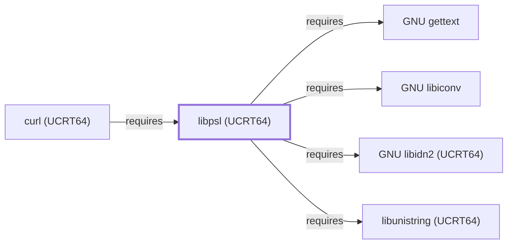

# libpsl (UCRT64)

## Purpose

This page documents the **UCRT64-environment** libpsl package
specifically — a library for parsing and evaluating a domain name
against Mozilla's Public Suffix List — depended on by
[curl (UCRT64)](CURL-UCRT64.md) for cookie-domain-scoping safety,
closing one of the sub-dependencies that page's own Dependencies
section had left explicitly unmodeled. See the
[official libpsl project page](https://github.com/rockdaboot/libpsl)
for the full reference.

## Architectural Classification

`library:libpsl:libpsl@ucrt64` is packaged in the UCRT64 environment as
`package:msys2:mingw-w64-ucrt-x86_64-libpsl` (version `0.21.5-3` in
the current catalog snapshot, license `MIT`) — a separately built,
separate catalog entity from [libpsl (MSYS)](LIBPSL.md)'s `libpsl`
package. This is the package [curl (UCRT64)](CURL-UCRT64.md) — a
UCRT64-native component itself — actually depends on.

## Responsibilities

- Providing Public Suffix List parsing and evaluation, consumed by
  [curl (UCRT64)](CURL-UCRT64.md#dependencies) to prevent cookies from
  being set for an overly broad, publicly-registrable domain suffix.

## Boundaries

This page's package serves UCRT64-environment consumers specifically;
[curl (MSYS)](CURL.md) and [libcurl (MSYS)](LIBCURL.md) instead depend
on [libpsl (MSYS)](LIBPSL.md#reverse-dependencies) — the two are not
interchangeable, matching the same distinction already made throughout
this volume for MSYS/UCRT64 sibling pairs.

## Interfaces

- The libpsl C API (`psl_is_public_suffix`, `psl_registrable_domain`,
  and related functions), the same interface
  [libpsl (MSYS)](LIBPSL.md#interfaces) documents, per the
  documentation.

## Dependencies

The UCRT64 `package:msys2:mingw-w64-ucrt-x86_64-libpsl` declares
dependencies on [GNU libiconv](GNU-LIBICONV.md) (character-set
conversion, `relationship:foundation-libraries:libpsl-ucrt64-requires-libiconv`),
[GNU libidn2 (UCRT64)](GNU-LIBIDN2-UCRT64.md) (internationalized
domain name processing for non-ASCII domain labels,
`relationship:foundation-libraries:libpsl-ucrt64-requires-libidn2-ucrt64`),
[GNU libunistring (UCRT64)](GNU-LIBUNISTRING-UCRT64.md) (Unicode
string processing,
`relationship:foundation-libraries:libpsl-ucrt64-requires-libunistring-ucrt64`),
and [GNU gettext](GNU-GETTEXT.md) (gettext-based message translation,
`relationship:foundation-libraries:libpsl-ucrt64-requires-gettext`) —
all UCRT64-environment sibling libraries.

## Reverse Dependencies

The catalog snapshot records 10 relationships targeting
`package:msys2:mingw-w64-ucrt-x86_64-libpsl`. One is now modeled in
this knowledge base: [curl (UCRT64)](CURL-UCRT64.md)
(`relationship:foundation-libraries:curl-ucrt64-requires-libpsl-ucrt64`).
The remaining recorded dependents (`libsoup3`, `qemu`,
`qemu-image-util`, `transmission-cli`, `transmission-gtk`,
`transmission-qt`, and `wget2`) are not individually modeled in this
knowledge base; see the
[reverse dependency impact analysis](REVERSE-DEPENDENCY-IMPACT-ANALYSIS.md)
for the current full list.

## Configuration

libpsl has no persistent configuration file; behavior is controlled
entirely through its C API by the calling program, using a bundled or
system-provided Public Suffix List data file.

## Initialization and Execution Flow

As a library, libpsl has no independent process lifecycle: it
initializes and executes within the process of whatever program links
against it — [curl (UCRT64)](CURL-UCRT64.md) in this dependency chain.
As a native MinGW-w64 library, this process model is Windows-facing
directly rather than mediated by `msys-2.0.dll`.

## Runtime Behavior

Identical functional behavior to
[libpsl (MSYS)](LIBPSL.md#runtime-behavior); see that page for detail
not specific to the UCRT64/MSYS packaging distinction.

## Compatibility and Variants

The UCRT64 and MSYS libpsl packages are separately versioned catalog
entities (see Architectural Classification); code built against one is
not automatically compatible with the other without matching the
correct package/environment.

## Security Considerations

libpsl's Public Suffix List check is a defense-in-depth measure
against cookie-scope abuse ("supercookies"); this page does not assert
this specific package version's completeness against the current
Public Suffix List. See
[Threat Model and Supply Chain](THREAT-MODEL-AND-SUPPLY-CHAIN.md) for
the project's general supply-chain posture; no version-qualified CVE
review has been performed for the recorded `0.21.5-3` version.

## Failure Modes and Diagnostics

A curl cookie unexpectedly rejected or accepted across domain
boundaries should be checked against libpsl's own Public Suffix List
matching logic before being treated as a curl defect.

## Evidence, Assumptions, and Open Questions

Public Suffix List parsing/evaluation scope is backed by the official
libpsl project page (`evidence:libpsl:manual-2026-07-30`), the same
evidence record [libpsl (MSYS)](LIBPSL.md) cites. Package identity,
version, license, and the recorded dependency/dependent edges are
backed by the pacman catalog snapshot (`evidence:catalog:current`).
Open, and explicitly out of scope for this page: the remaining
recorded dependents not individually modeled, and header-level API
surface / PE import/export-level evidence, per the
[Library Family Classification](LIBRARY-FAMILY-CLASSIFICATION.md)
methodology.

<!-- BEGIN GENERATED dependency-subgraph -->

## Dependency Diagram

Dependencies and dependents of `library:libpsl:libpsl@ucrt64` in the composed graph: 1 dependent and 4 dependencies.

Generated from the composed model by `tools/build_object_diagrams.py`.
Edits between the surrounding markers are overwritten on the next build.

<!-- END GENERATED dependency-subgraph -->

## Related Objects

- [MSYS2 Library Architecture](LIBRARIES-ARCHITECTURE.md)
- [libpsl (MSYS)](LIBPSL.md)
- [curl (UCRT64)](CURL-UCRT64.md)
- [GNU libidn2 (UCRT64)](GNU-LIBIDN2-UCRT64.md)
- [GNU libunistring (UCRT64)](GNU-LIBUNISTRING-UCRT64.md)
- [libpsl (CLANG64)](LIBPSL-CLANG64.md)
