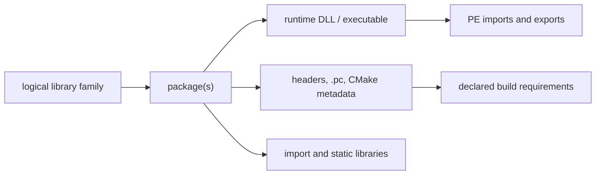

# MSYS2 Library Architecture

This volume organizes library families as logical interfaces connected to
separate package, binary, development, and dependency objects. It is a
navigation layer over the canonical package-inventory evidence in Volume 11;
it does not make package names or file suffixes into ABI claims.

## Architecture layers

| Question | Canonical evidence | Not established by that evidence |
| --- | --- | --- |
| Which package owns a library-related path? | Snapshot-qualified package/file ownership | Local byte presence or ABI compatibility |
| What does a DLL declare or export? | Hash-qualified PE import/export analysis | Dynamic loader selection or successful execution |
| Which headers and metadata describe a consumption surface? | Package paths plus parsed `.pc`/CMake metadata | Public API stability or a successful build |
| Which archive members exist? | Hash-qualified archive-member inventory | Runtime behavior or object-level ABI compatibility |
| Which binaries consume a DLL? | Static `imports-dll` relationships in one observation | Transitive runtime loading or reverse package dependency |

## First library pages

[libstdc++](LIBSTDCXX.md), [libc++](LIBCXX.md), [zlib](ZLIB.md),
[GNU libiconv](GNU-LIBICONV.md), [GNU gettext](GNU-GETTEXT.md),
[Expat](EXPAT.md), [libxml2](LIBXML2.md), [ICU](ICU.md), [Boost](BOOST.md),
[SQLite](SQLITE3.md), [GNU Readline](GNU-READLINE.md),
[GNU MP (GMP)](GNU-GMP.md), [GNU MPFR](GNU-MPFR.md), [GNU MPC](GNU-MPC.md),
[isl](LIBISL.md), [libwinpthread](LIBWINPTHREAD.md),
[winpthreads](WINPTHREADS.md), [PCRE2](PCRE2.md),
[libgpg-error](LIBGPG-ERROR.md), [libgcrypt](LIBGCRYPT.md),
[libassuan](LIBASSUAN.md), [libksba](LIBKSBA.md),
[nPth](NPTH.md), [Nettle](NETTLE.md), [GnuTLS](GNUTLS.md),
[GNU libidn2](GNU-LIBIDN2.md), [GNU Libtasn1](GNU-LIBTASN1.md),
[p11-kit](P11-KIT.md), [libpsl](LIBPSL.md),
[GNU libunistring](GNU-LIBUNISTRING.md), [libnghttp2](LIBNGHTTP2.md),
[libnghttp3](LIBNGHTTP3.md), [libngtcp2](LIBNGTCP2.md),
[libedit](LIBEDIT.md), [libxcrypt](LIBXCRYPT.md),
[libfido2](LIBFIDO2.md), [Heimdal](HEIMDAL.md), [cppdap](CPPDAP.md),
[JsonCpp](JSONCPP.md), [libarchive](LIBARCHIVE.md), [libuv](LIBUV.md),
[RHash](RHASH.md), [file](FILE.md), [GNU termcap](GNU-TERMCAP.md),
[WinEditLine](WINEDITLINE.md), [libgcrypt (MSYS)](LIBGCRYPT-MSYS.md),
[libassuan (MSYS)](LIBASSUAN-MSYS.md), [libksba (MSYS)](LIBKSBA-MSYS.md),
[nPth (MSYS)](NPTH-MSYS.md), [Nettle (MSYS)](NETTLE-MSYS.md),
[libgpg-error (MSYS)](LIBGPG-ERROR-MSYS.md),
[GNU libintl](GNU-LIBINTL.md), [libcurl](LIBCURL.md),
[PCRE2 (MSYS)](PCRE2-MSYS.md), [PCRE (MSYS)](PCRE-MSYS.md),
[GNU Readline (MSYS)](GNU-READLINE-MSYS.md),
[GNU Libltdl](GNU-LIBLTDL.md), [Zstandard (library)](LIBZSTD.md),
[LLVM libraries](LLVM-LIBS.md), [Clang libraries](CLANG-LIBS.md),
[xxHash](XXHASH.md), [liblzma](LIBLZMA.md),
[GNU libiconv (MSYS)](GNU-LIBICONV-MSYS.md), [GNU MP (MSYS)](GNU-GMP-MSYS.md),
[Expat (MSYS)](EXPAT-MSYS.md), [libxml2 (MSYS)](LIBXML2-MSYS.md),
[zlib (CLANG64)](ZLIB-CLANG64.md), [Zstandard (CLANG64)](LIBZSTD-CLANG64.md),
[libcbor](LIBCBOR.md), [Heimdal runtime libraries](HEIMDAL-LIBS.md),
[zlib (MSYS)](ZLIB-MSYS.md), [Brotli](BROTLI.md),
[ca-certificates](CA-CERTIFICATES.md), [libssh2](LIBSSH2.md),
[Zstandard (MSYS library)](LIBZSTD-MSYS.md), [libbz2](LIBBZ2.md),
[GNU MPFR (MSYS)](GNU-MPFR-MSYS.md), [libnettle (MSYS)](LIBNETTLE-MSYS.md),
[Hogweed (MSYS)](LIBHOGWEED-MSYS.md), [libopenssl](LIBOPENSSL.md),
[ncurses (UCRT64)](NCURSES-UCRT64.md), [libxml2 (CLANG64)](LIBXML2-CLANG64.md),
[liblzma (CLANG64)](LIBLZMA-CLANG64.md),
[winpthreads (CLANG64)](WINPTHREADS-CLANG64.md),
[libwinpthread (CLANG64)](LIBWINPTHREAD-CLANG64.md),
[libffi (MSYS)](LIBFFI-MSYS.md), [libffi (CLANG64)](LIBFFI-CLANG64.md),
[curl (UCRT64)](CURL-UCRT64.md), [OpenSSL (UCRT64)](OPENSSL-UCRT64.md), [Brotli (UCRT64)](BROTLI-UCRT64.md),
[libssh2 (UCRT64)](LIBSSH2-UCRT64.md),
[c-ares (UCRT64)](C-ARES-UCRT64.md),
[GNU libunistring (UCRT64)](GNU-LIBUNISTRING-UCRT64.md),
[GNU libidn2 (UCRT64)](GNU-LIBIDN2-UCRT64.md),
[libpsl (UCRT64)](LIBPSL-UCRT64.md),
[ca-certificates (UCRT64)](CA-CERTIFICATES-UCRT64.md),
[libnghttp2 (UCRT64)](LIBNGHTTP2-UCRT64.md),
[libngtcp2 (UCRT64)](LIBNGTCP2-UCRT64.md),
[libnghttp3 (UCRT64)](LIBNGHTTP3-UCRT64.md),
[libffi (UCRT64)](LIBFFI-UCRT64.md),
[GNU Libtasn1 (UCRT64)](GNU-LIBTASN1-UCRT64.md),
[p11-kit (UCRT64)](P11-KIT-UCRT64.md),
[GnuTLS (UCRT64)](GNUTLS-UCRT64.md),
[liblzma (MSYS)](LIBLZMA-MSYS.md), [liblz4 (MSYS)](LIBLZ4-MSYS.md),
[libarchive (MSYS)](LIBARCHIVE-MSYS.md),
[xxHash (MSYS)](XXHASH-MSYS.md),
[libsqlite (MSYS)](LIBSQLITE-MSYS.md),
[libsasl (MSYS)](LIBSASL-MSYS.md),
[popt (MSYS)](POPT-MSYS.md),
[LZO (MSYS)](LIBLZO2-MSYS.md), [APR](APR-MSYS.md),
[APR-util](APR-UTIL-MSYS.md), [Serf](LIBSERF-MSYS.md),
[GPGME (MSYS)](LIBGPGME-MSYS.md),
[GMP (CLANG64)](GNU-GMP-CLANG64.md),
[GNU MPFR (CLANG64)](GNU-MPFR-CLANG64.md),
[Nettle (CLANG64)](NETTLE-CLANG64.md),
[isl (CLANG64)](LIBISL-CLANG64.md),
[GNU MPC (CLANG64)](GNU-MPC-CLANG64.md),
[Brotli (CLANG64)](BROTLI-CLANG64.md),
[c-ares (CLANG64)](C-ARES-CLANG64.md),
[GNU libiconv (CLANG64)](GNU-LIBICONV-CLANG64.md),
[GNU gettext (CLANG64)](GNU-GETTEXT-CLANG64.md),
[GNU Libtasn1 (CLANG64)](GNU-LIBTASN1-CLANG64.md),
[p11-kit (CLANG64)](P11-KIT-CLANG64.md),
[ca-certificates (CLANG64)](CA-CERTIFICATES-CLANG64.md),
[GNU libunistring (CLANG64)](GNU-LIBUNISTRING-CLANG64.md),
[GNU libidn2 (CLANG64)](GNU-LIBIDN2-CLANG64.md),
[libpsl (CLANG64)](LIBPSL-CLANG64.md),
[libgpg-error (CLANG64)](LIBGPG-ERROR-CLANG64.md),
[libgcrypt (CLANG64)](LIBGCRYPT-CLANG64.md),
[libassuan (CLANG64)](LIBASSUAN-CLANG64.md),
[libksba (CLANG64)](LIBKSBA-CLANG64.md),
[OpenSSL (CLANG64)](OPENSSL-CLANG64.md),
[libssh2 (CLANG64)](LIBSSH2-CLANG64.md),
[bzip2 (CLANG64)](BZIP2-CLANG64.md),
[BLAKE2 (libb2) (CLANG64)](LIBB2-CLANG64.md),
[LZ4 (CLANG64)](LZ4-CLANG64.md),
[WinEditLine (CLANG64)](WINEDITLINE-CLANG64.md),
[Expat (CLANG64)](EXPAT-CLANG64.md),
[PCRE2 (CLANG64)](PCRE2-CLANG64.md),
[libarchive (CLANG64)](LIBARCHIVE-CLANG64.md),
[libnghttp2 (CLANG64)](LIBNGHTTP2-CLANG64.md),
[libnghttp3 (CLANG64)](LIBNGHTTP3-CLANG64.md),
[GnuTLS (CLANG64)](GNUTLS-CLANG64.md),
[libngtcp2 (CLANG64)](LIBNGTCP2-CLANG64.md),
[curl (CLANG64)](CURL-CLANG64.md),
[bzip2 (UCRT64)](BZIP2-UCRT64.md), [LZ4 (UCRT64)](LZ4-UCRT64.md),
[ncurses (CLANG64)](NCURSES-CLANG64.md), [libcbor (UCRT64)](LIBCBOR-UCRT64.md),
[libcbor (CLANG64)](LIBCBOR-CLANG64.md), [libfido2 (UCRT64)](LIBFIDO2-UCRT64.md),
[libfido2 (CLANG64)](LIBFIDO2-CLANG64.md), and
[BLAKE2 (libb2) (UCRT64)](LIBB2-UCRT64.md) are
this volume's first
per-library pages. The
first pair resolved the "C++ library" row the
[Toolchain Role Model](TOOLCHAIN-ROLE-MODEL.md) left open; the rest are
foundational libraries cited by dependency rationale across dozens of
pages elsewhere in this knowledge base (character-set conversion, NLS,
DEFLATE compression, XML parsing) that had not yet been given pages of
their own. zlib's 299 recorded reverse dependents make it the
most-depended-upon package identified anywhere in this knowledge base to
date (`claim:library:zlib:hub`). One cross-package mixup was caught and
corrected while writing [SQLite](SQLITE3.md): GnuPG depends on a
*separate*, MSYS-environment `libsqlite` package, not the UCRT64
`sqlite3` package this page documents — the same upstream project, two
distinct catalog entities, now stated explicitly rather than conflated.
All one hundred and fifty-seven pages are deliberately scoped to package/dependency-level
evidence only — package identity, bundling, provides/depends
relationships, and reverse-dependency counts — and all explicitly flag
that the fuller methodology below (headers, `pkg-config`/CMake metadata,
PE import/export analysis) has not been applied to them and remains open.
[winpthreads](WINPTHREADS.md) goes further and states outright that most
of its own headings could not be filled in at this evidence level. Its
relationship to [libwinpthread](LIBWINPTHREAD.md) started as a
medium-confidence dev/runtime-split inference and was revised down to
`low` after discovering a third package, `winpthreads-stub`, that
`provides`/`conflicts` with `winpthreads` as a near-empty placeholder —
new evidence that complicated the original theory rather than confirming
it, recorded as such rather than quietly dropped. The GnuPG crypto-stack
pages ([libgpg-error](LIBGPG-ERROR.md), [libgcrypt](LIBGCRYPT.md),
[libassuan](LIBASSUAN.md), [libksba](LIBKSBA.md), [nPth](NPTH.md),
[Nettle](NETTLE.md), and [GnuTLS](GNUTLS.md)) also close a loop back into
Volume 5: `component:gnupg:gnupg` now has explicit `requires` edges to
each of them, rather than the dependencies living only in
[GnuPG's](GNUPG.md) own prose table. [GnuTLS](GNUTLS.md) closes a second
such loop into `component:gnu:emacs`, whose
[dependency table](GNU-EMACS.md#dependencies) already cited it by package
name before this page existed. [GnuTLS's](GNUTLS.md) own sub-dependencies
were themselves left as an explicitly open item on first publication;
[GNU libidn2](GNU-LIBIDN2.md), [GNU Libtasn1](GNU-LIBTASN1.md), and
[p11-kit](P11-KIT.md) close that item with three more pages and `requires`
edges from `library:gnutls:gnutls`, following the dependency chain one
level deeper than any other family in this volume has gone so far. The
same pattern was then applied to [curl's](CURL.md) own directly-declared
dependencies: [libpsl](LIBPSL.md), [GNU libunistring](GNU-LIBUNISTRING.md),
[libnghttp2](LIBNGHTTP2.md), [libnghttp3](LIBNGHTTP3.md), and
[libngtcp2](LIBNGTCP2.md) now each have pages and `requires` edges from
`component:curl:curl`, plus their own inter-library edges where the
catalog records them (libpsl on libidn2 and libunistring, p11-kit on
libtasn1). One dependency was deliberately left as a prose-only mention
rather than a graph edge: libidn2 is a dependency of `libcurl`, curl's own
transfer library, not of the `curl` CLI package itself, so no `requires`
edge from `component:curl:curl` to `library:gnu:libidn2` was added,
recorded explicitly on [GNU libidn2's own page](GNU-LIBIDN2.md#reverse-dependencies)
rather than silently added or silently omitted. The same
directly-declared-dependency pattern was applied a third time to
[OpenSSH's](OPENSSH.md) remaining uncovered dependencies:
[libedit](LIBEDIT.md), [libxcrypt](LIBXCRYPT.md),
[libfido2](LIBFIDO2.md), and [Heimdal](HEIMDAL.md) now each have pages
and `requires` edges from `component:openssh:openssh`, closing every
dependency edge in OpenSSH's own table to a page of its own except
[OpenSSL](OPENSSL.md), which already had one from Volume 5. The same
pattern crossed volumes for the first time in this batch:
[CMake's](CMAKE.md) own dependency table (Volume 8) named
[cppdap](CPPDAP.md), [JsonCpp](JSONCPP.md), [libarchive](LIBARCHIVE.md),
[libuv](LIBUV.md), and [RHash](RHASH.md) by package without pages of
their own; all five are now modeled here in Volume 6, each with a
`requires` edge from `component:cmake:cmake`, and
[libarchive's](LIBARCHIVE.md) own UCRT64 sub-dependencies close a further
loop onto four libraries this volume already documented
([Expat](EXPAT.md), [GNU libiconv](GNU-LIBICONV.md), [PCRE2](PCRE2.md),
[zlib](ZLIB.md)), each of which now lists libarchive as a reverse
dependent in its own Related Objects. These five are also this volume's
first UCRT64-native library pages sourced from a cross-volume dependency
table rather than a Volume 5 MSYS component's, following the same
`contains`/`packaged-by` pattern (without a `uses-runtime` edge to
`msys-2.0.dll`) already established for [libstdc++](LIBSTDCXX.md),
[Expat](EXPAT.md), and the other native libraries earlier in this
volume. A final small batch mopped up three remaining single-dependency
items already named by package elsewhere in this knowledge base but
never modeled: [file](FILE.md) (a [GNU Nano](GNU-NANO.md) dependency,
Volume 5), [GNU termcap](GNU-TERMCAP.md) (GNU Readline's sole recorded
dependency), and [WinEditLine](WINEDITLINE.md) (a [PCRE2](PCRE2.md)
dependency, and the native-Windows-Console counterpart to
[libedit](LIBEDIT.md), which targets the MSYS/POSIX-emulated terminal
instead). A final batch corrected a genuine pre-existing modeling error
rather than adding new coverage: five `requires` edges from
`component:gnupg:gnupg` (to `libgcrypt`, `libassuan`, `libksba`, `nPth`,
and `Nettle`) had pointed at this volume's UCRT64-packaged entities for
those names, when `package:msys2:gnupg` is itself an MSYS-environment
package whose actual catalog-recorded dependencies are separately
versioned MSYS sibling packages — in two cases (`libassuan`, `libksba`)
a full major version apart. The five edges are now corrected to point at
six new `(MSYS)`-suffixed pages
([libgcrypt](LIBGCRYPT-MSYS.md), [libassuan](LIBASSUAN-MSYS.md),
[libksba](LIBKSBA-MSYS.md), [nPth](NPTH-MSYS.md), [Nettle](NETTLE-MSYS.md),
and [libgpg-error](LIBGPG-ERROR-MSYS.md), the last added because the
other three depend on it in turn), and the five original UCRT64 pages
were rewritten to remove their now-false GnuPG-dependency claims rather
than silently left inconsistent with the corrected graph. This is the
fourth and largest instance of the MSYS/UCRT64 conflation risk this
volume has caught this session, after the SQLite mixup, the avoided
libcurl mismatch, and GnuTLS's own careful environment check — this one
was not caught before publication, only discovered afterward while
investigating a follow-on batch, and is recorded as such rather than
quietly corrected without a trace. A systematic re-sweep of every
Volume 5 and Volume 8 dependency table for still-undocumented package
names then surfaced [GNU libintl](GNU-LIBINTL.md), the MSYS gettext
runtime — with 59 recorded reverse dependents, the single most
widely-depended-upon library discovered in this session, ahead of
zlib's 299 total reverse dependents only because zlib's count spans both
environments where libintl's is MSYS-only. Sixteen already-documented
entities (eleven Volume 5 components, one Volume 8 component, and four
Volume 6 libraries) now have explicit `requires` edges to it, closing
every libintl citation this sweep found across the two volumes in a
single pass. The same sweep also caught one small standalone gap: Vim's
own `libxcrypt` dependency, already correctly identified in Vim's prose
as the same package OpenSSH depends on, had never been given a formal
graph edge or cross-link — both are now added. One more gap the sweep
found: `libcurl` itself, curl's own transfer library, was cited by
package name on both [curl's](CURL.md) and [GnuPG's](GNUPG.md) pages —
two independent consumers — without ever being modeled as an entity of
its own. [libcurl's](LIBCURL.md) new page picks up six sibling-library
`requires` edges essentially for free, since its own MSYS dependency
list happens to match six libraries this volume had already added while
covering curl's CLI dependencies directly. The same sweep also closed out
the MSYS PCRE pair: [PCRE2 (MSYS)](PCRE2-MSYS.md) (`libpcre2_8`, backing
Git's `--perl-regexp` and less's search) and [PCRE (MSYS)](PCRE-MSYS.md)
(`libpcre`, the older PCRE1 line GNU Grep's `-P` engine depends on
instead) — both already correctly distinguished in prose from this
volume's existing [PCRE2 (UCRT64)](PCRE2.md) page before these pages
existed, now given pages and graph edges of their own. Two more
single-item gaps closed this batch: [GNU Readline (MSYS)](GNU-READLINE-MSYS.md)
(`libreadline`, backing GnuPG's interactive prompts and gawk's built-in
debugger, distinct from this volume's existing UCRT64 Readline entity —
[GNU Readline (UCRT64)](GNU-READLINE.md)'s own page previously claimed
GnuPG as a direct dependent, corrected here the same way the GnuPG
crypto-stack pages were corrected earlier this session) and
[GNU Libltdl](GNU-LIBLTDL.md) (`libltdl`, Libtool's own companion
dlopen() wrapper library). A final batch expanded the sweep into Volume
8's LLVM/native-toolchain dependency tables for the first time:
[Zstandard (library)](LIBZSTD.md) (the UCRT64 `zstd` library backing
compressed debug sections in [GCC](GNU-GCC.md) and
[GNU Binutils](GNU-BINUTILS.md), a distinct catalog entity from the
MSYS `zstd` CLI tool Volume 5 already documents, with 94 recorded
reverse dependents — second only to
[GNU libintl's](GNU-LIBINTL.md) 59 among MSYS-only libraries, and the
widest of any UCRT64-native library added this session), plus
[LLVM libraries](LLVM-LIBS.md) and [Clang libraries](CLANG-LIBS.md)
(the CLANG64-packaged infrastructure underlying [LLD](LLD.md),
[LLDB](LLDB.md), and [Clang](CLANG.md) itself). Two already-modeled
libraries also picked up new dependency edges in this batch without new
pages: [zlib](ZLIB.md#reverse-dependencies) and
[GNU gettext](GNU-GETTEXT.md#related-objects) both gained `requires`
edges from GCC and/or Binutils, since those UCRT64 packages' own
dependency lists matched these existing entities exactly. A follow-on
pass through [GDB's](GNU-GDB.md) own dependency table (not yet checked
this session) found the richest single-page yield: eight of GDB's twelve
declared dependencies matched entities already modeled in this volume
(Expat, GNU MP, GNU MPFR, GNU libiconv, GNU Readline, GNU gettext, zlib,
Zstandard), each getting a new `requires` edge and cross-link, plus two
genuinely new libraries — [xxHash](XXHASH.md) (GDB's debug-info cache
hashing) and [liblzma](LIBLZMA.md) (GDB's xz-compressed debug-section
support, distinct from Volume 5's MSYS `xz` CLI tool the same way
Zstandard's library form is distinct from its own CLI sibling). A final
batch closed four more explicitly-flagged MSYS/UCRT64 gaps discovered
while re-reading this volume's own prior pages:
[GNU libiconv (MSYS)](GNU-LIBICONV-MSYS.md) (the widest fan-in of any
single addition this session — six already-documented entities,
[GnuTLS](GNUTLS.md), [GnuPG](GNUPG.md), [GNU Coreutils](GNU-COREUTILS.md),
[GNU libintl](GNU-LIBINTL.md), [GNU libunistring](GNU-LIBUNISTRING.md),
and [libgpg-error (MSYS)](LIBGPG-ERROR-MSYS.md), each had explicitly
declined or silently omitted this exact edge before now),
[GNU MP (MSYS)](GNU-GMP-MSYS.md) (closing an item
[GnuTLS's own page](GNUTLS.md#dependencies) stated outright it was
declining to model), [Expat (MSYS)](EXPAT-MSYS.md) (Git's XML
dependency), and [libxml2 (MSYS)](LIBXML2-MSYS.md) (GNU Emacs's XML
dependency). Fixing these also surfaced two more false GnuPG-style
claims this batch corrected in place rather than left standing:
[Expat (UCRT64)](EXPAT.md) had claimed Git as a direct dependent, and
[libxml2 (UCRT64)](LIBXML2.md) had claimed both GNU Emacs and LLDB as
direct dependents — Emacs actually depends on the MSYS sibling and LLDB
on a third, CLANG64-packaged sibling not modeled in this knowledge
base, neither the UCRT64 package this page documents. A further batch
picked up the previously-deferred CLANG64 compression siblings for
[LLD](LLD.md) and [LLDB](LLDB.md) —
[zlib (CLANG64)](ZLIB-CLANG64.md) and
[Zstandard (CLANG64)](LIBZSTD-CLANG64.md), the third distinct catalog
entity for each name alongside their MSYS and UCRT64 siblings — plus
two more small, previously-flagged single-dependent gaps:
[libcbor](LIBCBOR.md) (libfido2's CBOR encoding dependency) and
[Heimdal runtime libraries](HEIMDAL-LIBS.md) (Heimdal's own
CLI/library-package split, the same pattern already documented for
curl/libcurl and OpenSSL/libopenssl). Investigating libcbor surfaced one
more real error: [LIBFIDO2.md](LIBFIDO2.md#dependencies) had
misidentified its own `zlib` dependency as this knowledge base's UCRT64
zlib entity, when it is in fact a third, MSYS-packaged zlib sibling —
[zlib (MSYS)](ZLIB-MSYS.md), now modeled with 60 recorded reverse
dependents, six already documented in this knowledge base
([curl](CURL.md), [GNU Emacs](GNU-EMACS.md), [GnuPG](GNUPG.md),
[libcurl](LIBCURL.md), [libfido2](LIBFIDO2.md), and [file](FILE.md)),
matching [GNU libiconv (MSYS)](GNU-LIBICONV-MSYS.md)'s own six-dependent
fan-in as the widest found this session. A final batch closed
[libcurl's](LIBCURL.md) last four remaining declared dependencies,
completing full coverage of all twelve: [Brotli](BROTLI.md)
(`Content-Encoding: br`), [ca-certificates](CA-CERTIFICATES.md) (TLS
trust-store data, also a direct [curl](CURL.md) CLI dependency in its
own right), [libssh2](LIBSSH2.md) (`sftp://`/`scp://` support), and
[Zstandard (MSYS library)](LIBZSTD-MSYS.md) (`Content-Encoding: zstd`,
also a [file](FILE.md) dependency, closing another item that page had
left open). This knowledge base now documents three separately
versioned zlib catalog entities (MSYS, UCRT64, CLANG64) and four
separately versioned Zstandard entities (an MSYS CLI tool plus MSYS,
UCRT64, and CLANG64 library packages), each cross-linked to the others
rather than conflated. A follow-on batch closed
[libbz2](LIBBZ2.md), the Burrows-Wheeler codec library split from
[the bzip2 CLI](BZIP2.md), already cited by package name across five
already-documented pages ([bzip2](BZIP2.md), [file](FILE.md),
[GnuPG](GNUPG.md), [Info-ZIP Zip](INFO-ZIP-ZIP.md), and
[Info-ZIP UnZip](INFO-ZIP-UNZIP.md)) without ever being modeled as an
entity of its own — each now has a `requires` edge to it. Investigating
libbz2's remaining catalog dependents caught a near-miss before
publication rather than after: `package:msys2:pcre` and
`package:msys2:pcre2` also declare a `libbz2` dependency, but those are
the separate `pcregrep`/`pcre2grep` CLI meta-packages, not the
`libpcre`/`libpcre2_8` library packages this volume already documents
on [PCRE (MSYS)](PCRE-MSYS.md) and [PCRE2 (MSYS)](PCRE2-MSYS.md) — an
initial draft of libbz2's reverse-dependency edges pointed at those two
existing library entities before this distinction was caught and
corrected, so the edges were removed rather than left standing, and the
two meta-packages are recorded as an explicitly open, not-yet-modeled
item on [libbz2's own page](LIBBZ2.md#reverse-dependencies) instead.
A further batch closed
[GNU MPFR (MSYS)](GNU-MPFR-MSYS.md), gawk's `--bignum` arbitrary-precision
dependency, already cited by package name on
[GNU-AWK.md's dependency table](GNU-AWK.md#dependencies) — a distinct
catalog entity from this volume's existing
[GNU MPFR (UCRT64)](GNU-MPFR.md) page, the same MSYS-vs-native pattern
applied throughout this session, with its own `requires` edge back onto
[GNU MP (MSYS)](GNU-GMP-MSYS.md) closing an inter-library loop between
two now-modeled MSYS math libraries. A final batch closed the MSYS
Nettle sub-library pair GnuTLS and GNU Emacs actually depend on:
[libnettle (MSYS)](LIBNETTLE-MSYS.md) (GnuTLS's own direct Nettle
dependency, already flagged by name but not modeled on both
[GnuTLS's](GNUTLS.md) and [Nettle (MSYS)'s](NETTLE-MSYS.md) own pages)
and [Hogweed (MSYS)](LIBHOGWEED-MSYS.md) (Nettle's public-key
sublibrary, depended on by libnettle and directly by
[GNU Emacs](GNU-EMACS.md), already flagged on Emacs' own page). Modeling
these caught a real error rather than just filling a gap:
[Nettle (MSYS)'s](NETTLE-MSYS.md#dependencies) own Dependencies section
had stated `package:msys2:nettle` depends directly on `libhogweed`, but
the catalog's actual edge targets `libnettle` instead, with `libhogweed`
one level further down `libnettle`'s own dependency chain — corrected in
place rather than left standing, the same discipline applied to every
other conflation this session has caught. [Hogweed (MSYS)](LIBHOGWEED-MSYS.md)
also picked up a `requires` edge onto [GNU MP (MSYS)](GNU-GMP-MSYS.md)
for its own arbitrary-precision arithmetic needs, its fourth modeled
reverse dependent alongside GnuTLS, Coreutils, and MPFR. A final batch
closed [libopenssl](LIBOPENSSL.md), the OpenSSL runtime library split
from [the openssl CLI package](OPENSSL.md) — explicitly flagged as
not-yet-modeled on both [Heimdal runtime libraries'](HEIMDAL-LIBS.md)
and [libngtcp2's](LIBNGTCP2.md) own pages before this page existed, and
the widest reverse-dependency footprint of any library added in this
batch at 27 recorded catalog dependents. Modeling it closed
[libngtcp2's](LIBNGTCP2.md#dependencies) own previously-declined
dependency edge (corrected in place, 2026-07-30) in addition to picking
up the split-package edge from [openssl](OPENSSL.md) itself and a third
edge from [Heimdal runtime libraries](HEIMDAL-LIBS.md). A final pass
added no new pages but closed six missing graph edges found by
re-checking every already-modeled library's own dependents' prose
against the graph: [GCC's](GNU-GCC.md#dependencies) own dependency table
had cited `gmp`, `mpfr`, `mpc`, `isl`, and `winpthreads` by package name
since this page's first publication, each already backed by its own
page in this volume, but only its zlib/zstd edges had ever been added as
formal `requires` relationships — the five missing edges are now added.
[GNU Binutils'](GNU-BINUTILS.md#dependencies) own table had the same gap
for its `libwinpthread` dependency, alongside its already-modeled
zlib/zstd/gettext edges — that sixth edge is now added too. Both
corrections are recorded in place on the affected pages
(GNU-GCC.md, GNU-BINUTILS.md, GNU-GMP.md, GNU-MPFR.md, GNU-MPC.md,
LIBISL.md, WINPTHREADS.md, LIBWINPTHREAD.md) rather than silently
patched. That same re-check surfaced GDB's own missing `ncurses`
dependency edge — its dependency table cited
`mingw-w64-ucrt-x86_64-ncurses` by name, but this is a separate,
UCRT64-native catalog entity from the MSYS `ncurses` hub
([ncurses (MSYS)](NCURSES.md), 40 reverse dependents) rather than an
existing library missing an edge; [ncurses (UCRT64)](NCURSES-UCRT64.md)
is now modeled with its own `requires` edge from
[GDB](GNU-GDB.md#dependencies). The same pass closed two items
[LLDB's](LLDB.md#dependencies) own dependency table had left open:
[libxml2 (CLANG64)](LIBXML2-CLANG64.md) (correcting a false claim on
[libxml2 (UCRT64)](LIBXML2.md), which had listed LLDB as a direct
dependent before this CLANG64-packaged sibling was modeled — 126
recorded reverse dependents, the widest of any library added this
session) and [liblzma (CLANG64)](LIBLZMA-CLANG64.md) (explicitly
flagged as not-yet-modeled on [liblzma (UCRT64)'s](LIBLZMA.md) own page
before now). A final batch extended the same graph-completeness check
to Clang, closing its own missing `winpthreads` edge
([winpthreads (CLANG64)](WINPTHREADS-CLANG64.md), the third such
missing toolchain-to-threading-library edge found this session after
GCC and Binutils) and its companion
[libwinpthread (CLANG64)](LIBWINPTHREAD-CLANG64.md) (139 recorded
reverse dependents, a similarly wide footprint to the UCRT64 sibling's
152). Following that same dependency chain into
[LLVM libraries](LLVM-LIBS.md) surfaced a more serious defect than a
missing edge: that page's Dependencies section had flatly stated no
`runtime-depends-on` edges existed for the package, when the catalog in
fact records four — corrected in place with all four edges added,
closing [libffi (CLANG64)](LIBFFI-CLANG64.md) (a new entity) alongside
edges onto the already-modeled [libxml2 (CLANG64)](LIBXML2-CLANG64.md),
[zlib (CLANG64)](ZLIB-CLANG64.md), and
[Zstandard (CLANG64)](LIBZSTD-CLANG64.md). Modeling libffi (CLANG64)
also closed [libffi (MSYS)](LIBFFI-MSYS.md), p11-kit's own
foreign-function-interface dependency that page had explicitly left
unmodeled since its first publication. A systematic pass comparing
every already-modeled entity's catalog dependencies against its actual
graph `requires` edges — extending the GCC/Binutils/Clang
graph-completeness checks to the whole volume — surfaced nine more gaps
without needing a single new page, all between entities already
documented elsewhere in this knowledge base:
[GCC's](GNU-GCC.md#dependencies) own `gcc-libs`/`libstdc++` edge (a
sixth missing edge alongside the five found in the prior batch);
[RHash](RHASH.md#dependencies) and [liblzma (UCRT64)](LIBLZMA.md#dependencies)
both cited `gettext-runtime` as either stale ("not yet given its own
page," when [GNU gettext](GNU-GETTEXT.md) already had one) or flatly
false ("no dependencies," when the catalog records one); the same false
"no dependencies" claim on [Clang libraries](CLANG-LIBS.md#dependencies)
turned out to hide a real edge onto [LLVM libraries](LLVM-LIBS.md);
[GNU libidn2's](GNU-LIBIDN2.md#dependencies) own prose named
[libunistring](GNU-LIBUNISTRING.md) without a graph edge;
[libarchive's](LIBARCHIVE.md#dependencies) own Dependencies section had
explicitly declined edges to zstd and liblzma, reasoning only their
MSYS CLI-tool siblings existed at the time — both UCRT64 library
entities now exist, so the two declined edges are added; and
[CMake's](CMAKE.md#dependencies) own table had marked its Expat and
zlib rows "documented fully in" without either edge actually existing
in the graph. Every affected page's Dependencies, Reverse Dependencies,
Related Objects, and (where applicable) Evidence sections were updated
to match, following the same correct-in-place discipline used
throughout this session rather than silently patching the graph without
a trace. A final batch modeled [curl (UCRT64)](CURL-UCRT64.md), a
UCRT64-native curl package bundling both CLI and library — a third,
previously-unmodeled curl-named catalog entity alongside
[curl (MSYS)](CURL.md) and [libcurl (MSYS)](LIBCURL.md), with 67
recorded reverse dependents, the widest of any library added in this
batch. Modeling it corrected a genuine MSYS/UCRT64 conflation:
[CMake's](CMAKE.md#dependencies) own dependency table had claimed its
`mingw-w64-ucrt-x86_64-curl` dependency was "the same library
documented fully in [curl](CURL.md)" — false, since CURL.md documents
the MSYS CLI, a wholly separate catalog entity. A follow-on batch
closed the single highest-value item from that open list:
[OpenSSL (UCRT64)](OPENSSL-UCRT64.md), curl (UCRT64)'s HTTPS/TLS
dependency, with 124 recorded catalog dependents — the widest
reverse-dependency footprint of any library added in this session and
a third distinct OpenSSL-named catalog entity alongside
[openssl (MSYS)](OPENSSL.md) and [libopenssl (MSYS)](LIBOPENSSL.md).
Unlike the MSYS environment's CLI/library split, this UCRT64 package
bundles both together in one, the same non-split pattern
[curl (UCRT64)](CURL-UCRT64.md) itself follows. Modeling it also
closed a stale open item on
[libopenssl's own page](LIBOPENSSL.md#compatibility-and-variants),
which had stated no native OpenSSL package existed in this snapshot at
all — true only for the *split* `libopenssl` naming, not for OpenSSL
generally. A further batch closed three more of curl (UCRT64)'s open
dependencies: [Brotli (UCRT64)](BROTLI-UCRT64.md) and
[libssh2 (UCRT64)](LIBSSH2-UCRT64.md) (UCRT64-native siblings of
already-documented MSYS libraries, following the same MSYS/UCRT64
sibling pattern used throughout this volume — libssh2 (UCRT64) itself
picked up two more edges onto [OpenSSL (UCRT64)](OPENSSL-UCRT64.md) and
[zlib](ZLIB.md)), and [c-ares (UCRT64)](C-ARES-UCRT64.md), an
asynchronous DNS-resolution library and the first page in this
knowledge base for any c-ares package in any environment. A final batch
closed the remaining six and reached full dependency coverage for
curl (UCRT64), the second package this session (after
[libcurl (MSYS)](LIBCURL.md)) to reach 12/12 modeled dependencies:
[GNU libidn2 (UCRT64)](GNU-LIBIDN2-UCRT64.md) and
[libpsl (UCRT64)](LIBPSL-UCRT64.md) (which pulled in a third new
entity, [GNU libunistring (UCRT64)](GNU-LIBUNISTRING-UCRT64.md), one
level further down their own shared dependency chain — libpsl (UCRT64)
also depends directly on libidn2 (UCRT64), not just transitively
through libunistring), [ca-certificates (UCRT64)](CA-CERTIFICATES-UCRT64.md)
(closing the loop on [OpenSSL (UCRT64)'s](OPENSSL-UCRT64.md#dependencies)
own previously-unlinked optional dependency), and the HTTP/2, HTTP/3,
and QUIC trio [libnghttp2 (UCRT64)](LIBNGHTTP2-UCRT64.md),
[libngtcp2 (UCRT64)](LIBNGTCP2-UCRT64.md), and
[libnghttp3 (UCRT64)](LIBNGHTTP3-UCRT64.md) (libngtcp2 itself depending
on [OpenSSL (UCRT64)](OPENSSL-UCRT64.md) for QUIC's TLS 1.3 handshake).
A final batch closed that remaining open item: [GnuTLS (UCRT64)](GNUTLS-UCRT64.md),
libngtcp2 (UCRT64)'s second declared TLS backend, with 31 recorded
catalog dependents and eleven of its own twelve declared dependencies
already modeled elsewhere in this volume — one of the most densely
connected entities added this session. Closing it pulled in three more
new UCRT64-native entities one level further down GnuTLS's own
dependency chain: [libffi (UCRT64)](LIBFFI-UCRT64.md) (the third
distinct libffi-named entity in this knowledge base),
[GNU Libtasn1 (UCRT64)](GNU-LIBTASN1-UCRT64.md), and
[p11-kit (UCRT64)](P11-KIT-UCRT64.md) — the latter also closing a
second open item, [ca-certificates (UCRT64)'s](CA-CERTIFICATES-UCRT64.md)
own previously-unmodeled p11-kit dependency. GnuTLS (UCRT64)'s reverse
dependents include separate UCRT64-native `gnupg` and `emacs`
packages, distinct catalog entities from this knowledge base's MSYS
[GnuPG](GNUPG.md) and [GNU Emacs](GNU-EMACS.md) — flagged explicitly
rather than conflated, the same MSYS/UCRT64 discipline maintained
throughout this session. A final pass re-ran the volume-wide
catalog-vs-graph edge audit against the now-larger set of modeled
entities and found ten more closeable gaps, all between entities
already documented elsewhere in this knowledge base — no new pages:
[GnuTLS's](GNUTLS.md#dependencies) own long-declined `zlib` edge (the
correct MSYS zlib sibling now exists);
[libssh2's](LIBSSH2.md#dependencies) and
[libxml2 (MSYS)'s](LIBXML2-MSYS.md#dependencies) own dependency tables,
both of which had stated their sub-dependencies were "not individually
enumerated," closed with edges onto zlib (MSYS), ca-certificates,
OpenSSL, and GNU Readline (MSYS) respectively — the
[ca-certificates](CA-CERTIFICATES.md#reverse-dependencies) page's own
prior note that libssh2 "does not itself record a direct
`ca-certificates` dependency" was corrected in place, since the catalog
does in fact record one;
[Heimdal runtime libraries'](HEIMDAL-LIBS.md#dependencies) own
`libedit` and `libxcrypt` edges, the latter correcting a prior version
of that page which had only noted libxcrypt among heimdal-libs'
*reverse* dependents rather than as its own direct forward dependency;
[libarchive's](LIBARCHIVE.md#dependencies) own declined OpenSSL
(UCRT64) edge, closed now that page exists; and
[ncurses (UCRT64)'s](NCURSES-UCRT64.md#dependencies) own PCRE2 (UCRT64)
edge. A final batch found one genuinely new entity while re-checking
this same audit: `package:msys2:liblzma`, a distinct MSYS catalog
package cited on both [XZ Utils'](XZ-UTILS.md#dependencies) own
dependency table (the split library half of the `xz` CLI) and
[file's](FILE.md#dependencies) own page (explicitly flagged as "not
individually modeled" since first publication) — closing the last item
that page had left open. [liblzma (MSYS)](LIBLZMA-MSYS.md) is the
third distinct liblzma-named catalog entity in this knowledge base
alongside [liblzma (UCRT64)](LIBLZMA.md) and
[liblzma (CLANG64)](LIBLZMA-CLANG64.md); modeling it also closed
[XZ Utils'](XZ-UTILS.md#dependencies) own long-cited-but-unlinked
`libiconv` sub-dependency in the same pass. A further re-run of the
volume-wide audit closed eleven more edges between entities already
documented elsewhere in this knowledge base — no new pages: five
already-modeled MSYS components
([GNU Grep](GNU-GREP.md#dependencies), [GNU Findutils](GNU-FINDUTILS.md#dependencies),
[GNU Tar](GNU-TAR.md#dependencies), [GNU Emacs](GNU-EMACS.md#dependencies),
and [Vim](VIM.md#dependencies)) had each cited
[GNU libiconv (MSYS)](GNU-LIBICONV-MSYS.md) by name without a
corresponding graph edge, closing the same class of gap found earlier
for [XZ Utils](XZ-UTILS.md); [Zstandard (MSYS CLI tool)'s](ZSTD.md#dependencies)
own split-library edge onto [Zstandard (MSYS library)](LIBZSTD-MSYS.md)
was similarly unlinked; [GnuPG's](GNUPG.md#dependencies) own
`libgpg-error` edge and [libgpg-error's](LIBGPG-ERROR.md#dependencies)
own `gettext` edge were both cited with "documented fully in" links
that had no backing graph edge — the former also corrected a stale note
on [libgpg-error (MSYS)'s](LIBGPG-ERROR-MSYS.md#reverse-dependencies)
own page, which had explicitly declined to model GnuPG as a direct
dependent; [libstdc++'s](LIBSTDCXX.md#dependencies) own documented
`libwinpthread` dependency was missing its edge, the same
graph-completeness class as the GCC/Binutils/Clang findings earlier
this session; and [libxml2 (CLANG64)'s](LIBXML2-CLANG64.md#dependencies)
own zlib edge had been incorrectly grouped with its still-unmodeled
libiconv sub-dependency and declined, when zlib (CLANG64) was in fact
already modeled; and [GNU Cpio's](GNU-CPIO.md#dependencies) own
`libintl` edge, cited by name but never graphed. A subsequent audit
re-run confirmed no further edges remained (the only unmodeled catalog
dependencies left anywhere in the volume are `gcc-libs` boilerplate
rows, excluded by policy), so the next two additions came from the
split-library/CLI pattern instead: [liblz4 (MSYS)](LIBLZ4-MSYS.md), a
genuinely distinct MSYS package from [LZ4](LZ4.md)'s own CLI (Volume 5)
with 7 recorded reverse dependents, none yet modeled; and
[libarchive (MSYS)](LIBARCHIVE-MSYS.md), a separate catalog entity from
this volume's earlier UCRT64 [libarchive](LIBARCHIVE.md) page, which
closed its own **update** on that page's prior open question ("whether
other native environments package libarchive separately") and, at eight
non-boilerplate dependency edges in a single pass, has the widest real
dependency footprint of any MSYS library modeled to date — pulling
together [libbz2](LIBBZ2.md), [Expat (MSYS)](EXPAT-MSYS.md),
[GNU libiconv (MSYS)](GNU-LIBICONV-MSYS.md),
[liblz4 (MSYS)](LIBLZ4-MSYS.md), [liblzma (MSYS)](LIBLZMA-MSYS.md),
[libopenssl](LIBOPENSSL.md), [libzstd (MSYS)](LIBZSTD-MSYS.md), and
[zlib (MSYS)](ZLIB-MSYS.md), each of which now lists it as a reverse
dependent. A third split-library candidate followed directly from
liblz4's own reverse-dependency list: [xxHash (MSYS)](XXHASH-MSYS.md),
a distinct catalog entity from this volume's earlier UCRT64
[xxHash](XXHASH.md) page (GDB's dependency) and from the separate MSYS
`xxhash` CLI package, with zero own dependencies and four
not-yet-modeled reverse dependents (`ccache`, `libxxhash-devel`,
`rsync`, `xxhash`); it closes [xxHash's](XXHASH.md) own prior open
question about whether other environments package it separately. A
scan of the remaining unmodeled reverse dependents of the split-library
additions above then found a second gap of the citation kind rather
than the split-library kind: [libsqlite (MSYS)](LIBSQLITE-MSYS.md) —
zero own dependencies, 14 reverse dependents — had been cited by name
on both [GnuPG's](GNUPG.md#dependencies) and
[Heimdal runtime libraries'](HEIMDAL-LIBS.md#dependencies) own
dependency tables without a corresponding graph edge or page of its
own; both edges are now added, and [SQLite (UCRT64)'s](SQLITE3.md#boundaries)
own page (which had already flagged the MSYS/UCRT64 distinction by
name) now links to it directly. [libsqlite's](LIBSQLITE-MSYS.md) own
reverse-dependency list then surfaced a fourth full-coverage candidate:
[libsasl (MSYS)](LIBSASL-MSYS.md), the Cyrus SASL authentication
library, whose four own catalog dependencies (libxcrypt, libopenssl,
Heimdal runtime libraries, libsqlite (MSYS)) were all already modeled
entities, letting this addition close its complete dependency footprint
in one pass, the same full-coverage pattern
[libarchive (MSYS)](LIBARCHIVE-MSYS.md) demonstrated earlier this
batch. A fifth full-coverage candidate followed the same discovery
path: [popt (MSYS)](POPT-MSYS.md), an RPM-project command-line option
parser consumed by `rsync` (not yet a modeled entity), whose two own
catalog dependencies — [GNU libiconv (MSYS)](GNU-LIBICONV-MSYS.md) and
[GNU libintl](GNU-LIBINTL.md) — were both already modeled, closing its
full dependency footprint in one pass. A final split-library candidate
closed out the compression-codec sweep begun with liblz4:
[LZO (MSYS)](LIBLZO2-MSYS.md), a fast-decompression codec library
consumed by `lzop` and `squashfs-tools` (neither yet a modeled
entity), with only the `gcc-libs` boilerplate row as its own recorded
dependency. A final chain closed out Subversion's own remaining
uncited dependencies in one batch: [APR](APR-MSYS.md) (Apache Portable
Runtime, full 1/1 coverage via [libxcrypt](LIBXCRYPT.md)),
[APR-util](APR-UTIL-MSYS.md) (3 of 4 catalog edges modeled — APR,
[libsqlite (MSYS)](LIBSQLITE-MSYS.md), libxcrypt — with the fourth,
`package:msys2:expat`, deliberately declined as a distinct catalog
package from this volume's already-modeled
[Expat (MSYS)](EXPAT-MSYS.md), the same `pcre`/`pcre2` meta-package
precedent already established for [libbz2](LIBBZ2.md)), and
[Serf](LIBSERF-MSYS.md) (full 3/3 coverage via APR-util,
[libopenssl](LIBOPENSSL.md), and [zlib (MSYS)](ZLIB-MSYS.md)) — none of
which have `subversion` itself as a modeled entity yet, so all three
pages explicitly flag it as an open item rather than fabricating a
`requires` edge to an unmodeled component. A stale note was also caught
in passing: [Expat (MSYS)'s](EXPAT-MSYS.md#reverse-dependencies) own
reverse-dependency list had listed `libarchive` among its
not-individually-modeled dependents, when
[libarchive (MSYS)](LIBARCHIVE-MSYS.md) was in fact already modeled
elsewhere in this knowledge base — corrected in place. A final citation
sweep across all `docs/*.md` files for unmodeled `package:msys2:*`
references (the same method that surfaced libsqlite) found one more
genuine gap: `package:msys2:libgpgme` had been cited as an unmodeled
reverse dependent on both
[libassuan (MSYS)'s](LIBASSUAN-MSYS.md#reverse-dependencies) and
[libgpg-error (MSYS)'s](LIBGPG-ERROR-MSYS.md#reverse-dependencies) own
pages. [GPGME (MSYS)](LIBGPGME-MSYS.md) closes it with full 3/3
dependency coverage (GnuPG, libassuan (MSYS), libgpg-error (MSYS), all
already modeled), the sixth full-coverage addition this session. A
third discovery vector was then tried: a systematic MSYS/UCRT64/CLANG64
triple-coverage scan across every packaged library base name, comparing
which environments the catalog actually packages against which are
modeled here. This surfaced a genuinely large number of pre-existing,
already-flagged "whether other environments package X separately was
not confirmed" open items — a much broader undertaking than the
targeted gap-closing this batch otherwise performed, and out of scope
for a single pass. One bounded, high-leverage item was pulled from it:
[GMP (CLANG64)](GNU-GMP-CLANG64.md), a zero-dependency library with 60
reverse dependents, several of which are the CLANG64 siblings of
libraries this volume already documents as MSYS/UCRT64 entities
([GNU MPFR](GNU-MPFR.md), [GNU MPC](GNU-MPC.md), [isl](LIBISL.md),
[Nettle](NETTLE.md)) — each now flagged as a concrete candidate for a
future batch rather than added speculatively. One of those candidates
was closed immediately: [GNU MPFR (CLANG64)](GNU-MPFR-CLANG64.md),
whose sole non-boilerplate dependency, GMP (CLANG64), had just been
modeled in the same batch, giving it full 1/1 coverage on arrival —
the seventh full-coverage addition this session. A second GMP
(CLANG64) candidate closed the same way:
[Nettle (CLANG64)](NETTLE-CLANG64.md), whose sole non-boilerplate
dependency is also GMP (CLANG64), the eighth full-coverage addition.
A third followed immediately: [isl (CLANG64)](LIBISL-CLANG64.md),
whose sole catalog dependency turned out to be GMP alone (not GMP+MPFR
as initially assumed), giving it full 1/1 coverage on the same
pattern — the ninth full-coverage addition this session. The
last candidate, [GNU MPC (CLANG64)](GNU-MPC-CLANG64.md), closed the
same batch with full 2/2 coverage (GMP and MPFR, both CLANG64), the
tenth full-coverage addition this session — completing every
concrete future-batch candidate the GMP (CLANG64) chain flagged. The
triple-environment scan was then applied more broadly: two more
zero-dependency CLANG64 siblings of already-modeled UCRT64 libraries
were added, [Brotli (CLANG64)](BROTLI-CLANG64.md) and
[c-ares (CLANG64)](C-ARES-CLANG64.md), each trivially at full coverage
with no catalog dependencies of their own. Adding
[c-ares (CLANG64)](C-ARES-CLANG64.md) also corrected a now-stale claim
on [c-ares (UCRT64)'s](C-ARES-UCRT64.md) own page, which had
originally and correctly stated no CLANG64 sibling existed at the time
it was written. A deeper chain followed the same vector: scoping
[ca-certificates (CLANG64)](CA-CERTIFICATES-CLANG64.md) required
walking its full dependency tree first — `ca-certificates` →
`p11-kit` → {`gettext-runtime`, `libffi` (already modeled),
`libtasn1`} → `libiconv` — five CLANG64 entities in total, four newly
modeled ([GNU libiconv (CLANG64)](GNU-LIBICONV-CLANG64.md),
[GNU gettext (CLANG64)](GNU-GETTEXT-CLANG64.md),
[GNU Libtasn1 (CLANG64)](GNU-LIBTASN1-CLANG64.md), and
[p11-kit (CLANG64)](P11-KIT-CLANG64.md)) alongside
[ca-certificates (CLANG64)](CA-CERTIFICATES-CLANG64.md) itself, each
closing full dependency coverage as its own prerequisites were modeled
in sequence — mirroring the same scope-first-then-build discipline
used for the earlier APR/APR-util/Serf (MSYS) chain. A post-batch
audit re-run then found two further edges this chain had
retroactively unlocked, no new pages needed: both
[libxml2 (CLANG64)](LIBXML2-CLANG64.md#dependencies) and
[liblzma (CLANG64)](LIBLZMA-CLANG64.md#dependencies) had each left
their own libiconv/gettext-runtime sub-dependency explicitly unmodeled
pending those libraries' own pages, which this batch supplied. A second chain
was scoped and built the same way, reusing the same
[GNU libiconv (CLANG64)](GNU-LIBICONV-CLANG64.md) and
[GNU gettext (CLANG64)](GNU-GETTEXT-CLANG64.md) base already modeled
this batch: [GNU libunistring (CLANG64)](GNU-LIBUNISTRING-CLANG64.md)
→ [GNU libidn2 (CLANG64)](GNU-LIBIDN2-CLANG64.md) →
[libpsl (CLANG64)](LIBPSL-CLANG64.md), all three closing full
dependency coverage in sequence. A third chain closed the GnuPG
crypto-stack for CLANG64, mirroring the UCRT64 and MSYS versions of
the same four-library cluster already documented earlier in this
volume: [libgpg-error (CLANG64)](LIBGPG-ERROR-CLANG64.md) (1/1,
reusing [GNU gettext (CLANG64)](GNU-GETTEXT-CLANG64.md)) as the base,
with [libgcrypt (CLANG64)](LIBGCRYPT-CLANG64.md),
[libassuan (CLANG64)](LIBASSUAN-CLANG64.md), and
[libksba (CLANG64)](LIBKSBA-CLANG64.md) each depending solely on it
(1/1 coverage apiece). As with the UCRT64 siblings' own pages, each
CLANG64 page explicitly distinguishes its own reverse-dependent
CLANG64-native `gnupg` package from this knowledge base's
MSYS-packaged `component:gnupg:gnupg` entity, rather than conflating
them. A fourth chain closed
[OpenSSL (CLANG64)](OPENSSL-CLANG64.md) — zero own dependencies, 121
reverse dependents, the widest footprint of any library added this
batch — unblocking [libssh2 (CLANG64)](LIBSSH2-CLANG64.md) (2/2:
OpenSSL and [zlib (CLANG64)](ZLIB-CLANG64.md), already modeled) in the
same pass. A follow-up batch then closed the rest of the
[libarchive (CLANG64)](LIBARCHIVE-CLANG64.md) cluster entirely: five
more zero-dependency base libraries —
[bzip2 (CLANG64)](BZIP2-CLANG64.md),
[BLAKE2 (libb2) (CLANG64)](LIBB2-CLANG64.md) (the first BLAKE2-family
entity modeled in this knowledge base),
[LZ4 (CLANG64)](LZ4-CLANG64.md),
[WinEditLine (CLANG64)](WINEDITLINE-CLANG64.md), and
[Expat (CLANG64)](EXPAT-CLANG64.md) — then
[PCRE2 (CLANG64)](PCRE2-CLANG64.md) (3/3: bzip2, WinEditLine, zlib),
and finally [libarchive (CLANG64)](LIBARCHIVE-CLANG64.md) itself,
closing all ten of its own catalog dependencies (bzip2, Expat, BLAKE2,
GNU libiconv, LZ4, OpenSSL, PCRE2, liblzma, zlib, Zstandard) in a
single pass — the widest single-pass dependency closure of any library
added this session. A final batch then closed `curl` (CLANG64) itself: two more
zero-dependency HTTP/2 and HTTP/3 protocol libraries
([libnghttp2](LIBNGHTTP2-CLANG64.md),
[libnghttp3](LIBNGHTTP3-CLANG64.md)), then
[GnuTLS (CLANG64)](GNUTLS-CLANG64.md) — 11/11 catalog dependencies, all
already modeled across this session's GMP-chain, ca-certificates-chain,
and GnuPG-crypto-stack CLANG64 batches — and
[libngtcp2 (CLANG64)](LIBNGTCP2-CLANG64.md) (2/2: GnuTLS and OpenSSL,
its two selectable QUIC TLS backends), before
[curl (CLANG64)](CURL-CLANG64.md) itself closed all twelve of its own
catalog dependencies in a single pass, completing the CLANG64
network-transfer library cluster entirely and mirroring the same
full-coverage milestone [curl (UCRT64)](CURL-UCRT64.md#dependencies)
and [libcurl (MSYS)](LIBCURL.md#dependencies) reached earlier this
session. A follow-on correction batch fixed a genuine false claim
rather than adding coverage: [ca-certificates'](CA-CERTIFICATES.md#dependencies)
own Dependencies section had stated the catalog recorded no
`runtime-depends-on` edges at all, when it in fact records six — two
now modeled as `requires` edges onto [OpenSSL](OPENSSL.md) and
[p11-kit](P11-KIT.md), the remaining four being out-of-scope CLI-tool
citations consistent with this volume's existing policy. The p11-kit
edge itself was found via a fresh triple-environment scan that flagged
`package:msys2:p11-kit` — a distinct, thin CLI/meta-package from the
already-modeled `package:msys2:libp11-kit` — as unmodeled; rather than
add a new entity for it (the same declined-meta-package precedent
already established for `pcre`/`pcre2` and `expat`/`libexpat`), its one
real dependent relationship was modeled directly from ca-certificates
onto the existing p11-kit library entity. A re-run of the
catalog-vs-graph audit then found two more citation-only gaps:
[libedit's](LIBEDIT.md#dependencies) own `ncurses` dependency and
[libfido2's](LIBFIDO2.md#dependencies) own `openssl` dependency were
both already cited by package name but never given formal `requires`
edges — the latter correcting libfido2's own prior stated rationale for
declining to model it, which did not hold up against this volume's
established practice. A further batch closed three more real gaps the
triple-environment scan surfaced: [bzip2 (UCRT64)](BZIP2-UCRT64.md) and
[LZ4 (UCRT64)](LZ4-UCRT64.md), both previously cited by package name on
[PCRE2's](PCRE2.md#dependencies) and/or
[libarchive's](LIBARCHIVE.md#dependencies) own dependency tables but
explicitly left unmodeled ("not individually modeled as their own
library entities," now corrected), and
[ncurses (CLANG64)](NCURSES-CLANG64.md), completing the ncurses
MSYS/UCRT64/CLANG64 sibling triple this volume had left partially
covered since [ncurses (UCRT64)](NCURSES-UCRT64.md) was first added. A
final batch of this session completed the libfido2 sibling triple the
same way: [libfido2 (UCRT64)](LIBFIDO2-UCRT64.md) and
[libfido2 (CLANG64)](LIBFIDO2-CLANG64.md), each depending on OpenSSL
and zlib (both already modeled for their own environments) and a new
per-environment [libcbor (UCRT64)](LIBCBOR-UCRT64.md)/
[libcbor (CLANG64)](LIBCBOR-CLANG64.md) pair added specifically to
unblock them — closing an item
[libfido2's](LIBFIDO2.md#architectural-classification) own page had
flagged as an existing-but-unmodeled native sibling since first
publication. A last item closed
[libarchive's](LIBARCHIVE.md#dependencies) own final declined UCRT64
dependency: [BLAKE2 (libb2) (UCRT64)](LIBB2-UCRT64.md), reaching full
10/10 catalog dependency coverage for that package and also correcting
a stale claim on [BLAKE2 (libb2) (CLANG64)'s](LIBB2-CLANG64.md#architectural-classification)
own page, which had stated no UCRT64 sibling existed.
These
pages are a starting point for this
volume, not a demonstration that its full evidence model is populated.

## Family navigation

Start with a logical family and carry environment, architecture, CRT/ABI,
package version, and evidence snapshot through every drill-down. Follow
package ownership to artifacts, then use the appropriate specialized view:

1. [Library family classification](LIBRARY-FAMILY-CLASSIFICATION.md) defines
   the distinct object types and membership rules.
2. [Header and development-metadata indexes](HEADER-AND-METADATA-INDEXES.md)
   covers source-facing headers and metadata.
3. [Binary-to-DLL dependency graph](BINARY-DLL-DEPENDENCY-GRAPH.md) covers
   static PE import/export facts.
4. [Reverse dependency impact analysis](REVERSE-DEPENDENCY-IMPACT-ANALYSIS.md)
   explains qualified reverse navigation.

## Evidence boundary

The local-only isolated MSYS/UCRT64 collection provides direct bytes for a
bounded installed subset. The repository-wide file-index projection provides
broad ownership coverage with `present: false`. Neither observation proves a
logical library identity, a complete API, binary compatibility, dynamic loader
outcome, or repository-wide byte coverage without further evidence.

## Related volumes

- Volume 4: [Runtime environments](RUNTIME-ENVIRONMENTS.md)
- Volume 8: [Toolchain role model](TOOLCHAIN-ROLE-MODEL.md)
- Volume 11: [Package file inventory](PACKAGE-FILE-INVENTORY.md)
- Volume 13: [Reverse dependency impact analysis](REVERSE-DEPENDENCY-IMPACT-ANALYSIS.md)

<!-- BEGIN GENERATED dependency-subgraph -->

## Dependency Diagram

Dependencies and dependents of `library:gnu:libstdc++` in the composed graph: 1 dependent and 1 dependency.

Generated from the composed model by `tools/build_object_diagrams.py`.
Edits between the surrounding markers are overwritten on the next build.

<!-- END GENERATED dependency-subgraph -->
